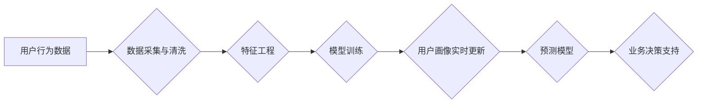

                 

## AI赋能的电商用户画像实时更新与预测系统

> 关键词：电商用户画像、实时更新、预测模型、机器学习、深度学习、数据分析、云计算

## 1. 背景介绍

在当今数据爆炸的时代，电商平台拥有海量用户数据，这些数据蕴藏着丰富的商业价值。用户画像作为电商平台的核心资产之一，能够帮助企业深入了解用户的需求、行为模式和偏好，从而实现精准营销、个性化推荐和提升用户体验。然而，传统的静态用户画像难以适应电商平台快速变化的市场环境和用户行为的动态演变。

随着人工智能技术的快速发展，特别是机器学习和深度学习的突破，AI赋能的电商用户画像实时更新与预测系统应运而生。该系统能够利用实时数据流和先进的算法模型，对用户画像进行动态更新和预测，为电商平台提供更精准、更实时、更智能的用户洞察。

## 2. 核心概念与联系

### 2.1  电商用户画像

电商用户画像是指通过对用户数据进行分析和挖掘，构建出用户特征、行为模式、兴趣偏好等多维度的描述，从而形成对用户的综合认知。

### 2.2  实时更新

实时更新是指用户画像能够根据用户最新的行为数据和市场动态进行动态调整和更新，确保用户画像始终保持最新状态。

### 2.3  预测模型

预测模型是指利用历史数据和机器学习算法，预测用户未来的行为和偏好，例如购买意愿、浏览商品类型、点击广告等。

**核心架构流程图**



## 3. 核心算法原理 & 具体操作步骤

### 3.1  算法原理概述

AI赋能的电商用户画像实时更新与预测系统主要基于以下核心算法：

* **机器学习算法:** 用于从用户数据中学习用户特征和行为模式，例如决策树、支持向量机、随机森林、神经网络等。
* **深度学习算法:** 用于处理复杂的用户行为数据，例如卷积神经网络、循环神经网络等。
* **时间序列分析算法:** 用于分析用户行为的时间趋势和规律，例如ARIMA、SARIMA等。

### 3.2  算法步骤详解

1. **数据采集与清洗:** 从电商平台的各种数据源，例如用户行为日志、商品信息、订单数据等，收集用户数据，并进行清洗和预处理，去除噪声数据和缺失值。
2. **特征工程:** 对原始用户数据进行特征提取和转换，构建更具代表性的用户特征，例如用户年龄、性别、购买频率、商品偏好、浏览时长等。
3. **模型训练:** 利用机器学习或深度学习算法，对用户特征数据进行训练，构建用户画像模型和预测模型。
4. **用户画像实时更新:** 将用户最新的行为数据输入到模型中，实时更新用户画像，确保用户画像始终保持最新状态。
5. **预测模型应用:** 利用预测模型，预测用户的未来行为和偏好，例如购买意愿、浏览商品类型、点击广告等。

### 3.3  算法优缺点

**优点:**

* **精准度高:** 基于机器学习和深度学习算法，能够更精准地识别用户特征和行为模式。
* **实时性强:** 利用实时数据流，能够实时更新用户画像，满足电商平台快速变化的需求。
* **可扩展性强:** 可以根据需要扩展算法模型和数据源，适应不同场景和业务需求。

**缺点:**

* **数据依赖性强:** 算法模型的性能取决于数据质量和数量，需要大量高质量的数据进行训练。
* **算法复杂度高:** 需要专业的技术人员进行模型设计、训练和维护。
* **隐私安全问题:** 需要妥善处理用户隐私数据，确保数据安全和合规性。

### 3.4  算法应用领域

AI赋能的电商用户画像实时更新与预测系统广泛应用于以下领域:

* **精准营销:** 根据用户画像，进行精准的广告投放和营销活动，提高营销效果。
* **个性化推荐:** 根据用户画像，推荐个性化的商品和服务，提升用户体验。
* **客户关系管理:** 根据用户画像，进行客户分层和个性化服务，提升客户满意度。
* **风险控制:** 根据用户画像，识别潜在的风险用户，降低平台风险。

## 4. 数学模型和公式 & 详细讲解 & 举例说明

### 4.1  数学模型构建

用户画像构建可以采用多种数学模型，例如：

* **K-Means聚类算法:** 将用户数据聚类成不同的用户群组，每个群组代表一种用户类型。
* **主成分分析(PCA):** 将用户特征降维，提取最重要的特征，简化模型复杂度。
* **贝叶斯网络:** 建立用户特征之间的依赖关系，预测用户未来的行为。

### 4.2  公式推导过程

例如，使用K-Means聚类算法构建用户画像，其核心公式为：

$$
min \sum_{i=1}^{k} \sum_{x \in C_i} ||x - \mu_i||^2
$$

其中：

* $k$ 为聚类数
* $C_i$ 为第 $i$ 个聚类
* $x$ 为用户数据点
* $\mu_i$ 为第 $i$ 个聚类的中心点

### 4.3  案例分析与讲解

假设电商平台有1000个用户，每个用户有5个特征，例如年龄、性别、购买频率、商品偏好、浏览时长等。可以使用K-Means算法将用户聚类成3个用户群组，每个群组代表一种用户类型，例如：

* **年轻用户群组:** 年龄较低，购买频率高，偏好时尚商品。
* **中年用户群组:** 年龄适中，购买频率中等，偏好实用商品。
* **老年用户群组:** 年龄较高，购买频率低，偏好保健商品。

## 5. 项目实践：代码实例和详细解释说明

### 5.1  开发环境搭建

* 操作系统: Ubuntu 20.04
* Python 版本: 3.8
* 必要的库: pandas, numpy, scikit-learn, TensorFlow

### 5.2  源代码详细实现

```python
# 导入必要的库
import pandas as pd
from sklearn.cluster import KMeans

# 加载用户数据
data = pd.read_csv('user_data.csv')

# 数据预处理
# ...

# 训练K-Means模型
kmeans = KMeans(n_clusters=3, random_state=42)
kmeans.fit(data)

# 获取用户群组标签
labels = kmeans.labels_

# 将用户群组标签添加到数据中
data['user_group'] = labels

# 保存用户画像数据
data.to_csv('user_portrait.csv', index=False)
```

### 5.3  代码解读与分析

* 代码首先导入必要的库，然后加载用户数据。
* 数据预处理步骤根据实际情况进行调整，例如特征缩放、缺失值处理等。
* 使用K-Means算法训练模型，并指定聚类数为3。
* 获取用户群组标签，并将其添加到数据中。
* 最后将用户画像数据保存到CSV文件。

### 5.4  运行结果展示

运行代码后，将生成一个包含用户群组标签的用户画像数据文件。

## 6. 实际应用场景

AI赋能的电商用户画像实时更新与预测系统在电商平台的实际应用场景非常广泛，例如：

* **精准营销:** 根据用户画像，为不同用户群组推送个性化的广告和促销活动，提高广告点击率和转化率。
* **个性化推荐:** 根据用户画像，推荐用户可能感兴趣的商品和服务，提升用户购物体验和购买意愿。
* **客户关系管理:** 根据用户画像，对用户进行分层管理，提供个性化的服务和支持，提升用户满意度和忠诚度。
* **风险控制:** 根据用户画像，识别潜在的风险用户，例如恶意用户、刷单用户等，降低平台风险。

### 6.4  未来应用展望

随着人工智能技术的不断发展，AI赋能的电商用户画像实时更新与预测系统将更加智能化、个性化和精准化。未来，该系统将应用于更多场景，例如：

* **智能客服:** 利用用户画像，为用户提供更智能、更个性化的客服服务。
* **供应链优化:** 利用用户画像，预测商品需求，优化库存管理和物流配送。
* **新产品开发:** 利用用户画像，洞察用户需求，开发更符合用户偏好的新产品。

## 7. 工具和资源推荐

### 7.1  学习资源推荐

* **书籍:**
    * 《深度学习》
    * 《机器学习实战》
    * 《Python机器学习》
* **在线课程:**
    * Coursera: 深度学习
    * edX: 机器学习
    * Udemy: Python机器学习

### 7.2  开发工具推荐

* **Python:** 强大的编程语言，广泛应用于数据分析和机器学习。
* **Jupyter Notebook:** 交互式编程环境，方便进行数据分析和模型开发。
* **Scikit-learn:** Python机器学习库，提供各种机器学习算法和工具。
* **TensorFlow:** 深度学习框架，用于构建和训练深度学习模型。

### 7.3  相关论文推荐

* **《Attention Is All You Need》**
* **《BERT: Pre-training of Deep Bidirectional Transformers for Language Understanding》**
* **《Generative Adversarial Networks》**

## 8. 总结：未来发展趋势与挑战

### 8.1  研究成果总结

AI赋能的电商用户画像实时更新与预测系统取得了显著成果，能够帮助电商平台更精准地了解用户需求，提供更个性化的服务，提升用户体验和商业效益。

### 8.2  未来发展趋势

未来，该系统的发展趋势主要体现在以下几个方面:

* **模型更加智能化:** 利用更先进的深度学习算法，构建更智能、更精准的用户画像模型。
* **数据更加丰富化:** 融合更多数据源，例如用户行为、社交数据、地理位置等，构建更全面的用户画像。
* **应用场景更加广泛化:** 应用于更多电商平台的业务场景，例如智能客服、供应链优化、新产品开发等。

### 8.3  面临的挑战

该系统的开发和应用也面临一些挑战:

* **数据隐私安全:** 需要妥善处理用户隐私数据，确保数据安全和合规性。
* **算法解释性:** 深度学习模型的解释性较差，需要研究更可解释的算法模型。
* **模型可维护性:** 模型需要不断更新和维护，以适应不断变化的用户行为和市场环境。

### 8.4  研究展望

未来，我们将继续研究AI赋能的电商用户画像实时更新与预测系统，探索更智能、更精准、更可解释的算法模型，并将其应用于更多电商平台的业务场景，为电商平台提供更强大的数据驱动的决策支持。

## 9. 附录：常见问题与解答

* **Q1: 如何选择合适的聚类算法?**

* **A1:** 选择聚类算法需要根据实际数据情况和业务需求进行选择。K-Means算法简单易用，适用于数据分布较为均匀的情况。DBSCAN算法能够发现任意形状的聚类，适用于数据分布不均匀的情况。

* **Q2: 如何评估聚类效果?**

* **A2:** 可以使用一些聚类评估指标，例如Silhouette score、Dunn index等，来评估聚类效果。

* **Q3: 如何处理用户数据中的缺失值?**

* **A3:** 可以使用一些缺失值处理方法，例如平均值填充、众数填充、KNN填充等，来处理用户数据中的缺失值。


作者：禅与计算机程序设计艺术 / Zen and the Art of Computer Programming 
<end_of_turn>

