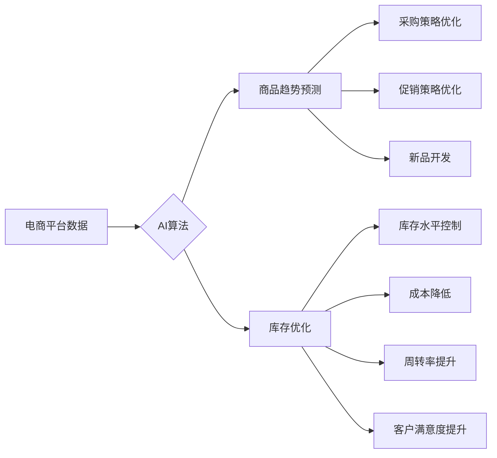

                 

## AI驱动的电商平台商品趋势预测与库存优化

> 关键词：电商平台、商品趋势预测、库存优化、机器学习、深度学习、时间序列分析、预测模型、优化算法

## 1. 背景介绍

在当今数据爆炸的时代，电商平台面临着日益激烈的竞争压力。如何准确预测商品趋势，并优化库存水平，成为提升运营效率和盈利能力的关键问题。传统的库存管理方法往往依赖于历史数据和经验判断，难以应对市场变化的快速性和复杂性。而人工智能（AI）技术的兴起为电商平台提供了全新的解决方案。

AI驱动的商品趋势预测与库存优化，通过利用机器学习、深度学习等算法，从海量商品数据中挖掘潜在的趋势和模式，并根据预测结果动态调整库存水平。这种智能化管理模式能够有效降低库存成本，提高商品周转率，最终提升电商平台的整体竞争力。

## 2. 核心概念与联系

### 2.1 商品趋势预测

商品趋势预测是指利用历史销售数据、市场信息、用户行为等数据，预测未来一段时间内商品的销售量、价格走势等指标。准确的商品趋势预测能够帮助电商平台：

* **优化商品采购策略:** 提前预判市场需求，合理安排商品采购计划，避免库存积压或缺货现象。
* **制定精准的促销策略:** 根据预测结果，制定针对不同商品的促销活动，提高销售转化率。
* **开发新品和调整产品线:** 通过分析趋势数据，识别市场潜在需求，开发符合市场趋势的新产品，或调整现有产品线结构。

### 2.2 库存优化

库存优化是指通过科学的管理方法，控制库存水平，实现最小化库存成本的同时最大化服务水平。有效的库存优化能够帮助电商平台：

* **降低库存成本:** 减少库存积压，降低仓储、管理和资金占用成本。
* **提高商品周转率:** 确保商品及时供应，提高商品销售速度和周转率。
* **提升客户满意度:** 避免缺货现象，满足客户及时获取商品的需求。

### 2.3 AI技术应用

AI技术在商品趋势预测与库存优化方面发挥着重要作用。主要应用场景包括：

* **数据分析和挖掘:** AI算法能够从海量商品数据中识别出潜在的趋势和模式，为预测和优化提供数据支持。
* **预测模型构建:** AI算法可以构建更精准的预测模型，例如时间序列分析模型、机器学习模型、深度学习模型等。
* **优化算法设计:** AI算法可以设计更有效的库存优化算法，例如遗传算法、模拟退火算法等。

**核心概念与联系流程图**



## 3. 核心算法原理 & 具体操作步骤

### 3.1 算法原理概述

商品趋势预测与库存优化通常采用以下几种核心算法：

* **时间序列分析:** 利用历史数据分析商品销售趋势，预测未来销售量。常见方法包括ARIMA、SARIMA、Prophet等。
* **机器学习:** 利用机器学习算法从历史数据中学习商品销售模式，预测未来销售量。常见方法包括线性回归、决策树、支持向量机、随机森林等。
* **深度学习:** 利用深度神经网络从复杂数据中提取特征，预测未来销售量。常见方法包括LSTM、GRU等。

库存优化算法则主要包括：

* **经济订货量模型:** 计算最优的订货量，以最小化库存成本。
* **安全库存模型:** 计算安全库存水平，以避免缺货风险。
* **遗传算法:** 通过模拟自然选择机制，优化库存策略。

### 3.2 算法步骤详解

**时间序列分析:**

1. **数据收集:** 收集历史商品销售数据，包括日期、销售量等信息。
2. **数据预处理:** 处理缺失值、异常值等问题，并对数据进行平滑处理。
3. **模型选择:** 根据数据特点选择合适的ARIMA、SARIMA或Prophet模型。
4. **模型训练:** 利用历史数据训练模型，并进行参数调整。
5. **预测:** 利用训练好的模型预测未来一段时间内的商品销售量。

**机器学习:**

1. **数据收集:** 收集历史商品销售数据、市场信息、用户行为等数据。
2. **数据预处理:** 处理缺失值、异常值等问题，并对数据进行特征工程。
3. **模型选择:** 根据数据特点选择合适的线性回归、决策树、支持向量机等模型。
4. **模型训练:** 利用历史数据训练模型，并进行参数调整。
5. **预测:** 利用训练好的模型预测未来一段时间内的商品销售量。

**深度学习:**

1. **数据收集:** 收集历史商品销售数据、市场信息、用户行为等数据。
2. **数据预处理:** 处理缺失值、异常值等问题，并对数据进行特征工程。
3. **模型选择:** 选择合适的LSTM、GRU等深度神经网络模型。
4. **模型训练:** 利用历史数据训练模型，并进行参数调整。
5. **预测:** 利用训练好的模型预测未来一段时间内的商品销售量。

**库存优化算法:**

1. **数据收集:** 收集商品销售数据、库存成本、缺货成本等信息。
2. **模型选择:** 根据实际情况选择合适的经济订货量模型、安全库存模型或遗传算法。
3. **模型参数设置:** 设置模型参数，例如订货周期、安全库存水平等。
4. **库存策略优化:** 利用模型计算最优的库存策略，并进行调整。

### 3.3 算法优缺点

| 算法类型 | 优点 | 缺点 |
|---|---|---|
| 时间序列分析 | 算法简单易懂，易于实现 | 对数据趋势变化敏感，难以处理非线性趋势 |
| 机器学习 | 可以处理非线性趋势，预测精度较高 | 需要大量训练数据，模型选择和参数调整较为复杂 |
| 深度学习 | 能够从复杂数据中提取特征，预测精度更高 | 需要大量训练数据，模型训练时间长，参数调整较为复杂 |
| 经济订货量模型 | 计算简单，易于理解 | 忽略了市场需求变化的随机性 |
| 安全库存模型 | 可以有效避免缺货风险 | 需要准确估计需求波动和补货时间 |
| 遗传算法 | 可以找到全局最优解 | 计算复杂度高，收敛速度慢 |

### 3.4 算法应用领域

* **电商平台:** 商品趋势预测、库存优化、个性化推荐等。
* **制造业:** 产品需求预测、生产计划优化、库存管理等。
* **金融行业:** 股票价格预测、风险管理、信用评估等。
* **医疗行业:** 疾病预测、药物研发、医疗资源配置等。

## 4. 数学模型和公式 & 详细讲解 & 举例说明

### 4.1 数学模型构建

**时间序列分析模型:**

ARIMA模型是一种常用的时间序列分析模型，其核心思想是利用历史数据中的自相关性和偏自相关性来预测未来值。ARIMA模型包含三个参数：p、d、q，分别代表自回归阶数、差分阶数和移动平均阶数。

**机器学习模型:**

机器学习模型的数学模型较为复杂，通常涉及到线性代数、概率论、统计学等知识。常见的机器学习模型包括线性回归、逻辑回归、决策树、支持向量机、神经网络等。

**库存优化模型:**

经济订货量模型的数学公式为：

$$EOQ = \sqrt{\frac{2DS}{H}}$$

其中：

* EOQ: 经济订货量
* D: 年需求量
* S: 每次订货成本
* H: 单位库存成本

### 4.2 公式推导过程

**经济订货量模型的推导过程:**

经济订货量模型的目标是最小化总库存成本，总库存成本包括订货成本和持有成本。

* 订货成本 = S * (D/Q)
* 持有成本 = H * (Q/2)

其中：

* Q: 订货量

总库存成本 = 订货成本 + 持有成本

$$TC = S \cdot \frac{D}{Q} + H \cdot \frac{Q}{2}$$

对总库存成本求导，并令其等于零，可以得到经济订货量公式：

$$EOQ = \sqrt{\frac{2DS}{H}}$$

### 4.3 案例分析与讲解

**案例分析:**

假设一家电商平台销售一款商品，其年需求量为10000件，每次订货成本为100元，单位库存成本为1元/件。

根据经济订货量公式，可以计算出该商品的经济订货量为：

$$EOQ = \sqrt{\frac{2 \times 10000 \times 100}{1}} = 1414.21$$

这意味着，该电商平台应该每次订货1414件商品，才能最小化总库存成本。

## 5. 项目实践：代码实例和详细解释说明

### 5.1 开发环境搭建

* **操作系统:** Linux/macOS/Windows
* **编程语言:** Python
* **库依赖:** pandas, numpy, scikit-learn, tensorflow/pytorch

### 5.2 源代码详细实现

```python
# 导入必要的库
import pandas as pd
from sklearn.linear_model import LinearRegression

# 加载商品销售数据
data = pd.read_csv('sales_data.csv')

# 数据预处理
# ...

# 训练线性回归模型
model = LinearRegression()
model.fit(data[['日期']], data['销售量'])

# 预测未来一周的销售量
future_dates = pd.date_range(start='2023-10-27', periods=7)
future_sales = model.predict(future_dates.values.reshape(-1, 1))

# 打印预测结果
print(future_sales)
```

### 5.3 代码解读与分析

* **数据加载:** 使用pandas库加载商品销售数据。
* **数据预处理:** 对数据进行清洗、转换、特征工程等操作，以提高模型预测精度。
* **模型训练:** 使用sklearn库中的线性回归模型训练预测模型。
* **预测:** 利用训练好的模型预测未来一周的销售量。
* **结果展示:** 打印预测结果。

### 5.4 运行结果展示

运行代码后，将输出未来一周的商品销售量预测值。

## 6. 实际应用场景

### 6.1 电商平台商品趋势预测

* **新品开发:** 通过预测未来商品趋势，电商平台可以识别市场潜在需求，开发符合市场趋势的新产品。
* **促销策略优化:** 根据预测结果，制定针对不同商品的促销活动，提高销售转化率。
* **库存管理:** 预测未来商品需求，优化库存水平，避免库存积压或缺货现象。

### 6.2 电商平台库存优化

* **自动补货:** 根据预测结果，自动触发补货流程，确保商品及时供应。
* **库存预警:** 设置库存预警阈值，及时提醒相关人员进行库存调整。
* **仓储空间优化:** 根据预测结果，优化仓储空间分配，提高仓储效率。

### 6.4 未来应用展望

* **个性化推荐:** 利用AI技术，对用户的购买历史、浏览记录等数据进行分析，提供个性化的商品推荐。
* **智能客服:** 利用自然语言处理技术，开发智能客服系统，为用户提供更便捷的购物体验。
* **供应链管理:** 利用AI技术，优化整个供应链流程，提高效率和降低成本。

## 7. 工具和资源推荐

### 7.1 学习资源推荐

* **书籍:**
    * 《Python机器学习》
    * 《深度学习》
    * 《时间序列分析》
* **在线课程:**
    * Coursera
    * edX
    * Udemy

### 7.2 开发工具推荐

* **Python:** 
    * Jupyter Notebook
    * PyCharm
* **机器学习库:**
    * scikit-learn
    * TensorFlow
    * PyTorch

### 7.3 相关论文推荐

* **商品趋势预测:**
    * "A Survey on Time Series Forecasting Methods"
    * "Deep Learning for Time Series Forecasting: A Comprehensive Review"
* **库存优化:**
    * "Economic Order Quantity Model"
    * "Inventory Control: A Review"

## 8. 总结：未来发展趋势与挑战

### 8.1 研究成果总结

AI驱动的商品趋势预测与库存优化取得了显著成果，能够有效提高电商平台的运营效率和盈利能力。

### 8.2 未来发展趋势

* **模型精度提升:** 研究更精准的预测模型，例如结合多源数据、强化学习等技术。
* **个性化服务:** 利用AI技术，提供更个性化的商品推荐和库存管理服务。
* **智能化决策:** 将AI技术与决策支持系统结合，帮助电商平台做出更智能化的运营决策。

### 8.3 面临的挑战

* **数据质量:** 预测模型的精度依赖于数据质量，需要不断完善数据采集、清洗和预处理流程。
* **模型解释性:** 许多AI模型的决策过程难以解释，需要研究更可解释的模型，提高用户信任度。
* **伦理问题:** AI技术应用需要考虑伦理问题，例如数据隐私、算法偏见等。

### 8.4 研究展望

未来，AI技术将继续推动电商平台商品趋势预测与库存优化领域的发展，带来更多创新应用和商业价值。


## 9. 附录：常见问题与解答

**Q1: 如何选择合适的预测模型？**

**A1:** 选择合适的预测模型需要根据实际情况和数据特点进行综合考虑。

* **数据类型:** 时间序列数据、分类数据、回归数据等。
* **数据趋势:** 线性趋势、非线性趋势、季节性趋势等。
* **数据规模:** 小规模数据、大规模数据等。

**Q2: 如何评估预测模型的精度？**

**A2:** 可以使用多种指标评估预测模型的精度，例如均方误差（MSE）、平均绝对误差（MAE）、R-squared等。

**Q3: 如何处理缺失值和异常值？**

**A3:** 缺失值可以采用插值、删除或使用机器学习算法进行填充。异常值可以采用删除、替换或进行降维处理。


作者：禅与计算机程序设计艺术 / Zen and the Art of Computer Programming<end_of_turn>

