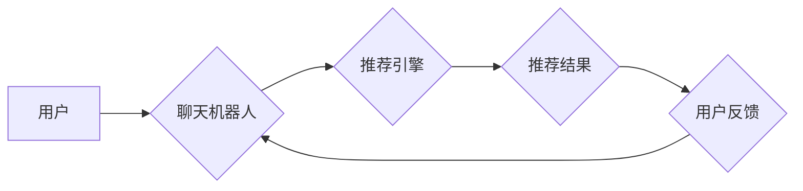

                 

## Chat-Rec：交互式推荐

> 关键词：交互式推荐、聊天机器人、推荐系统、自然语言处理、深度学习、用户行为分析、个性化推荐

## 1. 背景介绍

推荐系统是信息时代的重要技术支柱，广泛应用于电商、社交媒体、视频平台等领域，帮助用户发现感兴趣的内容和服务。传统的推荐系统主要依赖于用户的历史行为数据，例如浏览记录、购买历史等，通过协同过滤、内容过滤等算法进行预测。然而，这些方法存在一些局限性：

* **数据稀疏性问题:** 用户行为数据往往是稀疏的，难以准确地捕捉用户的兴趣偏好。
* **冷启动问题:** 新用户或新商品缺乏历史数据，难以进行有效的推荐。
* **缺乏个性化:** 传统的推荐系统难以满足用户个性化需求，推荐结果可能过于泛化。

近年来，随着聊天机器人的兴起，交互式推荐逐渐成为研究热点。交互式推荐系统通过与用户进行自然语言对话，动态获取用户的反馈和偏好，从而提供更精准、个性化的推荐结果。

## 2. 核心概念与联系

交互式推荐系统将推荐系统与自然语言处理（NLP）技术相结合，通过对话交互的方式，实现用户与推荐系统的双向沟通。

**核心概念:**

* **聊天机器人:** 能够理解和生成人类语言的智能系统，可以与用户进行自然对话。
* **推荐系统:** 基于用户历史行为数据或其他信息，预测用户可能感兴趣的内容或服务的系统。
* **自然语言处理 (NLP):** 处理和理解人类语言的技术，包括文本分析、语音识别、机器翻译等。

**架构:**



**核心联系:**

* 聊天机器人作为用户与推荐系统的交互桥梁，负责收集用户需求和反馈。
* 推荐引擎根据用户反馈和历史数据，生成个性化的推荐结果。
* 用户反馈可以不断完善推荐引擎的模型，提高推荐的准确性。

## 3. 核心算法原理 & 具体操作步骤

### 3.1  算法原理概述

交互式推荐系统通常采用基于对话的推荐算法，例如：

* **基于规则的推荐:** 基于预先定义的规则，根据用户对话内容生成推荐结果。
* **基于机器学习的推荐:** 利用机器学习算法，从用户对话数据中学习用户偏好，并生成推荐结果。

### 3.2  算法步骤详解

**基于机器学习的交互式推荐算法步骤:**

1. **数据收集:** 收集用户对话数据，包括用户输入、聊天机器人回复、推荐结果等。
2. **数据预处理:** 对用户对话数据进行清洗、格式化、标注等预处理操作。
3. **特征提取:** 从用户对话数据中提取特征，例如用户兴趣、对话主题、推荐结果点击率等。
4. **模型训练:** 利用机器学习算法，训练推荐模型，例如深度神经网络、支持向量机等。
5. **推荐生成:** 根据用户对话内容和训练好的模型，生成个性化的推荐结果。
6. **用户反馈收集:** 收集用户对推荐结果的反馈，例如点击、评分、评论等。
7. **模型更新:** 利用用户反馈数据，更新推荐模型，提高推荐的准确性。

### 3.3  算法优缺点

**优点:**

* **个性化推荐:** 可以根据用户的实时反馈和偏好，提供更精准的推荐结果。
* **动态更新:** 可以根据用户行为变化，动态更新推荐模型，保持推荐的时效性。
* **用户参与度高:** 通过对话交互，提高用户参与度，增强用户体验。

**缺点:**

* **数据依赖性强:** 需要大量的用户对话数据进行训练，否则模型效果难以保证。
* **算法复杂度高:** 需要复杂的机器学习算法和模型，开发和维护成本较高。
* **对话理解难度:** 聊天机器人的对话理解能力需要不断提升，才能更好地理解用户的需求。

### 3.4  算法应用领域

* **电商推荐:** 提供个性化的商品推荐，提高用户购买率。
* **内容推荐:** 推荐用户感兴趣的文章、视频、音乐等内容。
* **旅游推荐:** 根据用户的旅行偏好，推荐合适的旅游目的地和行程。
* **教育推荐:** 根据用户的学习目标和进度，推荐合适的学习资源。

## 4. 数学模型和公式 & 详细讲解 & 举例说明

### 4.1  数学模型构建

交互式推荐系统通常采用基于用户的协同过滤模型，例如：

**用户-物品评分矩阵:**

$$
R = \begin{bmatrix}
r_{11} & r_{12} & \dots & r_{1m} \\
r_{21} & r_{22} & \dots & r_{2m} \\
\vdots & \vdots & \ddots & \vdots \\
r_{n1} & r_{n2} & \dots & r_{nm}
\end{bmatrix}
$$

其中:

* $r_{ij}$ 表示用户 $i$ 对物品 $j$ 的评分。
* $n$ 表示用户数量。
* $m$ 表示物品数量。

**目标:**

预测用户 $i$ 对物品 $j$ 的评分 $r_{ij}$。

### 4.2  公式推导过程

**基于矩阵分解的协同过滤算法:**

将用户-物品评分矩阵 $R$ 分解为两个低维矩阵 $U$ 和 $V$，分别表示用户特征矩阵和物品特征矩阵。

$$
R \approx U V^T
$$

其中:

* $U$ 是 $n \times k$ 的用户特征矩阵，$k$ 是隐特征维度。
* $V$ 是 $m \times k$ 的物品特征矩阵。

**预测公式:**

$$
\hat{r}_{ij} = u_i^T v_j
$$

其中:

* $\hat{r}_{ij}$ 是预测的用户 $i$ 对物品 $j$ 的评分。
* $u_i$ 是用户 $i$ 的特征向量。
* $v_j$ 是物品 $j$ 的特征向量。

### 4.3  案例分析与讲解

**举例说明:**

假设有一个用户-物品评分矩阵，其中用户 $1$ 对物品 $1$ 的评分为 $5$，用户 $2$ 对物品 $1$ 的评分为 $3$。

使用矩阵分解算法，可以将用户-物品评分矩阵分解为两个低维矩阵，例如:

$$
U = \begin{bmatrix}
0.8 & 0.6 \\
0.4 & 0.8
\end{bmatrix}
$$

$$
V = \begin{bmatrix}
0.9 & 0.7 \\
0.6 & 0.5
\end{bmatrix}
$$

根据预测公式，可以预测用户 $1$ 对物品 $2$ 的评分:

$$
\hat{r}_{12} = u_1^T v_2 = (0.8, 0.6) \cdot (0.6, 0.5) = 0.8 \cdot 0.6 + 0.6 \cdot 0.5 = 0.88
$$

## 5. 项目实践：代码实例和详细解释说明

### 5.1  开发环境搭建

* Python 3.x
* TensorFlow 或 PyTorch
* NLTK 或 spaCy

### 5.2  源代码详细实现

```python
import tensorflow as tf

# 定义用户-物品评分矩阵
R = tf.constant([[5, 3], [4, 2]])

# 定义用户特征矩阵
U = tf.Variable(tf.random.normal([2, 2]))

# 定义物品特征矩阵
V = tf.Variable(tf.random.normal([2, 2]))

# 定义预测公式
def predict(user_id, item_id):
  return tf.reduce_sum(U[user_id] * V[item_id])

# 定义损失函数
def loss_function(R_pred, R_true):
  return tf.reduce_mean(tf.square(R_pred - R_true))

# 定义优化器
optimizer = tf.keras.optimizers.Adam()

# 训练模型
for epoch in range(100):
  with tf.GradientTape() as tape:
    R_pred = predict(0, 0)
    loss = loss_function(R_pred, R[0, 0])
  gradients = tape.gradient(loss, [U, V])
  optimizer.apply_gradients(zip(gradients, [U, V]))

# 打印训练结果
print(U)
print(V)
```

### 5.3  代码解读与分析

* 代码首先定义了用户-物品评分矩阵 $R$，用户特征矩阵 $U$ 和物品特征矩阵 $V$。
* 然后定义了预测公式和损失函数，用于计算预测结果与真实评分之间的误差。
* 使用 Adam 优化器对模型参数进行训练，迭代更新用户特征矩阵和物品特征矩阵。
* 最后打印训练后的用户特征矩阵和物品特征矩阵。

### 5.4  运行结果展示

训练完成后，可以利用训练好的模型预测用户对物品的评分。

## 6. 实际应用场景

### 6.1  电商推荐

* **个性化商品推荐:** 根据用户的浏览历史、购买记录、购物车内容等信息，推荐用户可能感兴趣的商品。
* **新品推荐:** 推送新上市的商品，吸引用户关注。
* **促销活动推荐:** 根据用户的消费习惯和偏好，推荐相关的促销活动和优惠信息。

### 6.2  内容推荐

* **新闻推荐:** 根据用户的阅读历史、关注领域等信息，推荐用户感兴趣的新闻资讯。
* **视频推荐:** 根据用户的观看历史、点赞记录等信息，推荐用户可能喜欢的视频内容。
* **音乐推荐:** 根据用户的听歌记录、喜欢的音乐类型等信息，推荐用户可能喜欢的音乐作品。

### 6.3  旅游推荐

* **目的地推荐:** 根据用户的旅行偏好、预算、时间等信息，推荐合适的旅游目的地。
* **行程推荐:** 根据用户的旅行时间、兴趣爱好等信息，推荐合理的旅游行程安排。
* **酒店推荐:** 根据用户的住宿需求、预算等信息，推荐合适的酒店。

### 6.4  未来应用展望

* **更精准的个性化推荐:** 利用更先进的机器学习算法和自然语言处理技术，实现更精准的个性化推荐。
* **多模态交互:** 将文本、语音、图像等多模态信息融合到交互式推荐系统中，提供更丰富的用户体验。
* **跨平台推荐:** 将交互式推荐系统应用到多个平台，例如移动端、桌面端、智能家居等，实现更全面的用户覆盖。

## 7. 工具和资源推荐

### 7.1  学习资源推荐

* **书籍:**
    * 《推荐系统实践》
    * 《深度学习》
    * 《自然语言处理》
* **在线课程:**
    * Coursera: Recommender Systems
    * Udacity: Deep Learning Nanodegree
    * edX: Natural Language Processing

### 7.2  开发工具推荐

* **Python:** 广泛应用于机器学习和自然语言处理领域。
* **TensorFlow:** 开源深度学习框架，提供丰富的机器学习算法和工具。
* **PyTorch:** 开源深度学习框架，以其灵活性和易用性而闻名。
* **NLTK:** 自然语言处理工具包，提供文本处理、词法分析、语义分析等功能。
* **spaCy:** 高性能自然语言处理库，支持多种语言和任务。

### 7.3  相关论文推荐

* **Collaborative Filtering for Implicit Feedback Datasets**
* **Deep Learning for Recommender Systems**
* **Neural Conversational Recommender Systems**

## 8. 总结：未来发展趋势与挑战

### 8.1  研究成果总结

交互式推荐系统在个性化推荐、用户参与度提升等方面取得了显著成果，为用户提供更精准、更便捷的推荐体验。

### 8.2  未来发展趋势

* **更精准的个性化推荐:** 利用更先进的机器学习算法和自然语言处理技术，实现更精准的个性化推荐。
* **多模态交互:** 将文本、语音、图像等多模态信息融合到交互式推荐系统中，提供更丰富的用户体验。
* **跨平台推荐:** 将交互式推荐系统应用到多个平台，例如移动端、桌面端、智能家居等，实现更全面的用户覆盖。
* **可解释性增强:** 提高交互式推荐系统的可解释性，帮助用户理解推荐结果背后的逻辑。

### 8.3  面临的挑战

* **数据稀疏性:** 用户对话数据往往是稀疏的，难以准确地捕捉用户的兴趣偏好。
* **对话理解难度:** 聊天机器人的对话理解能力需要不断提升，才能更好地理解用户的需求。
* **模型复杂度:** 交互式推荐系统的模型往往比较复杂，训练和部署成本较高。

### 8.4  研究展望

未来，交互式推荐系统将朝着更智能、更个性化、更可解释的方向发展，为用户提供更优质的推荐体验。


## 9. 附录：常见问题与解答

**Q1: 交互式推荐系统与传统的推荐系统有什么区别？**

**A1:** 传统的推荐系统主要依赖于用户的历史行为数据，而交互式推荐系统通过与用户进行对话，动态获取用户的反馈和偏好，从而提供更精准、个性化的推荐结果。

**Q2: 交互式推荐系统有哪些应用场景？**

**A2:** 交互式推荐系统广泛应用于电商推荐、内容推荐、旅游推荐等领域。

**Q3: 如何评估交互式推荐系统的性能？**

**A3:** 交互式推荐系统的性能可以评估指标包括点击率、转化率、用户满意度等。

**Q4: 交互式推荐系统有哪些挑战？**

**A4:** 交互式推荐系统面临的数据稀疏性、对话理解难度、模型复杂度等挑战。


作者：禅与计算机程序设计艺术 / Zen and the Art of Computer Programming<end_of_turn>

