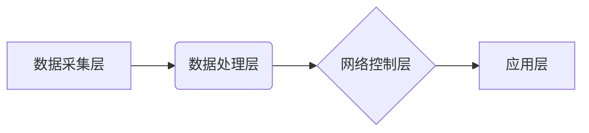

                 

## 5G+AI：智能通信网络的未来

> 关键词：5G, AI, 智能通信网络, 网络切片, 机器学习, 深度学习, 预测分析, 网络优化

### 1. 背景介绍

随着全球对高速、低延迟、高可靠性的网络需求不断增长，第五代移动通信技术（5G）应运而生。5G 凭借其超高速率、超低时延、超大连接数等特性，为万物互联、智能化社会的发展提供了坚实的基础。然而，5G 仅仅是基础设施的升级，要想真正实现智能化，还需要人工智能（AI）技术的赋能。

人工智能技术近年来发展迅速，特别是深度学习的突破，使得 AI 在图像识别、语音识别、自然语言处理等领域取得了令人瞩目的成就。将 AI 技术与 5G 网络相结合，可以构建智能通信网络，实现网络自优化、自适应、自修复等功能，从而提升网络效率、用户体验和安全性。

### 2. 核心概念与联系

#### 2.1 5G 网络架构

5G 网络架构相比于 4G 网络，更加灵活、可扩展和智能化。其核心特点包括：

* **网络切片 (Network Slicing):** 将物理网络资源虚拟化，为不同的应用场景提供定制化的网络服务，例如高带宽、低延迟的网络切片用于增强现实（AR）/虚拟现实（VR）应用，而高可靠性的网络切片用于工业自动化应用。
* **边缘计算 (Edge Computing):** 将计算资源部署到靠近用户的数据中心或边缘节点，减少数据传输延迟，提高实时性。
* **软件定义网络 (SDN) 和网络功能虚拟化 (NFV):** 通过软件控制网络设备和功能，实现网络资源的动态配置和管理，提高网络灵活性。

#### 2.2 AI 技术应用

AI 技术在 5G 网络中可以应用于多个方面，例如：

* **网络优化:** 利用机器学习算法分析网络流量数据，预测网络拥塞情况，动态调整网络资源配置，优化网络性能。
* **安全保障:** 利用深度学习算法识别网络攻击，防御网络安全威胁。
* **用户体验提升:** 利用自然语言处理技术实现智能客服，提供个性化网络服务。

#### 2.3 5G+AI 架构

5G+AI 智能通信网络架构通常包括以下几个关键组件：

* **数据采集层:** 收集网络流量数据、用户行为数据等。
* **数据处理层:** 利用 AI 算法对数据进行分析、预测和决策。
* **网络控制层:** 根据 AI 算法的决策，动态调整网络资源配置和服务策略。
* **应用层:** 提供基于 5G+AI 的智能化应用服务。



### 3. 核心算法原理 & 具体操作步骤

#### 3.1 算法原理概述

在 5G+AI 智能通信网络中，常用的 AI 算法包括：

* **机器学习 (Machine Learning):** 通过训练模型，从数据中学习规律，进行预测和决策。
* **深度学习 (Deep Learning):** 利用多层神经网络，模拟人类大脑的学习机制，实现更复杂的模式识别和预测。

#### 3.2 算法步骤详解

以网络流量预测为例，使用机器学习算法进行网络流量预测的步骤如下：

1. **数据收集:** 收集历史网络流量数据，包括时间、流量大小、用户类型等信息。
2. **数据预处理:** 对数据进行清洗、转换和特征工程，例如将时间信息转换为时间戳，将流量大小进行标准化处理。
3. **模型选择:** 选择合适的机器学习算法，例如线性回归、决策树、支持向量机等。
4. **模型训练:** 利用训练数据训练模型，调整模型参数，使模型能够准确预测未来流量。
5. **模型评估:** 利用测试数据评估模型的预测精度，例如使用均方误差 (MSE) 或平均绝对误差 (MAE) 作为评价指标。
6. **模型部署:** 将训练好的模型部署到网络控制层，用于实时预测网络流量。

#### 3.3 算法优缺点

**优点:**

* 能够准确预测未来网络流量，帮助网络运营商优化资源配置。
* 可以根据用户行为和网络状态动态调整网络服务策略，提升用户体验。

**缺点:**

* 需要大量的历史数据进行训练，数据质量直接影响模型精度。
* 模型需要定期更新，以适应不断变化的网络环境。

#### 3.4 算法应用领域

* **网络流量预测:** 预估未来网络流量，优化网络资源配置。
* **网络拥塞控制:** 识别和缓解网络拥塞，保障网络稳定运行。
* **网络安全威胁检测:** 识别网络攻击，保护网络安全。
* **用户行为分析:** 分析用户行为模式，提供个性化网络服务。

### 4. 数学模型和公式 & 详细讲解 & 举例说明

#### 4.1 数学模型构建

网络流量预测可以使用 ARIMA (Autoregressive Integrated Moving Average) 模型，该模型假设网络流量的时间序列具有自回归性、差分性和移动平均性。

ARIMA 模型的数学表达式如下：

$$
y_t = c + \phi_1 y_{t-1} + \phi_2 y_{t-2} + ... + \phi_p y_{t-p} + \theta_1 \epsilon_{t-1} + \theta_2 \epsilon_{t-2} + ... + \theta_q \epsilon_{t-q} + \epsilon_t
$$

其中：

* $y_t$ 表示时间 $t$ 的网络流量。
* $c$ 是常数项。
* $\phi_i$ 是自回归系数。
* $\theta_i$ 是移动平均系数。
* $\epsilon_t$ 是白噪声。
* $p$ 和 $q$ 分别是自回归阶数和移动平均阶数。

#### 4.2 公式推导过程

ARIMA 模型的推导过程较为复杂，需要利用时间序列分析的理论知识，例如协整性、自相关函数和偏自相关函数等。

#### 4.3 案例分析与讲解

假设我们收集了 100 个时间点的网络流量数据，并使用 ARIMA 模型进行预测。经过模型训练和评估，我们发现模型的预测精度较高。

我们可以利用训练好的 ARIMA 模型，预测未来 10 个时间点的网络流量，并根据预测结果，动态调整网络资源配置，例如增加网络带宽，缓解网络拥塞。

### 5. 项目实践：代码实例和详细解释说明

#### 5.1 开发环境搭建

* 操作系统: Ubuntu 20.04
* Python 版本: 3.8
* 必要的库: pandas, numpy, scikit-learn, matplotlib

#### 5.2 源代码详细实现

```python
import pandas as pd
from sklearn.model_selection import train_test_split
from sklearn.linear_model import LinearRegression
from sklearn.metrics import mean_squared_error

# 加载网络流量数据
data = pd.read_csv('network_traffic.csv')

# 将时间转换为时间戳
data['timestamp'] = pd.to_datetime(data['timestamp'])

# 选择特征和目标变量
features = ['timestamp', 'user_count', 'bandwidth_usage']
target = 'traffic_volume'

# 将数据分割为训练集和测试集
X_train, X_test, y_train, y_test = train_test_split(data[features], data[target], test_size=0.2)

# 创建线性回归模型
model = LinearRegression()

# 训练模型
model.fit(X_train, y_train)

# 预测测试集数据
y_pred = model.predict(X_test)

# 计算模型精度
mse = mean_squared_error(y_test, y_pred)
print(f'Mean Squared Error: {mse}')

# 可视化预测结果
import matplotlib.pyplot as plt
plt.scatter(y_test, y_pred)
plt.xlabel('Actual Traffic Volume')
plt.ylabel('Predicted Traffic Volume')
plt.title('Linear Regression Model Performance')
plt.show()
```

#### 5.3 代码解读与分析

* 代码首先加载网络流量数据，并进行数据预处理，例如将时间信息转换为时间戳。
* 然后，代码选择特征和目标变量，并将数据分割为训练集和测试集。
* 接着，代码创建线性回归模型，并使用训练集训练模型。
* 训练完成后，代码使用测试集数据进行预测，并计算模型精度。
* 最后，代码可视化预测结果，以便直观地观察模型性能。

#### 5.4 运行结果展示

运行代码后，会输出模型的均方误差 (MSE) 值，以及预测结果与实际值的散点图。

### 6. 实际应用场景

#### 6.1 网络优化

* **流量预测:** 利用 AI 预测未来网络流量，动态调整网络资源配置，例如增加网络带宽，缓解网络拥塞。
* **网络性能监控:** 利用 AI 分析网络性能指标，识别网络问题，并提供解决方案。
* **网络故障诊断:** 利用 AI 分析网络故障日志，快速定位故障原因，缩短故障修复时间。

#### 6.2 安全保障

* **网络攻击检测:** 利用 AI 分析网络流量数据，识别恶意攻击行为，例如 DDoS 攻击、SQL 注入攻击等。
* **网络入侵防御:** 利用 AI 建立入侵防御系统，拦截恶意流量，保护网络安全。
* **身份认证:** 利用 AI 进行用户身份认证，提高网络安全等级。

#### 6.3 用户体验提升

* **个性化网络服务:** 利用 AI 分析用户行为模式，提供个性化网络服务，例如推荐感兴趣的内容，优化网络体验。
* **智能客服:** 利用 AI 开发智能客服系统，自动回答用户问题，提高服务效率。
* **增强现实/虚拟现实 (AR/VR) 应用:** 利用 5G 高速率和低延迟特性，结合 AI 技术，提供更沉浸式的 AR/VR 应用体验。

#### 6.4 未来应用展望

随着 5G 技术的不断发展和 AI 技术的进步，5G+AI 智能通信网络将应用于更多领域，例如：

* **工业自动化:** 利用 5G+AI 实现工业设备的远程控制和监控，提高生产效率。
* **智慧城市:** 利用 5G+AI 建设智慧城市，例如智能交通、智能安防、智能环境监测等。
* **医疗健康:** 利用 5G+AI 实现远程医疗、精准医疗等应用，提高医疗服务质量。

### 7. 工具和资源推荐

#### 7.1 学习资源推荐

* **书籍:**
    * 《深度学习》 - Ian Goodfellow, Yoshua Bengio, Aaron Courville
    * 《机器学习》 - Tom Mitchell
* **在线课程:**
    * Coursera: Machine Learning by Andrew Ng
    * edX: Artificial Intelligence by Columbia University
* **博客和网站:**
    * Towards Data Science
    * Machine Learning Mastery

#### 7.2 开发工具推荐

* **Python:** 广泛应用于 AI 开发，拥有丰富的 AI 库和框架。
* **TensorFlow:** Google 开发的开源深度学习框架。
* **PyTorch:** Facebook 开发的开源深度学习框架。
* **Keras:** 基于 TensorFlow 或 Theano 的高层深度学习 API。

#### 7.3 相关论文推荐

* **《Attention Is All You Need》:** 提出 Transformer 架构，用于自然语言处理任务。
* **《ImageNet Classification with Deep Convolutional Neural Networks》:** 提出 AlexNet 模型，在 ImageNet 图像分类任务上取得突破性进展。
* **《Deep Residual Learning for Image Recognition》:** 提出 ResNet 模型，解决深度神经网络训练中的梯度消失问题。

### 8. 总结：未来发展趋势与挑战

#### 8.1 研究成果总结

5G+AI 智能通信网络的研究取得了显著进展，在网络优化、安全保障、用户体验提升等方面展现出巨大的潜力。

#### 8.2 未来发展趋势

* **更智能的网络控制:** 利用更先进的 AI 算法，实现网络自优化、自适应、自修复等功能。
* **更个性化的网络服务:** 利用 AI 分析用户行为模式，提供更精准、更个性化的网络服务。
* **更安全的网络环境:** 利用 AI 加强网络安全防护，抵御各种网络攻击。

#### 8.3 面临的挑战

* **数据安全和隐私保护:** 5G+AI 网络需要处理大量用户数据，如何保障数据安全和隐私保护是一个重要挑战。
* **算法可解释性和信任度:** AI 算法的决策过程往往难以理解，如何提高算法的可解释性和信任度是一个关键问题。
* **网络资源分配和管理:** 如何高效地分配和管理 5G+AI 网络资源，是一个需要进一步研究的问题。

#### 8.4 研究展望

未来，5G+AI 智能通信网络的研究将继续深入，探索更智能、更安全、更可靠的网络解决方案，为万物互联、智能化社会的发展提供强有力的技术支撑。

### 9. 附录：常见问题与解答

**Q1: 5G+AI 智能通信网络与传统通信网络相比有哪些优势？**

**A1:** 5G+AI 智能通信网络相比传统通信网络，具有以下优势：

* **更高的网络效率:** AI 算法可以优化网络资源配置，提高网络吞吐量和降低网络延迟。
* **更强的安全保障:** AI 可以识别和防御网络攻击，提高网络安全等级。
* **更个性化的用户体验:** AI 可以根据用户行为模式提供个性化网络服务。

**Q2: 5G+AI 智能通信网络有哪些应用场景？**

**A2:** 5G+AI 智能通信网络的应用场景非常广泛，包括：

* **网络优化:** 流量预测、网络性能监控、网络故障诊断
* **安全保障:** 网络攻击检测、网络入侵防御、身份认证
* **用户体验提升:** 个性化网络服务、智能客服、增强现实/虚拟现实 (AR/VR) 应用
* **工业自动化:** 工业设备远程控制和监控
* **智慧城市:** 智能交通、智能安防、智能环境监测
* **医疗健康:** 远程医疗、精准医疗

**Q3: 5G+AI 智能通信网络面临哪些挑战？**

**A3:** 5G+AI 智能通信网络面临以下挑战：

* **数据安全和隐私保护:** 5G+AI 网络需要处理大量用户数据，如何保障数据安全和隐私保护是一个重要挑战。
* **算法可解释性和信任度:** AI 算法的决策过程往往难以理解，如何提高算法的可解释性和信任度是一个关键问题。
* **网络资源分配和管理:** 如何高效地分配和管理 5G+AI 网络资源，是一个需要进一步研究的问题。


作者：禅与计算机程序设计艺术 / Zen and the Art of Computer Programming<end_of_turn>

