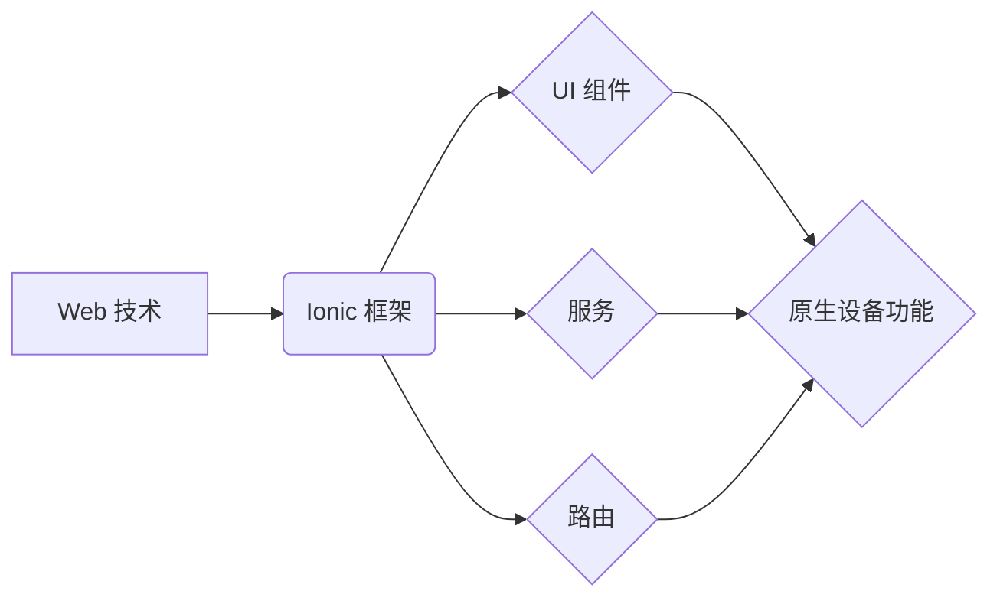

                 

## Ionic 框架：基于 Angular 的移动应用

> 关键词：Ionic, Angular, 移动应用开发, 跨平台, Web 技术, UI 组件, Cordova, Capacitor

## 1. 背景介绍

移动应用已成为现代生活不可或缺的一部分，其便捷性和强大的功能吸引了越来越多的用户。开发高质量的移动应用需要掌握特定的技术和工具。传统的移动应用开发通常需要分别针对 iOS 和 Android 平台进行开发，这不仅增加了开发成本和时间，也难以保证跨平台的应用一致性。

为了解决这些问题，跨平台移动应用开发框架应运而生。Ionic 框架作为其中佼佼者，基于 Web 技术，利用 Angular 的强大功能，为开发者提供了一种高效、便捷的跨平台移动应用开发解决方案。

## 2. 核心概念与联系

Ionic 框架的核心概念是将 Web 技术应用于移动应用开发。它利用 HTML、CSS 和 JavaScript 等 Web 技术构建用户界面，并通过 Cordova 或 Capacitor 等插件与原生设备功能进行交互。

**Ionic 框架的架构**



**核心概念解释:**

* **Web 技术:** Ionic 框架的核心是基于 Web 技术的开发，包括 HTML、CSS 和 JavaScript。
* **Ionic 框架:**  Ionic 框架提供了一套完整的移动应用开发工具和组件，简化了开发流程。
* **UI 组件:** Ionic 框架提供丰富的 UI 组件，例如按钮、列表、卡片等，方便开发者快速构建用户界面。
* **服务:** Ionic 框架支持服务化开发，开发者可以将业务逻辑封装成服务，方便代码复用和维护。
* **路由:** Ionic 框架支持路由功能，方便开发者构建多页面应用。
* **原生设备功能:** 通过 Cordova 或 Capacitor 插件，Ionic 框架可以访问原生设备功能，例如相机、定位、通知等。

## 3. 核心算法原理 & 具体操作步骤

Ionic 框架本身并不依赖于特定的算法，而是基于 Web 技术和 Angular 的框架结构。其核心原理在于将 Web 应用打包成原生应用，并通过插件与原生设备功能进行交互。

**3.1 算法原理概述**

Ionic 框架的核心原理是将 Web 应用打包成原生应用，并通过插件与原生设备功能进行交互。

* **Web 应用打包:** Ionic 框架使用 Webpack 等工具将 Web 应用代码打包成一个独立的应用程序包。
* **原生应用容器:**  Ionic 框架使用 Cordova 或 Capacitor 等插件将 Web 应用包封装成一个原生应用容器，使其能够在不同平台上运行。
* **插件交互:**  Ionic 框架通过插件与原生设备功能进行交互，例如访问相机、定位、通知等。

**3.2 算法步骤详解**

1. **开发 Web 应用:** 使用 HTML、CSS 和 JavaScript 等 Web 技术开发移动应用的逻辑和用户界面。
2. **集成 Ionic 框架:** 在 Web 应用中引入 Ionic 框架的库和组件。
3. **配置 Cordova 或 Capacitor:** 选择合适的插件，并配置 Cordova 或 Capacitor 以实现与原生设备功能的交互。
4. **打包应用:** 使用 Ionic CLI 命令打包 Web 应用成原生应用包。
5. **发布应用:** 将打包好的应用包上传到 App Store 或 Google Play 等应用商店。

**3.3 算法优缺点**

**优点:**

* **跨平台开发:**  Ionic 框架支持跨平台开发，可以一次开发，在多个平台上运行。
* **快速开发:**  Ionic 框架提供丰富的 UI 组件和服务，可以加速开发流程。
* **成本效益高:**  Ionic 框架基于 Web 技术，开发成本相对较低。

**缺点:**

* **性能:**  Ionic 框架基于 Web 技术，性能可能不如原生应用。
* **原生功能:**  Ionic 框架依赖于插件，访问原生功能可能存在一些限制。
* **学习曲线:**  Ionic 框架需要学习 Angular 和 Web 技术。

**3.4 算法应用领域**

Ionic 框架适用于各种类型的移动应用开发，例如：

* **企业应用:**  内部管理系统、客户关系管理系统等。
* **电商应用:**  商品展示、订单管理、支付系统等。
* **社交应用:**  聊天、分享、社区互动等。
* **教育应用:**  在线学习、考试、资源分享等。

## 4. 数学模型和公式 & 详细讲解 & 举例说明

Ionic 框架本身并不依赖于特定的数学模型和公式。其核心原理是基于 Web 技术和 Angular 的框架结构，通过 UI 组件、服务和路由等机制实现移动应用开发。

## 5. 项目实践：代码实例和详细解释说明

**5.1 开发环境搭建**

1. 安装 Node.js 和 npm:  Ionic 框架基于 Node.js 和 npm 进行开发，需要先安装这两个工具。
2. 安装 Ionic CLI: 使用 npm 安装 Ionic CLI 工具。

```bash
npm install -g @ionic/cli
```

3. 创建 Ionic 项目: 使用 Ionic CLI 创建一个新的 Ionic 项目。

```bash
ionic start my-app tabs
```

**5.2 源代码详细实现**

Ionic 项目的源代码结构通常包含以下几个主要部分:

* **src:**  包含应用的源代码文件，例如组件、服务、路由等。
* **assets:**  包含应用的静态资源文件，例如图片、字体、配置文件等。
* **package.json:**  包含项目的依赖包信息。

**示例代码:**

```html
<!-- app.component.html -->
<h1>Hello Ionic!</h1>
```

```typescript
// app.component.ts
import { Component } from '@angular/core';

@Component({
  selector: 'app-root',
  templateUrl: './app.component.html',
  styleUrls: ['./app.component.css'],
})
export class AppComponent {
  title = 'my-app';
}
```

**5.3 代码解读与分析**

* **app.component.html:**  定义了应用的根组件的模板，显示 "Hello Ionic!" 的文本。
* **app.component.ts:**  定义了应用的根组件的逻辑，包含一个 `title` 属性，用于设置应用的标题。

**5.4 运行结果展示**

使用 Ionic CLI 命令运行应用:

```bash
ionic serve
```

运行后，应用会启动一个本地服务器，并在浏览器中打开应用。

## 6. 实际应用场景

Ionic 框架广泛应用于各种移动应用场景，例如：

* **电商应用:**  使用 Ionic 框架开发的电商应用可以提供丰富的商品展示、购物车、订单管理等功能，并支持跨平台发布。
* **社交应用:**  Ionic 框架可以用于开发聊天、分享、社区互动等社交应用，并支持实时消息推送和用户身份验证。
* **教育应用:**  Ionic 框架可以用于开发在线学习、考试、资源分享等教育应用，并支持离线学习和个性化学习内容。

**6.4 未来应用展望**

随着移动互联网的发展，Ionic 框架的应用场景将更加广泛。未来，Ionic 框架可能会更加注重性能优化、原生功能集成和人工智能应用，为开发者提供更强大的移动应用开发工具。

## 7. 工具和资源推荐

**7.1 学习资源推荐**

* **Ionic 官方文档:** https://ionicframework.com/docs/
* **Ionic 官方教程:** https://ionicframework.com/docs/getting-started
* **Ionic 中文社区:** https://forum.ionicframework.com/

**7.2 开发工具推荐**

* **Visual Studio Code:** https://code.visualstudio.com/
* **Android Studio:** https://developer.android.com/studio
* **Xcode:** https://developer.apple.com/xcode/

**7.3 相关论文推荐**

* **Ionic Framework: A Cross-Platform Mobile Development Framework**
* **AngularJS: A Comprehensive Overview**

## 8. 总结：未来发展趋势与挑战

Ionic 框架作为一种跨平台移动应用开发框架，在移动应用开发领域发挥着重要作用。其基于 Web 技术的开发模式，简化了开发流程，降低了开发成本。

**8.1 研究成果总结**

Ionic 框架已经发展成为一个成熟的跨平台移动应用开发框架，拥有丰富的 UI 组件、服务和插件，支持多种平台和设备。

**8.2 未来发展趋势**

* **性能优化:**  Ionic 框架将继续关注性能优化，提高应用的运行效率。
* **原生功能集成:**  Ionic 框架将继续加强与原生设备功能的集成，提供更丰富的功能支持。
* **人工智能应用:**  Ionic 框架将探索人工智能技术在移动应用开发中的应用，为开发者提供更智能的开发工具和功能。

**8.3 面临的挑战**

* **性能瓶颈:**  Ionic 框架基于 Web 技术，在某些情况下可能存在性能瓶颈，需要不断优化和改进。
* **原生功能限制:**  Ionic 框架依赖于插件，访问原生功能可能存在一些限制，需要开发者进行妥善处理。
* **技术更新:**  Web 技术和移动平台不断更新，Ionic 框架需要不断跟进技术发展，提供最新的开发工具和支持。

**8.4 研究展望**

Ionic 框架的未来发展方向将更加注重性能优化、原生功能集成和人工智能应用，为开发者提供更强大、更便捷的移动应用开发工具。


## 9. 附录：常见问题与解答

**常见问题:**

* **Ionic 框架和 React Native 的区别是什么？**
* **如何解决 Ionic 框架应用的性能问题？**
* **如何使用 Ionic 框架访问原生设备功能？**

**解答:**

* **Ionic 框架和 React Native 的区别:** Ionic 框架基于 Web 技术，使用 HTML、CSS 和 JavaScript 开发，而 React Native 基于原生组件，使用 JavaScript 开发。Ionic 框架的开发成本相对较低，但性能可能不如 React Native。
* **如何解决 Ionic 框架应用的性能问题:** 可以通过优化代码、使用缓存机制、减少网络请求等方式来提高 Ionic 框架应用的性能。
* **如何使用 Ionic 框架访问原生设备功能:** 可以使用 Cordova 或 Capacitor 插件来访问原生设备功能。


作者：禅与计算机程序设计艺术 / Zen and the Art of Computer Programming 
<end_of_turn>

