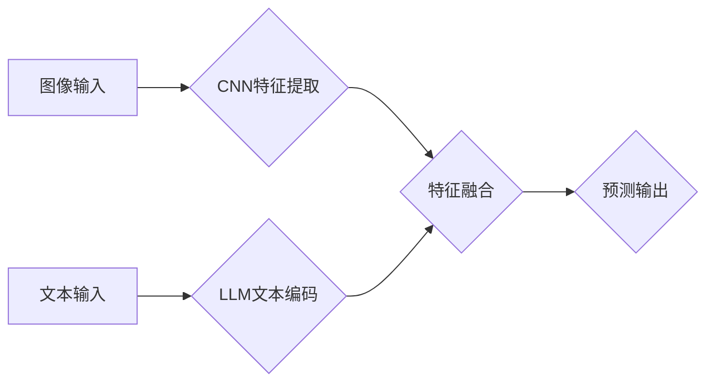

                 

## LLM与传统图像识别技术的结合：视觉AI新境界

> 关键词：大型语言模型（LLM）、图像识别、视觉AI、多模态学习、跨模态理解、文本描述、图像生成、计算机视觉

## 1. 背景介绍

近年来，人工智能（AI）领域取得了令人瞩目的进展，其中大型语言模型（LLM）和传统图像识别技术两大支柱技术分别在自然语言处理和计算机视觉领域取得了突破性成就。LLM，例如GPT-3和LaMDA，展现出强大的文本生成、理解和翻译能力，而传统图像识别技术，例如卷积神经网络（CNN），在图像分类、目标检测和图像分割等任务上取得了令人印象深刻的精度。

然而，这两个领域仍然相对独立，缺乏有效的融合。图像和文本是人类感知和理解世界的重要两种方式，将它们结合起来可以构建更强大、更智能的AI系统，从而实现更深入的跨模态理解和交互。

## 2. 核心概念与联系

**2.1 核心概念**

* **大型语言模型（LLM）：** 训练于海量文本数据，能够理解和生成人类语言的深度学习模型。
* **传统图像识别技术：** 利用深度学习算法，例如卷积神经网络（CNN），从图像中提取特征并进行分类、检测、分割等任务。
* **多模态学习：** 训练模型处理多种类型的数据，例如文本、图像、音频等，并学习不同模态之间的关系。
* **跨模态理解：** 能够理解不同模态之间的语义联系，例如从图像中提取文本描述，或根据文本生成图像。

**2.2 架构示意图**



**2.3 联系**

将LLM与传统图像识别技术结合，可以实现以下优势：

* **增强图像理解：** LLM可以利用其强大的文本理解能力，为图像识别提供更丰富的语义信息，从而提高识别精度和准确性。
* **实现跨模态交互：** 可以利用LLM生成图像描述文本，或根据文本描述生成图像，实现图像和文本之间的相互转换和理解。
* **拓展应用场景：** 结合LLM可以拓展图像识别技术的应用场景，例如自动生成图像字幕、图像问答、图像生成等。

## 3. 核心算法原理 & 具体操作步骤

**3.1 算法原理概述**

将LLM与传统图像识别技术结合的核心算法原理是多模态学习，即训练模型处理多种类型的数据，并学习不同模态之间的关系。

常见的多模态学习方法包括：

* **特征融合:** 将图像特征和文本特征融合在一起，作为模型的输入，例如使用注意力机制对不同模态特征进行加权融合。
* **共享表示学习:** 训练一个共享的表示空间，使得图像和文本特征在同一个空间中进行表示，从而学习它们的语义联系。
* **端到端训练:** 将图像识别和文本生成任务作为一个整体进行端到端训练，优化整个系统的性能。

**3.2 算法步骤详解**

1. **图像预处理:** 对输入图像进行预处理，例如尺寸调整、归一化等。
2. **图像特征提取:** 使用CNN提取图像特征，例如使用ResNet、VGG等预训练模型。
3. **文本编码:** 使用LLM对文本输入进行编码，例如使用BERT、RoBERTa等预训练模型。
4. **特征融合:** 使用注意力机制或其他融合方法将图像特征和文本特征融合在一起。
5. **预测输出:** 根据融合后的特征，进行预测输出，例如图像分类、目标检测、图像生成等。

**3.3 算法优缺点**

* **优点:** 能够提高图像理解能力，实现跨模态交互，拓展应用场景。
* **缺点:** 需要大量的训练数据，训练成本较高，模型复杂度较高。

**3.4 算法应用领域**

* **自动驾驶:** 利用图像识别和文本理解技术，帮助车辆识别道路标志、交通信号灯和行人等。
* **医疗诊断:** 利用图像识别和文本理解技术，帮助医生诊断疾病、分析病理图像等。
* **电商推荐:** 利用图像识别和文本理解技术，帮助电商平台推荐商品、生成商品描述等。
* **内容创作:** 利用图像识别和文本理解技术，帮助用户生成图像字幕、图像问答等。

## 4. 数学模型和公式 & 详细讲解 & 举例说明

**4.1 数学模型构建**

多模态学习模型通常采用以下数学模型：

* **特征融合模型:**

$$
\mathbf{h} = \mathbf{W}_1 \mathbf{x} + \mathbf{W}_2 \mathbf{y} + \mathbf{b}
$$

其中：

* $\mathbf{h}$ 是融合后的特征向量。
* $\mathbf{x}$ 是图像特征向量。
* $\mathbf{y}$ 是文本特征向量。
* $\mathbf{W}_1$ 和 $\mathbf{W}_2$ 是权重矩阵。
* $\mathbf{b}$ 是偏置项。

* **共享表示学习模型:**

$$
\mathbf{z} = \mathbf{f}(\mathbf{x}, \mathbf{y})
$$

其中：

* $\mathbf{z}$ 是共享表示向量。
* $\mathbf{f}$ 是共享表示学习函数。

**4.2 公式推导过程**

特征融合模型的推导过程是基于线性组合的思想，将图像特征和文本特征线性组合起来，得到融合后的特征向量。共享表示学习模型的推导过程则更复杂，需要使用神经网络等深度学习算法，学习图像和文本之间的非线性关系。

**4.3 案例分析与讲解**

例如，在图像字幕生成任务中，可以使用一个多模态学习模型，将图像特征和文本特征融合在一起，然后使用一个文本生成器生成图像字幕。

## 5. 项目实践：代码实例和详细解释说明

**5.1 开发环境搭建**

* Python 3.7+
* TensorFlow 或 PyTorch
* CUDA 和 cuDNN

**5.2 源代码详细实现**

```python
import tensorflow as tf

# 定义图像特征提取模型
image_model = tf.keras.applications.ResNet50(include_top=False, weights='imagenet')

# 定义文本编码模型
text_model = tf.keras.layers.Embedding(vocab_size=10000, embedding_dim=128)

# 定义特征融合模型
def fusion_model(image_features, text_features):
    # 使用注意力机制融合特征
    attention_weights = tf.keras.layers.Dense(1, activation='softmax')(tf.concat([image_features, text_features], axis=-1))
    weighted_image_features = tf.multiply(image_features, attention_weights)
    fused_features = tf.keras.layers.Add()([weighted_image_features, text_features])
    return fused_features

# 定义预测模型
def prediction_model(fused_features):
    # 使用全连接层进行预测
    output = tf.keras.layers.Dense(num_classes, activation='softmax')(fused_features)
    return output

# 构建多模态学习模型
input_image = tf.keras.Input(shape=(image_height, image_width, 3))
input_text = tf.keras.Input(shape=(text_length,))
image_features = image_model(input_image)
text_features = text_model(input_text)
fused_features = fusion_model(image_features, text_features)
output = prediction_model(fused_features)

model = tf.keras.Model(inputs=[input_image, input_text], outputs=output)

# 训练模型
model.compile(optimizer='adam', loss='categorical_crossentropy', metrics=['accuracy'])
model.fit(x=[image_data, text_data], y=label_data, epochs=10)

```

**5.3 代码解读与分析**

* 代码首先定义了图像特征提取模型和文本编码模型。
* 然后定义了特征融合模型，使用注意力机制对图像特征和文本特征进行加权融合。
* 最后定义了预测模型，使用全连接层进行预测。

**5.4 运行结果展示**

运行代码后，可以得到模型的训练结果，例如准确率、损失等指标。

## 6. 实际应用场景

**6.1 自动驾驶**

* 利用图像识别技术识别道路标志、交通信号灯和行人等。
* 利用文本理解技术理解道路指示牌和语音导航信息。
* 将图像识别和文本理解技术结合起来，实现更精准的驾驶决策。

**6.2 医疗诊断**

* 利用图像识别技术分析病理图像，辅助医生诊断疾病。
* 利用文本理解技术分析患者病历和医学文献，辅助医生制定治疗方案。
* 将图像识别和文本理解技术结合起来，实现更智能的医疗诊断系统。

**6.3 电商推荐**

* 利用图像识别技术识别商品的类别和属性。
* 利用文本理解技术分析用户商品评论和搜索词，了解用户需求。
* 将图像识别和文本理解技术结合起来，实现更精准的商品推荐。

**6.4 内容创作**

* 利用图像识别技术生成图像字幕和图像描述。
* 利用文本理解技术根据文本描述生成图像。
* 将图像识别和文本理解技术结合起来，实现更智能的内容创作工具。

**6.5 未来应用展望**

随着LLM和传统图像识别技术的不断发展，其结合将带来更多创新应用，例如：

* 更智能的虚拟助手，能够理解图像和文本信息，并提供更精准的帮助。
* 更逼真的虚拟现实和增强现实体验，能够将虚拟物体与现实环境融合在一起。
* 更强大的图像生成工具，能够根据文本描述生成更逼真的图像。

## 7. 工具和资源推荐

**7.1 学习资源推荐**

* **书籍:**
    * Deep Learning with Python by Francois Chollet
    * Natural Language Processing with Python by Steven Bird, Ewan Klein, and Edward Loper
* **在线课程:**
    * Stanford CS231n: Convolutional Neural Networks for Visual Recognition
    * DeepLearning.AI: Natural Language Processing Specialization

**7.2 开发工具推荐**

* **TensorFlow:** 开源深度学习框架，支持多种硬件平台。
* **PyTorch:** 开源深度学习框架，以其灵活性和易用性而闻名。
* **Hugging Face Transformers:** 提供预训练的LLM模型和工具，方便进行多模态学习开发。

**7.3 相关论文推荐**

* **Show, Attend and Tell: Neural Image Captioning with Visual Attention**
* **BERT: Pre-training of Deep Bidirectional Transformers for Language Understanding**
* **CLIP: Contrastive Language-Image Pretraining**

## 8. 总结：未来发展趋势与挑战

**8.1 研究成果总结**

LLM与传统图像识别技术的结合取得了显著成果，在图像理解、跨模态交互、应用场景拓展等方面展现出巨大潜力。

**8.2 未来发展趋势**

* **模型规模和能力提升:** 随着计算资源的不断发展，LLM和图像识别模型将变得更大、更强大，能够处理更复杂的任务。
* **多模态学习方法创新:** 将探索更有效的多模态学习方法，例如跨模态自监督学习、生成式多模态学习等。
* **应用场景拓展:** 将LLM与传统图像识别技术结合应用于更多领域，例如教育、娱乐、医疗等。

**8.3 面临的挑战**

* **数据获取和标注:** 多模态学习需要大量的标注数据，获取和标注这些数据成本较高。
* **模型训练和推理效率:** 多模态学习模型通常规模较大，训练和推理效率较低。
* **伦理和安全问题:** LLM和图像识别技术可能存在伦理和安全问题，例如数据隐私、算法偏见等，需要引起重视和解决。

**8.4 研究展望**

未来，LLM与传统图像识别技术的结合将继续是一个重要的研究方向，需要不断探索新的方法和技术，以解决上述挑战，并推动视觉AI技术的进一步发展。

## 9. 附录：常见问题与解答

**9.1 如何选择合适的LLM模型？**

选择合适的LLM模型需要根据具体任务和数据特点进行选择。例如，对于图像字幕生成任务，可以选择预训练的图像 captioning 模型，例如Show, Attend and Tell。

**9.2 如何处理多模态数据的不平衡问题？**

多模态数据的不平衡问题可以通过数据增强、权重调整等方法进行处理。

**9.3 如何评估多模态学习模型的性能？**

多模态学习模型的性能可以评估指标包括准确率、召回率、F1-score等。

**9.4 如何解决多模态学习模型的训练效率问题？**

可以采用模型压缩、分布式训练等方法提高训练效率。


作者：禅与计算机程序设计艺术 / Zen and the Art of Computer Programming<end_of_turn>

