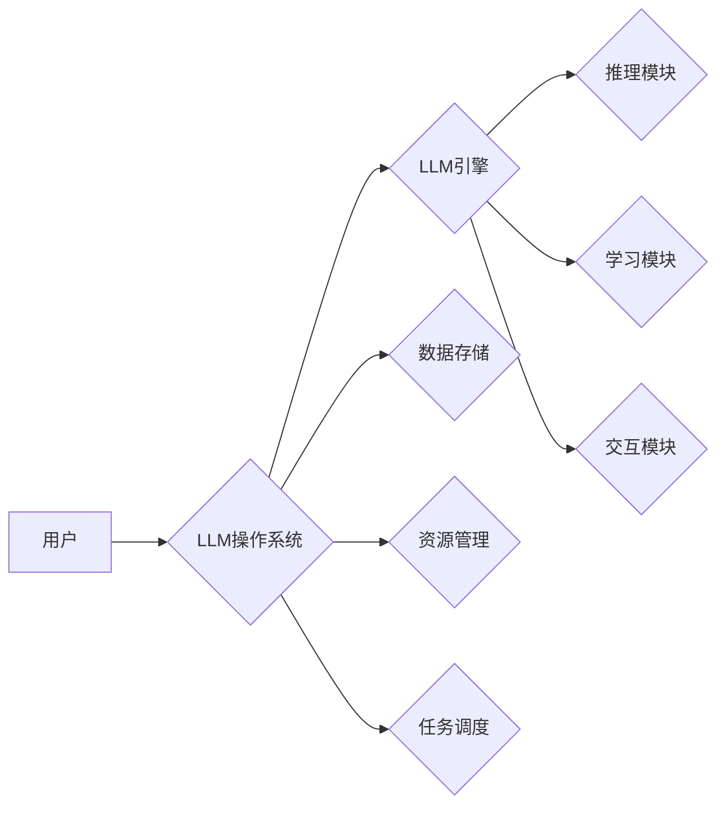

                 

## LLM操作系统：AI时代的新型OS构想

> 关键词：LLM, 大模型, 操作系统, AI, 编程, 认知计算, 人机交互, 未来技术

### 1. 背景介绍

随着人工智能技术的飞速发展，大型语言模型（LLM）已经展现出强大的能力，能够理解和生成人类语言，完成各种复杂的任务，例如文本生成、翻译、问答、代码编写等。然而，LLM 的应用目前主要局限于特定的场景和任务，缺乏灵活性和通用性。

传统的操作系统为硬件和软件提供了一套运行环境和服务，管理资源、调度任务、提供用户界面等。而LLM操作系统则旨在为大型语言模型提供一个全新的运行环境，使其能够更灵活、更有效地进行推理、学习和交互。

### 2. 核心概念与联系

LLM操作系统的核心概念是将大型语言模型视为一个独立的“进程”，并为其提供一套完整的运行环境和服务。

**架构图：**

**核心概念：**

* **LLM引擎:** 作为LLM操作系统的核心，负责执行LLM的推理、学习和交互任务。
* **数据存储:** 用于存储LLM模型参数、训练数据、运行日志等信息。
* **资源管理:** 管理LLM引擎所需的计算资源、内存资源、网络资源等。
* **任务调度:** 负责接收用户请求，调度LLM引擎执行相应的任务。
* **推理模块:** 负责执行LLM的推理任务，例如文本生成、翻译、问答等。
* **学习模块:** 负责LLM的在线学习和模型更新。
* **交互模块:** 负责与用户进行交互，接收用户输入，输出LLM的处理结果。

### 3. 核心算法原理 & 具体操作步骤

#### 3.1  算法原理概述

LLM操作系统的核心算法原理是基于Transformer架构的深度学习算法。Transformer是一种新型的神经网络架构，能够有效地处理序列数据，例如文本。它利用注意力机制来捕捉文本中的长距离依赖关系，从而实现更准确的理解和生成。

#### 3.2  算法步骤详解

1. **数据预处理:** 将文本数据进行清洗、分词、词嵌入等预处理操作，使其能够被LLM模型理解。
2. **模型训练:** 使用训练数据训练LLM模型，通过反向传播算法不断调整模型参数，使其能够生成更准确的输出。
3. **模型部署:** 将训练好的LLM模型部署到LLM操作系统中，使其能够接受用户请求并执行相应的任务。
4. **任务执行:** 当用户发出请求时，LLM操作系统会将请求发送到LLM引擎，LLM引擎会根据请求内容执行相应的推理任务，并返回结果给用户。

#### 3.3  算法优缺点

**优点:**

* **强大的文本理解和生成能力:** Transformer架构能够有效地捕捉文本中的长距离依赖关系，从而实现更准确的理解和生成。
* **可扩展性强:** Transformer模型可以很容易地扩展到更大的规模，从而处理更复杂的任务。
* **通用性强:** Transformer模型可以应用于各种自然语言处理任务，例如文本分类、问答、机器翻译等。

**缺点:**

* **训练成本高:** Transformer模型的训练需要大量的计算资源和时间。
* **参数量大:** Transformer模型的参数量很大，需要大量的存储空间。
* **推理速度慢:** Transformer模型的推理速度相对较慢，尤其是在处理长文本时。

#### 3.4  算法应用领域

LLM操作系统和其核心算法在以下领域具有广泛的应用前景:

* **智能客服:** 自动化处理客户咨询，提供快速、高效的客户服务。
* **内容创作:** 自动生成各种类型的文本内容，例如文章、故事、广告文案等。
* **教育辅助:** 提供个性化的学习辅导，帮助学生提高学习效率。
* **代码生成:** 自动生成代码，提高软件开发效率。
* **科学研究:** 辅助科学家进行数据分析、文献综述等工作。

### 4. 数学模型和公式 & 详细讲解 & 举例说明

#### 4.1  数学模型构建

LLM操作系统的核心数学模型是基于Transformer架构的深度神经网络。Transformer模型由多个编码器和解码器层组成，每个层包含多头注意力机制、前馈神经网络等模块。

#### 4.2  公式推导过程

Transformer模型的注意力机制的核心公式是：

$$
Attention(Q, K, V) = softmax(\frac{QK^T}{\sqrt{d_k}})V
$$

其中：

* $Q$：查询矩阵
* $K$：键矩阵
* $V$：值矩阵
* $d_k$：键向量的维度
* $softmax$：softmax函数

该公式计算了查询向量与键向量的相似度，并根据相似度对值向量进行加权求和，从而得到注意力输出。

#### 4.3  案例分析与讲解

例如，在机器翻译任务中，输入句子会被编码成一个查询向量，目标语言的词典会被编码成一个键向量和一个值向量。注意力机制会计算查询向量与每个键向量的相似度，并根据相似度对值向量进行加权求和，从而得到翻译结果。

### 5. 项目实践：代码实例和详细解释说明

#### 5.1  开发环境搭建

LLM操作系统可以使用Python语言开发，并依赖于深度学习框架，例如TensorFlow或PyTorch。开发环境需要安装Python、深度学习框架、必要的库和工具。

#### 5.2  源代码详细实现

LLM操作系统的源代码实现涉及多个模块，例如LLM引擎、数据存储、资源管理、任务调度等。每个模块都需要根据具体需求进行设计和实现。

#### 5.3  代码解读与分析

代码解读需要分析每个模块的功能、算法实现、数据结构等。

#### 5.4  运行结果展示

LLM操作系统的运行结果需要展示其能够完成各种任务的能力，例如文本生成、翻译、问答等。

### 6. 实际应用场景

LLM操作系统可以应用于各种实际场景，例如智能客服、内容创作、教育辅助、代码生成等。

#### 6.4  未来应用展望

LLM操作系统在未来将会有更广泛的应用场景，例如：

* **个性化教育:** 根据学生的学习情况提供个性化的学习辅导。
* **医疗诊断:** 辅助医生进行疾病诊断和治疗方案制定。
* **法律服务:** 自动化处理法律文件和合同审查。
* **金融分析:** 分析市场数据，预测股票价格走势。

### 7. 工具和资源推荐

#### 7.1  学习资源推荐

* **书籍:**

    * 《深度学习》
    * 《自然语言处理》
    * 《Transformer模型》

* **在线课程:**

    * Coursera
    * edX
    * Udacity

#### 7.2  开发工具推荐

* **Python:** 作为LLM操作系统的开发语言。
* **TensorFlow:** 深度学习框架。
* **PyTorch:** 深度学习框架。
* **HuggingFace:** 预训练模型库。

#### 7.3  相关论文推荐

* 《Attention Is All You Need》
* 《BERT: Pre-training of Deep Bidirectional Transformers for Language Understanding》
* 《GPT-3: Language Models are Few-Shot Learners》

### 8. 总结：未来发展趋势与挑战

#### 8.1  研究成果总结

LLM操作系统是一个新兴的领域，近年来取得了显著的进展。Transformer模型的出现为LLM的开发提供了强大的工具，并推动了LLM应用的快速发展。

#### 8.2  未来发展趋势

LLM操作系统的未来发展趋势包括：

* **模型规模的进一步扩大:** 更大的模型能够处理更复杂的任务，并获得更高的性能。
* **模型效率的提升:** 降低模型的训练成本和推理速度，使其能够在更多场景中应用。
* **模型的通用性增强:** 使LLM能够适应更多不同的任务和领域。
* **模型的可解释性提高:** 更好地理解LLM的决策过程，提高其可信度和安全性。

#### 8.3  面临的挑战

LLM操作系统的开发和应用还面临着一些挑战：

* **数据获取和标注:** 训练高质量的LLM模型需要大量的标注数据，而获取和标注数据成本高昂。
* **模型训练和部署:** 训练大型语言模型需要大量的计算资源和时间，部署到实际应用场景中也需要克服一些技术难题。
* **模型安全性:** LLM模型可能存在一些安全风险，例如生成虚假信息、被恶意利用等。

#### 8.4  研究展望

未来，LLM操作系统将继续朝着更强大、更通用、更安全的方向发展。研究者们将致力于解决上述挑战，并探索LLM在更多领域的新应用场景。

### 9. 附录：常见问题与解答

* **什么是LLM操作系统？**

LLM操作系统是一个为大型语言模型提供运行环境和服务的全新操作系统。

* **LLM操作系统与传统操作系统有什么区别？**

传统操作系统主要为硬件和软件提供运行环境，而LLM操作系统则专门为大型语言模型提供服务。

* **LLM操作系统有哪些应用场景？**

LLM操作系统可以应用于智能客服、内容创作、教育辅助、代码生成等各种场景。

* **如何开发LLM操作系统？**

LLM操作系统可以使用Python语言开发，并依赖于深度学习框架，例如TensorFlow或PyTorch。

* **LLM操作系统有哪些挑战？**

LLM操作系统的开发和应用还面临着数据获取、模型训练、模型安全性等挑战。

作者：禅与计算机程序设计艺术 / Zen and the Art of Computer Programming 
<end_of_turn>

