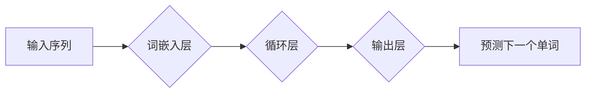

                 

## LLM的时序性：重新定义计算过程

> 关键词：大型语言模型 (LLM)、时序性、计算过程、动态计算、因果关系、序列建模、时间感知计算

## 1. 背景介绍

大型语言模型 (LLM) 近年来取得了令人瞩目的成就，在自然语言处理、文本生成、代码编写等领域展现出强大的能力。然而，传统的计算模型主要基于静态数据处理，难以充分捕捉语言的动态性和语义依赖关系。LLM的出现，为我们提供了一种全新的视角，即通过学习语言的时序性来理解和处理信息。

传统的计算模型通常将数据视为独立的元素，并通过预先定义的规则和算法进行处理。这种静态处理方式难以捕捉语言的动态性和语义依赖关系。例如，理解一个句子需要考虑每个单词的上下文信息，而上下文信息本身又是时序性的。

LLM 则通过学习语言的时序性来克服这一局限性。它们采用序列建模的方式，将语言视为一个时间序列，并学习每个单词在序列中的位置和语义关系。这种动态的计算过程能够更好地捕捉语言的复杂性和微妙性。

## 2. 核心概念与联系

LLM 的时序性体现在以下几个核心概念上：

* **序列建模:** 将语言视为一个时间序列，并学习每个单词在序列中的位置和语义关系。
* **动态计算:** 随着输入序列的不断更新，模型的计算过程也会不断变化，从而能够捕捉语言的动态性。
* **因果关系:** LLM 学习语言的因果关系，即一个单词的出现会影响后续单词的出现。

这些概念相互关联，共同构成了 LLM 的时序性计算模型。

**Mermaid 流程图**



## 3. 核心算法原理 & 具体操作步骤

### 3.1  算法原理概述

LLM 的核心算法通常是基于 Transformer 架构的，它利用自注意力机制来捕捉语言的序列依赖关系。自注意力机制能够学习每个单词与其他单词之间的关系，从而更好地理解上下文信息。

### 3.2  算法步骤详解

1. **词嵌入:** 将每个单词转换为一个向量表示，称为词嵌入。
2. **循环层:** 将词嵌入输入到循环层中，循环层会根据每个单词的上下文信息生成一个隐藏状态。
3. **自注意力机制:** 在循环层中，自注意力机制会计算每个单词与其他单词之间的注意力权重，从而捕捉语言的序列依赖关系。
4. **输出层:** 将隐藏状态输入到输出层中，输出层会预测下一个单词。

### 3.3  算法优缺点

**优点:**

* 能够捕捉语言的复杂性和微妙性。
* 训练效率高，能够处理大量的数据。
* 在各种自然语言处理任务中表现出色。

**缺点:**

* 计算量大，需要强大的计算资源。
* 训练数据量大，需要大量的标注数据。
* 对长序列数据处理能力有限。

### 3.4  算法应用领域

LLM 的时序性计算模型在以下领域具有广泛的应用：

* **自然语言理解:** 文本分类、情感分析、问答系统等。
* **文本生成:** 机器翻译、文本摘要、对话系统等。
* **代码生成:** 代码补全、代码生成等。
* **时间序列分析:** 预测股票价格、天气预报等。

## 4. 数学模型和公式 & 详细讲解 & 举例说明

### 4.1  数学模型构建

LLM 的时序性计算模型可以抽象为一个动态的概率图模型，其中每个节点代表一个单词，边代表单词之间的关系。模型的目标是学习每个单词在序列中的概率分布，从而能够预测下一个单词。

### 4.2  公式推导过程

LLM 的训练过程通常使用最大似然估计 (MLE) 方法，目标是最大化模型在训练数据上的似然概率。

$$
\mathcal{L} = \prod_{i=1}^{N} p(w_i | w_{<i})
$$

其中：

* $\mathcal{L}$ 是似然函数。
* $N$ 是序列长度。
* $w_i$ 是序列中的第 $i$ 个单词。
* $w_{<i}$ 是序列中第 $i$ 个单词之前的单词。

### 4.3  案例分析与讲解

假设我们有一个简单的序列 "the cat sat on the mat"，LLM 需要预测下一个单词。

* 首先，模型会将每个单词转换为词嵌入向量。
* 然后，模型会使用自注意力机制计算每个单词与其他单词之间的注意力权重。
* 最后，模型会根据注意力权重和词嵌入向量生成下一个单词的概率分布。

在该例子中，模型可能会预测下一个单词是 "dog"，因为 "dog" 是一个常见的动物词汇，并且在语境中与 "cat" 相关。

## 5. 项目实践：代码实例和详细解释说明

### 5.1  开发环境搭建

LLM 的开发环境通常需要包含以下软件：

* Python 语言环境
* 深度学习框架 (例如 TensorFlow 或 PyTorch)
* 自然语言处理库 (例如 NLTK 或 spaCy)

### 5.2  源代码详细实现

以下是一个使用 PyTorch 实现简单的 LLM 的代码示例：

```python
import torch
import torch.nn as nn

class SimpleLLM(nn.Module):
    def __init__(self, vocab_size, embedding_dim, hidden_dim):
        super(SimpleLLM, self).__init__()
        self.embedding = nn.Embedding(vocab_size, embedding_dim)
        self.lstm = nn.LSTM(embedding_dim, hidden_dim)
        self.fc = nn.Linear(hidden_dim, vocab_size)

    def forward(self, x):
        x = self.embedding(x)
        x, _ = self.lstm(x)
        x = self.fc(x[:, -1, :])
        return x

# 实例化模型
model = SimpleLLM(vocab_size=10000, embedding_dim=128, hidden_dim=256)

# 定义损失函数和优化器
criterion = nn.CrossEntropyLoss()
optimizer = torch.optim.Adam(model.parameters())

# 训练模型
for epoch in range(num_epochs):
    for batch in train_data:
        # 前向传播
        outputs = model(batch)
        loss = criterion(outputs, batch_labels)

        # 反向传播
        optimizer.zero_grad()
        loss.backward()

        # 更新参数
        optimizer.step()
```

### 5.3  代码解读与分析

* 该代码定义了一个简单的 LLM 模型，包含词嵌入层、循环层和输出层。
* 词嵌入层将每个单词转换为向量表示。
* 循环层使用 LSTM 网络来捕捉语言的序列依赖关系。
* 输出层预测下一个单词的概率分布。
* 模型使用最大似然估计方法进行训练，目标是最大化模型在训练数据上的似然概率。

### 5.4  运行结果展示

训练完成后，模型可以用于预测下一个单词。例如，如果输入序列是 "the cat sat on the"，模型可能会预测下一个单词是 "mat"。

## 6. 实际应用场景

LLM 的时序性计算模型在以下实际应用场景中展现出强大的能力：

### 6.1  机器翻译

LLM 可以学习语言之间的语义关系，从而实现更准确和流畅的机器翻译。

### 6.2  文本摘要

LLM 可以分析文本的结构和语义，并生成简洁准确的文本摘要。

### 6.3  对话系统

LLM 可以理解用户的自然语言输入，并生成自然流畅的对话回复。

### 6.4  未来应用展望

LLM 的时序性计算模型在未来将有更广泛的应用，例如：

* **个性化教育:** 根据学生的学习进度和风格，提供个性化的学习内容和辅导。
* **医疗诊断:** 分析患者的病历和症状，辅助医生进行诊断。
* **金融预测:** 分析市场数据和趋势，预测股票价格和经济走势。

## 7. 工具和资源推荐

### 7.1  学习资源推荐

* **书籍:**
    * "Deep Learning" by Ian Goodfellow, Yoshua Bengio, and Aaron Courville
    * "Speech and Language Processing" by Daniel Jurafsky and James H. Martin
* **在线课程:**
    * Coursera: Natural Language Processing Specialization
    * Udacity: Deep Learning Nanodegree

### 7.2  开发工具推荐

* **深度学习框架:** TensorFlow, PyTorch
* **自然语言处理库:** NLTK, spaCy
* **代码托管平台:** GitHub

### 7.3  相关论文推荐

* "Attention Is All You Need" by Vaswani et al. (2017)
* "BERT: Pre-training of Deep Bidirectional Transformers for Language Understanding" by Devlin et al. (2018)
* "GPT-3: Language Models are Few-Shot Learners" by Brown et al. (2020)

## 8. 总结：未来发展趋势与挑战

### 8.1  研究成果总结

LLM 的时序性计算模型取得了显著的进展，在自然语言处理领域取得了突破性的成就。

### 8.2  未来发展趋势

LLM 的未来发展趋势包括：

* **模型规模的进一步扩大:** 更大的模型能够学习更复杂的语言模式。
* **训练数据的多样化:** 更丰富的训练数据能够提高模型的泛化能力。
* **算法的改进:** 新的算法能够提高模型的效率和性能。

### 8.3  面临的挑战

LLM 还面临着一些挑战：

* **计算资源的限制:** 训练大型 LLM 需要大量的计算资源。
* **数据隐私和安全:** LLM 的训练数据可能包含敏感信息，需要妥善保护。
* **模型的可解释性:** LLM 的决策过程难以理解，需要提高模型的可解释性。

### 8.4  研究展望

未来，LLM 的研究将继续探索新的算法、模型架构和应用场景，推动人工智能技术的发展。

## 9. 附录：常见问题与解答

**Q1: LLM 的时序性计算模型与传统的计算模型有什么区别？**

**A1:** 传统的计算模型通常将数据视为独立的元素，而 LLM 的时序性计算模型则将语言视为一个时间序列，并学习每个单词在序列中的位置和语义关系。

**Q2: LLM 的训练数据需要满足哪些条件？**

**A2:** LLM 的训练数据需要是大量的文本数据，并且需要包含丰富的语义信息。

**Q3: 如何评估 LLM 的性能？**

**A3:** LLM 的性能通常使用准确率、困惑度等指标进行评估。


作者：禅与计算机程序设计艺术 / Zen and the Art of Computer Programming 
<end_of_turn>

