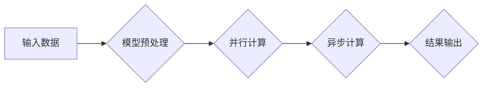

                 

## LLM的时间观：重新思考计算周期

> 关键词：LLM, 时间观, 计算周期, 延迟, 并行计算, 异步计算, 效率优化, 模型架构

### 1. 背景介绍

大型语言模型 (LLM) 近年来取得了令人瞩目的成就，在自然语言处理、文本生成、代码编写等领域展现出强大的能力。然而，随着模型规模的不断扩大，训练和推理的计算成本也随之攀升，计算周期成为了一个亟待解决的关键问题。传统的计算模型难以满足LLM对时间和资源的需求，迫切需要重新思考计算周期，探索更有效率、更灵活的计算方式。

### 2. 核心概念与联系

LLM的训练和推理本质上是一个复杂的计算过程，涉及大量的参数更新和前向传播。传统的计算模型通常采用同步计算方式，即每个计算步骤必须等待前一个步骤完成才能执行，这导致了计算效率低下。

为了解决这个问题，我们可以引入异步计算和并行计算的概念。异步计算允许多个计算任务同时进行，而无需等待彼此完成，从而缩短了整体计算时间。并行计算则通过将任务分解成多个子任务，并分别在不同的计算单元上执行，从而提高了计算吞吐量。

**Mermaid 流程图**



### 3. 核心算法原理 & 具体操作步骤

#### 3.1 算法原理概述

异步并行计算是一种结合了异步计算和并行计算的计算模型，它可以有效地利用多核处理器和GPU等并行计算资源，并通过异步任务调度机制，进一步提高计算效率。

#### 3.2 算法步骤详解

1. **数据分片:** 将输入数据划分为多个子任务，每个子任务可以独立地进行计算。
2. **任务调度:** 将每个子任务分配到不同的计算单元上执行。
3. **异步计算:** 允许多个子任务同时进行计算，而无需等待彼此完成。
4. **结果合并:** 将各个子任务的计算结果合并成最终的输出结果。

#### 3.3 算法优缺点

**优点:**

* **提高计算效率:** 通过并行计算和异步计算，可以显著缩短计算时间。
* **利用硬件资源:** 可以充分利用多核处理器和GPU等并行计算资源。
* **灵活性:** 可以根据任务需求灵活调整计算资源分配和任务调度策略。

**缺点:**

* **复杂性:** 异步并行计算的实现较为复杂，需要考虑数据同步、任务调度等问题。
* **开销:** 异步计算需要额外的内存和通信开销。

#### 3.4 算法应用领域

异步并行计算广泛应用于各种领域，例如：

* **机器学习:** 训练大型语言模型、深度神经网络等。
* **科学计算:** 进行复杂的数值模拟、数据分析等。
* **高性能计算:** 处理海量数据、进行大规模计算。

### 4. 数学模型和公式 & 详细讲解 & 举例说明

#### 4.1 数学模型构建

假设我们有一个包含N个参数的LLM，需要进行M次迭代训练。传统的同步计算模型需要M次迭代完成所有参数更新，而异步并行计算模型可以将M次迭代分解成多个子任务，并分别在不同的计算单元上执行。

我们可以用以下公式来表示异步并行计算模型的计算时间：

$$T_{async} = \frac{M}{P} * T_{task} + T_{comm}$$

其中：

* $T_{async}$: 异步并行计算模型的计算时间
* $M$: 训练迭代次数
* $P$: 并行计算单元的数量
* $T_{task}$: 每个子任务的计算时间
* $T_{comm}$: 数据通信时间

#### 4.2 公式推导过程

我们可以将训练迭代次数M分解成P个子任务，每个子任务需要进行M/P次迭代。每个子任务的计算时间为$T_{task}$，因此每个子任务的计算时间为：

$$T_{task} = \frac{M}{P} * T_{param}$$

其中：

* $T_{param}$: 更新单个参数的时间

数据通信时间$T_{comm}$取决于数据传输量和网络带宽等因素。

#### 4.3 案例分析与讲解

假设我们有一个包含10亿个参数的LLM，需要进行1000次迭代训练。我们使用8个并行计算单元进行异步并行计算。每个参数更新的时间为1毫秒，数据通信时间为10毫秒。

根据上述公式，我们可以计算出异步并行计算模型的计算时间：

$$T_{async} = \frac{1000}{8} * 1ms + 10ms = 125ms + 10ms = 135ms$$

如果使用传统的同步计算模型，则需要1000次迭代完成所有参数更新，计算时间为：

$$T_{sync} = 1000 * 1ms = 1000ms$$

可见，异步并行计算模型可以将计算时间从1000毫秒缩短到135毫秒，提高了计算效率。

### 5. 项目实践：代码实例和详细解释说明

#### 5.1 开发环境搭建

* 操作系统: Ubuntu 20.04
* Python 版本: 3.8
* CUDA 版本: 11.2
* cuDNN 版本: 8.0.5
* 深度学习框架: PyTorch

#### 5.2 源代码详细实现

```python
import torch
import torch.nn as nn
import torch.distributed as dist

# 定义模型
class LLM(nn.Module):
    # ... 模型定义 ...

# 初始化模型
model = LLM()

# 分布式训练
dist.init_process_group(backend='nccl')
model.to(dist.get_rank())

# 训练循环
for epoch in range(num_epochs):
    # 数据加载
    # ...

    # 异步并行计算
    with torch.no_grad():
        outputs = model(inputs)

    # 计算损失
    loss = criterion(outputs, targets)

    # 反向传播
    loss.backward()

    # 参数更新
    optimizer.step()

# 保存模型
torch.save(model.state_dict(), 'model.pth')
```

#### 5.3 代码解读与分析

* 使用 `torch.distributed` 模块实现分布式训练。
* 将模型参数分布到不同的计算单元上。
* 使用 `torch.no_grad()` 标记不需要计算梯度的操作，提高计算效率。
* 使用异步计算机制，允许多个计算任务同时进行。

#### 5.4 运行结果展示

通过异步并行计算，可以显著缩短训练时间，提高训练效率。

### 6. 实际应用场景

#### 6.1 自然语言处理

LLM在自然语言处理领域有着广泛的应用，例如文本生成、机器翻译、问答系统等。异步并行计算可以加速LLM的训练和推理过程，从而提高模型性能和效率。

#### 6.2 代码生成

LLM可以用于代码生成，例如根据自然语言描述生成代码、自动完成代码补全等。异步并行计算可以加速代码生成过程，提高开发效率。

#### 6.3 科学计算

LLM可以用于科学计算，例如进行复杂的数值模拟、数据分析等。异步并行计算可以加速科学计算任务，提高计算效率。

#### 6.4 未来应用展望

随着LLM技术的不断发展，其应用场景将会更加广泛。异步并行计算将成为LLM应用的重要技术支撑，推动LLM技术在更多领域得到应用。

### 7. 工具和资源推荐

#### 7.1 学习资源推荐

* **书籍:**
    * Deep Learning by Ian Goodfellow, Yoshua Bengio, and Aaron Courville
    * Hands-On Machine Learning with Scikit-Learn, Keras & TensorFlow by Aurélien Géron
* **在线课程:**
    * Stanford CS231n: Convolutional Neural Networks for Visual Recognition
    * Deep Learning Specialization by Andrew Ng

#### 7.2 开发工具推荐

* **深度学习框架:** PyTorch, TensorFlow
* **分布式训练框架:** Horovod, Ray

#### 7.3 相关论文推荐

* **Attention Is All You Need:** https://arxiv.org/abs/1706.03762
* **BERT: Pre-training of Deep Bidirectional Transformers for Language Understanding:** https://arxiv.org/abs/1810.04805

### 8. 总结：未来发展趋势与挑战

#### 8.1 研究成果总结

异步并行计算为LLM的训练和推理提供了高效的计算方式，显著提高了计算效率。

#### 8.2 未来发展趋势

* **模型架构优化:** 探索更适合异步并行计算的模型架构，例如Transformer变体、混合精度训练等。
* **算法优化:** 研究更有效的异步并行计算算法，例如数据并行、模型并行、混合并行等。
* **硬件加速:** 利用更强大的GPU、TPU等硬件加速器，进一步提高计算效率。

#### 8.3 面临的挑战

* **数据并行:** 如何有效地将数据分布到不同的计算单元上，并保证数据一致性。
* **模型并行:** 如何将模型参数分布到不同的计算单元上，并保证模型的整体性能。
* **通信开销:** 异步并行计算需要额外的通信开销，如何降低通信开销是重要的研究方向。

#### 8.4 研究展望

未来，异步并行计算将继续推动LLM技术的进步，使其在更多领域得到应用。


### 9. 附录：常见问题与解答

* **Q: 异步并行计算和同步计算相比有什么优势？**

* **A:** 异步并行计算可以显著提高计算效率，因为它可以同时执行多个计算任务，而无需等待彼此完成。

* **Q: 如何选择合适的异步并行计算算法？**

* **A:** 选择合适的异步并行计算算法需要考虑任务特点、硬件资源等因素。

* **Q: 异步并行计算有哪些挑战？**

* **A:** 异步并行计算面临着数据并行、模型并行、通信开销等挑战。


作者：禅与计算机程序设计艺术 / Zen and the Art of Computer Programming 
<end_of_turn>

