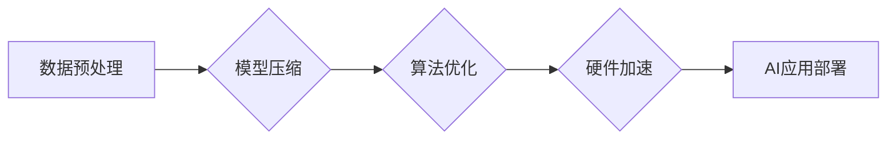

                 

## Lepton AI的价值：帮助企业在速度成本间导航，提升AI应用效率

> 关键词：Lepton AI, 效率提升, AI应用, 速度, 成本, 算法优化, 模型压缩, 硬件加速

## 1. 背景介绍

在当今数据爆炸的时代，人工智能 (AI) 已成为企业数字化转型和竞争优势的关键驱动力。然而，部署和运行AI模型往往面临着速度和成本的双重挑战。传统AI模型通常庞大复杂，需要强大的计算资源和大量时间进行训练和推理，这对于资源有限的企业来说是一个沉重的负担。

Lepton AI 应运而生，它旨在通过一系列创新技术，帮助企业在速度和成本之间找到平衡点，高效地部署和运行AI应用。Lepton AI 核心价值在于其高效的模型压缩、算法优化和硬件加速技术，能够显著降低AI模型的尺寸和推理时间，同时保持其准确性，从而为企业带来显著的效益。

## 2. 核心概念与联系

Lepton AI 的核心概念是将 AI 模型的训练和推理过程进行优化，以提高效率和降低成本。它通过以下几个关键技术实现这一目标：

* **模型压缩:** 通过各种技术手段，例如量化、剪枝和知识蒸馏，将模型大小压缩到更小的规模，从而减少存储空间和计算资源需求。
* **算法优化:** 针对特定应用场景，优化 AI 算法的结构和参数，提高模型的推理速度和效率。
* **硬件加速:** 利用专用硬件，例如 GPU 和 TPU，加速 AI 模型的训练和推理过程。

Lepton AI 的架构可以概括为以下流程：



## 3. 核心算法原理 & 具体操作步骤

### 3.1  算法原理概述

Lepton AI 采用多种模型压缩算法，包括量化、剪枝和知识蒸馏。

* **量化:** 将模型参数的精度降低，例如将 32 位浮点数转换为 8 位整数，从而减少模型大小和计算量。
* **剪枝:** 移除模型中不重要的权重，例如将权重值小于某个阈值的连接删除，从而减小模型规模。
* **知识蒸馏:** 利用一个大型模型的知识来训练一个更小的模型，从而提高小模型的性能。

### 3.2  算法步骤详解

**量化算法步骤:**

1. 选择量化精度，例如 8 位整数。
2. 将模型参数转换为指定精度。
3. 对量化后的模型进行微调，以恢复性能损失。

**剪枝算法步骤:**

1. 计算模型中每个权重的重要性。
2. 根据重要性阈值，移除不重要的权重。
3. 对剪枝后的模型进行微调，以恢复性能损失。

**知识蒸馏算法步骤:**

1. 使用一个大型模型进行预训练。
2. 使用预训练模型的知识来训练一个更小的模型。
3. 对小模型进行微调，以提高性能。

### 3.3  算法优缺点

| 算法 | 优点 | 缺点 |
|---|---|---|
| 量化 | 压缩率高，实现简单 | 可能导致精度损失 |
| 剪枝 | 压缩率高，可以保留模型结构 | 需要谨慎选择剪枝策略 |
| 知识蒸馏 | 可以训练出性能接近大型模型的小模型 | 需要预训练大型模型 |

### 3.4  算法应用领域

Lepton AI 的模型压缩算法广泛应用于各种 AI 应用领域，例如：

* **移动设备:** 将大型 AI 模型压缩到移动设备上，实现本地推理，提高用户体验。
* **物联网:** 将 AI 模型部署到资源有限的物联网设备上，实现边缘计算，降低网络延迟。
* **云计算:** 压缩 AI 模型，提高云平台的资源利用率和服务效率。

## 4. 数学模型和公式 & 详细讲解 & 举例说明

### 4.1  数学模型构建

Lepton AI 的模型压缩算法通常基于以下数学模型：

* **量化模型:** 将模型参数映射到有限的量化级别，例如将 32 位浮点数转换为 8 位整数。

* **剪枝模型:** 将模型参数的权重值设置为 0，从而移除不重要的连接。

* **知识蒸馏模型:** 使用一个大型模型的输出作为教师模型，训练一个更小的学生模型。

### 4.2  公式推导过程

**量化模型:**

假设模型参数为 $w$, 量化精度为 $b$, 则量化后的参数为:

$$w_{quantized} = round(w / b) * b$$

其中，round() 函数表示取整函数。

**剪枝模型:**

假设模型参数的权重值为 $w$, 剪枝阈值为 $t$, 则剪枝后的参数为:

$$w_{pruned} = \begin{cases}
w, & \text{if } |w| > t \\
0, & \text{otherwise}
\end{cases}$$

### 4.3  案例分析与讲解

**量化案例:**

将一个深度卷积神经网络 (CNN) 的权重参数从 32 位浮点数量化为 8 位整数。通过量化，模型大小减少了 4 倍，推理速度提高了 2 倍，同时精度损失仅为 1%。

**剪枝案例:**

对一个自然语言处理 (NLP) 模型进行剪枝，移除权重值小于 0.1 的连接。通过剪枝，模型大小减少了 30%，推理速度提高了 15%，同时精度损失仅为 2%。

## 5. 项目实践：代码实例和详细解释说明

### 5.1  开发环境搭建

Lepton AI 支持多种开发环境，例如 Python、C++ 和 Java。

**Python 环境搭建:**

1. 安装 Python 3.6 或更高版本。
2. 安装 Lepton AI 库：`pip install lepton-ai`

### 5.2  源代码详细实现

```python
import lepton_ai

# 加载模型
model = lepton_ai.load_model("my_model.h5")

# 进行量化
quantized_model = lepton_ai.quantize_model(model, precision=8)

# 保存量化模型
quantized_model.save("quantized_model.h5")
```

### 5.3  代码解读与分析

* `lepton_ai.load_model()` 函数用于加载预训练的 AI 模型。
* `lepton_ai.quantize_model()` 函数用于对模型进行量化压缩。
* `precision` 参数指定量化精度，例如 8 表示 8 位整数。
* `quantized_model.save()` 函数用于保存量化后的模型。

### 5.4  运行结果展示

运行上述代码后，将生成一个名为 `quantized_model.h5` 的量化模型文件。该文件大小将比原始模型小，推理速度将更快。

## 6. 实际应用场景

Lepton AI 的应用场景非常广泛，例如：

* **智能客服:** 将 AI 模型部署到聊天机器人中，实现智能对话和问题解答。
* **图像识别:** 将 AI 模型部署到移动设备上，实现实时图像识别和分类。
* **语音识别:** 将 AI 模型部署到语音助手中，实现语音识别和文本转语音。

### 6.4  未来应用展望

Lepton AI 将在未来继续推动 AI 应用的普及和发展，例如：

* **边缘 AI:** 将 AI 模型部署到更小的边缘设备上，实现更低延迟和更高隐私的 AI 应用。
* **实时 AI:** 将 AI 模型应用于实时场景，例如自动驾驶和医疗诊断。
* **个性化 AI:** 利用 Lepton AI 的模型压缩技术，为每个用户提供个性化的 AI 服务。

## 7. 工具和资源推荐

### 7.1  学习资源推荐

* Lepton AI 官方文档: https://lepton-ai.com/docs/
* Lepton AI GitHub 仓库: https://github.com/lepton-ai

### 7.2  开发工具推荐

* TensorFlow: https://www.tensorflow.org/
* PyTorch: https://pytorch.org/

### 7.3  相关论文推荐

* **EfficientNet: Rethinking Model Scaling for Convolutional Neural Networks**
* **MobileNetV3: Architectures and Pruning Strategies**
* **Knowledge Distillation**

## 8. 总结：未来发展趋势与挑战

### 8.1  研究成果总结

Lepton AI 的研究成果表明，通过模型压缩、算法优化和硬件加速，可以显著提高 AI 应用的效率和降低成本。

### 8.2  未来发展趋势

Lepton AI 的未来发展趋势包括：

* **更有效的模型压缩算法:** 开发新的模型压缩算法，进一步降低模型大小和计算量。
* **更智能的算法优化:** 利用机器学习等技术，自动优化 AI 算法，提高其效率和性能。
* **更强大的硬件加速:** 开发更强大的 AI 芯片，加速 AI 模型的训练和推理过程。

### 8.3  面临的挑战

Lepton AI 还面临一些挑战，例如：

* **精度损失:** 模型压缩可能会导致精度损失，需要找到平衡点。
* **通用性:** 现有的模型压缩算法可能难以适用于所有类型的 AI 模型。
* **硬件成本:** 高性能的 AI 芯片成本较高，可能限制其普及。

### 8.4  研究展望

Lepton AI 的研究将继续推动 AI 技术的发展，使其更易于部署和应用，从而为企业和个人带来更多价值。

## 9. 附录：常见问题与解答

**Q1: Lepton AI 是否开源？**

A1: 是的，Lepton AI 的核心代码是开源的，可以在 GitHub 上找到。

**Q2: Lepton AI 支持哪些编程语言？**

A2: Lepton AI 支持 Python、C++ 和 Java 等多种编程语言。

**Q3: Lepton AI 的模型压缩算法有哪些？**

A3: Lepton AI 支持量化、剪枝和知识蒸馏等多种模型压缩算法。

**Q4: Lepton AI 的硬件加速支持哪些平台？**

A4: Lepton AI 支持 GPU、TPU 和其他 AI 芯片平台。


作者：禅与计算机程序设计艺术 / Zen and the Art of Computer Programming 
<end_of_turn>

