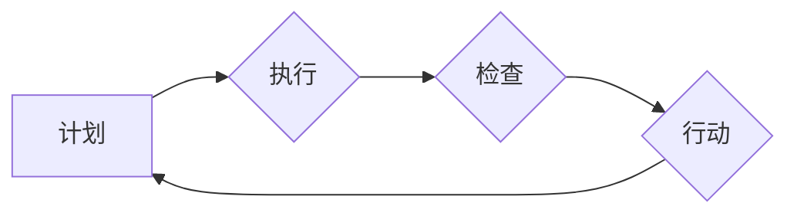

                 

## PDCA落地:持续改进的指南

> 关键词：PDCA,持续改进,流程优化,软件开发,项目管理,质量提升,效率提升

### 1. 背景介绍

在瞬息万变的科技时代，持续改进已成为企业和个人保持竞争力的关键。无论是软件开发、项目管理还是日常工作，高效的流程和不断优化的方法论都至关重要。PDCA循环，全称为Plan-Do-Check-Act（计划-执行-检查-行动），是一种以循环的方式进行改进的管理方法，其核心在于通过不断的计划、执行、检查和行动，逐步提升效率和质量。

PDCA循环最初由美国质量管理专家Walter Shewhart提出，后来被W. Edwards Deming广泛应用于管理实践中，并逐渐成为全球范围内应用最广泛的持续改进方法之一。其简单易懂、易于实施的特点使其适用于各种领域和场景，尤其是在软件开发和项目管理领域，PDCA循环被广泛应用于流程优化、缺陷修复、产品迭代等环节。

### 2. 核心概念与联系

PDCA循环的核心在于四个步骤的循环迭代，每个步骤都相互关联，共同推动着持续改进的过程。

* **Plan（计划）:** 针对当前问题或目标，制定详细的改进计划，包括目标设定、方案设计、资源分配等。
* **Do（执行）:** 根据计划，实施改进方案，并收集相关数据和反馈。
* **Check（检查）:** 对执行结果进行分析和评估，对比计划目标，找出偏差和问题。
* **Act（行动）:** 根据检查结果，对计划进行调整和优化，并将其纳入日常工作流程，形成持续改进的闭环。

**Mermaid 流程图:**



### 3. 核心算法原理 & 具体操作步骤

PDCA循环本身并非一个算法，而是一种管理方法。然而，其核心思想可以应用于算法设计和优化过程中。

**3.1 算法原理概述**

PDCA循环的核心思想可以应用于算法设计和优化过程中，通过不断的迭代和改进，逐步提升算法的效率和准确性。

* **计划阶段:** 针对特定问题，明确算法的目标和需求，设计算法框架和关键步骤。
* **执行阶段:** 实现算法代码，并进行测试和验证，收集算法运行数据和性能指标。
* **检查阶段:** 分析算法运行数据，评估算法的性能和效率，找出算法的缺陷和改进点。
* **行动阶段:** 根据检查结果，对算法进行调整和优化，例如改进算法的复杂度、优化算法的代码实现等，并重新进行测试和验证。

**3.2 算法步骤详解**

1. **问题定义:** 明确算法需要解决的问题，并定义算法的目标和性能指标。
2. **算法设计:** 根据问题需求，设计算法框架和关键步骤，选择合适的算法模型和数据结构。
3. **代码实现:** 将算法设计转化为代码实现，并进行单元测试和集成测试。
4. **性能测试:** 对算法进行性能测试，收集算法运行数据和性能指标，例如时间复杂度、空间复杂度、准确率等。
5. **结果分析:** 分析算法运行数据，评估算法的性能和效率，找出算法的缺陷和改进点。
6. **算法优化:** 根据结果分析，对算法进行调整和优化，例如改进算法的复杂度、优化算法的代码实现等。
7. **迭代测试:** 对优化后的算法进行测试和验证，并重复上述步骤，直到算法满足需求。

**3.3 算法优缺点**

PDCA循环应用于算法设计和优化过程中，具有以下优点：

* **迭代改进:** 通过不断的迭代和改进，可以逐步提升算法的效率和准确性。
* **数据驱动:** 基于算法运行数据和性能指标进行分析和评估，可以更客观地判断算法的优劣。
* **可持续性:** PDCA循环是一种持续改进的方法，可以帮助算法保持竞争力。

然而，PDCA循环也存在一些缺点：

* **时间成本:** 算法设计和优化是一个迭代的过程，需要花费较长时间。
* **资源消耗:** 算法测试和验证需要消耗一定的资源，例如计算资源和测试数据。
* **经验依赖:** PDCA循环的实施需要一定的经验和技巧，才能有效地进行改进。

**3.4 算法应用领域**

PDCA循环应用于算法设计和优化过程中，可以应用于各种领域，例如：

* **机器学习:** 优化机器学习模型的性能和效率。
* **数据挖掘:** 提高数据挖掘算法的准确性和效率。
* **软件开发:** 优化软件算法的性能和效率。
* **网络优化:** 提高网络传输效率和可靠性。

### 4. 数学模型和公式 & 详细讲解 & 举例说明

PDCA循环本身并不依赖于特定的数学模型，但其核心思想可以应用于数学模型的构建和优化。

**4.1 数学模型构建**

可以构建数学模型来描述PDCA循环的过程，例如：

* **目标函数:** 定义算法的目标，例如最小化时间复杂度或最大化准确率。
* **约束条件:** 定义算法的限制条件，例如内存限制或计算资源限制。
* **优化算法:** 使用数学优化算法来寻找最优解，例如梯度下降法或遗传算法。

**4.2 公式推导过程**

具体的公式推导过程取决于具体的算法和问题，但一般来说，需要根据目标函数和约束条件，推导出一系列优化公式，并使用数值方法求解。

**4.3 案例分析与讲解**

例如，在机器学习领域，可以使用PDCA循环来优化模型的性能。

* **计划阶段:** 设定目标，例如提高模型的准确率。
* **执行阶段:** 训练模型，并收集模型的性能指标。
* **检查阶段:** 分析模型的性能指标，找出模型的缺陷和改进点。
* **行动阶段:** 根据检查结果，调整模型的超参数或选择不同的模型结构，并重新训练模型。

通过不断的迭代和改进，可以逐步提升模型的性能。

### 5. 项目实践：代码实例和详细解释说明

以下是一个简单的代码实例，演示了如何使用PDCA循环来优化一个简单的算法。

**5.1 开发环境搭建**

可以使用任何支持Python的开发环境，例如PyCharm或VS Code。

**5.2 源代码详细实现**

```python
def calculate_sum(numbers):
    """
    计算列表中所有数字的和。
    """
    sum = 0
    for number in numbers:
        sum += number
    return sum

# 测试数据
numbers = [1, 2, 3, 4, 5]

# 计算和
sum = calculate_sum(numbers)

# 打印结果
print(f"数字列表的和为: {sum}")
```

**5.3 代码解读与分析**

这个代码实现了一个简单的`calculate_sum`函数，用于计算列表中所有数字的和。

**5.4 运行结果展示**

运行代码后，输出结果为：

```
数字列表的和为: 15
```

### 6. 实际应用场景

PDCA循环在软件开发、项目管理、质量管理等领域都有广泛的应用场景。

**6.1 软件开发**

* **流程优化:** 使用PDCA循环来优化软件开发流程，例如代码审查流程、测试流程等，提高开发效率和软件质量。
* **缺陷修复:** 使用PDCA循环来修复软件缺陷，例如分析缺陷原因、制定修复方案、测试修复结果等，确保缺陷得到有效解决。
* **产品迭代:** 使用PDCA循环来进行产品迭代，例如收集用户反馈、分析用户需求、设计改进方案等，不断提升产品的功能和用户体验。

**6.2 项目管理**

* **项目计划:** 使用PDCA循环来制定项目计划，例如明确项目目标、分解项目任务、分配资源等，确保项目顺利进行。
* **项目执行:** 使用PDCA循环来执行项目计划，例如跟踪项目进度、管理项目风险、协调项目团队等，确保项目按计划完成。
* **项目评估:** 使用PDCA循环来评估项目成果，例如分析项目成功与否、总结项目经验、改进项目管理方法等，为下次项目提供参考。

**6.3 质量管理**

* **质量控制:** 使用PDCA循环来进行质量控制，例如制定质量标准、检查产品质量、分析质量问题等，确保产品质量符合要求。
* **质量改进:** 使用PDCA循环来进行质量改进，例如分析质量问题原因、制定改进方案、实施改进措施等，不断提升产品质量。

**6.4 未来应用展望**

随着人工智能、大数据等技术的不断发展，PDCA循环将在更多领域得到应用，例如：

* **智能制造:** 使用PDCA循环来优化生产流程，提高生产效率和产品质量。
* **智慧城市:** 使用PDCA循环来管理城市资源，提高城市管理效率和居民生活质量。
* **个性化服务:** 使用PDCA循环来提供个性化服务，例如推荐个性化商品、提供个性化医疗服务等。

### 7. 工具和资源推荐

**7.1 学习资源推荐**

* **书籍:**
    * 《持续改进的艺术》
    * 《PDCA循环：持续改进的指南》
* **在线课程:**
    * Coursera上的“持续改进”课程
    * Udemy上的“PDCA循环”课程

**7.2 开发工具推荐**

* **项目管理工具:** Jira, Trello, Asana
* **代码版本控制工具:** Git, Github
* **测试工具:** Selenium, JUnit

**7.3 相关论文推荐**

* **Shewhart, W. A. (1931). Statistical method from the viewpoint of quality control.**
* **Deming, W. E. (1986). Out of the crisis.**

### 8. 总结：未来发展趋势与挑战

**8.1 研究成果总结**

PDCA循环是一种简单易懂、易于实施的持续改进方法，其核心思想可以应用于各种领域和场景，例如软件开发、项目管理、质量管理等。通过不断的计划、执行、检查和行动，可以逐步提升效率和质量。

**8.2 未来发展趋势**

随着人工智能、大数据等技术的不断发展，PDCA循环将更加智能化、自动化，例如：

* **人工智能辅助PDCA:** 使用人工智能技术自动分析数据、识别问题、提出改进方案，提高PDCA循环的效率和准确性。
* **数据驱动PDCA:** 使用大数据技术收集和分析更多数据，为PDCA循环提供更丰富的决策依据。
* **云端PDCA:** 将PDCA循环平台化，实现云端部署和协同工作，方便团队成员进行协作和管理。

**8.3 面临的挑战**

PDCA循环的实施也面临一些挑战：

* **文化阻力:** 一些企业或团队可能缺乏持续改进的文化，难以接受PDCA循环的理念。
* **执行力不足:** PDCA循环的实施需要团队成员的积极参与和执行力，如果执行力不足，则难以取得预期效果。
* **数据质量问题:** PDCA循环需要依赖数据分析，如果数据质量问题，则会影响PDCA循环的准确性和有效性。

**8.4 研究展望**

未来研究方向包括：

* **开发更智能化的PDCA循环工具:** 使用人工智能技术，提高PDCA循环的自动化程度和智能化水平。
* **研究不同领域PDCA循环的最佳实践:** 针对不同领域的特点，探索更适合的PDCA循环实施方法。
* **研究PDCA循环与其他管理方法的结合:** 将PDCA循环与其他管理方法，例如敏捷开发、六西格玛等，进行结合，形成更完善的管理体系。


### 9. 附录：常见问题与解答

**9.1 如何开始实施PDCA循环？**

1. **选择一个具体的项目或问题:** 确定需要改进的目标，并制定具体的改进计划。
2. **建立团队:** 组建一个负责实施PDCA循环的团队，并明确每个成员的职责。
3. **收集数据:** 收集相关数据，例如项目进度、缺陷数量、用户反馈等，为PDCA循环提供依据。
4. **分析数据:** 分析收集到的数据，找出问题根源和改进方向。
5. **制定改进方案:** 根据分析结果，制定具体的改进方案，并将其纳入日常工作流程。
6. **实施改进方案:** 执行改进方案，并收集新的数据进行评估。
7. **评估结果:** 分析改进方案的效果，并根据评估结果进行调整和优化。

**9.2 PDCA循环的实施需要多久？**

PDCA循环是一个持续改进的过程，没有固定的时间周期。

**9.3 PDCA循环的实施需要哪些资源？**

PDCA循环的实施需要以下资源：

* 人力资源: 负责实施PDCA循环的团队成员。
* 时间资源: 用于计划、执行、检查和行动的时长。
* 数据资源: 用于分析和评估的原始数据。
* 工具资源: 用于收集、分析和管理数据的工具。


作者：禅与计算机程序设计艺术 / Zen and the Art of Computer Programming 
<end_of_turn>

