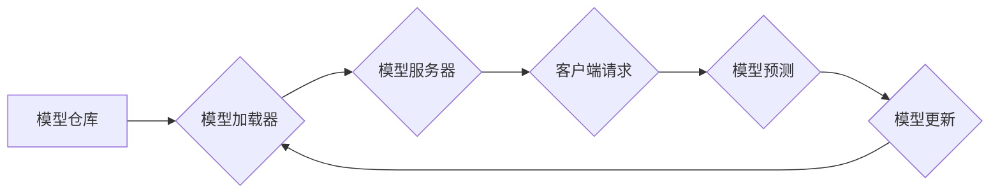

                 

## TensorFlow Serving模型热更新

> 关键词：TensorFlow Serving, 模型热更新, 模型部署, 模型更新, 延迟最小化, 可持续性

## 1. 背景介绍

在机器学习领域，模型的训练和部署是两个关键环节。随着模型规模的不断增长和应用场景的日益多样化，模型的部署和更新效率成为了一个重要的挑战。TensorFlow Serving (TF Serving) 作为 Google 开发的一款开源模型服务器，为机器学习模型的部署提供了高效、可扩展和可管理的解决方案。然而，传统的模型更新方式需要重新部署整个模型，这会导致服务中断和部署时间过长。为了解决这个问题，TensorFlow Serving 引入了模型热更新的功能，使得模型更新可以在不中断服务的情况下进行，从而提高了模型的部署效率和可持续性。

## 2. 核心概念与联系

### 2.1 模型热更新的概念

模型热更新是指在不中断服务的情况下，将新的模型版本加载到 TensorFlow Serving 中，并替换掉旧的模型版本。这种更新方式可以显著减少模型更新带来的服务中断时间，提高模型的更新频率和灵活性。

### 2.2 TensorFlow Serving 的架构

TensorFlow Serving 的架构主要由以下几个部分组成：

* **模型仓库:** 用于存储模型文件和元数据。
* **模型加载器:** 负责从模型仓库加载模型文件并将其转换为 TensorFlow Serving 可以识别的格式。
* **模型服务器:** 负责接收来自客户端的请求，并根据请求调用相应的模型进行预测。
* **管理接口:** 用于管理模型服务器的运行状态、模型版本和模型加载等操作。

**模型热更新流程图:**



## 3. 核心算法原理 & 具体操作步骤

### 3.1 算法原理概述

TensorFlow Serving 的模型热更新基于以下核心算法原理：

* **模型版本管理:** TensorFlow Serving 支持多个模型版本并行运行，并通过版本号进行区分。
* **异步模型加载:** 模型加载操作是异步执行的，不会阻塞模型服务器的正常运行。
* **模型切换机制:** 当新的模型版本加载完成后，模型服务器会根据配置策略自动切换到新的模型版本。

### 3.2 算法步骤详解

模型热更新的具体操作步骤如下：

1. **准备新模型:** 将新的模型文件打包成 TensorFlow Serving 支持的格式，并上传到模型仓库。
2. **启动模型服务器:** 启动 TensorFlow Serving 模型服务器，并配置模型仓库地址和模型版本策略。
3. **加载新模型:** 使用 TensorFlow Serving 的管理接口，异步加载新的模型版本到模型服务器。
4. **模型切换:** 当新的模型版本加载完成后，模型服务器会根据配置策略自动切换到新的模型版本。
5. **验证模型更新:** 使用测试数据验证新的模型版本是否正常运行。

### 3.3 算法优缺点

**优点:**

* **无服务中断:** 模型更新可以在不中断服务的情况下进行，保证了服务的连续性。
* **快速更新:** 模型更新速度更快，可以及时部署新的模型版本。
* **灵活管理:** 支持多个模型版本并行运行，方便进行模型比较和切换。

**缺点:**

* **资源消耗:** 模型热更新需要额外的资源来加载和管理新的模型版本。
* **复杂性:** 模型热更新的实现需要一定的技术复杂度。

### 3.4 算法应用领域

模型热更新技术广泛应用于以下领域:

* **推荐系统:** 根据用户行为和数据变化，及时更新推荐模型，提高推荐准确率。
* **自然语言处理:** 根据新的语言数据和任务需求，更新语言模型，提升模型的理解和生成能力。
* **图像识别:** 根据新的图像数据和识别任务，更新图像识别模型，提高模型的识别精度。

## 4. 数学模型和公式 & 详细讲解 & 举例说明

### 4.1 数学模型构建

模型热更新的数学模型可以抽象为一个状态转换过程，其中模型版本作为状态，更新策略作为转换规则。

**状态:**

* $S_t$: 表示在时间 $t$ 时模型服务器运行的模型版本。

**转换规则:**

* $R(S_t, M_{new})$: 表示从模型版本 $S_t$ 到新模型版本 $M_{new}$ 的转换规则，其中 $M_{new}$ 是待加载的新模型版本。

**更新策略:**

* $\pi(S_t, M_{new})$: 表示根据当前模型版本 $S_t$ 和新模型版本 $M_{new}$ 的信息，选择是否进行模型更新的策略。

### 4.2 公式推导过程

模型热更新的决策过程可以表示为以下公式:

$$S_{t+1} = \begin{cases}
S_t & \text{if } \pi(S_t, M_{new}) = \text{false} \\
M_{new} & \text{if } \pi(S_t, M_{new}) = \text{true}
\end{cases}$$

其中，$\pi(S_t, M_{new})$ 可以根据不同的策略进行定义，例如:

* **基于时间间隔:** 每隔一段时间就进行模型更新。
* **基于性能指标:** 当模型性能下降到一定阈值时，就进行模型更新。
* **基于模型版本号:** 根据模型版本号进行更新，例如只更新比当前版本更高的模型。

### 4.3 案例分析与讲解

假设我们有一个推荐系统的模型，其性能指标是准确率。当模型准确率下降到 80% 时，我们决定进行模型更新。

* $S_t$: 当前模型版本，准确率为 85%。
* $M_{new}$: 新模型版本，准确率为 88%。
* $\pi(S_t, M_{new})$: 根据性能指标策略，当 $S_t$ 的准确率低于 80% 时，返回 true，否则返回 false。

由于 $S_t$ 的准确率高于 80%，所以 $\pi(S_t, M_{new})$ 返回 false，模型不会进行更新。

## 5. 项目实践：代码实例和详细解释说明

### 5.1 开发环境搭建

* **操作系统:** Linux (Ubuntu 18.04 或更高版本推荐)
* **Python 版本:** 3.6 或更高版本
* **TensorFlow Serving:** 从官方仓库下载并安装 TensorFlow Serving。

### 5.2 源代码详细实现

以下代码示例展示了如何使用 TensorFlow Serving 的管理接口进行模型热更新:

```python
import tensorflow_serving.apis as serving_api

# 连接到 TensorFlow Serving 模型服务器
model_server_address = "localhost:8501"
model_name = "my_model"

# 创建模型更新请求
update_request = serving_api.ModelUpdateRequest(
    model_spec=serving_api.ModelSpec(name=model_name),
    model_version=1,
    model_content=open("path/to/new_model.pb", "rb").read(),
)

# 发送模型更新请求
with grpc.insecure_channel(model_server_address) as channel:
    stub = serving_api.ModelServerStub(channel)
    response = stub.UpdateModel(update_request)

# 检查模型更新结果
if response.status == "OK":
    print("模型更新成功!")
else:
    print("模型更新失败:", response.error_message)
```

### 5.3 代码解读与分析

* **连接到 TensorFlow Serving 模型服务器:** 使用 `grpc.insecure_channel()` 创建一个 gRPC 连接到 TensorFlow Serving 模型服务器。
* **创建模型更新请求:** 使用 `serving_api.ModelUpdateRequest()` 创建一个模型更新请求，其中包含模型名称、模型版本号和模型文件内容。
* **发送模型更新请求:** 使用 `serving_api.ModelServerStub()` 创建一个模型服务器 stub 对象，并调用 `UpdateModel()` 方法发送模型更新请求。
* **检查模型更新结果:** 检查 `response.status` 字段的值，判断模型更新是否成功。

### 5.4 运行结果展示

如果模型更新成功，则会打印 "模型更新成功!" 的信息。否则，会打印 "模型更新失败:" 和错误信息。

## 6. 实际应用场景

### 6.1 模型热更新在推荐系统的应用

在推荐系统中，用户行为和数据变化非常频繁，需要及时更新模型以保持推荐准确率。模型热更新可以帮助推荐系统快速部署新的模型版本，从而提高推荐的时效性和准确性。

### 6.2 模型热更新在自然语言处理的应用

自然语言处理模型需要不断学习新的语言数据和任务需求。模型热更新可以帮助自然语言处理系统快速更新模型，从而提升模型的理解和生成能力。

### 6.3 模型热更新在图像识别的应用

图像识别模型需要不断学习新的图像数据和识别任务。模型热更新可以帮助图像识别系统快速更新模型，从而提高模型的识别精度。

### 6.4 未来应用展望

随着机器学习模型规模的不断增长和应用场景的日益多样化，模型热更新技术将发挥越来越重要的作用。未来，模型热更新技术将朝着以下方向发展:

* **更智能的更新策略:** 基于模型性能、数据变化和业务需求等多方面因素，自动制定更智能的模型更新策略。
* **更高效的更新机制:** 采用更先进的模型加载和切换机制，进一步降低模型更新的延迟和资源消耗。
* **更广泛的应用场景:** 模型热更新技术将应用于更多领域，例如医疗诊断、金融风险控制等。

## 7. 工具和资源推荐

### 7.1 学习资源推荐

* **TensorFlow Serving 官方文档:** https://www.tensorflow.org/tfx/serving
* **TensorFlow Serving GitHub 仓库:** https://github.com/tensorflow/serving
* **TensorFlow Serving 模型热更新指南:** https://www.tensorflow.org/tfx/serving/model_hot_update

### 7.2 开发工具推荐

* **Docker:** 用于构建和部署 TensorFlow Serving 模型服务器。
* **Kubernetes:** 用于管理和调度 TensorFlow Serving 模型服务器集群。
* **TensorBoard:** 用于监控 TensorFlow Serving 模型服务器的运行状态和模型性能。

### 7.3 相关论文推荐

* **TensorFlow Serving: A Flexible and Efficient Serving System for Machine Learning Models:** https://arxiv.org/abs/1708.08888
* **Model Hot Update in TensorFlow Serving:** https://www.tensorflow.org/tfx/serving/model_hot_update

## 8. 总结：未来发展趋势与挑战

### 8.1 研究成果总结

TensorFlow Serving 的模型热更新功能为机器学习模型的部署和更新提供了高效、灵活和可持续的解决方案。模型热更新技术可以显著提高模型更新的效率和灵活性，并降低模型更新带来的服务中断时间。

### 8.2 未来发展趋势

未来，模型热更新技术将朝着以下方向发展:

* **更智能的更新策略:** 基于模型性能、数据变化和业务需求等多方面因素，自动制定更智能的模型更新策略。
* **更高效的更新机制:** 采用更先进的模型加载和切换机制，进一步降低模型更新的延迟和资源消耗。
* **更广泛的应用场景:** 模型热更新技术将应用于更多领域，例如医疗诊断、金融风险控制等。

### 8.3 面临的挑战

模型热更新技术也面临一些挑战:

* **模型兼容性:** 不同版本的模型可能存在兼容性问题，需要进行严格的测试和验证。
* **资源消耗:** 模型热更新需要额外的资源来加载和管理新的模型版本，需要进行优化和管理。
* **安全性和可靠性:** 模型热更新需要保证模型的安全性、可靠性和数据隐私。

### 8.4 研究展望

未来，我们需要继续研究和探索模型热更新技术的更先进的算法、更智能的策略和更完善的解决方案，以更好地满足机器学习模型的部署和更新需求。

## 9. 附录：常见问题与解答

### 9.1 模型更新失败的原因

模型更新失败的原因可能包括:

* 模型文件格式错误。
* 模型文件损坏。
* 模型服务器配置错误。
* 网络连接问题。

### 9.2 如何监控模型更新状态

可以使用 TensorFlow Serving 的管理接口或监控工具来监控模型更新状态。

### 9.3 如何配置模型更新策略

可以使用 TensorFlow Serving 的配置文件来配置模型更新策略，例如更新时间间隔、性能指标阈值等。


作者：禅与计算机程序设计艺术 / Zen and the Art of Computer Programming 
<end_of_turn>

