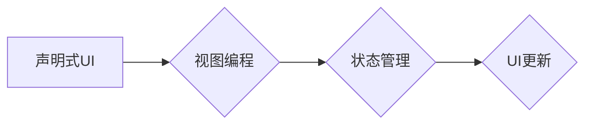

                 

## iOS SwiftUI应用开发

> 关键词：SwiftUI, iOS开发, 跨平台, 声明式UI, 视图编程, Apple生态

## 1. 背景介绍

随着移动互联网的快速发展，iOS平台作为全球领先的移动操作系统之一，吸引着越来越多的开发者前来开发应用。传统的iOS开发框架基于 UIKit，需要开发者手动管理视图层次结构和事件响应，开发过程较为繁琐。为了简化开发流程，提高开发效率，苹果公司于 2019 年发布了 SwiftUI 框架，这是一个全新的声明式UI框架，彻底改变了 iOS 应用开发的方式。

SwiftUI 采用声明式编程方式，开发者只需描述 UI 的最终状态，框架会自动处理视图的创建、更新和布局。它支持跨平台开发，可以用于开发 iOS、macOS、watchOS 和 tvOS 应用。SwiftUI 的简洁语法、强大的功能和优异的性能，使其成为 iOS 开发的最佳选择。

## 2. 核心概念与联系

### 2.1  声明式UI

声明式UI 是一种编程范式，开发者描述 UI 的最终状态，而不是具体的实现步骤。与传统的命令式UI 相比，声明式UI 更易于理解和维护，因为它更关注“什么”而不是“怎么做”。

### 2.2  视图编程

视图编程是一种将 UI 视为数据驱动程序的编程方式。在 SwiftUI 中，每个 UI 元素都是一个视图，视图可以接收数据作为输入，并根据数据生成相应的 UI 元素。视图之间的关系通过嵌套和布局来定义。

### 2.3  状态管理

状态管理是 SwiftUI 应用的核心概念之一。 SwiftUI 应用的状态由数据驱动，当数据发生变化时，相应的视图会自动更新。

**核心概念与联系流程图**



## 3. 核心算法原理 & 具体操作步骤

### 3.1  算法原理概述

SwiftUI 的核心算法原理是基于视图树和数据绑定机制。

* **视图树:** SwiftUI 应用的 UI 由一系列视图组成，这些视图以树状结构组织起来。每个视图都有一个父视图和零个或多个子视图。
* **数据绑定:** SwiftUI 使用数据绑定机制将视图和数据连接起来。当数据发生变化时，相应的视图会自动更新。

### 3.2  算法步骤详解

1. **创建视图树:** 开发者使用 SwiftUI 的语法创建视图树，定义 UI 的结构和布局。
2. **绑定数据:** 开发者将数据绑定到视图属性，以便视图可以根据数据变化进行更新。
3. **更新视图:** 当数据发生变化时，SwiftUI 会自动检测到变化，并更新相应的视图。
4. **渲染视图:** SwiftUI 会将更新后的视图树渲染到屏幕上，呈现最终的 UI。

### 3.3  算法优缺点

**优点:**

* 简洁易用: SwiftUI 的语法简洁易懂，开发效率高。
* 声明式编程: 开发者只需描述 UI 的最终状态，框架会自动处理细节。
* 数据绑定: 数据和视图之间自动绑定，减少了手动更新代码。
* 跨平台: SwiftUI 支持跨平台开发，可以用于开发 iOS、macOS、watchOS 和 tvOS 应用。

**缺点:**

* 生态系统相对较新: SwiftUI 的生态系统相对 UIKit 来说还比较年轻，一些第三方库和工具的覆盖率相对较低。
* 学习曲线: 虽然 SwiftUI 的语法简洁，但对于初学者来说，理解声明式编程和视图编程的理念可能需要一些时间。

### 3.4  算法应用领域

SwiftUI 适用于各种类型的 iOS 应用开发，包括：

* **消费类应用:** 社交媒体、新闻阅读、电商、游戏等。
* **企业级应用:** CRM、ERP、项目管理、办公协作等。
* **教育类应用:** 在线学习、考试系统、互动教学等。

## 4. 数学模型和公式 & 详细讲解 & 举例说明

SwiftUI 的核心算法原理涉及到一些数学模型和公式，例如：

### 4.1  数学模型构建

* **视图树:** 视图树可以看作是一个树形结构，每个节点代表一个视图，节点之间的关系由父-子关系定义。

* **布局算法:** SwiftUI 使用各种布局算法来确定视图的尺寸和位置，例如：

    * **Stack:** 将视图堆叠在一起，可以水平或垂直排列。
    * **Grid:** 将视图排列成网格，可以指定列数和行数。
    * **ZStack:** 将视图叠加在一起，可以控制视图的层级关系。

### 4.2  公式推导过程

布局算法的具体实现涉及到一些数学公式，例如：

* **尺寸计算:** 根据视图的约束条件和父视图的尺寸，计算视图的宽度和高度。
* **位置计算:** 根据视图的约束条件和父视图的尺寸，计算视图的 x 和 y 坐标。

### 4.3  案例分析与讲解

例如，使用 `HStack` 布局视图时， SwiftUI 会根据视图的宽度和父视图的宽度，计算每个视图的宽度和位置。

## 5. 项目实践：代码实例和详细解释说明

### 5.1  开发环境搭建

* 安装 Xcode 14 或更高版本。
* 创建一个新的 SwiftUI 项目。

### 5.2  源代码详细实现

```swift
import SwiftUI

struct ContentView: View {
    var body: some View {
        VStack {
            Text("Hello, SwiftUI!")
                .font(.largeTitle)
            Image(systemName: "globe")
                .font(.system(size: 100))
        }
        .padding()
    }
}

struct ContentView_Previews: PreviewProvider {
    static var previews: some View {
        ContentView()
    }
}
```

### 5.3  代码解读与分析

* `struct ContentView: View` 定义了一个名为 `ContentView` 的 SwiftUI 视图。
* `var body: some View` 是视图的构建函数，返回一个 `View` 类型。
* `VStack` 创建了一个垂直堆叠视图。
* `Text("Hello, SwiftUI!")` 创建了一个文本视图，显示 "Hello, SwiftUI!"。
* `Image(systemName: "globe")` 创建了一个系统图标视图，显示地球图标。
* `.font(.largeTitle)` 设置文本视图的字体大小为大标题。
* `.font(.system(size: 100))` 设置图标视图的字体大小为 100 点。
* `.padding()` 为视图添加边距。

### 5.4  运行结果展示

运行代码后，会在 Xcode 预览器中显示一个包含文本和图标的简单视图。

## 6. 实际应用场景

SwiftUI 广泛应用于各种 iOS 应用场景，例如：

* **社交媒体应用:** 使用 SwiftUI 创建流畅的用户界面，实现消息推送、动态更新等功能。
* **电商应用:** 使用 SwiftUI 设计精美的商品展示页面，实现购物车、支付等功能。
* **教育类应用:** 使用 SwiftUI 开发互动式学习内容，实现课程管理、考试系统等功能。

### 6.4  未来应用展望

随着 SwiftUI 的不断发展，其应用场景将会更加广泛，例如：

* **AR/VR 应用:** SwiftUI 可以用于开发 AR/VR 应用，提供更沉浸式的用户体验。
* **跨平台应用:** SwiftUI 可以用于开发跨平台应用，在 iOS、macOS、watchOS 和 tvOS 平台上共享代码。

## 7. 工具和资源推荐

### 7.1  学习资源推荐

* **Apple 官方文档:** https://developer.apple.com/documentation/swiftui
* **SwiftUI by Tutorials:** https://www.raywenderlich.com/category/swiftui
* **Hacking with Swift:** https://www.hackingwithswift.com/quick-start/swiftui

### 7.2  开发工具推荐

* **Xcode:** https://developer.apple.com/xcode/

### 7.3  相关论文推荐

* **SwiftUI: A Declarative UI Framework for Apple Platforms:** https://developer.apple.com/documentation/swiftui/swiftui

## 8. 总结：未来发展趋势与挑战

### 8.1  研究成果总结

SwiftUI 作为苹果公司推出的全新 UI 框架，在简化开发流程、提高开发效率、提供跨平台开发能力等方面取得了显著成果。

### 8.2  未来发展趋势

* **更强大的功能:** SwiftUI 将会继续添加新的功能和特性，例如更强大的动画效果、更丰富的布局选项、更完善的测试工具等。
* **更完善的生态系统:** SwiftUI 的生态系统将会不断完善，更多的第三方库和工具将会出现，为开发者提供更丰富的开发资源。
* **更广泛的应用场景:** SwiftUI 将会应用于更多类型的应用场景，例如 AR/VR 应用、跨平台应用等。

### 8.3  面临的挑战

* **生态系统成熟度:** SwiftUI 的生态系统相对 UIKit 来说还比较年轻，一些第三方库和工具的覆盖率相对较低。
* **学习曲线:** 虽然 SwiftUI 的语法简洁，但对于初学者来说，理解声明式编程和视图编程的理念可能需要一些时间。

### 8.4  研究展望

未来，SwiftUI 将会继续发展壮大，成为 iOS 开发的主流框架。开发者需要不断学习和掌握 SwiftUI 的新知识和新技术，才能更好地利用它开发出更优秀、更具竞争力的应用。

## 9. 附录：常见问题与解答

* **Q: SwiftUI 和 UIKit 的区别是什么？**

A: SwiftUI 是一个声明式 UI 框架，而 UIKit 是一个命令式 UI 框架。 SwiftUI 更易于理解和维护，而 UIKit 更灵活。

* **Q: 如何学习 SwiftUI？**

A: 可以参考 Apple 官方文档、SwiftUI by Tutorials、Hacking with Swift 等学习资源。

* **Q: SwiftUI 的未来发展趋势是什么？**

A: SwiftUI 将会继续添加新的功能和特性，生态系统将会不断完善，应用场景将会更加广泛。


作者：禅与计算机程序设计艺术 / Zen and the Art of Computer Programming 
<end_of_turn>

