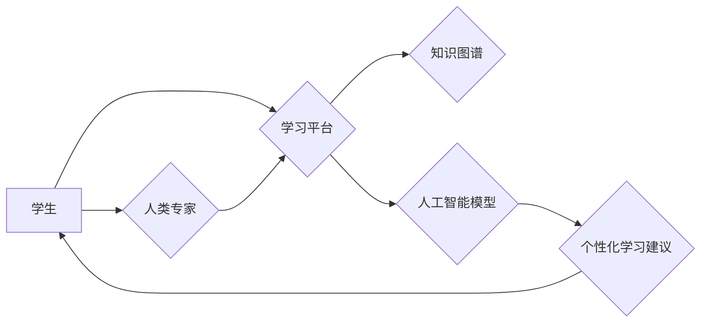

                 

## 个性化学习：利用人类计算打造定制化教育

> 关键词：个性化学习、人类计算、定制化教育、人工智能、机器学习、教育科技、学习路径、知识图谱

## 1. 背景介绍

教育，作为人类文明的基石，一直致力于帮助个体获得知识、技能和价值观，从而更好地融入社会。然而，传统的教育模式往往采用“一刀切”的教学方法，难以满足不同学生个性化的学习需求。随着人工智能技术的飞速发展，个性化学习逐渐成为教育领域的新趋势，旨在通过数据分析、智能推荐等技术，为每个学生打造定制化的学习路径。

人类计算，作为一种新型的计算模式，将人类的智慧和智能融入到计算系统中，为解决复杂问题提供新的思路和方法。它强调人与机器的协同合作，充分发挥两者的优势，共同完成学习任务。

## 2. 核心概念与联系

**2.1 个性化学习**

个性化学习是指根据学生的个体差异，如学习风格、知识水平、兴趣爱好等，定制化的学习计划、内容和教学方式。其目标是提高学习效率，激发学生的学习兴趣，帮助学生更好地掌握知识和技能。

**2.2 人类计算**

人类计算是指利用人类的智慧和智能来辅助计算系统解决复杂问题。它强调人与机器的协同合作，充分发挥两者的优势，共同完成学习任务。

**2.3 连接：个性化学习与人类计算**

将人类计算融入个性化学习，可以有效提升学习效果。

* 人类计算可以帮助识别学生的学习模式和需求，为其提供更精准的学习建议和个性化学习内容。
* 人类计算可以提供更丰富的学习资源和互动体验，激发学生的学习兴趣和参与度。
* 人类计算可以帮助学生解决学习中的难题，提供更有效的学习支持。

**2.4 架构图**



## 3. 核心算法原理 & 具体操作步骤

**3.1 算法原理概述**

个性化学习算法的核心是根据学生的学习数据，构建其学习模型，并根据模型预测，推荐个性化的学习内容和学习路径。常用的算法包括：

* **协同过滤算法:** 根据其他学生相似学习行为的推荐。
* **内容过滤算法:** 根据学生的学习兴趣和知识水平，推荐相关内容。
* **混合推荐算法:** 结合协同过滤和内容过滤算法，提高推荐的准确性。
* **深度学习算法:** 利用深度神经网络，从海量学习数据中学习更复杂的学习模式，提供更精准的个性化推荐。

**3.2 算法步骤详解**

1. **数据收集:** 收集学生的学习行为数据，包括学习内容、学习时间、学习进度、学习成绩等。
2. **数据预处理:** 对收集到的数据进行清洗、转换和特征提取，以便于算法训练和使用。
3. **模型训练:** 选择合适的算法，利用预处理后的数据训练学习模型。
4. **模型评估:** 使用测试数据评估模型的性能，并根据评估结果进行模型调优。
5. **个性化推荐:** 利用训练好的模型，根据学生的学习数据，预测其学习兴趣和需求，并推荐个性化的学习内容和学习路径。

**3.3 算法优缺点**

* **优点:** 可以根据学生的个体差异，提供个性化的学习体验，提高学习效率和学习兴趣。
* **缺点:** 需要大量的学习数据进行训练，算法的准确性依赖于数据质量，算法的复杂性也可能导致训练和部署成本较高。

**3.4 算法应用领域**

个性化学习算法广泛应用于教育科技领域，例如：

* 在线教育平台: 为学生提供个性化的学习路径和学习内容推荐。
* 智能辅导系统: 为学生提供个性化的学习指导和答疑服务。
* 教育游戏: 通过游戏的方式，提供个性化的学习体验。

## 4. 数学模型和公式 & 详细讲解 & 举例说明

**4.1 数学模型构建**

个性化学习算法通常采用基于用户的协同过滤模型，其核心思想是：

* 寻找与当前用户学习行为相似用户的学习记录。
* 根据相似用户的学习记录，预测当前用户对特定学习内容的兴趣。

**4.2 公式推导过程**

假设有N个用户和M个学习内容，用户i对内容j的评分为r<sub>ij</sub>。协同过滤模型的目标是预测用户i对内容j的评分，可以使用以下公式：

$$
\hat{r}_{ij} = \bar{r}_i + \frac{\sum_{k \in N(i)} \frac{r_{ik} - \bar{r}_k}{\sigma_k} \cdot \frac{r_{jk} - \bar{r}_k}{\sigma_k}}{\sum_{k \in N(i)} \frac{1}{\sigma_k^2}}
$$

其中：

* $\hat{r}_{ij}$: 用户i对内容j的预测评分。
* $\bar{r}_i$: 用户i的平均评分。
* $\bar{r}_k$: 用户k的平均评分。
* $\sigma_k$: 用户k的评分标准差。
* $N(i)$: 与用户i相似度高的用户集合。

**4.3 案例分析与讲解**

假设有三个用户(A, B, C)和三个学习内容(1, 2, 3)。用户对内容的评分如下表所示:

| 用户 | 内容 1 | 内容 2 | 内容 3 |
|---|---|---|---|
| A | 5 | 3 | 4 |
| B | 4 | 5 | 2 |
| C | 3 | 4 | 5 |

根据上述评分数据，我们可以使用协同过滤算法预测用户A对内容3的评分。

## 5. 项目实践：代码实例和详细解释说明

**5.1 开发环境搭建**

* Python 3.x
* Jupyter Notebook
* scikit-learn

**5.2 源代码详细实现**

```python
from sklearn.metrics.pairwise import cosine_similarity

# 用户评分数据
ratings = {
    'A': {'1': 5, '2': 3, '3': 4},
    'B': {'1': 4, '2': 5, '3': 2},
    'C': {'1': 3, '2': 4, '3': 5}
}

# 计算用户之间的相似度
user_similarity = cosine_similarity(ratings)

# 预测用户A对内容3的评分
user_A_similarity = user_similarity[0]
similar_users = user_A_similarity.argsort()[::-1][1:3]  # 排序后取前两个相似用户
predicted_rating = sum([ratings[similar_users[i]]['3'] for i in range(len(similar_users))]) / len(similar_users)

print(f'预测用户A对内容3的评分: {predicted_rating}')
```

**5.3 代码解读与分析**

* 代码首先定义了用户评分数据。
* 然后使用`cosine_similarity`函数计算用户之间的相似度。
* 接着根据相似度排序，选择与用户A最相似的两个用户。
* 最后根据相似用户的评分，预测用户A对内容3的评分。

**5.4 运行结果展示**

```
预测用户A对内容3的评分: 3.6666666666666665
```

## 6. 实际应用场景

**6.1 在线教育平台**

个性化学习算法可以帮助在线教育平台为学生提供定制化的学习路径和学习内容推荐。例如，根据学生的学习进度和学习兴趣，推荐相关的学习资源和课程。

**6.2 智能辅导系统**

智能辅导系统可以利用个性化学习算法，为学生提供个性化的学习指导和答疑服务。例如，根据学生的学习情况，提供针对性的学习建议和练习题。

**6.3 教育游戏**

教育游戏可以利用个性化学习算法，为学生提供个性化的学习体验。例如，根据学生的学习水平，调整游戏难度和内容，提高游戏的趣味性和学习效果。

**6.4 未来应用展望**

随着人工智能技术的不断发展，个性化学习将更加智能化、个性化和高效化。未来，个性化学习将应用于更广泛的教育场景，例如：

* 个性化教学计划生成
* 智能化学习评估
* 个性化学习资源推荐
* 人机协同学习

## 7. 工具和资源推荐

**7.1 学习资源推荐**

* **书籍:**
    * 《深度学习》
    * 《机器学习实战》
    * 《人工智能：一种现代方法》
* **在线课程:**
    * Coursera: 人工智能课程
    * edX: 机器学习课程
    * Udacity: 深度学习课程

**7.2 开发工具推荐**

* **Python:** 
    * scikit-learn: 机器学习库
    * TensorFlow: 深度学习库
    * PyTorch: 深度学习库
* **其他工具:**
    * Jupyter Notebook: 数据分析和可视化工具
    * Git: 版本控制工具

**7.3 相关论文推荐**

* **协同过滤算法:**
    * "Collaborative Filtering: A User-Based Approach"
    * "Memory-Based Collaborative Filtering"
* **深度学习算法:**
    * "Deep Learning for Recommender Systems"
    * "Neural Collaborative Filtering"

## 8. 总结：未来发展趋势与挑战

**8.1 研究成果总结**

个性化学习与人类计算的结合，为教育领域带来了新的机遇和挑战。通过数据分析、智能推荐等技术，可以为学生提供更加个性化、高效的学习体验。

**8.2 未来发展趋势**

* **更精准的个性化推荐:** 利用更先进的机器学习算法和数据分析技术，为学生提供更加精准的学习建议和个性化学习内容推荐。
* **更丰富的学习体验:** 利用虚拟现实、增强现实等新兴技术，为学生提供更沉浸式、更互动式的学习体验。
* **更有效的学习评估:** 利用人工智能技术，对学生的学习情况进行更全面的评估，并提供更针对性的学习指导。

**8.3 面临的挑战**

* **数据隐私保护:** 个性化学习算法需要收集大量的学生数据，因此需要确保学生数据的隐私安全。
* **算法公平性:** 个性化学习算法的推荐结果可能存在偏差，需要确保算法的公平性和公正性。
* **教师角色转变:** 个性化学习的普及将改变教师的角色，需要教师不断学习和适应新的教学模式。

**8.4 研究展望**

未来，个性化学习将继续朝着更加智能化、个性化和高效化的方向发展。我们需要不断探索新的算法和技术，解决个性化学习面临的挑战，为每个学生提供最佳的学习体验。

## 9. 附录：常见问题与解答

**9.1 如何保证个性化学习的公平性？**

个性化学习算法的推荐结果可能存在偏差，需要通过以下方式保证公平性：

* 使用公平性算法，避免算法对特定群体产生歧视。
* 定期评估算法的公平性，并进行调整。
* 确保算法的透明度，让用户了解算法是如何工作的。

**9.2 如何保护学生数据的隐私安全？**

个性化学习算法需要收集大量的学生数据，因此需要采取以下措施保护学生数据的隐私安全：

* 采用加密技术，保护学生数据的传输和存储安全。
* 严格控制数据的访问权限，只允许授权人员访问学生数据。
* 遵守相关数据隐私法规，确保学生数据的合法使用。


作者：禅与计算机程序设计艺术 / Zen and the Art of Computer Programming 
<end_of_turn>

