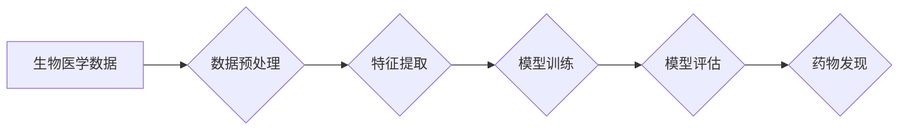

                 

## 人工智能在生物医学和药物发现中的应用

> 关键词：人工智能、机器学习、深度学习、药物发现、生物医学、精准医疗、大数据分析

## 1. 背景介绍

生物医学和药物发现领域一直以来都面临着巨大的挑战。传统药物研发周期长、成本高昂，成功率低。随着大数据时代的到来，海量生物医学数据不断涌现，为人工智能（AI）的应用提供了 fertile ground。AI 凭借其强大的数据处理能力和模式识别能力，正在深刻地改变生物医学和药物发现的格局，为加速药物研发、提高研发效率、降低研发成本、推动精准医疗的发展提供新的思路和方法。

### 1.1  传统药物发现的局限性

传统药物发现流程复杂，通常包括以下几个阶段：

* **目标识别:** 确定药物作用的具体靶点。
* **候选药物筛选:** 从数百万种化合物中筛选出潜在的候选药物。
* **药物优化:** 对候选药物进行结构优化，提高其活性、安全性、稳定性等。
* **临床试验:** 对优化后的药物进行多阶段的临床试验，评估其疗效和安全性。

整个过程耗时数年，成本高达数十亿美元，成功率仅为 10% 左右。

### 1.2  人工智能的优势

AI 拥有以下优势，使其成为药物发现的理想工具：

* **强大的数据处理能力:** AI 能够处理海量生物医学数据，从中发现隐藏的模式和规律。
* **精准的模式识别能力:** AI 能够识别复杂的生物学过程和疾病机制，帮助科学家更快地找到药物靶点。
* **高效的药物筛选:** AI 可以加速候选药物筛选过程，缩短药物研发周期。
* **个性化治疗:** AI 可以根据患者的基因信息、生活方式等因素，预测药物疗效，实现个性化治疗。

## 2. 核心概念与联系

### 2.1  机器学习

机器学习是 AI 的核心技术之一，它通过算法训练模型，使模型能够从数据中学习，并对新数据进行预测或分类。

### 2.2  深度学习

深度学习是机器学习的子集，它使用多层神经网络来模拟人类大脑的学习过程，能够学习更复杂的模式和特征。

### 2.3  自然语言处理

自然语言处理（NLP）是 AI 的另一个重要分支，它能够理解和处理人类语言，可以用于分析医学文献、提取生物医学知识等。

**Mermaid 流程图**



## 3. 核心算法原理 & 具体操作步骤

### 3.1  算法原理概述

在生物医学和药物发现领域，常用的 AI 算法包括：

* **支持向量机 (SVM):** 用于分类和回归问题，能够在高维空间中找到最佳的分隔超平面。
* **随机森林:** 是一种集成学习算法，通过构建多个决策树并投票决策，提高预测准确率。
* **深度神经网络 (DNN):** 能够学习复杂的非线性关系，在图像识别、自然语言处理等领域取得了突破性进展。
* **强化学习 (RL):** 通过奖励机制训练模型，使其能够在复杂环境中做出最优决策。

### 3.2  算法步骤详解

以药物靶点预测为例，使用深度学习算法进行药物靶点预测的步骤如下：

1. **数据收集:** 收集相关生物医学数据，例如蛋白质序列、结构、功能注释等。
2. **数据预处理:** 对数据进行清洗、格式转换、特征工程等处理，使其适合深度学习模型训练。
3. **模型构建:** 选择合适的深度学习模型架构，例如卷积神经网络 (CNN) 或循环神经网络 (RNN)。
4. **模型训练:** 使用训练数据训练模型，调整模型参数，使其能够准确预测药物靶点。
5. **模型评估:** 使用测试数据评估模型性能，例如准确率、召回率、F1-score 等。
6. **模型部署:** 将训练好的模型部署到实际应用场景中，用于预测新的药物靶点。

### 3.3  算法优缺点

**优点:**

* 能够处理复杂的数据关系，发现隐藏的模式。
* 预测精度高，能够提高药物靶点预测的准确率。
* 能够自动化药物靶点预测过程，提高效率。

**缺点:**

* 需要大量的训练数据，数据质量对模型性能影响较大。
* 模型训练过程复杂，需要专业的技术人员进行操作。
* 模型解释性较差，难以理解模型的决策过程。

### 3.4  算法应用领域

* **药物靶点预测:** 预测药物作用的具体靶点。
* **药物分子设计:** 设计具有特定生物活性的药物分子。
* **药物筛选:** 从数百万种化合物中筛选出潜在的候选药物。
* **药物安全性预测:** 预测药物的潜在毒性。
* **疾病诊断:** 基于患者的基因信息、影像数据等，辅助诊断疾病。
* **个性化治疗:** 根据患者的个体特征，制定个性化的治疗方案。

## 4. 数学模型和公式 & 详细讲解 & 举例说明

### 4.1  数学模型构建

在药物发现领域，常用的数学模型包括：

* **逻辑回归模型:** 用于预测药物是否具有特定生物活性。
* **支持向量机 (SVM) 模型:** 用于分类和回归问题，能够在高维空间中找到最佳的分隔超平面。
* **深度神经网络 (DNN) 模型:** 能够学习复杂的非线性关系，用于药物靶点预测、药物分子设计等。

### 4.2  公式推导过程

以逻辑回归模型为例，其目标函数为：

$$
L(w,b) = -\frac{1}{N} \sum_{i=1}^{N} y_i \log(p_i) + (1-y_i) \log(1-p_i)
$$

其中：

* $w$ 为模型参数向量。
* $b$ 为模型偏置项。
* $N$ 为样本数量。
* $y_i$ 为第 $i$ 个样本的真实标签 (0 或 1)。
* $p_i$ 为模型预测第 $i$ 个样本的概率。

通过梯度下降算法，可以迭代更新模型参数 $w$ 和 $b$，使目标函数最小化。

### 4.3  案例分析与讲解

假设我们想要预测药物是否具有抗癌活性。我们可以收集相关数据，例如药物的化学结构、生物活性等，并使用逻辑回归模型进行训练。训练完成后，我们可以使用模型预测新的药物是否具有抗癌活性。

## 5. 项目实践：代码实例和详细解释说明

### 5.1  开发环境搭建

* **操作系统:** Linux 或 macOS
* **编程语言:** Python
* **深度学习框架:** TensorFlow 或 PyTorch
* **其他工具:** Jupyter Notebook、Git 等

### 5.2  源代码详细实现

```python
import tensorflow as tf

# 定义模型结构
model = tf.keras.models.Sequential([
    tf.keras.layers.Dense(64, activation='relu', input_shape=(1024,)),
    tf.keras.layers.Dense(32, activation='relu'),
    tf.keras.layers.Dense(1, activation='sigmoid')
])

# 编译模型
model.compile(optimizer='adam',
              loss='binary_crossentropy',
              metrics=['accuracy'])

# 训练模型
model.fit(x_train, y_train, epochs=10)

# 评估模型
loss, accuracy = model.evaluate(x_test, y_test)
print('Loss:', loss)
print('Accuracy:', accuracy)
```

### 5.3  代码解读与分析

* **模型结构:** 使用了三层全连接神经网络，第一层输入维度为 1024，最后一层输出维度为 1，用于预测药物是否具有抗癌活性。
* **激活函数:** 使用了 ReLU 激活函数，可以提高模型的表达能力。
* **损失函数:** 使用了二分类交叉熵损失函数，用于衡量模型预测结果与真实标签之间的差异。
* **优化器:** 使用了 Adam 优化器，可以快速收敛到模型最优解。
* **训练过程:** 使用训练数据训练模型 10 个 epochs。
* **评估过程:** 使用测试数据评估模型性能，输出模型的损失值和准确率。

### 5.4  运行结果展示

运行代码后，会输出模型的损失值和准确率。

## 6. 实际应用场景

### 6.1  药物靶点预测

AI 算法可以分析蛋白质结构、功能注释等数据，预测药物作用的具体靶点。

### 6.2  药物分子设计

AI 算法可以根据药物靶点信息，设计具有特定生物活性的药物分子。

### 6.3  药物筛选

AI 算法可以加速候选药物筛选过程，从数百万种化合物中筛选出潜在的候选药物。

### 6.4  未来应用展望

* **个性化治疗:** 根据患者的基因信息、生活方式等因素，制定个性化的治疗方案。
* **疾病预防:** 利用 AI 算法分析患者的健康数据，预测疾病风险，并提供预防措施。
* **药物研发加速:** AI 算法可以加速药物研发过程，降低研发成本，提高研发效率。

## 7. 工具和资源推荐

### 7.1  学习资源推荐

* **在线课程:** Coursera、edX、Udacity 等平台提供 AI 和机器学习相关的在线课程。
* **书籍:** 《深度学习》、《机器学习实战》等书籍。
* **博客:** TensorFlow、PyTorch 等深度学习框架的官方博客。

### 7.2  开发工具推荐

* **深度学习框架:** TensorFlow、PyTorch、Keras 等。
* **数据处理工具:** Pandas、NumPy 等。
* **可视化工具:** Matplotlib、Seaborn 等。

### 7.3  相关论文推荐

* **Nature:** https://www.nature.com/
* **Science:** https://www.science.org/
* **Cell:** https://www.cell.com/

## 8. 总结：未来发展趋势与挑战

### 8.1  研究成果总结

AI 在生物医学和药物发现领域取得了显著进展，例如药物靶点预测、药物分子设计、药物筛选等方面取得了突破性进展。

### 8.2  未来发展趋势

* **模型复杂度提升:** 开发更复杂、更强大的 AI 模型，例如 Transformer、Graph Neural Network 等。
* **数据规模扩大:** 收集和整合更多生物医学数据，例如基因组数据、蛋白质组数据、影像数据等。
* **跨学科融合:** 将 AI 与其他学科，例如生物学、化学、医学等进行融合，开发更全面的解决方案。

### 8.3  面临的挑战

* **数据质量问题:** 生物医学数据往往存在噪声、缺失值等问题，需要进行有效的数据清洗和预处理。
* **模型解释性问题:** 深度学习模型的决策过程难以解释，需要开发更可解释的 AI 模型。
* **伦理问题:** AI 在生物医学领域的应用需要考虑伦理问题，例如数据隐私、算法偏见等。

### 8.4  研究展望

未来，AI 将在生物医学和药物发现领域发挥越来越重要的作用，推动精准医疗的发展，为人类健康带来新的希望。

## 9. 附录：常见问题与解答

* **Q1: AI 是否能够完全取代人类科学家？**

A1: 目前，AI 仍然无法完全取代人类科学家，AI 算法需要人类科学家进行设计、训练和评估，人类科学家还需要对 AI 的结果进行解读和分析。

* **Q2: AI 在生物医学领域的应用有哪些伦理问题？**

A2: AI 在生物医学领域的应用需要考虑数据隐私、算法偏见、责任归属等伦理问题。

* **Q3: 如何学习 AI 和机器学习的知识？**

A3: 可以通过在线课程、书籍、博客等方式学习 AI 和机器学习的知识。


作者：禅与计算机程序设计艺术 / Zen and the Art of Computer Programming 
<end_of_turn>

