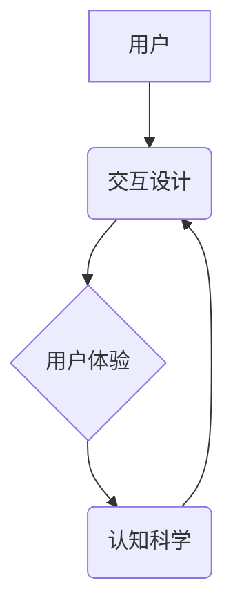

                 

## 人机交互设计：打造高效的人类计算系统

> 关键词：人机交互、用户体验、交互设计、界面设计、认知科学、人工智能、计算系统

### 1. 背景介绍

随着人工智能技术的飞速发展，人机交互已经不再局限于简单的命令输入和文本输出，而是朝着更加自然、智能、人性化的方向演进。高效的人机交互设计，对于构建流畅、便捷、易于理解的计算系统至关重要。

传统的计算系统设计往往侧重于技术实现，而忽略了用户体验。这种设计模式导致用户操作复杂、学习成本高，难以真正发挥计算系统的潜力。而现代人机交互设计则强调用户需求，将用户体验作为核心设计要素，旨在打造更加人性化、高效的计算系统。

### 2. 核心概念与联系

#### 2.1 人机交互设计

人机交互设计 (Human-Computer Interaction, HCI) 是一门跨学科领域，它研究用户与计算机系统之间的交互方式，旨在设计出易于使用、高效、愉悦的用户体验。

#### 2.2 用户体验 (User Experience, UX)

用户体验是指用户在使用产品或服务过程中所感受到的整体感受，包括情感、认知、生理等方面。良好的用户体验可以提升用户满意度、忠诚度和使用效率。

#### 2.3 认知科学

认知科学研究人类的思维、学习、记忆、语言等认知过程。理解认知科学原理可以帮助设计师设计出符合人类认知规律的交互系统，提高用户操作效率和准确性。

**核心概念关系流程图:**



### 3. 核心算法原理 & 具体操作步骤

#### 3.1 算法原理概述

人机交互设计中常用的算法包括：

* **用户模型:** 建立用户行为和偏好的模型，用于预测用户需求和行为。
* **交互式反馈机制:** 提供及时、明确的反馈，帮助用户了解系统状态和操作结果。
* **自然语言处理 (NLP):** 理解和处理用户的自然语言输入，实现更自然的交互方式。
* **机器学习 (ML):** 利用数据训练模型，不断优化交互体验和系统性能。

#### 3.2 算法步骤详解

以用户模型为例，其构建步骤如下：

1. **数据收集:** 收集用户行为数据，例如用户点击、滑动、输入等操作。
2. **数据预处理:** 清洗和转换数据，使其适合模型训练。
3. **模型选择:** 选择合适的机器学习算法，例如决策树、支持向量机等。
4. **模型训练:** 利用收集的数据训练模型，使其能够预测用户的行为和偏好。
5. **模型评估:** 使用测试数据评估模型的性能，并进行调整和优化。

#### 3.3 算法优缺点

* **优点:** 可以个性化交互体验，提高用户满意度和使用效率。
* **缺点:** 需要大量数据进行训练，模型训练复杂，且存在隐私安全问题。

#### 3.4 算法应用领域

* **个性化推荐:** 根据用户的行为和偏好，推荐个性化的内容和服务。
* **智能客服:** 利用 NLP 技术，实现与用户的自然语言交互，提供智能客服服务。
* **用户行为分析:** 分析用户的行为数据，了解用户需求和使用习惯，为产品设计提供参考。

### 4. 数学模型和公式 & 详细讲解 & 举例说明

#### 4.1 数学模型构建

用户模型可以采用概率模型来表示用户行为和偏好。例如，可以使用贝叶斯网络来建模用户对不同产品的偏好，其中每个节点代表一个属性，例如用户年龄、性别、兴趣等，边表示属性之间的依赖关系。

#### 4.2 公式推导过程

贝叶斯网络中的概率计算可以使用贝叶斯公式进行推导。例如，假设用户对产品 A 的偏好概率为 P(A)，用户年龄为 Y，则用户年龄 Y 对产品 A 偏好概率的条件概率为：

$$P(A|Y) = \frac{P(Y|A)P(A)}{P(Y)}$$

其中，P(Y|A) 是用户年龄 Y 给定用户对产品 A 偏好时出现的概率，P(A) 是用户对产品 A 偏好的概率，P(Y) 是用户年龄 Y 的概率。

#### 4.3 案例分析与讲解

假设我们有一个电商平台，想要预测用户对不同产品的购买意愿。我们可以收集用户年龄、性别、浏览历史、购买记录等数据，构建一个贝叶斯网络模型。

通过分析用户数据，我们可以得到每个属性的概率分布，以及属性之间的依赖关系。例如，我们可以发现用户年龄较大的用户更倾向于购买高价产品，而用户性别则与产品类别相关。

利用贝叶斯公式，我们可以计算出用户对不同产品的购买意愿概率。例如，对于一个特定用户，我们可以根据其年龄、性别、浏览历史等信息，计算出其购买特定产品的概率。

### 5. 项目实践：代码实例和详细解释说明

#### 5.1 开发环境搭建

* 操作系统: Ubuntu 20.04
* 编程语言: Python 3.8
* 开发工具: Jupyter Notebook

#### 5.2 源代码详细实现

```python
import pandas as pd
from sklearn.model_selection import train_test_split
from sklearn.linear_model import LogisticRegression

# 加载用户数据
data = pd.read_csv("user_data.csv")

# 选择特征和目标变量
features = ["age", "gender", "browsing_history"]
target = "purchase_intention"

# 将数据分割为训练集和测试集
X_train, X_test, y_train, y_test = train_test_split(data[features], data[target], test_size=0.2)

# 创建逻辑回归模型
model = LogisticRegression()

# 训练模型
model.fit(X_train, y_train)

# 预测测试集结果
y_pred = model.predict(X_test)

# 评估模型性能
from sklearn.metrics import accuracy_score
accuracy = accuracy_score(y_test, y_pred)
print(f"模型准确率: {accuracy}")
```

#### 5.3 代码解读与分析

* 代码首先加载用户数据，并选择特征和目标变量。
* 然后将数据分割为训练集和测试集，用于训练和评估模型。
* 创建逻辑回归模型，并使用训练集进行模型训练。
* 训练完成后，使用测试集进行预测，并评估模型性能。

#### 5.4 运行结果展示

运行代码后，会输出模型的准确率。

### 6. 实际应用场景

#### 6.1 个性化推荐系统

人机交互设计可以用于构建个性化推荐系统，根据用户的行为和偏好，推荐个性化的产品、服务或内容。例如，电商平台可以根据用户的浏览历史、购买记录等数据，推荐用户可能感兴趣的产品。

#### 6.2 智能客服系统

人机交互设计可以用于构建智能客服系统，利用 NLP 技术，实现与用户的自然语言交互，提供更便捷、高效的客服服务。例如，聊天机器人可以帮助用户解答常见问题，处理简单的订单操作。

#### 6.3 教育培训系统

人机交互设计可以用于构建更具互动性和趣味性的教育培训系统，例如，游戏化学习平台可以利用游戏机制，提高用户的学习兴趣和效率。

#### 6.4 未来应用展望

随着人工智能技术的不断发展，人机交互设计将更加智能化、人性化。未来，我们可以期待看到：

* 更自然、更流畅的人机交互方式，例如语音交互、手势识别等。
* 更个性化的交互体验，系统能够根据用户的需求和偏好，定制个性化的交互界面和功能。
* 更智能的交互系统，能够理解用户的意图，并提供更精准、更有效的帮助。

### 7. 工具和资源推荐

#### 7.1 学习资源推荐

* **书籍:**
    * 《人机交互设计》
    * 《交互设计基础》
    * 《用户体验设计》
* **在线课程:**
    * Coursera: 人机交互设计
    * edX: 用户体验设计
    * Udemy: 交互设计

#### 7.2 开发工具推荐

* **Figma:** 交互设计工具
* **Adobe XD:** 交互设计工具
* **Sketch:** 交互设计工具
* **Axure RP:** 交互原型设计工具

#### 7.3 相关论文推荐

* **Don Norman, The Design of Everyday Things (1988)**
* **Jakob Nielsen, Usability Engineering (1993)**
* **Steve Krug, Don't Make Me Think (2000)**

### 8. 总结：未来发展趋势与挑战

#### 8.1 研究成果总结

人机交互设计已经取得了显著的成果，例如，智能手机、平板电脑、虚拟现实等设备的出现，都离不开人机交互设计的推动。

#### 8.2 未来发展趋势

* **更自然、更智能的人机交互方式:** 例如，语音交互、手势识别、脑机接口等。
* **更个性化的交互体验:** 系统能够根据用户的需求和偏好，定制个性化的交互界面和功能。
* **更融合的交互环境:** 人机交互将更加融入到我们的生活环境中，例如，智能家居、智能城市等。

#### 8.3 面临的挑战

* **技术挑战:** 如何设计出更自然、更智能的人机交互方式，以及如何解决数据安全、隐私保护等问题。
* **伦理挑战:** 人工智能技术的快速发展，也带来了伦理挑战，例如，如何避免算法偏见，如何确保人机交互的公平性和透明度。
* **社会挑战:** 人机交互技术的普及，可能会对人类社会带来一些挑战，例如，如何应对自动化带来的失业问题，如何确保人机交互的安全性。

#### 8.4 研究展望

未来，人机交互设计将继续朝着更智能、更人性化、更融合的方向发展。我们需要不断探索新的交互方式，解决技术、伦理和社会挑战，最终构建一个更加美好的人机共存的未来。

### 9. 附录：常见问题与解答

* **Q1: 人机交互设计与用户体验设计有什么区别？**

* **A1:** 人机交互设计是用户体验设计的子领域，它更侧重于用户与计算机系统之间的交互方式，而用户体验设计则更广泛，涵盖了用户与产品或服务的整体体验。

* **Q2: 如何评估人机交互设计的质量？**

* **A2:** 可以通过用户测试、问卷调查、数据分析等方法来评估人机交互设计的质量。

* **Q3: 人机交互设计需要掌握哪些技能？**

* **A3:** 人机交互设计需要掌握的用户体验设计、心理学、计算机科学等方面的知识和技能。


作者：禅与计算机程序设计艺术 / Zen and the Art of Computer Programming 
<end_of_turn>

