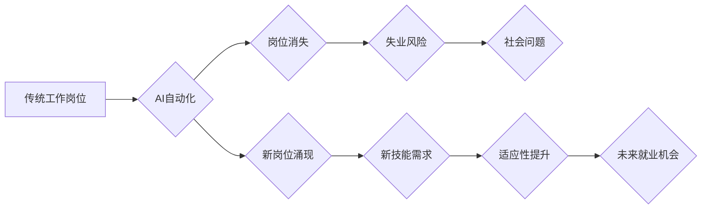

                 

## 人类计算：AI时代的未来就业市场与技能发展预测

> 关键词：人工智能、未来就业、技能发展、人类计算、自动化、机器学习、数据分析、编程、软技能

## 1. 背景介绍

人工智能（AI）正以惊人的速度发展，其影响力正在深刻地改变着我们生活的方方面面。从自动驾驶汽车到个性化医疗，从智能家居到金融风控，AI技术的应用场景日益广泛。然而，这种快速发展也引发了人们对未来就业市场和技能发展趋势的担忧。

一方面，AI技术的自动化能力将取代一些传统工作岗位，例如数据录入、客服、简单重复性操作等。另一方面，AI技术也创造了大量新的工作机会，例如AI开发工程师、数据科学家、AI产品经理等。因此，在AI时代，我们需要认真思考如何适应未来的就业市场，如何提升自身竞争力，才能在新的时代中获得成功。

## 2. 核心概念与联系

**2.1 人类计算**

人类计算是指人类利用自身的认知能力、创造力、判断力和解决问题的能力来完成计算任务。它强调人类在AI时代仍然不可替代的重要作用。

**2.2 AI时代就业市场变化**

AI技术的应用将导致就业市场发生深刻变化：

* **自动化替代:** AI技术能够自动完成一些重复性、规则性工作，从而替代部分人工岗位。
* **新岗位涌现:** AI技术的发展催生了大量新的工作岗位，例如AI开发工程师、数据科学家、AI产品经理等。
* **技能需求升级:**  未来就业市场将更加重视具备数据分析、编程、机器学习等技能的人才。

**2.3 技能发展与适应性**

为了适应AI时代的就业市场变化，我们需要不断提升自身技能，增强适应性。

**2.4  Mermaid 流程图**



## 3. 核心算法原理 & 具体操作步骤

**3.1 算法原理概述**

在AI时代，许多核心算法在推动就业市场和技能发展变化中发挥着重要作用。例如：

* **机器学习算法:** 能够从数据中学习模式，并根据学习到的模式进行预测或分类。
* **深度学习算法:**  一种更高级的机器学习算法，能够处理更复杂的数据，并取得更优的性能。
* **自然语言处理算法:**  能够理解和处理人类语言，例如文本分析、机器翻译等。

**3.2 算法步骤详解**

以机器学习算法为例，其基本步骤包括：

1. **数据收集和预处理:** 收集相关数据，并进行清洗、转换、特征提取等预处理工作。
2. **模型选择:** 根据具体任务选择合适的机器学习模型，例如线性回归、决策树、支持向量机等。
3. **模型训练:** 使用训练数据训练模型，调整模型参数，使其能够准确地预测或分类。
4. **模型评估:** 使用测试数据评估模型的性能，例如准确率、召回率、F1-score等。
5. **模型部署:** 将训练好的模型部署到实际应用场景中，例如预测客户行为、识别图像内容等。

**3.3 算法优缺点**

每个算法都有其优缺点，需要根据具体任务选择合适的算法。例如，线性回归算法简单易实现，但对数据分布有较高的要求；决策树算法能够处理非线性数据，但容易过拟合；支持向量机算法能够处理高维数据，但训练时间较长。

**3.4 算法应用领域**

机器学习算法广泛应用于各个领域，例如：

* **医疗保健:** 疾病诊断、药物研发、个性化治疗等。
* **金融服务:** 风险评估、欺诈检测、投资决策等。
* **电商:** 商品推荐、客户画像、精准营销等。
* **交通运输:** 自动驾驶、交通流量预测、物流优化等。

## 4. 数学模型和公式 & 详细讲解 & 举例说明

**4.1 数学模型构建**

在机器学习中，常用的数学模型包括线性回归模型、逻辑回归模型、支持向量机模型等。这些模型都基于一定的数学公式，用来描述数据之间的关系。

**4.2 公式推导过程**

例如，线性回归模型的目标是找到一条直线，能够最佳地拟合数据点。其数学公式如下：

$$y = wx + b$$

其中，$y$ 是预测值，$x$ 是输入特征，$w$ 是权重系数，$b$ 是偏置项。

通过最小化预测值与真实值的误差，可以求解出最佳的 $w$ 和 $b$ 值。

**4.3 案例分析与讲解**

假设我们有一个数据集，包含房屋面积和房屋价格的信息。我们可以使用线性回归模型来预测房屋价格。

* 输入特征：房屋面积
* 输出特征：房屋价格

通过训练模型，我们可以得到一个最佳的线性回归方程，例如：

$$y = 5000x + 100000$$

其中，$y$ 表示房屋价格，$x$ 表示房屋面积。

根据这个方程，我们可以预测不同面积的房屋价格。例如，如果一个房屋面积为100平方米，那么其价格可以预测为：

$$y = 5000 * 100 + 100000 = 600000$$

## 5. 项目实践：代码实例和详细解释说明

**5.1 开发环境搭建**

为了实现机器学习项目，我们需要搭建一个合适的开发环境。常用的开发环境包括：

* **Python:**  Python 是机器学习领域最常用的编程语言，拥有丰富的机器学习库，例如 scikit-learn、TensorFlow、PyTorch 等。
* **Jupyter Notebook:** Jupyter Notebook 是一个交互式编程环境，方便进行机器学习代码的编写、调试和展示。
* **云计算平台:**  例如 AWS、Azure、Google Cloud 等，可以提供强大的计算资源和机器学习服务。

**5.2 源代码详细实现**

以下是一个使用 scikit-learn 库实现线性回归模型的 Python 代码示例：

```python
from sklearn.linear_model import LinearRegression
from sklearn.model_selection import train_test_split
from sklearn.metrics import mean_squared_error

# 加载数据
# ...

# 将数据分为训练集和测试集
X_train, X_test, y_train, y_test = train_test_split(X, y, test_size=0.2)

# 创建线性回归模型
model = LinearRegression()

# 训练模型
model.fit(X_train, y_train)

# 预测测试集数据
y_pred = model.predict(X_test)

# 计算模型性能
mse = mean_squared_error(y_test, y_pred)
print(f"Mean Squared Error: {mse}")
```

**5.3 代码解读与分析**

这段代码首先加载数据，然后将数据分为训练集和测试集。接着，创建了一个线性回归模型，并使用训练集数据训练模型。最后，使用测试集数据预测结果，并计算模型的性能指标 Mean Squared Error (MSE)。

**5.4 运行结果展示**

运行这段代码后，会输出模型的 MSE 值，表示模型预测的准确程度。

## 6. 实际应用场景

**6.1 医疗保健**

* **疾病诊断:**  AI算法可以分析患者的医疗影像、病历、基因信息等数据，辅助医生进行疾病诊断。
* **药物研发:** AI算法可以加速药物研发过程，例如预测药物的有效性、安全性、毒性等。
* **个性化治疗:** AI算法可以根据患者的个体特征，制定个性化的治疗方案。

**6.2 金融服务**

* **风险评估:** AI算法可以分析客户的信用记录、交易行为等数据，评估客户的信用风险。
* **欺诈检测:** AI算法可以识别异常交易行为，帮助金融机构防范欺诈。
* **投资决策:** AI算法可以分析市场数据、公司财务信息等，辅助投资者进行投资决策。

**6.3 电商**

* **商品推荐:** AI算法可以根据用户的购买历史、浏览记录等数据，推荐用户可能感兴趣的商品。
* **客户画像:** AI算法可以分析用户的行为数据，构建用户的画像，帮助商家进行精准营销。
* **个性化服务:** AI算法可以提供个性化的客户服务，例如智能客服、个性化推荐等。

**6.4 未来应用展望**

AI技术的应用场景还在不断扩展，未来将更加广泛地应用于各个领域，例如教育、娱乐、交通、能源等。

## 7. 工具和资源推荐

**7.1 学习资源推荐**

* **在线课程:** Coursera、edX、Udacity 等平台提供丰富的机器学习课程。
* **书籍:** 《深入理解机器学习》、《Python机器学习实战》等书籍。
* **博客和网站:**  Towards Data Science、Machine Learning Mastery 等网站提供最新的机器学习资讯和教程。

**7.2 开发工具推荐**

* **Python:**  Python 是机器学习领域最常用的编程语言。
* **Jupyter Notebook:**  Jupyter Notebook 是一个交互式编程环境，方便进行机器学习代码的编写、调试和展示。
* **scikit-learn:**  scikit-learn 是一个开源的机器学习库，提供了丰富的机器学习算法和工具。
* **TensorFlow:**  TensorFlow 是一个开源的深度学习框架，可以用于构建和训练复杂的深度学习模型。
* **PyTorch:**  PyTorch 是另一个开源的深度学习框架，以其灵活性和易用性而闻名。

**7.3 相关论文推荐**

* **《机器学习》** by Tom Mitchell
* **《深度学习》** by Ian Goodfellow, Yoshua Bengio, and Aaron Courville

## 8. 总结：未来发展趋势与挑战

**8.1 研究成果总结**

近年来，AI技术取得了长足的进步，在各个领域都取得了显著的应用成果。

**8.2 未来发展趋势**

* **更强大的算法:**  未来将出现更强大的机器学习算法，能够处理更复杂的数据，取得更优的性能。
* **更广泛的应用场景:**  AI技术将应用于更多领域，例如医疗保健、教育、娱乐、交通等。
* **更智能的系统:**  未来将出现更智能的AI系统，能够自主学习、决策、解决问题。

**8.3 面临的挑战**

* **数据安全和隐私:**  AI技术的应用需要处理大量数据，如何保障数据安全和隐私是一个重要的挑战。
* **算法偏见:**  AI算法可能会受到训练数据的影响，导致算法偏见，需要进行算法公平性评估和改进。
* **伦理问题:**  AI技术的应用可能会引发一些伦理问题，例如人工智能的责任、人工智能的权利等，需要进行深入的伦理探讨。

**8.4 研究展望**

未来，我们需要继续加强对AI技术的研发和应用，同时也要关注AI技术的伦理和社会影响，确保AI技术能够造福人类。


## 9. 附录：常见问题与解答

**9.1 如何学习AI技术？**

学习AI技术需要掌握一定的数学基础、编程基础和机器学习知识。可以参考上述学习资源推荐，选择适合自己的学习路径。

**9.2 AI技术会取代所有工作吗？**

AI技术会改变一些工作岗位，但不会完全取代所有工作。未来，更多的人将需要与AI协同工作，发挥自身的创造力和解决问题的能力。

**9.3 如何应对AI时代带来的就业挑战？**

需要不断提升自身技能，学习新的技术，增强适应性，才能在AI时代获得成功。


作者：禅与计算机程序设计艺术 / Zen and the Art of Computer Programming 
<end_of_turn>

