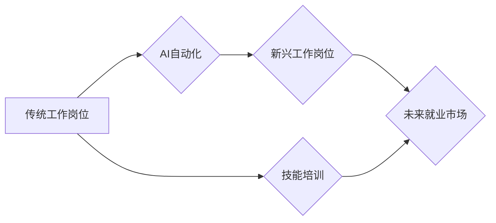

                 

## 人类计算：AI时代的未来就业市场与技能培训发展

> 关键词：人工智能、未来就业、技能培训、人类计算、自动化、数字转型、数据分析、机器学习、深度学习

## 1. 背景介绍

人工智能（AI）技术的飞速发展正在深刻地改变着我们的世界，它正在渗透到各个领域，从医疗保健到金融，从制造业到教育。AI驱动的自动化正在改变工作方式，并对未来就业市场产生重大影响。一方面，AI将创造出许多新的工作岗位，例如AI工程师、数据科学家和AI伦理学家。另一方面，一些传统的工作岗位将被自动化取代，导致部分人员失业。因此，我们需要认真思考AI时代如何应对就业市场变化，如何培养适应未来需求的人才。

## 2. 核心概念与联系

**2.1 人类计算**

人类计算是指人类利用自身的认知能力和创造力来解决问题、进行分析和做出决策的过程。它强调人类在AI时代仍然不可替代的价值，例如批判性思维、创造力、情感智能和复杂问题解决能力。

**2.2 AI时代就业市场变化**

AI技术的进步将导致以下就业市场变化：

* **自动化取代传统工作岗位：**AI可以自动化许多重复性、规则性工作，例如数据录入、客服和物流配送。
* **新兴工作岗位的出现：**AI技术的发展将催生许多新的工作岗位，例如AI工程师、数据科学家、AI伦理学家和AI培训师。
* **技能需求的转变：**未来就业市场将更加重视具备数据分析、编程、机器学习和人工智能应用能力的人才。

**2.3 技能培训与发展**

为了适应AI时代就业市场变化，我们需要加强技能培训和发展，培养具备未来竞争力的人才。

**2.4  Mermaid 流程图**



## 3. 核心算法原理 & 具体操作步骤

**3.1 算法原理概述**

人类计算的核心算法原理是基于人类认知能力的模拟，例如逻辑推理、知识表示和决策制定。这些算法通常结合了符号逻辑、概率统计和神经网络等技术，旨在模拟人类的思维过程。

**3.2 算法步骤详解**

1. **数据收集和预处理：**收集与问题相关的各种数据，并进行清洗、转换和格式化。
2. **知识表示和建模：**将数据转化为可理解的知识表示形式，例如知识图谱、规则库或语义网络。
3. **推理和决策：**利用算法进行逻辑推理、知识抽取和决策分析，得出解决方案或建议。
4. **结果解释和反馈：**将算法结果解释为人类可理解的形式，并根据反馈进行算法调整和优化。

**3.3 算法优缺点**

**优点：**

* 能够处理复杂、模糊和不确定性问题。
* 具备一定的学习和适应能力。
* 可以结合人类的经验和知识进行决策。

**缺点：**

* 算法设计和实现难度较高。
* 需要大量的训练数据和计算资源。
* 算法解释性和可解释性相对较差。

**3.4 算法应用领域**

* **医疗诊断和治疗：**辅助医生进行疾病诊断、制定治疗方案和预测患者病情。
* **金融风险管理：**识别和评估金融风险，帮助金融机构进行风险控制和决策。
* **法律决策支持：**分析法律文本、判例和法规，为律师提供法律建议和决策支持。
* **教育个性化学习：**根据学生的学习情况和需求，提供个性化的学习内容和教学方法。

## 4. 数学模型和公式 & 详细讲解 & 举例说明

**4.1 数学模型构建**

人类计算的数学模型通常基于概率统计和机器学习理论。例如，可以使用贝叶斯网络来表示知识和推理关系，使用决策树来进行分类和预测，使用神经网络来模拟人类大脑的学习和决策过程。

**4.2 公式推导过程**

例如，贝叶斯网络中的概率计算公式如下：

$$P(A|B) = \frac{P(B|A)P(A)}{P(B)}$$

其中：

* $P(A|B)$ 是在已知事件 B 发生的情况下，事件 A 发生的概率。
* $P(B|A)$ 是在已知事件 A 发生的情况下，事件 B 发生的概率。
* $P(A)$ 是事件 A 发生的概率。
* $P(B)$ 是事件 B 发生的概率。

**4.3 案例分析与讲解**

例如，在医疗诊断领域，可以使用贝叶斯网络来计算患者患某种疾病的概率。根据患者的症状、病史和检查结果，可以构建一个贝叶斯网络模型，并利用公式计算出患者患病的概率。

## 5. 项目实践：代码实例和详细解释说明

**5.1 开发环境搭建**

可以使用 Python 语言和相关库来实现人类计算算法。例如，可以使用 TensorFlow 或 PyTorch 库来构建和训练神经网络模型。

**5.2 源代码详细实现**

```python
# 使用 TensorFlow 构建一个简单的决策树模型
import tensorflow as tf

# 定义决策树模型
model = tf.keras.models.Sequential([
    tf.keras.layers.Dense(10, activation='relu', input_shape=(10,)),
    tf.keras.layers.Dense(1, activation='sigmoid')
])

# 编译模型
model.compile(optimizer='adam', loss='binary_crossentropy', metrics=['accuracy'])

# 训练模型
model.fit(x_train, y_train, epochs=10)

# 评估模型
loss, accuracy = model.evaluate(x_test, y_test)
print('Loss:', loss)
print('Accuracy:', accuracy)
```

**5.3 代码解读与分析**

这段代码使用 TensorFlow 库构建了一个简单的决策树模型。模型包含两层神经元，第一层有 10 个神经元，第二层有 1 个神经元。模型使用 Adam 优化器、二元交叉熵损失函数和精度指标进行训练。

**5.4 运行结果展示**

训练完成后，可以评估模型的性能，例如计算模型在测试集上的损失和精度。

## 6. 实际应用场景

**6.1 医疗诊断辅助**

AI可以辅助医生进行疾病诊断，例如根据患者的症状、病史和影像数据，预测患者患某种疾病的概率。

**6.2 金融风险管理**

AI可以帮助金融机构识别和评估金融风险，例如预测客户违约概率、识别欺诈交易和管理投资组合风险。

**6.3 法律决策支持**

AI可以分析法律文本、判例和法规，为律师提供法律建议和决策支持，例如预测案件结果、识别法律风险和撰写法律文件。

**6.4 未来应用展望**

随着AI技术的不断发展，人类计算将在更多领域得到应用，例如教育、交通、能源和环境保护等。

## 7. 工具和资源推荐

**7.1 学习资源推荐**

* **在线课程:** Coursera、edX、Udacity 等平台提供人工智能、机器学习和深度学习相关的在线课程。
* **书籍:** 《深度学习》、《人工智能简史》、《机器学习实战》等书籍可以帮助读者深入了解AI相关知识。
* **开源项目:** TensorFlow、PyTorch、Scikit-learn 等开源项目可以帮助读者实践AI算法。

**7.2 开发工具推荐**

* **Python:** Python 语言是AI开发的常用语言，拥有丰富的库和工具。
* **Jupyter Notebook:** Jupyter Notebook 是一个交互式编程环境，方便进行AI算法开发和调试。
* **云计算平台:** AWS、Azure、GCP 等云计算平台提供AI相关的服务和工具。

**7.3 相关论文推荐**

* **《ImageNet Classification with Deep Convolutional Neural Networks》**
* **《Attention Is All You Need》**
* **《Generative Adversarial Networks》**

## 8. 总结：未来发展趋势与挑战

**8.1 研究成果总结**

人类计算领域取得了显著的进展，例如在自然语言处理、计算机视觉和决策支持等领域取得了突破。

**8.2 未来发展趋势**

* **更强大的计算能力:** 随着硬件技术的进步，AI模型将更加强大，能够处理更复杂的任务。
* **更广泛的应用场景:** AI将应用于更多领域，例如医疗保健、教育、交通和能源等。
* **更注重伦理和可解释性:** 人类计算的发展需要更加注重伦理和可解释性，确保AI技术安全、可靠和可控。

**8.3 面临的挑战**

* **算法设计和实现难度:** 人类计算算法的设计和实现难度较高，需要跨学科的知识和技能。
* **数据获取和隐私保护:** AI模型需要大量的训练数据，如何获取高质量数据并保护用户隐私是一个挑战。
* **社会影响和伦理问题:** AI技术的应用可能带来社会影响和伦理问题，需要进行深入的思考和讨论。

**8.4 研究展望**

未来，人类计算研究将继续探索更强大的算法、更广泛的应用场景和更完善的伦理框架，为人类社会带来更多福祉。

## 9. 附录：常见问题与解答

**9.1 如何学习人类计算？**

可以学习人工智能、机器学习和深度学习相关的课程和书籍，并参与开源项目实践。

**9.2 人类计算与AI有什么区别？**

人类计算强调人类认知能力的模拟，而AI更侧重于构建能够执行特定任务的智能系统。

**9.3 人类计算的未来发展趋势是什么？**

未来，人类计算将更加强大、更加广泛地应用于各个领域，并更加注重伦理和可解释性。


作者：禅与计算机程序设计艺术 / Zen and the Art of Computer Programming 
<end_of_turn>

