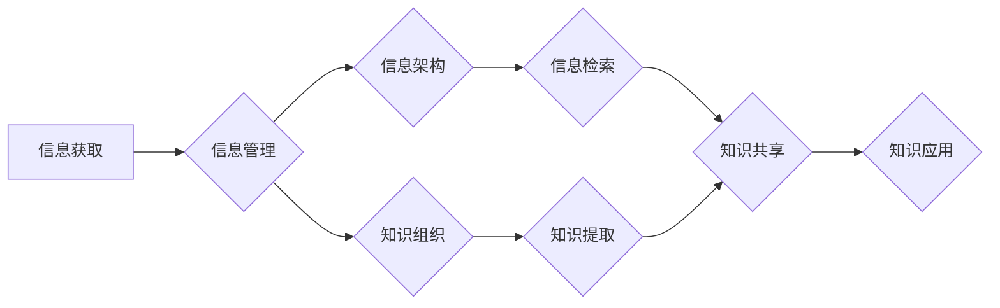

                 

## 信息过载与知识管理策略与实践：管理和组织信息

> 关键词：信息过载、知识管理、信息架构、信息检索、知识组织、信息过滤、知识共享、人工智能、机器学习

### 1. 背景介绍

在当今信息爆炸的时代，我们每天接触的海量信息呈指数级增长。从新闻、社交媒体到学术论文、专业文档，信息无处不在，却并非都具有价值。如何有效地管理和组织这些信息，从中提取有用的知识，已成为个人和组织面临的重大挑战。

信息过载现象的产生，源于信息获取的便捷性和信息生产的快速增长。互联网、移动设备和社交媒体等技术的普及，使得信息获取变得更加容易，但也带来了信息流的爆炸式增长。同时，数据分析、自动化生产等技术的进步，也加速了信息的生成速度。

信息过载带来的负面影响不容忽视：

* **效率低下：** 过多的信息会分散注意力，降低工作效率，难以找到所需的信息。
* **决策困难：** 难以从海量信息中筛选出关键信息，导致决策迟缓，甚至错误。
* **知识沉淀不足：** 无法有效地整理和存储信息，导致知识积累缓慢，难以形成知识库。
* **认知疲劳：** 长时间处于信息过载状态，会导致认知疲劳，影响身心健康。

### 2. 核心概念与联系

**2.1 信息管理与知识管理**

信息管理和知识管理是两个密切相关的概念，但它们并非完全等同。

* **信息管理**是指收集、存储、整理、检索和传播信息的系统化过程。其目标是确保信息的准确性、完整性和及时性，并使其能够被有效地利用。
* **知识管理**是指识别、创建、共享和应用知识的过程。其目标是将分散的知识转化为有价值的资产，并将其应用于组织的决策、创新和运营。

**2.2 信息架构与知识组织**

信息架构和知识组织是实现信息管理和知识管理的关键环节。

* **信息架构**是指对信息进行分类、组织和结构化的过程，使其能够被用户以逻辑和直观的方式理解和导航。
* **知识组织**是指对知识进行分类、结构化和关联，使其能够被有效地检索、共享和应用。

**2.3 信息过滤与知识提取**

信息过滤和知识提取是应对信息过载的有效策略。

* **信息过滤**是指从海量信息中筛选出与用户需求相关的关键信息，减少信息噪音。
* **知识提取**是指从文本、数据等信息源中提取关键知识，并将其转化为可理解和应用的形式。

**2.4 知识共享与协作**

知识共享和协作是促进知识积累和创新的重要途径。

* **知识共享**是指将知识公开传播，以便他人能够学习和利用。
* **协作**是指多个个体共同参与知识的创造、分享和应用。

**2.5 人工智能与机器学习**

人工智能和机器学习技术正在为信息管理和知识管理提供强大的支持。

* **人工智能**可以帮助自动完成信息分类、过滤、提取等任务，提高效率和准确性。
* **机器学习**可以根据用户的行为和偏好，个性化推荐信息，并不断学习和改进信息过滤和知识提取的算法。

**Mermaid 流程图：信息管理与知识管理的联系**



### 3. 核心算法原理 & 具体操作步骤

**3.1 算法原理概述**

信息管理和知识管理涉及多种算法，例如信息检索算法、知识图谱构建算法、机器学习算法等。这些算法的原理主要基于以下几个方面：

* **文本处理：** 对文本进行分词、词性标注、语义分析等处理，提取文本中的关键信息。
* **数据挖掘：** 从海量数据中发现模式、趋势和关系，提取有价值的知识。
* **机器学习：** 利用算法从数据中学习，提高信息过滤、知识提取和知识推荐的准确性。

**3.2 算法步骤详解**

以信息检索算法为例，其基本步骤包括：

1. **用户查询：** 用户输入查询词或短语。
2. **文本预处理：** 对查询词和文档文本进行分词、词性标注、去除停用词等预处理。
3. **关键词提取：** 从查询词和文档文本中提取关键词，并计算关键词的权重。
4. **匹配度计算：** 根据关键词的权重和文档的词频，计算文档与查询词的匹配度。
5. **排序结果：** 根据匹配度排序结果，将最相关的文档显示给用户。

**3.3 算法优缺点**

不同的信息管理和知识管理算法各有优缺点，需要根据具体应用场景选择合适的算法。

* **优点：** 提高信息检索效率，个性化推荐信息，自动化完成信息处理任务。
* **缺点：** 算法复杂度高，需要大量数据进行训练，可能存在偏差和误差。

**3.4 算法应用领域**

信息管理和知识管理算法广泛应用于各个领域，例如：

* **搜索引擎：** Google、百度等搜索引擎利用信息检索算法为用户提供相关搜索结果。
* **电子商务：** Amazon、淘宝等电商平台利用推荐算法为用户推荐商品。
* **医疗保健：** 医院利用知识管理系统存储和管理患者信息，辅助医生诊断和治疗。
* **教育：** 在线教育平台利用知识管理系统为学生提供个性化学习内容。

### 4. 数学模型和公式 & 详细讲解 & 举例说明

**4.1 数学模型构建**

信息检索算法通常基于数学模型，例如TF-IDF模型、BM25模型等。

* **TF-IDF模型：** 

TF-IDF模型用于衡量关键词在文档中的重要性。

* **TF (Term Frequency)：** 词频，即关键词在文档中出现的次数。
* **IDF (Inverse Document Frequency)：** 逆文档频率，即关键词在整个语料库中出现的频率的倒数。

TF-IDF值 = TF * IDF

**4.2 公式推导过程**

TF-IDF值的计算公式如下：

* TF(t, d) = (Number of times term t appears in document d) / (Total number of terms in document d)
* IDF(t) = log_e (Total number of documents / Number of documents containing term t)

**4.3 案例分析与讲解**

假设有一个文档包含关键词“人工智能”，在整个语料库中，“人工智能”出现的频率较低，则IDF(人工智能)值较高。如果该关键词在该文档中出现次数较多，则TF(人工智能, 文档)值较高。因此，该关键词的TF-IDF值较高，表明该关键词在该文档中具有重要性。

**4.4 BM25模型**

BM25模型是TF-IDF模型的改进版本，它考虑了文档长度和关键词在文档中的位置信息，提高了检索的准确性。

BM25公式：

```
score(Q, D) = Σ (IDF(t) * (k1 + 1) * (tf(t, D) / (k1 * (1 - b) + b * (dl / avgdl)))
```

其中：

* Q：查询词
* D：文档
* t：关键词
* IDF(t)：关键词的逆文档频率
* tf(t, D)：关键词在文档D中出现的次数
* k1、b：BM25模型的参数
* dl：文档D的长度
* avgdl：语料库中所有文档的平均长度

### 5. 项目实践：代码实例和详细解释说明

**5.1 开发环境搭建**

* Python 3.x
* NLTK 自然语言处理库
* Scikit-learn 机器学习库
* SpaCy 自然语言处理库

**5.2 源代码详细实现**

```python
import nltk
from sklearn.feature_extraction.text import TfidfVectorizer

# 下载 NLTK 数据集
nltk.download('punkt')
nltk.download('stopwords')

# 文本预处理
def preprocess_text(text):
    # 分词
    tokens = nltk.word_tokenize(text)
    # 去除停用词
    stop_words = nltk.corpus.stopwords.words('english')
    tokens = [token for token in tokens if token not in stop_words]
    return tokens

# TF-IDF 向量化
vectorizer = TfidfVectorizer()
documents = [
    "This is the first document.",
    "This document is the second document.",
    "And this is the third one.",
    "Is this the first document?"
]
processed_documents = [preprocess_text(doc) for doc in documents]
tfidf_matrix = vectorizer.fit_transform(processed_documents)

# 打印 TF-IDF 矩阵
print(tfidf_matrix.toarray())
```

**5.3 代码解读与分析**

* 代码首先导入必要的库，并下载 NLTK 数据集。
* `preprocess_text()` 函数对文本进行分词和停用词去除等预处理。
* `TfidfVectorizer()` 类用于将文本转换为 TF-IDF 向量。
* `fit_transform()` 方法将文本数据进行训练和转换。
* `toarray()` 方法将 TF-IDF 矩阵转换为 NumPy 数组，以便打印输出。

**5.4 运行结果展示**

运行代码后，会输出一个 TF-IDF 矩阵，其中每一行代表一个文档，每一列代表一个关键词。每个单元格的值表示该关键词在该文档中的 TF-IDF 值。

### 6. 实际应用场景

**6.1 搜索引擎优化 (SEO)**

SEO 专家利用 TF-IDF 模型分析关键词在网页中的出现频率和重要性，优化网页内容以提高搜索引擎排名。

**6.2 文档分类**

TF-IDF 模型可以用于将文档分类到不同的类别，例如新闻分类、邮件分类等。

**6.3 信息检索系统**

信息检索系统利用 TF-IDF 模型为用户提供相关信息，例如图书馆文献检索系统、企业知识库检索系统等。

**6.4 个性化推荐系统**

TF-IDF 模型可以用于分析用户行为数据，推荐用户感兴趣的内容，例如电商平台商品推荐、音乐平台歌曲推荐等。

**6.5 未来应用展望**

随着人工智能和机器学习技术的不断发展，信息管理和知识管理算法将更加智能化、个性化和自动化。

* **自然语言理解 (NLU)：** NLU 技术可以帮助更深入地理解文本语义，提高信息提取和知识组织的准确性。
* **知识图谱 (KG)：** 知识图谱可以将知识表示为结构化的形式，方便知识查询、推理和应用。
* **联邦学习 (FL)：** 联邦学习可以将机器学习模型训练在分散的数据上，保护用户隐私，同时提高模型的泛化能力。

### 7. 工具和资源推荐

**7.1 学习资源推荐**

* **书籍：**
    * 《信息检索》 (Information Retrieval) by Manning, Raghavan, Schütze
    * 《自然语言处理入门》 (Natural Language Processing with Python) by Bird, Klein, Loper
* **在线课程：**
    * Coursera: Natural Language Processing Specialization
    * edX: Machine Learning
* **博客和网站：**
    * Towards Data Science
    * Analytics Vidhya

**7.2 开发工具推荐**

* **Python：** Python 是信息管理和知识管理领域最常用的编程语言。
* **NLTK：** NLTK 是一个强大的自然语言处理库，提供各种文本处理工具和算法。
* **Scikit-learn：** Scikit-learn 是一个机器学习库，提供各种机器学习算法和工具。
* **SpaCy：** SpaCy 是一个高效的自然语言处理库，提供预训练的语言模型和各种文本处理功能。

**7.3 相关论文推荐**

* **TF-IDF：**
    * Salton, G., & McGill, M. (1983). Introduction to modern information retrieval. McGraw-Hill.
* **BM25：**
    * Robertson, S. E., & Zaragoza, H. (2009). The probabilistic relevance model. In Proceedings of the 32nd annual international ACM SIGIR conference on Research and development in information retrieval (pp. 1-8). ACM.
* **知识图谱：**
    * Bizer, C., Heath, T., & Berners-Lee, T. (2009). Linked data-the story so far. Journal of Web Semantics, 7(1), 1-2.

### 8. 总结：未来发展趋势与挑战

**8.1 研究成果总结**

信息管理和知识管理领域取得了显著的进展，例如：

* **信息检索算法的改进：** BM25、BERT 等算法提高了信息检索的准确性和效率。
* **知识图谱的构建和应用：** 知识图谱可以帮助组织和管理知识，并用于知识推理和问答系统。
* **机器学习在信息管理和知识管理中的应用：** 机器学习可以帮助自动完成信息分类、过滤、提取等任务。

**8.2 未来发展趋势**

* **更智能的知识管理系统：** 未来知识管理系统将更加智能化，能够自动学习和适应用户的需求。
* **更个性化的信息推荐：** 基于用户行为和偏好的个性化信息推荐将更加精准和有效。
* **跨领域知识融合：** 将不同领域知识融合在一起，构建更完整的知识图谱。

**8.3 面临的挑战**

* **数据质量问题：** 信息过载导致数据质量下降，需要开发更有效的算法和方法来处理不完整、不准确的数据。
* **隐私保护问题：** 信息管理和知识管理涉及大量个人数据，需要确保数据的安全和隐私。
* **解释性问题：** 许多机器学习算法是黑箱模型，难以解释其决策过程，需要开发更可解释的算法。

**8.4 研究展望**

未来研究将重点关注以下几个方面：

* **开发更智能、更个性化的信息管理和知识管理算法。**
* **解决数据质量、隐私保护和解释性问题。**
* **探索跨领域知识融合和知识共享的新方法。**

### 9. 附录：常见问题与解答

**9.1 如何选择合适的算法？**

选择合适的算法取决于具体的应用场景和数据特点。例如，对于文本分类任务，可以使用 Naive Bayes、SVM 或深度学习算法。

**9.2 如何处理数据质量问题？**

可以采用数据清洗、数据增强和异常值处理等方法来提高数据质量。

**9.3 如何保护用户隐私？**

可以使用数据匿名化、差分隐私和联邦学习等技术来保护用户隐私。


作者：禅与计算机程序设计艺术 / Zen and the Art of Computer Programming<end_of_turn>

