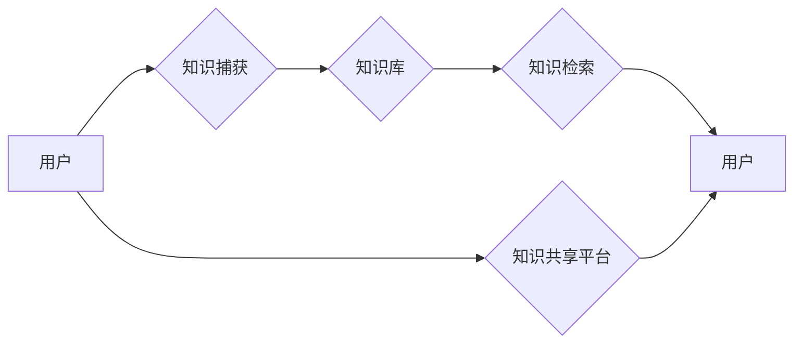

                 

## 信息过载与知识管理系统实施：有效组织和检索信息的指南

> 关键词：信息过载、知识管理系统、知识组织、信息检索、人工智能、机器学习、自然语言处理、数据可视化、知识图谱

### 1. 背景介绍

在当今信息爆炸的时代，我们每天都会接触到海量的数字信息。从新闻报道到学术论文，从社交媒体到在线课程，信息无处不在，却并非都具有价值。如何有效地组织、检索和利用这些信息，已成为个人和组织面临的重大挑战。

信息过载是指个人或组织在处理大量信息时，难以有效地获取、理解和利用所需信息，从而导致效率低下、决策错误和认知疲劳。它不仅影响着个人的学习和工作效率，也阻碍着组织的创新和发展。

知识管理系统 (KMS) 应运而生，旨在帮助个人和组织有效地管理和利用知识资产。KMS 提供了一个平台，用于存储、组织、检索和共享知识，从而提高知识的发现性和利用率。

### 2. 核心概念与联系

**2.1 知识管理系统 (KMS) 的核心概念**

KMS 的核心概念包括：

* **知识:** 指个人或组织掌握的经验、技能、知识、见解和创新成果。
* **知识创建:** 指通过学习、研究、实践等方式获取和积累知识的过程。
* **知识共享:** 指将知识传播和交流给其他人，使其能够被利用的过程。
* **知识应用:** 指将知识应用于实际工作中，解决问题和创造价值的过程。

**2.2 KMS 的架构**

KMS 的架构通常包括以下几个主要部分：

* **知识库:** 用于存储和管理知识资产的数据库。
* **知识捕获工具:** 用于收集和整理各种形式的知识，例如文档、视频、音频等。
* **知识检索引擎:** 用于帮助用户快速找到所需知识的搜索引擎。
* **知识共享平台:** 用于促进知识的传播和交流的平台，例如论坛、博客、社交网络等。
* **知识管理平台:** 用于管理整个 KMS 系统的平台，包括用户管理、权限控制、系统监控等功能。

**2.3 KMS 与其他技术的联系**

KMS 与其他技术密切相关，例如：

* **人工智能 (AI):** AI 技术可以用于知识提取、知识分类、知识推荐等方面，提高 KMS 的智能化水平。
* **机器学习 (ML):** ML 技术可以用于分析用户行为，个性化推荐知识，并不断优化 KMS 的性能。
* **自然语言处理 (NLP):** NLP 技术可以用于理解和处理自然语言文本，提高 KMS 的知识检索和知识发现能力。
* **数据可视化:** 数据可视化技术可以用于将知识以直观的方式呈现，帮助用户更好地理解和利用知识。
* **知识图谱:** 知识图谱是一种用于表示和组织知识的结构化数据模型，可以为 KMS 提供更丰富的知识表示和推理能力。

**2.4 KMS 架构流程图**



### 3. 核心算法原理 & 具体操作步骤

**3.1 算法原理概述**

KMS 中常用的算法包括：

* **文本分类算法:** 用于将文本内容分类到不同的类别，例如主题、领域、情感等。常见的文本分类算法包括 Naive Bayes、支持向量机 (SVM) 和深度学习模型。
* **关键词提取算法:** 用于从文本中提取最重要的关键词，用于知识检索和知识发现。常见的关键词提取算法包括 TF-IDF、RAKE 和 TextRank。
* **知识图谱构建算法:** 用于从文本数据中提取实体和关系，构建知识图谱。常见的知识图谱构建算法包括关系抽取、实体识别和知识图谱推理。

**3.2 算法步骤详解**

以文本分类算法为例，其步骤如下：

1. **数据预处理:** 对文本数据进行清洗、分词、词干提取等预处理操作，以便于算法训练和应用。
2. **特征提取:** 从预处理后的文本数据中提取特征，例如词频、词向量等。
3. **模型训练:** 使用训练数据训练文本分类模型，例如 Naive Bayes、SVM 或深度学习模型。
4. **模型评估:** 使用测试数据评估模型的性能，例如准确率、召回率和 F1-score。
5. **模型部署:** 将训练好的模型部署到 KMS 系统中，用于对新文本进行分类。

**3.3 算法优缺点**

不同的算法具有不同的优缺点，需要根据实际应用场景选择合适的算法。例如，Naive Bayes 算法简单易实现，但性能可能不如 SVM 或深度学习模型；SVM 算法性能较好，但训练时间较长；深度学习模型性能优异，但需要大量的训练数据和计算资源。

**3.4 算法应用领域**

KMS 中的算法广泛应用于各个领域，例如：

* **企业知识管理:** 用于分类和检索企业内部的知识资产，提高知识共享和利用率。
* **学术研究:** 用于分析和总结学术文献，发现研究趋势和热点。
* **医疗保健:** 用于管理患者信息和医疗知识，提高医疗诊断和治疗效率。
* **教育培训:** 用于组织和检索教学资源，个性化推荐学习内容。

### 4. 数学模型和公式 & 详细讲解 & 举例说明

**4.1 数学模型构建**

文本分类算法通常使用概率模型来表示文本分类问题。例如，Naive Bayes 算法假设每个特征独立地对分类结果产生影响，可以使用贝叶斯定理来计算每个类别的概率。

**4.2 公式推导过程**

假设我们有一个文本分类问题，需要将文本分类到两个类别：正类和负类。

* **P(C|D)**: 文本 D 属于类别 C 的概率。
* **P(D|C)**: 类别 C 下文本 D 的概率。
* **P(C)**: 类别 C 的先验概率。

根据贝叶斯定理，我们可以得到：

$$P(C|D) = \frac{P(D|C)P(C)}{P(D)}$$

其中，P(D) 是文本 D 的概率，可以计算为：

$$P(D) = P(D|C)P(C) + P(D|¬C)P(¬C)$$

**4.3 案例分析与讲解**

假设我们有一个文本分类任务，需要将新闻文章分类为体育类和财经类。我们可以使用 Naive Bayes 算法来训练模型。

* **训练数据:** 我们收集了一批体育类和财经类新闻文章，并标记了它们的类别。
* **特征提取:** 我们从新闻文章中提取了一些特征，例如关键词、词频等。
* **模型训练:** 我们使用训练数据训练 Naive Bayes 模型，计算出每个类别下特征的概率。
* **模型评估:** 我们使用测试数据评估模型的性能，例如准确率、召回率和 F1-score。

### 5. 项目实践：代码实例和详细解释说明

**5.1 开发环境搭建**

* **操作系统:** Linux 或 macOS
* **编程语言:** Python
* **开发工具:** Jupyter Notebook 或 VS Code
* **库和框架:** scikit-learn、NLTK、spaCy

**5.2 源代码详细实现**

```python
from sklearn.feature_extraction.text import TfidfVectorizer
from sklearn.naive_bayes import MultinomialNB
from sklearn.model_selection import train_test_split

# 准备数据
texts = [
    "今天天气真好，适合打篮球",
    "股市今天上涨了2%，投资者情绪乐观",
    "我今天去看了最新的电影，非常精彩",
    "苹果公司发布了新款手机，引发了热议",
]
labels = ["体育", "财经", "娱乐", "科技"]

# 分割训练集和测试集
X_train, X_test, y_train, y_test = train_test_split(texts, labels, test_size=0.2)

# 使用 TF-IDF 向量化文本数据
vectorizer = TfidfVectorizer()
X_train = vectorizer.fit_transform(X_train)
X_test = vectorizer.transform(X_test)

# 使用 Naive Bayes 模型训练分类器
classifier = MultinomialNB()
classifier.fit(X_train, y_train)

# 对测试集进行预测
y_pred = classifier.predict(X_test)

# 评估模型性能
from sklearn.metrics import accuracy_score
accuracy = accuracy_score(y_test, y_pred)
print(f"模型准确率: {accuracy}")
```

**5.3 代码解读与分析**

* **数据准备:** 首先，我们需要准备一些文本数据和对应的类别标签。
* **数据预处理:** 使用 TF-IDF 向量化技术将文本数据转换为数字向量，以便于机器学习模型的训练。
* **模型训练:** 使用 Naive Bayes 模型训练分类器，并使用训练数据进行模型训练。
* **模型评估:** 使用测试数据评估模型的性能，例如准确率。

**5.4 运行结果展示**

运行上述代码后，可以得到模型的准确率，例如 0.8 或 0.9。

### 6. 实际应用场景

KMS 在各个领域都有广泛的应用场景，例如：

* **企业知识管理:** 帮助企业收集、整理和共享知识资产，提高知识利用率和创新能力。
* **学术研究:** 帮助学者分析和总结学术文献，发现研究趋势和热点。
* **医疗保健:** 帮助医生管理患者信息和医疗知识，提高诊断和治疗效率。
* **教育培训:** 帮助教师组织和检索教学资源，个性化推荐学习内容。

**6.4 未来应用展望**

随着人工智能、机器学习和自然语言处理技术的不断发展，KMS 将更加智能化、个性化和自动化。未来，KMS 可能具备以下能力：

* **主动学习:** KMS 可以根据用户的行为和需求，主动学习新的知识和技能。
* **个性化推荐:** KMS 可以根据用户的兴趣和偏好，个性化推荐相关的知识和资源。
* **知识推理:** KMS 可以利用知识图谱和推理引擎，进行知识推理和发现。
* **跨语言支持:** KMS 可以支持多种语言，方便全球用户使用。

### 7. 工具和资源推荐

**7.1 学习资源推荐**

* **书籍:**
    * 《知识管理：理论与实践》
    * 《知识管理系统设计与实施》
    * 《人工智能：一种现代方法》
* **在线课程:**
    * Coursera: 知识管理
    * edX: 人工智能
    * Udemy: 自然语言处理

**7.2 开发工具推荐**

* **知识库:**
    * MongoDB
    * Elasticsearch
    * Neo4j
* **知识共享平台:**
    * Confluence
    * SharePoint
    * Slack
* **开发框架:**
    * Django
    * Flask
    * Spring Boot

**7.3 相关论文推荐**

* **知识图谱构建:**
    * "A Survey on Knowledge Graph Construction"
    * "Knowledge Graph Embedding: A Survey"
* **文本分类:**
    * "Naive Bayes Classifiers"
    * "Support Vector Machines for Text Classification"
* **知识管理系统:**
    * "A Framework for Knowledge Management Systems"
    * "The Role of Knowledge Management Systems in Organizational Learning"

### 8. 总结：未来发展趋势与挑战

**8.1 研究成果总结**

KMS 领域取得了显著的进展，特别是人工智能、机器学习和自然语言处理技术的应用，使得 KMS 更加智能化和自动化。

**8.2 未来发展趋势**

未来 KMS 将朝着以下方向发展：

* **更加智能化:** 利用人工智能技术，实现知识自动提取、分类、推荐和推理。
* **更加个性化:** 根据用户的需求和偏好，提供个性化的知识服务。
* **更加协作性:** 支持多人协作，共同创建和共享知识。
* **更加可视化:** 使用数据可视化技术，将知识以更直观的方式呈现。

**8.3 面临的挑战**

KMS 发展也面临一些挑战：

* **数据质量:** KMS 的核心是知识，而知识的质量直接影响 KMS 的性能。如何保证知识数据的准确性、完整性和一致性是一个重要的挑战。
* **知识表示:** 如何将知识以一种结构化和可理解的方式表示，是 KMS 发展的一个关键问题。
* **知识共享:** 如何鼓励用户共享知识，并构建一个开放和共享的知识社区，也是 KMS 需要解决的挑战。

**8.4 研究展望**

未来 KMS 研究将继续探索以下方向：

* **更先进的知识表示模型:** 研究更灵活、更强大的知识表示模型，例如知识图谱、语义网络等。
* **更智能的知识发现和推理算法:** 研究能够自动发现知识规律和推理新知识的算法。
* **更个性化和协作的知识服务:** 研究能够根据用户需求和偏好提供个性化知识服务的系统。


### 9. 附录：常见问题与解答

**9.1 如何选择合适的 KMS 系统？**

选择 KMS 系统需要根据企业的具体需求和情况进行评估，考虑以下因素：

* **企业规模:** 小型企业可以选择开源的 KMS 系统，而大型企业可能需要定制开发的 KMS 系统。
* **知识类型:** 不同的 KMS 系统擅长处理不同的知识类型，例如文本、图像、视频等。
* **预算:** KMS 系统的价格差异很大，需要根据企业的预算进行选择。
* **技术支持:** 选择具有良好技术支持的 KMS 系统，可以确保系统稳定运行和及时解决问题。

**9.2 如何有效地管理和维护 KMS 系统？**

有效管理和维护 KMS 系统需要以下步骤：

* **制定知识管理策略:** 明确 KMS 的目标、范围和使用规则。
* **建立知识管理流程:** 建立知识创建、共享、使用和维护的流程。
* **定期评估和优化:** 定期评估 KMS 的性能和效果，并根据需要进行优化。
* **提供培训和支持:** 为用户提供 KMS 的培训和支持，帮助他们更好地使用 KMS 系统。


作者：禅与计算机程序设计艺术 / Zen and the Art of Computer Programming 
<end_of_turn>

