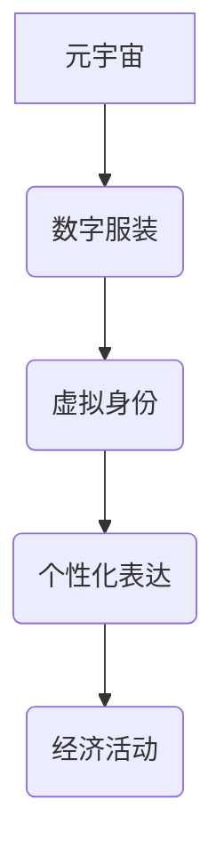

                 

## 元宇宙时尚设计师:数字化服装的创新先锋

> 关键词：元宇宙、数字服装、虚拟时尚、3D建模、区块链、NFT、AI设计

## 1. 背景介绍

元宇宙概念的兴起，为时尚产业带来了前所未有的机遇。虚拟世界不再仅仅是游戏或娱乐的场所，而是逐渐演变成一个与现实世界相互交融、并具有独立经济体系的全新空间。在这个虚拟世界中，人们渴望拥有独特的虚拟身份和表达方式，而数字服装作为一种重要的虚拟资产，成为了元宇宙时尚的核心。

传统服装设计流程耗时且成本高昂，而数字服装的创作则更加灵活、高效和可持续。设计师可以利用3D建模技术、AI辅助设计等工具，快速创作出各种风格和材质的虚拟服装，并通过NFT技术实现其唯一性和可交易性。

## 2. 核心概念与联系

### 2.1 元宇宙

元宇宙是一个由虚拟现实、增强现实、区块链、人工智能等技术融合而成的沉浸式虚拟世界。它拥有以下核心特征：

* **沉浸式体验:**  用户可以通过VR/AR设备或其他交互方式，身临其境地体验虚拟世界。
* **持久性:** 元宇宙是一个持续运行的虚拟世界，用户可以随时进入并进行活动。
* **去中心化:** 元宇宙由多个平台和开发者共同构建，不存在单一控制者。
* **经济体系:** 元宇宙拥有自己的虚拟经济体系，用户可以通过交易虚拟资产获得收益。

### 2.2 数字服装

数字服装是指在虚拟世界中穿戴的虚拟服饰，它可以是3D模型、纹理图、动画效果等形式。数字服装与传统服装的区别在于：

* **虚拟存在:** 数字服装只存在于虚拟世界，无法在现实世界穿戴。
* **无限可变:** 数字服装可以根据用户的喜好进行无限修改和定制。
* **可交易性:** 数字服装可以通过NFT技术实现唯一性和可交易性。

### 2.3 核心概念关系

元宇宙和数字服装之间存在着密切的联系。元宇宙为数字服装提供了展示和交易的平台，而数字服装则丰富了元宇宙的用户体验和经济活动。



## 3. 核心算法原理 & 具体操作步骤

### 3.1 算法原理概述

数字服装的设计主要依赖于3D建模技术和AI辅助设计。

* **3D建模:** 利用软件工具创建虚拟服装的3D模型，包括形状、材质、纹理等细节。
* **AI辅助设计:** 利用机器学习算法，分析流行趋势、用户喜好等数据，辅助设计师进行服装设计和风格推荐。

### 3.2 算法步骤详解

1. **概念设计:** 设计师根据目标用户、风格主题等进行服装概念设计，包括整体轮廓、细节元素、颜色搭配等。
2. **3D建模:** 利用3D建模软件，根据概念设计创建服装的3D模型，并添加材质、纹理等细节。
3. **虚拟试穿:** 利用虚拟试穿技术，将3D服装模型应用于虚拟人物模型，进行虚拟试穿效果展示。
4. **用户反馈:** 收集用户对虚拟服装的反馈意见，进行修改和优化。
5. **NFT铸造:** 将完成的数字服装模型转换为NFT，实现其唯一性和可交易性。

### 3.3 算法优缺点

**优点:**

* **高效便捷:** 数字服装的设计流程更加高效便捷，可以快速迭代和更新。
* **无限创意:** 数字服装可以突破现实世界的材质和设计限制，实现无限的创意表达。
* **可持续发展:** 数字服装的生产和流通过程更加环保可持续。

**缺点:**

* **技术门槛:** 数字服装的设计需要一定的3D建模和编程技术。
* **用户体验:** 目前虚拟试穿技术还存在一定的局限性，用户体验需要进一步提升。
* **市场规范:** 数字服装的市场规范和法律法规尚未完善。

### 3.4 算法应用领域

数字服装的应用领域非常广泛，包括：

* **游戏:** 游戏角色的服装定制和交易。
* **社交平台:** 用户在虚拟社交平台上展示个性化虚拟形象。
* **电商:** 线上虚拟服装商店和销售平台。
* **娱乐:** 音乐会、演唱会等虚拟演出中的虚拟服装设计。
* **教育:** 虚拟服装设计作为一种新的教育资源，培养学生的创意和设计能力。

## 4. 数学模型和公式 & 详细讲解 & 举例说明

### 4.1 数学模型构建

数字服装的设计可以利用数学模型来描述服装的形状、尺寸、材质等属性。常用的数学模型包括：

* **贝塞尔曲线:** 用于描述服装的曲线的形状。
* **B样条曲线:** 用于描述服装的复杂曲面形状。
* **三角形网格:** 用于表示服装的表面结构。

### 4.2 公式推导过程

例如，利用贝塞尔曲线可以描述服装的袖口形状。贝塞尔曲线的控制点可以控制曲线的形状和方向。

$$
P(t) = \sum_{i=0}^{n} B_i^n(t) * P_i
$$

其中：

* $P(t)$ 是贝塞尔曲线上某个点的坐标。
* $B_i^n(t)$ 是贝塞尔基函数。
* $P_i$ 是贝塞尔曲线的控制点坐标。
* $n$ 是控制点的数量。
* $t$ 是参数，取值范围为0到1。

### 4.3 案例分析与讲解

通过调整贝塞尔曲线的控制点坐标，可以实现不同形状的袖口，例如圆形、椭圆形、波浪形等。

## 5. 项目实践：代码实例和详细解释说明

### 5.1 开发环境搭建

数字服装设计项目可以使用以下开发环境：

* **操作系统:** Windows、macOS、Linux
* **编程语言:** Python、C++、JavaScript
* **3D建模软件:** Blender、Maya、3ds Max
* **虚拟试穿引擎:** Unity、Unreal Engine

### 5.2 源代码详细实现

以下是一个使用Python和Blender实现数字服装设计的基本代码示例：

```python
import bpy

# 创建新的场景
bpy.ops.scene.new()

# 创建一个立方体作为服装基础
bpy.ops.mesh.primitive_cube_add()

# 修改立方体的尺寸和位置
cube = bpy.context.object
cube.scale = (0.5, 0.5, 0.5)
cube.location = (0, 0, 0)

# 添加材质和纹理
material = bpy.data.materials.new(name="MyMaterial")
material.diffuse_color = (1, 0, 0, 1)  # 红色
cube.data.materials.append(material)

# 导出服装模型为OBJ文件
bpy.ops.export_mesh.obj(filepath="my_dress.obj")
```

### 5.3 代码解读与分析

这段代码首先创建了一个新的Blender场景，然后添加了一个立方体作为服装基础。接着，代码修改了立方体的尺寸和位置，并为其添加了红色材质。最后，代码将服装模型导出为OBJ文件，以便在其他软件中使用。

### 5.4 运行结果展示

运行这段代码后，Blender中将出现一个红色的立方体，代表着数字服装的基础模型。

## 6. 实际应用场景

### 6.1 游戏

数字服装在游戏中扮演着重要的角色，玩家可以根据自己的喜好和游戏角色的设定，选择不同的服装来进行个性化定制。例如，在虚拟角色扮演游戏中，玩家可以购买和穿戴各种风格的服装，来塑造自己的虚拟形象。

### 6.2 社交平台

数字服装也逐渐成为社交平台上的一种流行趋势。用户可以在虚拟社交平台上展示自己的数字服装，并与其他用户进行互动交流。例如，在虚拟社交平台上，用户可以举办虚拟时装秀，展示自己的数字服装设计。

### 6.3 电商

数字服装的电商平台也正在快速发展。用户可以在这些平台上购买和出售数字服装，并进行虚拟交易。例如，一些虚拟服装品牌已经开始在电商平台上销售自己的数字服装，并提供虚拟试穿服务。

### 6.4 未来应用展望

数字服装的应用场景还在不断拓展，未来可能会应用于以下领域：

* **虚拟会议:** 在虚拟会议中，用户可以穿戴数字服装来表达自己的身份和职业。
* **虚拟教育:** 在虚拟教育场景中，数字服装可以帮助学生更好地理解服装设计和制作的原理。
* **虚拟医疗:** 数字服装可以用于虚拟医疗场景，例如帮助患者进行虚拟手术模拟和康复训练。

## 7. 工具和资源推荐

### 7.1 学习资源推荐

* **书籍:**

    * 《3D建模入门》
    * 《Blender教程》
    * 《Unity游戏开发入门》

* **在线课程:**

    * Coursera: 3D Modeling and Animation
    * Udemy: Blender for Beginners
    * Skillshare: Fashion Design in the Metaverse

### 7.2 开发工具推荐

* **3D建模软件:** Blender, Maya, 3ds Max
* **虚拟试穿引擎:** Unity, Unreal Engine
* **NFT平台:** OpenSea, Rarible

### 7.3 相关论文推荐

* **The Metaverse: A New Frontier for Fashion**
* **Digital Fashion: Trends, Opportunities, and Challenges**
* **Blockchain Technology and the Future of Fashion**

## 8. 总结：未来发展趋势与挑战

### 8.1 研究成果总结

数字服装的设计和应用已经取得了显著的进展，为元宇宙时尚产业的发展提供了新的可能性。

### 8.2 未来发展趋势

未来，数字服装的发展趋势包括：

* **更逼真的虚拟体验:** 利用更先进的3D建模技术和虚拟现实技术，打造更逼真的虚拟试穿体验。
* **更个性化的定制服务:** 利用AI技术和用户数据，提供更个性化的数字服装定制服务。
* **更丰富的虚拟经济体系:** 数字服装的交易和流通将更加便捷和安全，虚拟经济体系将更加完善。

### 8.3 面临的挑战

数字服装的发展也面临着一些挑战：

* **技术壁垒:** 数字服装的设计和开发需要一定的技术门槛，需要吸引更多人才加入。
* **用户认知:** 用户对数字服装的认知度和接受度还需要进一步提升。
* **版权保护:** 数字服装的版权保护机制需要完善，防止盗版和侵权行为。

### 8.4 研究展望

未来，数字服装的研究方向包括：

* **更智能的服装设计:** 利用AI技术，实现服装设计更加智能化和自动化。
* **更可持续的服装生产:** 利用数字技术，减少服装生产过程中的资源消耗和环境污染。
* **更融合的虚拟现实体验:** 将数字服装与其他虚拟现实技术融合，打造更沉浸式的虚拟体验。

## 9. 附录：常见问题与解答

**Q1: 数字服装和传统服装有什么区别？**

**A1:** 数字服装只存在于虚拟世界，无法在现实世界穿戴。而传统服装是实体物品，可以实际穿戴。

**Q2: 如何购买和出售数字服装？**

**A2:** 数字服装可以通过NFT平台进行交易。用户可以购买数字服装NFT，获得其所有权和使用权。

**Q3: 数字服装的未来发展趋势是什么？**

**A3:** 数字服装的未来发展趋势包括更逼真的虚拟体验、更个性化的定制服务和更丰富的虚拟经济体系。


作者：禅与计算机程序设计艺术 / Zen and the Art of Computer Programming 
<end_of_turn>

