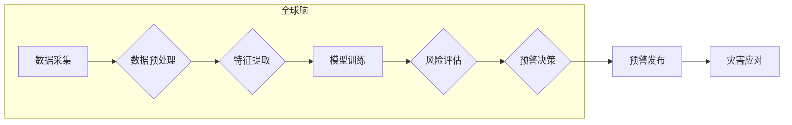

                 

## 全球脑与灾害预防：集体预警的力量

> 关键词：全球脑、灾害预防、集体预警、人工智能、机器学习、大数据分析、风险评估、预测模型

## 1. 背景介绍

人类社会自古以来就面临着各种自然灾害和人为灾难的威胁。从洪水、地震、火灾到疫情、战争，这些灾害给人类带来了巨大的损失，也深刻地影响着人类文明的发展。随着全球化进程的加速和人口规模的不断增长，灾害的发生频率和破坏力都在不断增加，灾害风险也日益凸显。

传统的灾害预警系统主要依赖于气象观测、地震监测等单一数据源，预警范围有限，预警时间短，预警精度低。随着信息技术的快速发展，特别是人工智能、大数据分析等技术的突破，为构建更加智能、高效的灾害预警系统提供了新的机遇。

## 2. 核心概念与联系

**2.1 全球脑**

全球脑是一个由众多分散的计算节点组成的虚拟网络，通过网络连接和数据共享，实现对全球范围内的信息收集、处理和分析。它可以整合来自不同领域、不同来源的数据，形成一个庞大的知识库，并利用人工智能算法进行智能分析和决策。

**2.2 集体预警**

集体预警是指利用全球脑的强大计算能力和数据分析能力，从海量数据中识别灾害发生的潜在风险，并及时向相关人员发出预警。它通过多源数据融合、机器学习模型训练、风险评估和预警决策等环节，实现对灾害的早期预警、精准预警和及时预警。

**2.3 架构图**



## 3. 核心算法原理 & 具体操作步骤

**3.1 算法原理概述**

集体预警系统的核心算法主要包括：

* **数据预处理:** 对采集到的原始数据进行清洗、转换、格式化等处理，使其满足模型训练和分析的要求。
* **特征提取:** 从预处理后的数据中提取关键特征，例如气温、湿度、风速、地壳活动等，这些特征与灾害的发生密切相关。
* **模型训练:** 利用机器学习算法，例如支持向量机、决策树、神经网络等，对提取的特征进行训练，建立灾害预测模型。
* **风险评估:** 将模型预测结果与历史灾害数据、地理环境数据等进行综合分析，评估灾害发生的风险等级。
* **预警决策:** 根据风险评估结果，制定相应的预警策略，例如发布预警信息、疏散人群、启动应急预案等。

**3.2 算法步骤详解**

1. **数据采集:** 从气象站、地震监测站、卫星遥感、社会媒体等多种数据源收集相关数据。
2. **数据预处理:** 对采集到的数据进行清洗、去噪、缺失值处理、标准化等操作，确保数据质量。
3. **特征提取:** 利用数据挖掘和特征工程技术，从预处理后的数据中提取与灾害发生相关的特征，例如气温变化率、降雨量、地壳位移等。
4. **模型训练:** 选择合适的机器学习算法，例如支持向量机、决策树、神经网络等，对提取的特征进行训练，建立灾害预测模型。
5. **模型评估:** 利用测试数据对训练好的模型进行评估，评估模型的准确率、召回率、F1-score等指标，并根据评估结果对模型进行调优。
6. **风险评估:** 将模型预测结果与历史灾害数据、地理环境数据等进行综合分析，评估灾害发生的风险等级。
7. **预警决策:** 根据风险评估结果，制定相应的预警策略，例如发布预警信息、疏散人群、启动应急预案等。

**3.3 算法优缺点**

**优点:**

* **数据驱动:** 基于海量数据分析，预测结果更加准确可靠。
* **实时性强:** 可以实时监测数据变化，及时发出预警信息。
* **可扩展性强:** 可以根据需要扩展数据源和模型类型。

**缺点:**

* **数据依赖:** 模型的准确性依赖于数据质量和数据量。
* **算法复杂:** 模型训练和优化需要专业的技术人员和计算资源。
* **解释性弱:** 一些机器学习模型的决策过程难以解释，难以获得公众的信任。

**3.4 算法应用领域**

* **自然灾害预警:** 预警地震、洪水、火灾、台风等自然灾害。
* **公共卫生事件预警:** 预警疫情、传染病等公共卫生事件。
* **安全事件预警:** 预警恐怖袭击、网络攻击等安全事件。
* **金融风险预警:** 预警金融市场风险、信用风险等。

## 4. 数学模型和公式 & 详细讲解 & 举例说明

**4.1 数学模型构建**

灾害预测模型通常采用统计模型或机器学习模型。统计模型例如线性回归、逻辑回归等，可以建立灾害发生与影响因素之间的线性或非线性关系。机器学习模型例如支持向量机、决策树、神经网络等，可以学习数据中的复杂模式，并进行预测。

**4.2 公式推导过程**

例如，使用线性回归模型预测地震发生概率，可以将地震发生与地壳活动、人口密度、地质构造等因素建立线性关系，并通过最小二乘法求解模型参数。

$$
P(地震发生) = \beta_0 + \beta_1 * 地壳活动 + \beta_2 * 人口密度 + \beta_3 * 地质构造
$$

其中，$P(地震发生)$ 是地震发生概率，$\beta_0$, $\beta_1$, $\beta_2$, $\beta_3$ 是模型参数，需要通过训练数据求解。

**4.3 案例分析与讲解**

例如，可以使用机器学习模型对历史地震数据进行训练，并预测未来地震发生的可能性。模型可以学习地震发生与地壳活动、人口密度、地质构造等因素之间的复杂关系，并给出预测结果。

## 5. 项目实践：代码实例和详细解释说明

**5.1 开发环境搭建**

* 操作系统: Ubuntu 20.04
* Python 版本: 3.8
* 必要的库: pandas, numpy, scikit-learn, matplotlib

**5.2 源代码详细实现**

```python
import pandas as pd
from sklearn.model_selection import train_test_split
from sklearn.linear_model import LogisticRegression
from sklearn.metrics import accuracy_score

# 加载地震数据
data = pd.read_csv('earthquake_data.csv')

# 选择特征和目标变量
features = ['地壳活动', '人口密度', '地质构造']
target = '地震发生'

# 将数据分为训练集和测试集
X_train, X_test, y_train, y_test = train_test_split(data[features], data[target], test_size=0.2)

# 创建逻辑回归模型
model = LogisticRegression()

# 训练模型
model.fit(X_train, y_train)

# 对测试集进行预测
y_pred = model.predict(X_test)

# 计算模型准确率
accuracy = accuracy_score(y_test, y_pred)
print(f'模型准确率: {accuracy}')
```

**5.3 代码解读与分析**

* 代码首先加载地震数据，并选择特征和目标变量。
* 然后将数据分为训练集和测试集，用于训练和评估模型。
* 创建逻辑回归模型，并使用训练集进行模型训练。
* 最后对测试集进行预测，并计算模型准确率。

**5.4 运行结果展示**

运行代码后，会输出模型的准确率。

## 6. 实际应用场景

**6.1 自然灾害预警**

* **地震预警:** 利用全球脑收集地震波数据，并结合地质数据和人口密度数据，预测地震发生概率和震级，及时发出预警信息。
* **洪水预警:** 利用全球脑收集气象数据、水文数据和地形数据，预测洪水发生区域、洪水深度和洪水时间，及时发出预警信息。
* **火灾预警:** 利用全球脑收集气象数据、植被数据和火灾历史数据，预测火灾发生区域、火灾强度和火灾蔓延速度，及时发出预警信息。

**6.2 公共卫生事件预警**

* **疫情预警:** 利用全球脑收集疫情数据、人口流动数据和医疗资源数据，预测疫情传播路径、疫情扩散速度和疫情高峰期，及时发出预警信息。
* **传染病预警:** 利用全球脑收集传染病数据、环境数据和人群免疫数据，预测传染病发生区域、传染病传播途径和传染病风险等级，及时发出预警信息。

**6.3 安全事件预警**

* **恐怖袭击预警:** 利用全球脑收集社会媒体数据、网络数据和情报数据，预测恐怖袭击发生区域、恐怖袭击目标和恐怖袭击时间，及时发出预警信息。
* **网络攻击预警:** 利用全球脑收集网络流量数据、安全日志数据和威胁情报数据，预测网络攻击类型、网络攻击目标和网络攻击时间，及时发出预警信息。

**6.4 未来应用展望**

随着人工智能、大数据分析、物联网等技术的不断发展，全球脑与集体预警系统将发挥更加重要的作用，为人类社会提供更加精准、高效、全面的灾害预防和应急响应服务。

## 7. 工具和资源推荐

**7.1 学习资源推荐**

* **书籍:**
    * 《人工智能：一种现代方法》
    * 《机器学习》
    * 《深度学习》
* **在线课程:**
    * Coursera: 人工智能课程
    * edX: 机器学习课程
    * Udacity: 深度学习课程

**7.2 开发工具推荐**

* **Python:** 广泛应用于数据分析、机器学习和人工智能领域。
* **TensorFlow:** 开源深度学习框架。
* **PyTorch:** 开源深度学习框架。
* **Scikit-learn:** 机器学习库。

**7.3 相关论文推荐**

* **Collective Intelligence for Disaster Response**
* **Global Brain: Towards a Collective Intelligence System**
* **Machine Learning for Disaster Prediction and Response**

## 8. 总结：未来发展趋势与挑战

**8.1 研究成果总结**

全球脑与集体预警系统已经取得了一定的成果，在自然灾害预警、公共卫生事件预警、安全事件预警等领域展现出巨大的潜力。

**8.2 未来发展趋势**

* **模型精度提升:** 通过更先进的机器学习算法和更丰富的训练数据，提高模型预测精度。
* **数据融合增强:** 将来自不同来源的数据进行更有效的融合，形成更加全面的灾害预警体系。
* **预警决策智能化:** 利用人工智能技术，实现预警决策的自动化和智能化。
* **可解释性增强:** 提高模型的解释性，增强公众对预警结果的信任。

**8.3 面临的挑战**

* **数据质量问题:** 灾害数据往往存在不完整、不准确、格式不统一等问题，需要进行有效的数据清洗和预处理。
* **算法复杂度:** 一些机器学习模型的训练和优化需要大量的计算资源和专业技术人员。
* **伦理道德问题:** 灾害预警系统涉及到个人隐私和社会安全等敏感问题，需要认真考虑伦理道德问题。

**8.4 研究展望**

未来，全球脑与集体预警系统将继续朝着更加智能、高效、全面的方向发展，为人类社会提供更加强大的灾害预防和应急响应能力。


## 9. 附录：常见问题与解答

**9.1 如何获取灾害数据？**

灾害数据可以从政府机构、科研机构、国际组织等多个渠道获取。例如，中国地震台网中心、中国气象局、世界卫生组织等机构都提供相关的灾害数据。

**9.2 如何选择合适的机器学习模型？**

选择合适的机器学习模型需要根据具体应用场景和数据特点进行选择。例如，对于分类问题，可以使用逻辑回归、支持向量机、决策树等模型；对于回归问题，可以使用线性回归、支持向量回归、神经网络等模型。

**9.3 如何评估模型的性能？**

模型的性能可以通过准确率、召回率、F1-score等指标进行评估。

**9.4 如何提高模型的预测精度？**

提高模型的预测精度可以通过以下方法：

* 提高数据质量
* 增加训练数据量
* 选择更先进的机器学习算法
* 优化模型参数

**9.5 如何解决模型的解释性问题？**

提高模型的解释性可以通过以下方法：

* 使用可解释性模型，例如决策树、线性回归等。
* 使用模型解释技术，例如SHAP值、LIME等。
* 提供模型决策过程的详细解释。


作者：禅与计算机程序设计艺术 / Zen and the Art of Computer Programming 
<end_of_turn>

