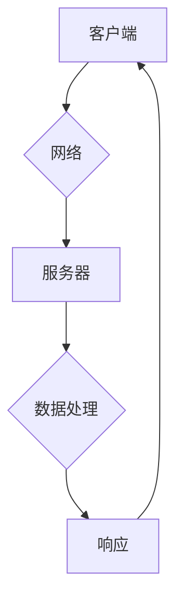

                 

## 分布式系统设计：理论与实践

> 关键词：分布式系统、一致性、容错、网络通信、数据存储、微服务、CAP定理

### 1. 背景介绍

随着互联网和云计算的蓬勃发展，分布式系统已成为现代软件架构的基石。分布式系统由多个独立的计算节点组成，通过网络进行通信和协作，共同完成任务。相较于传统的单机系统，分布式系统具有更高的可用性、可扩展性和容错性，能够更好地应对海量数据和用户需求。然而，分布式系统也带来了新的挑战，例如一致性、容错、网络延迟等问题，需要深入理解其理论基础和设计原则才能构建可靠、高效的分布式系统。

### 2. 核心概念与联系

**2.1 分布式系统关键概念**

* **节点:** 分布式系统中的基本单元，每个节点都是一个独立的计算资源，拥有自己的内存、CPU和存储空间。
* **网络:** 节点之间通过网络进行通信，网络可以是局域网、广域网或互联网。
* **进程:** 节点上运行的程序实例，负责执行特定的任务。
* **消息:** 节点之间传递信息的载体，可以是文本、二进制数据或其他格式。
* **一致性:** 所有节点上的数据保持一致性，即同一数据在所有节点上具有相同的副本。
* **容错:** 系统能够容忍部分节点故障，保证整体系统功能的正常运行。

**2.2 分布式系统架构**

分布式系统架构通常分为以下几种类型：

* **客户端-服务器架构:** 客户端请求服务，服务器提供服务。
* **peer-to-peer (P2P) 架构:** 所有节点都是平等的，可以同时充当客户端和服务器。
* **微服务架构:** 将系统分解成多个独立的服务，每个服务负责特定的功能。

**2.3 Mermaid 流程图**



### 3. 核心算法原理 & 具体操作步骤

**3.1 算法原理概述**

分布式系统中常用的算法包括：

* **一致性算法:** 保证数据在所有节点上保持一致性，例如Paxos、Raft等。
* **容错算法:** 容忍部分节点故障，保证系统功能的正常运行，例如Byzantine fault tolerance (BFT)算法。
* **网络通信算法:** 优化网络通信效率，例如TCP、UDP等。
* **数据存储算法:** 提高数据存储效率和可靠性，例如分布式文件系统、数据库等。

**3.2 算法步骤详解**

以Paxos算法为例，其步骤如下：

1. **提案阶段:** 一个节点提出一个提案，并将其广播到所有其他节点。
2. **承诺阶段:** 节点收到提案后，如果满足一定的条件，则承诺接受该提案。
3. **接受阶段:** 当一个提案获得大多数节点的承诺后，节点将接受该提案并将其应用到本地状态。

**3.3 算法优缺点**

Paxos算法具有以下优点：

* **高一致性:** 能够保证数据在所有节点上保持一致性。
* **容错性:** 能够容忍部分节点故障。

但也有以下缺点：

* **复杂性:** Paxos算法的实现比较复杂。
* **性能:** Paxos算法的性能相对较低。

**3.4 算法应用领域**

Paxos算法广泛应用于分布式数据库、分布式锁、分布式配置管理等领域。

### 4. 数学模型和公式 & 详细讲解 & 举例说明

**4.1 数学模型构建**

分布式系统中的许多问题可以用数学模型来描述，例如一致性问题可以用状态机模型来描述。

**状态机模型:**

* **状态:** 系统的当前状态。
* **事件:** 系统发生的事件，例如节点加入、节点离开、数据更新等。
* **状态转换函数:** 描述系统状态如何根据事件发生而改变的函数。

**4.2 公式推导过程**

例如，我们可以用数学公式来描述Paxos算法的提案接受条件：

* **提案接受条件:** 当一个提案获得超过半数节点的承诺后，该提案才被接受。

**4.3 案例分析与讲解**

我们可以用Paxos算法的数学模型来分析其容错性。假设系统中有n个节点，其中m个节点故障，则Paxos算法能够容忍m <= n/2的节点故障。

### 5. 项目实践：代码实例和详细解释说明

**5.1 开发环境搭建**

* 操作系统: Linux
* 编程语言: Go
* 工具: Docker, Kubernetes

**5.2 源代码详细实现**

```go
// 提案结构体
type Proposal struct {
    Id int
    Value string
}

// 节点结构体
type Node struct {
    Id int
    State string
    Proposals map[int]Proposal
}

// 提案阶段
func (n *Node) Propose(proposal Proposal) {
    // 将提案广播到所有其他节点
}

// 承诺阶段
func (n *Node) Promise(proposal Proposal) {
    // 如果满足条件，则承诺接受该提案
}

// 接受阶段
func (n *Node) Accept(proposal Proposal) {
    // 接受提案并将其应用到本地状态
}
```

**5.3 代码解读与分析**

* 代码实现了Paxos算法的基本流程，包括提案阶段、承诺阶段和接受阶段。
* 每个节点都维护一个状态和一个提案列表。
* 节点之间通过网络通信进行交互。

**5.4 运行结果展示**

* 通过运行代码，可以观察到Paxos算法如何保证数据一致性。

### 6. 实际应用场景

分布式系统广泛应用于各种场景，例如：

* **电商平台:** 处理海量用户请求和订单数据。
* **社交媒体:** 提供实时消息推送和用户互动功能。
* **金融系统:** 保证交易安全和数据一致性。

**6.4 未来应用展望**

随着云计算和物联网的发展，分布式系统将应用于更多领域，例如：

* **边缘计算:** 将计算资源部署到网络边缘，降低延迟和提高效率。
* **人工智能:** 分布式训练模型，处理海量数据。

### 7. 工具和资源推荐

**7.1 学习资源推荐**

* **书籍:**
    * 《分布式系统设计：理论与实践》
    * 《Designing Data-Intensive Applications》
* **在线课程:**
    * Coursera: Distributed Systems
    * edX: Introduction to Distributed Systems

**7.2 开发工具推荐**

* **Docker:** 容器化应用部署和管理。
* **Kubernetes:** 集群管理和自动化部署。
* **Apache Kafka:** 分布式消息队列。

**7.3 相关论文推荐**

* The CAP Theorem
* Paxos Made Live: An Engineering Perspective
* Raft: In Search of an Understandable Consensus Algorithm

### 8. 总结：未来发展趋势与挑战

**8.1 研究成果总结**

分布式系统设计领域取得了显著进展，例如一致性算法、容错算法、网络通信算法等取得了突破性进展。

**8.2 未来发展趋势**

* **更强的容错性:** 应对更加复杂的网络环境和节点故障。
* **更高的效率:** 降低网络延迟和资源消耗。
* **更易于开发和维护:** 提供更友好的开发工具和框架。

**8.3 面临的挑战**

* **复杂性:** 分布式系统设计面临着巨大的复杂性挑战。
* **安全:** 保证分布式系统的安全性和数据隐私。
* **可扩展性:** 应对不断增长的用户需求和数据规模。

**8.4 研究展望**

未来研究将集中在以下几个方面：

* **新型一致性算法:** 探索更高效、更鲁棒的一致性算法。
* **分布式安全:** 研究分布式系统的安全机制和攻击防御策略。
* **自动化的分布式系统设计:** 开发自动化工具和框架，简化分布式系统的设计和部署。

### 9. 附录：常见问题与解答

* **Q: 什么是CAP定理？**
* **A:** CAP定理指出，在分布式系统中，不可能同时满足一致性、可用性和分区容忍这三个特性。

* **Q: 如何选择合适的分布式系统架构？**
* **A:** 选择合适的架构取决于具体的应用场景和需求。

* **Q: 如何保证分布式系统的可靠性？**
* **A:** 通过冗余、容错机制和监控等手段保证分布式系统的可靠性。


作者：禅与计算机程序设计艺术 / Zen and the Art of Computer Programming 
<end_of_turn>

