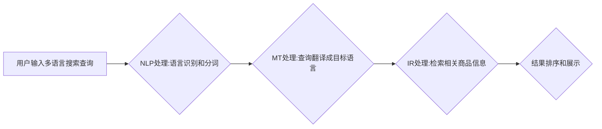

                 

## 多语言AI搜索:跨境电商的技术挑战

> 关键词：多语言搜索、跨境电商、自然语言处理、机器翻译、信息检索、人工智能、深度学习

## 1. 背景介绍

跨境电商的蓬勃发展为全球消费者带来了便捷的购物体验，但也带来了新的技术挑战。其中，多语言搜索是跨境电商平台面临的重大难题之一。随着全球化进程的加速，跨境电商平台的用户群体日益多元化，来自不同国家和地区的消费者使用着各种语言进行商品搜索。如何有效地理解用户的多语言搜索需求，并提供精准的搜索结果，是跨境电商平台实现用户增长和商业成功的关键。

传统的搜索引擎主要依赖于关键词匹配，难以理解用户搜索意图，尤其是在多语言环境下。随着人工智能技术的快速发展，多语言AI搜索技术逐渐成为跨境电商平台提升用户体验和商业效益的重要手段。

## 2. 核心概念与联系

多语言AI搜索的核心概念包括：

* **自然语言处理 (NLP)：** 旨在使计算机能够理解、理解和生成人类语言。
* **机器翻译 (MT)：** 利用人工智能技术将一种语言自动翻译成另一种语言。
* **信息检索 (IR)：** 从海量数据中检索出与用户查询相关的文档或信息。
* **深度学习 (DL)：** 一种机器学习方法，通过多层神经网络模拟人类大脑的学习过程。

多语言AI搜索技术将以上概念有机结合，实现以下功能：

* **多语言理解：** 能够理解来自不同语言的用户搜索查询。
* **跨语言信息检索：** 从不同语言的商品信息库中检索出相关结果。
* **精准匹配：** 准确理解用户搜索意图，提供更精准的搜索结果。
* **个性化推荐：** 基于用户搜索历史和偏好，提供个性化的商品推荐。

**Mermaid 流程图**



## 3. 核心算法原理 & 具体操作步骤

### 3.1  算法原理概述

多语言AI搜索的核心算法原理主要基于深度学习技术，包括以下几个方面：

* **词嵌入：** 将单词映射到低维向量空间，捕捉单词之间的语义关系。
* **序列模型：** 用于处理自然语言序列数据，例如句子或文档，例如RNN、LSTM、Transformer等。
* **检索模型：** 用于从海量商品信息库中检索出与用户查询相关的商品信息。

### 3.2  算法步骤详解

1. **预处理：** 对用户输入的搜索查询进行预处理，包括语言识别、分词、词形还原等。
2. **词嵌入：** 将预处理后的单词映射到低维向量空间，例如Word2Vec、GloVe等词嵌入模型。
3. **序列编码：** 使用序列模型，例如BERT、RoBERTa等，对查询和商品信息进行编码，生成表示查询和商品信息的向量。
4. **相似度计算：** 计算查询向量和商品信息向量的相似度，例如余弦相似度、点积等。
5. **结果排序：** 根据相似度排序检索结果，并将排序结果展示给用户。

### 3.3  算法优缺点

**优点：**

* 能够理解用户搜索意图，提供更精准的搜索结果。
* 支持多语言搜索，满足跨境电商平台的用户需求。
* 可以进行个性化推荐，提升用户体验。

**缺点：**

* 需要大量的训练数据，训练成本较高。
* 模型复杂度高，推理速度相对较慢。
* 对数据质量要求较高，存在数据偏差和噪声问题。

### 3.4  算法应用领域

多语言AI搜索技术广泛应用于以下领域：

* 跨境电商平台
* 搜索引擎
* 语音助手
* 机器翻译
* 内容推荐系统

## 4. 数学模型和公式 & 详细讲解 & 举例说明

### 4.1  数学模型构建

多语言AI搜索的核心数学模型是基于深度学习的检索模型，例如BERT、RoBERTa等。这些模型通过多层神经网络学习文本语义表示，并利用这些表示进行信息检索。

### 4.2  公式推导过程

由于篇幅限制，此处不再详细推导模型的公式，但可以概括为以下步骤：

1. 使用词嵌入模型将单词映射到低维向量空间。
2. 使用序列模型对查询和商品信息进行编码，生成表示查询和商品信息的向量。
3. 计算查询向量和商品信息向量的相似度，例如余弦相似度：

$$
\text{相似度} = \frac{\mathbf{q} \cdot \mathbf{d}}{\|\mathbf{q}\| \|\mathbf{d}\|}
$$

其中，$\mathbf{q}$ 是查询向量，$\mathbf{d}$ 是商品信息向量。

4. 根据相似度排序检索结果。

### 4.3  案例分析与讲解

假设用户输入的查询为“红色鞋子”，目标语言为英语。

1. 使用词嵌入模型将“红色鞋子”映射到低维向量空间，得到查询向量$\mathbf{q}$。
2. 使用BERT模型对查询向量$\mathbf{q}$进行编码，得到最终的查询表示向量$\mathbf{q'}$。
3. 对商品信息库中的所有商品信息进行编码，得到商品信息向量$\mathbf{d_i}$。
4. 计算查询向量$\mathbf{q'}$与每个商品信息向量$\mathbf{d_i}$的余弦相似度。
5. 根据相似度排序检索结果，并将排序结果展示给用户。

## 5. 项目实践：代码实例和详细解释说明

### 5.1  开发环境搭建

* Python 3.7+
* TensorFlow 2.0+
* PyTorch 1.0+
* NLTK
* SpaCy

### 5.2  源代码详细实现

```python
# 使用BERT模型对查询进行编码
from transformers import AutoTokenizer, AutoModel

tokenizer = AutoTokenizer.from_pretrained('bert-base-uncased')
model = AutoModel.from_pretrained('bert-base-uncased')

query = "红色鞋子"
encoded_input = tokenizer(query, return_tensors='pt')
output = model(**encoded_input)
query_embedding = output.last_hidden_state[:, 0, :]

# 计算商品信息与查询的相似度
def calculate_similarity(query_embedding, product_embedding):
    return torch.cosine_similarity(query_embedding, product_embedding)

# 从商品信息库中检索商品信息
def retrieve_products(query_embedding, product_embeddings):
    similarities = [calculate_similarity(query_embedding, product_embedding) for product_embedding in product_embeddings]
    sorted_indices = torch.argsort(torch.tensor(similarities), descending=True)
    return sorted_indices

# 示例代码
product_embeddings = [torch.randn(768) for _ in range(100)]  # 假设有100个商品信息
sorted_indices = retrieve_products(query_embedding, product_embeddings)
```

### 5.3  代码解读与分析

* 使用预训练的BERT模型对查询进行编码，得到查询向量。
* 计算查询向量与每个商品信息向量的余弦相似度。
* 根据相似度排序检索结果，并将排序结果返回。

### 5.4  运行结果展示

运行上述代码，将返回一个包含商品索引的列表，表示与查询最相关的商品。

## 6. 实际应用场景

多语言AI搜索技术在跨境电商平台的实际应用场景非常广泛，例如：

* **商品搜索：** 允许用户使用多种语言进行商品搜索，并提供精准的搜索结果。
* **个性化推荐：** 基于用户搜索历史和偏好，提供个性化的商品推荐。
* **跨语言客服：** 支持多种语言的在线客服，帮助用户解决购物问题。
* **多语言内容翻译：** 将商品信息、产品描述等内容翻译成不同语言，方便用户理解。

### 6.4  未来应用展望

未来，多语言AI搜索技术将朝着以下方向发展：

* **更精准的搜索结果：** 利用更先进的深度学习模型和语义理解技术，提供更精准的搜索结果。
* **更个性化的推荐：** 基于用户行为数据和偏好，提供更个性化的商品推荐。
* **更丰富的交互方式：** 支持语音搜索、图像搜索等多种交互方式，提升用户体验。
* **更跨域的应用：** 将多语言AI搜索技术应用于其他领域，例如教育、医疗、金融等。

## 7. 工具和资源推荐

### 7.1  学习资源推荐

* **书籍：**
    * 《深度学习》
    * 《自然语言处理》
    * 《机器翻译》
* **在线课程：**
    * Coursera: Natural Language Processing Specialization
    * edX: Deep Learning
    * fast.ai: Practical Deep Learning for Coders

### 7.2  开发工具推荐

* **Python：** 广泛用于深度学习和自然语言处理开发。
* **TensorFlow：** 开源深度学习框架，提供丰富的工具和资源。
* **PyTorch：** 开源深度学习框架，以其灵活性和易用性而闻名。
* **Hugging Face Transformers：** 提供预训练的深度学习模型，例如BERT、RoBERTa等。

### 7.3  相关论文推荐

* BERT: Pre-training of Deep Bidirectional Transformers for Language Understanding
* RoBERTa: A Robustly Optimized BERT Pretraining Approach
* XLNet: Generalized Autoregressive Pretraining for Language Understanding

## 8. 总结：未来发展趋势与挑战

### 8.1  研究成果总结

多语言AI搜索技术取得了显著的进展，能够理解用户多语言搜索需求，提供精准的搜索结果。

### 8.2  未来发展趋势

未来，多语言AI搜索技术将朝着更精准、更个性化、更跨域的方向发展。

### 8.3  面临的挑战

* 数据质量问题：多语言数据往往存在偏差和噪声，需要进行高质量的数据清洗和标注。
* 模型复杂度问题：多语言AI搜索模型往往非常复杂，训练和推理成本较高。
* 跨语言语义理解问题：不同语言的语义表达存在差异，需要进一步研究跨语言语义理解技术。

### 8.4  研究展望

未来研究方向包括：

* 开发更鲁棒、更有效的跨语言语义理解模型。
* 探索更轻量级、更高效的多语言AI搜索模型。
* 研究多语言AI搜索在不同领域的应用场景。

## 9. 附录：常见问题与解答

* **Q：多语言AI搜索技术需要多少数据才能训练？**

* **A：** 训练多语言AI搜索模型需要大量的训练数据，具体数量取决于模型复杂度和任务难度。一般来说，需要至少几百万条语料数据才能达到较好的效果。

* **Q：多语言AI搜索技术有哪些应用场景？**

* **A：** 多语言AI搜索技术广泛应用于跨境电商平台、搜索引擎、语音助手、机器翻译等领域。

* **Q：如何评估多语言AI搜索技术的性能？**

* **A：** 多语言AI搜索技术的性能可以评估指标包括准确率、召回率、F1-score等。


作者：禅与计算机程序设计艺术 / Zen and the Art of Computer Programming 
<end_of_turn>

