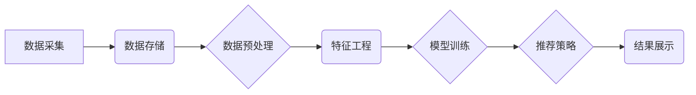

                 

## 大数据驱动的电商平台转型：搜索推荐系统是核心，AI 模型融合是关键

> 关键词：电商平台、搜索推荐系统、大数据、机器学习、深度学习、个性化推荐、AI 模型融合、转型升级

## 1. 背景介绍

在当今数据爆炸的时代，电商平台面临着前所未有的挑战和机遇。用户需求日益多元化，商品种类繁多，信息获取渠道多样化，传统的电商运营模式已难以满足用户对个性化、精准化、智能化的体验需求。大数据技术的兴起为电商平台转型升级提供了强有力的支撑。

大数据能够帮助电商平台深入挖掘用户行为数据、商品属性数据、市场趋势数据等，从而实现对用户需求的精准洞察和预测。基于大数据分析的搜索推荐系统成为电商平台转型升级的核心驱动力，它能够帮助电商平台提供更精准、更个性化的商品推荐，提升用户体验，促进交易转化。

## 2. 核心概念与联系

### 2.1 搜索推荐系统

搜索推荐系统是电商平台的核心功能之一，它通过分析用户搜索行为、浏览历史、购买记录等数据，推荐与用户需求相匹配的商品。搜索推荐系统通常由以下几个模块组成：

* **数据采集与存储:** 收集用户行为数据、商品属性数据、市场趋势数据等，并将其存储在数据仓库中。
* **数据预处理:** 对采集到的数据进行清洗、转换、格式化等处理，使其能够被算法模型进行分析。
* **特征工程:** 从原始数据中提取用户特征、商品特征、上下文特征等，构建用于训练算法模型的特征向量。
* **模型训练:** 利用机器学习算法对特征向量进行训练，构建商品推荐模型。
* **推荐策略:** 根据用户需求和商品特征，选择合适的推荐策略，生成推荐结果。
* **结果展示:** 将推荐结果以用户友好的方式展示给用户。

### 2.2 AI 模型融合

AI 模型融合是指将多个不同的机器学习模型组合在一起，以提高推荐系统的准确性和个性化程度。常见的AI模型融合方法包括：

* **加权平均:** 对多个模型的推荐结果进行加权平均，权重可以根据模型的性能进行调整。
* **投票机制:** 每个模型对商品进行推荐，最终根据投票结果选择推荐商品。
* **集成学习:** 利用多个模型的优势，构建一个更强大的集成模型。

### 2.3  架构图



## 3. 核心算法原理 & 具体操作步骤

### 3.1 算法原理概述

推荐算法的核心是根据用户的历史行为和商品的属性信息，预测用户对商品的兴趣程度。常见的推荐算法包括：

* **协同过滤:** 基于用户的相似度或商品的相似度进行推荐。
* **内容过滤:** 基于商品的属性信息和用户的兴趣偏好进行推荐。
* **基于知识的推荐:** 基于商品之间的关系和用户对商品的知识进行推荐。
* **深度学习推荐:** 利用深度神经网络模型学习用户和商品的复杂关系，进行推荐。

### 3.2 算法步骤详解

以协同过滤算法为例，其具体操作步骤如下：

1. **数据收集:** 收集用户对商品的评分或购买记录数据。
2. **用户-商品矩阵构建:** 将用户和商品作为矩阵的行和列，用户对商品的评分或购买记录作为矩阵的元素。
3. **相似度计算:** 计算用户之间的相似度或商品之间的相似度。常用的相似度计算方法包括余弦相似度、皮尔逊相关系数等。
4. **推荐生成:** 根据用户的相似用户或商品的相似商品，推荐用户可能感兴趣的商品。

### 3.3 算法优缺点

**协同过滤算法的优点:**

* 能够发现用户和商品之间的隐性关系。
* 推荐结果通常具有较高的准确性。

**协同过滤算法的缺点:**

* 数据稀疏性问题: 当用户对商品的评分或购买记录较少时，难以计算出准确的相似度。
* 冷启动问题: 新用户或新商品难以进行推荐。

### 3.4 算法应用领域

协同过滤算法广泛应用于电商平台、电影推荐系统、音乐推荐系统等领域。

## 4. 数学模型和公式 & 详细讲解 & 举例说明

### 4.1 数学模型构建

协同过滤算法的数学模型可以表示为用户-商品评分矩阵的预测问题。假设用户u对商品i的评分为r(u,i)，则可以使用以下公式预测用户u对商品i的评分:

$$
r(u,i) = \sum_{j \in N(u)} \frac{sim(u,j) * r(j,i)}{\sum_{k \in N(u)} sim(u,k)}
$$

其中:

* N(u) 表示与用户u相似的用户集合。
* sim(u,j) 表示用户u和用户j之间的相似度。
* r(j,i) 表示用户j对商品i的评分。

### 4.2 公式推导过程

该公式的推导过程基于以下假设:

* 用户之间的相似度可以反映用户对商品的兴趣偏好。
* 相似用户的评分对预测目标用户的评分具有参考价值。

公式的分子部分计算了所有相似用户对商品i的评分的加权平均值，其中权重为用户之间的相似度。分母部分则为所有相似用户的相似度之和，用于归一化。

### 4.3 案例分析与讲解

假设用户A和用户B对电影的评分如下:

| 用户 | 电影1 | 电影2 | 电影3 |
|---|---|---|---|
| A | 5 | 3 | 4 |
| B | 4 | 5 | 3 |

如果我们想要预测用户A对电影4的评分，可以利用协同过滤算法。首先需要计算用户A和用户B之间的相似度，可以使用余弦相似度计算:

$$
sim(A,B) = \frac{A \cdot B}{||A|| ||B||}
$$

其中:

* A 和 B 分别表示用户A和用户B的评分向量。
* A · B 表示 A 和 B 的点积。
* ||A|| 和 ||B|| 分别表示 A 和 B 的模长。

计算得到 sim(A,B) = 0.8。然后，我们可以利用公式预测用户A对电影4的评分:

$$
r(A,4) = \frac{0.8 * 3}{\sum_{k \in N(A)} 0.8} = 0.6
$$

## 5. 项目实践：代码实例和详细解释说明

### 5.1 开发环境搭建

推荐系统开发环境通常包括以下软件:

* Python 语言环境
* 数据处理库 (例如 Pandas, NumPy)
* 机器学习库 (例如 Scikit-learn, TensorFlow)
* 数据库 (例如 MySQL, MongoDB)

### 5.2 源代码详细实现

以下是一个使用 Python 和 Scikit-learn 库实现协同过滤算法的简单代码示例:

```python
import pandas as pd
from sklearn.metrics.pairwise import cosine_similarity

# 加载用户-商品评分数据
ratings = pd.read_csv('ratings.csv')

# 计算用户之间的余弦相似度
user_similarity = cosine_similarity(ratings)

# 预测用户对商品的评分
def predict_rating(user_id, item_id):
    # 获取用户相似用户
    similar_users = user_similarity[user_id].argsort()[:-10:-1]
    # 计算预测评分
    predicted_rating = sum([ratings.loc[similar_users[i], item_id] * user_similarity[user_id][similar_users[i]] for i in range(len(similar_users))]) / sum([user_similarity[user_id][similar_users[i]] for i in range(len(similar_users))])
    return predicted_rating

# 预测用户1对商品3的评分
predicted_rating = predict_rating(1, 3)
print(f'Predicted rating for user 1 on item 3: {predicted_rating}')
```

### 5.3 代码解读与分析

该代码首先加载用户-商品评分数据，然后使用 Scikit-learn 库的 cosine_similarity 函数计算用户之间的余弦相似度。

`predict_rating` 函数用于预测用户对商品的评分。该函数首先获取用户相似用户，然后计算预测评分。预测评分是所有相似用户对商品的评分的加权平均值，其中权重为用户之间的相似度。

### 5.4 运行结果展示

运行该代码后，会输出用户1对商品3的预测评分。

## 6. 实际应用场景

### 6.1 电商平台商品推荐

电商平台可以利用搜索推荐系统推荐用户可能感兴趣的商品，提升用户体验和转化率。例如，当用户搜索“手机”时，系统可以推荐与用户搜索词相关的手机型号、品牌、价格等信息。

### 6.2 内容平台个性化推荐

内容平台可以利用搜索推荐系统推荐用户可能感兴趣的文章、视频、音频等内容，提升用户粘性和活跃度。例如，当用户阅读了一篇关于人工智能的文章时，系统可以推荐其他与人工智能相关的文章。

### 6.3 社交媒体个性化推荐

社交媒体平台可以利用搜索推荐系统推荐用户可能感兴趣的用户、话题、群组等信息，提升用户互动和社交体验。例如，当用户关注了一位科技博主时，系统可以推荐其他与该博主兴趣相似的用户。

### 6.4 未来应用展望

随着大数据技术的不断发展，搜索推荐系统将更加智能化、个性化、精准化。未来，搜索推荐系统将应用于更多领域，例如医疗、教育、金融等，为用户提供更加个性化的服务。

## 7. 工具和资源推荐

### 7.1 学习资源推荐

* **书籍:**
    * 《推荐系统实践》
    * 《机器学习》
    * 《深度学习》
* **在线课程:**
    * Coursera: 机器学习
    * edX: 深度学习
    * Udacity: 自然语言处理

### 7.2 开发工具推荐

* **Python:** 
    * Scikit-learn
    * TensorFlow
    * PyTorch
* **数据库:**
    * MySQL
    * MongoDB
* **云平台:**
    * AWS
    * Azure
    * GCP

### 7.3 相关论文推荐

* **协同过滤算法:**
    * "Collaborative Filtering: A User-Based Approach"
    * "Memory-Based Collaborative Filtering"
* **深度学习推荐:**
    * "Neural Collaborative Filtering"
    * "Deep Learning for Recommender Systems"

## 8. 总结：未来发展趋势与挑战

### 8.1 研究成果总结

大数据驱动的电商平台转型升级取得了显著成果，搜索推荐系统作为核心技术，在提升用户体验、促进交易转化方面发挥了重要作用。AI 模型融合技术进一步提升了推荐系统的准确性和个性化程度。

### 8.2 未来发展趋势

未来，搜索推荐系统将朝着以下方向发展:

* **更精准的个性化推荐:** 利用更丰富的用户数据和更先进的算法模型，实现更精准的个性化推荐。
* **更智能的推荐策略:** 基于用户行为分析和场景理解，开发更智能的推荐策略，提供更符合用户需求的推荐结果。
* **更跨域的推荐服务:** 将搜索推荐技术应用于更多领域，例如医疗、教育、金融等，为用户提供更全面的服务。

### 8.3 面临的挑战

搜索推荐系统的发展也面临着一些挑战:

* **数据隐私保护:** 如何保护用户隐私数据，是搜索推荐系统发展面临的重要挑战。
* **算法公平性:** 如何避免算法产生偏见，确保推荐结果公平公正，也是需要解决的问题。
* **解释性问题:** 深度学习模型的推荐结果难以解释，如何提高模型的解释性，也是一个重要的研究方向。

### 8.4 研究展望

未来，搜索推荐系统将继续是一个重要的研究领域，需要不断探索新的算法模型、新的推荐策略、新的技术应用，以更好地服务于用户。

## 9. 附录：常见问题与解答

### 9.1 冷启动问题如何解决?

冷启动问题是指新用户或新商品难以进行推荐。解决冷启动问题的常用方法包括:

* **基于内容的推荐:** 利用新用户的基本信息或新商品的属性信息进行推荐。
* **基于流行度的推荐:** 推荐当前流行的商品或用户。
* **用户反馈引导:** 鼓励用户对新商品进行评分或评价，收集用户反馈数据。

### 9.2 数据稀疏性问题如何解决?

数据稀疏性是指用户对商品的评分或购买记录较少，导致难以计算出准确的相似度。解决数据稀疏性问题的常用方法包括:

* **矩阵分解:** 将用户-商品评分矩阵分解成两个低维矩阵，降低数据维度，提高计算效率。
* **聚类算法:** 将用户或商品进行聚类，将相似用户或商品进行分组，提高数据密度。
* **迁移学习:** 利用其他领域的数据进行预训练，迁移到目标领域，缓解数据稀疏性问题。


作者：禅与计算机程序设计艺术 / Zen and the Art of Computer Programming 
<end_of_turn>

