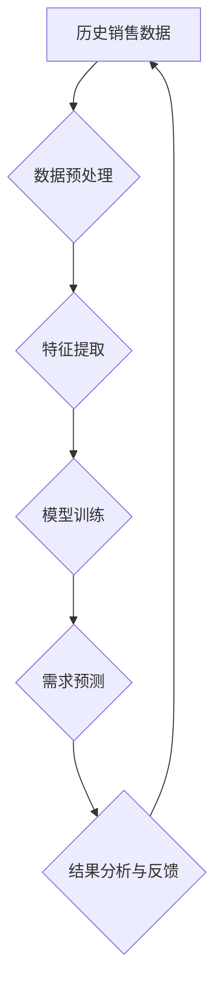

                 

## 大模型在商品需求预测中的应用

> 关键词：大模型、商品需求预测、深度学习、Transformer、时间序列分析、自然语言处理

## 1. 背景介绍

在当今数据爆炸的时代，商品需求预测已成为企业运营和决策的关键环节。准确预测商品需求能够帮助企业优化库存管理、制定合理的生产计划、调整营销策略，从而提高运营效率和盈利能力。传统的商品需求预测方法主要依赖于统计模型和专家经验，但这些方法往往难以捕捉到复杂的数据模式和非线性关系。

近年来，深度学习技术的发展为商品需求预测带来了新的机遇。大模型，作为深度学习领域的一项重要突破，凭借其强大的学习能力和泛化能力，在许多领域取得了显著的成果。大模型在商品需求预测中的应用，能够有效地挖掘数据中的潜在模式，提高预测精度，并为企业提供更精准的决策支持。

## 2. 核心概念与联系

### 2.1  商品需求预测

商品需求预测是指根据历史销售数据、市场趋势、季节性因素等信息，预测未来一段时间内特定商品的销售量。

### 2.2  大模型

大模型是指参数规模庞大、训练数据海量、具备强大的泛化能力的深度学习模型。大模型通常采用Transformer架构，能够有效地捕捉长距离依赖关系和复杂模式。

### 2.3  核心概念联系

大模型在商品需求预测中的应用，主要体现在以下几个方面：

* **数据挖掘:** 大模型能够从海量商品销售数据中挖掘出隐藏的模式和趋势，例如季节性变化、促销活动的影响、用户行为特征等。
* **特征提取:** 大模型能够自动学习商品属性、用户画像、市场环境等多维特征，并将其转化为模型可理解的表示形式。
* **预测建模:** 大模型可以构建复杂的预测模型，例如时间序列模型、回归模型、分类模型等，并根据历史数据进行训练，以预测未来商品需求。

**Mermaid 流程图**



## 3. 核心算法原理 & 具体操作步骤

### 3.1  算法原理概述

大模型在商品需求预测中的应用主要基于深度学习算法，其中Transformer架构最为常见。Transformer模型通过自注意力机制和多头注意力机制，能够有效地捕捉序列数据中的长距离依赖关系，从而提高预测精度。

### 3.2  算法步骤详解

1. **数据预处理:** 收集历史销售数据，进行清洗、格式化、缺失值处理等操作，将数据转化为模型可理解的格式。
2. **特征工程:** 从原始数据中提取相关特征，例如商品属性、用户画像、市场环境等，并进行编码和转换。
3. **模型训练:** 使用Transformer模型，将预处理后的数据进行训练，学习商品需求预测的映射关系。
4. **模型评估:** 使用测试数据评估模型的预测精度，并根据评估结果进行模型调优。
5. **需求预测:** 将预处理后的新数据输入到训练好的模型中，进行预测。

### 3.3  算法优缺点

**优点:**

* **高预测精度:** 大模型能够捕捉到复杂的数据模式和非线性关系，提高预测精度。
* **自动特征学习:** 大模型能够自动学习特征，无需人工特征工程。
* **泛化能力强:** 大模型在训练数据之外的数据上也能表现良好。

**缺点:**

* **训练成本高:** 大模型参数规模庞大，训练需要大量的计算资源和时间。
* **数据依赖性强:** 大模型的性能取决于训练数据的质量和数量。
* **解释性差:** 大模型的决策过程较为复杂，难以解释其预测结果。

### 3.4  算法应用领域

大模型在商品需求预测的应用领域广泛，包括：

* **电商平台:** 预测商品销量、库存需求、促销效果等。
* **零售企业:** 优化库存管理、制定采购计划、调整商品定价等。
* **制造业:** 预测生产需求、优化生产计划、控制原材料库存等。
* **金融行业:** 预测客户需求、评估风险、制定投资策略等。

## 4. 数学模型和公式 & 详细讲解 & 举例说明

### 4.1  数学模型构建

大模型在商品需求预测中的应用通常采用回归模型或时间序列模型。

* **回归模型:** 将商品需求作为因变量，将历史销售数据、市场趋势、季节性因素等作为自变量，建立回归关系，预测未来商品需求。

* **时间序列模型:** 将商品需求视为时间序列数据，利用ARIMA、SARIMA等模型，捕捉时间序列中的趋势、季节性、随机波动等特征，预测未来商品需求。

### 4.2  公式推导过程

由于篇幅限制，此处仅列举ARIMA模型的公式推导过程：

ARIMA模型由三个参数组成：p、d、q，分别代表自回归阶数、差分阶数和滑动平均阶数。

* **自回归模型 (AR):**  $y_t = c + \phi_1 y_{t-1} + \phi_2 y_{t-2} + ... + \phi_p y_{t-p} + \epsilon_t$

* **移动平均模型 (MA):** $y_t = c + \theta_1 \epsilon_{t-1} + \theta_2 \epsilon_{t-2} + ... + \theta_q \epsilon_{t-q} + \epsilon_t$

* **ARIMA模型:** $y_t = c + \phi_1 y_{t-1} + \phi_2 y_{t-2} + ... + \phi_p y_{t-p} + \theta_1 \epsilon_{t-1} + \theta_2 \epsilon_{t-2} + ... + \theta_q \epsilon_{t-q} + \epsilon_t$

其中：

* $y_t$ 表示时间t的商品需求值。
* $c$ 表示截距项。
* $\phi_i$ 表示自回归系数。
* $\theta_i$ 表示移动平均系数。
* $\epsilon_t$ 表示时间t的随机误差项。

### 4.3  案例分析与讲解

假设我们想要预测某商品未来一周的销量，可以使用ARIMA模型进行预测。

1. **数据收集:** 收集该商品过去一年每周的销量数据。
2. **数据分析:** 使用时间序列分析工具，分析数据中的趋势、季节性、随机波动等特征。
3. **模型选择:** 根据数据分析结果，选择合适的ARIMA模型参数 (p, d, q)。
4. **模型训练:** 使用训练数据训练ARIMA模型。
5. **模型评估:** 使用测试数据评估模型的预测精度。
6. **预测结果:** 将未来一周的数据输入到训练好的模型中，预测该商品未来一周的销量。

## 5. 项目实践：代码实例和详细解释说明

### 5.1  开发环境搭建

* **操作系统:** Linux/macOS/Windows
* **编程语言:** Python
* **深度学习框架:** TensorFlow/PyTorch
* **数据处理库:** Pandas
* **可视化库:** Matplotlib/Seaborn

### 5.2  源代码详细实现

```python
import pandas as pd
from sklearn.model_selection import train_test_split
from tensorflow.keras.models import Sequential
from tensorflow.keras.layers import LSTM, Dense

# 数据加载
data = pd.read_csv('sales_data.csv', index_col='Date')

# 数据预处理
data['Sales'] = data['Sales'].astype(float)
data = data.resample('W').mean()  # 周期聚合

# 数据分割
X_train, X_test, y_train, y_test = train_test_split(data[:-1], data[1:], test_size=0.2)

# 模型构建
model = Sequential()
model.add(LSTM(units=50, return_sequences=True, input_shape=(X_train.shape[1], 1)))
model.add(LSTM(units=50))
model.add(Dense(units=1))

# 模型编译
model.compile(loss='mean_squared_error', optimizer='adam')

# 模型训练
model.fit(X_train, y_train, epochs=100, batch_size=32)

# 模型评估
loss = model.evaluate(X_test, y_test)
print('模型损失:', loss)

# 预测结果
predictions = model.predict(X_test)
```

### 5.3  代码解读与分析

* **数据加载:** 使用Pandas库加载销售数据。
* **数据预处理:** 将数据转换为浮点数类型，并进行周聚合。
* **数据分割:** 将数据分为训练集和测试集。
* **模型构建:** 使用TensorFlow/Keras库构建LSTM模型，包含两层LSTM层和一层Dense层。
* **模型编译:** 使用均方误差损失函数和Adam优化器编译模型。
* **模型训练:** 使用训练数据训练模型，设置训练轮数和批处理大小。
* **模型评估:** 使用测试数据评估模型的损失值。
* **预测结果:** 使用训练好的模型预测测试集的销量。

### 5.4  运行结果展示

运行代码后，会输出模型的损失值以及预测结果。

## 6. 实际应用场景

### 6.1  电商平台

电商平台可以利用大模型预测商品销量，优化库存管理，避免缺货或积压库存。例如，亚马逊可以使用大模型预测不同商品的未来销量，并根据预测结果调整库存水平，以满足客户需求。

### 6.2  零售企业

零售企业可以利用大模型预测商品需求，制定合理的采购计划，控制成本。例如，沃尔玛可以使用大模型预测不同商品的未来需求，并根据预测结果调整采购量，以避免过量采购或缺货。

### 6.3  制造业

制造业可以利用大模型预测生产需求，优化生产计划，提高生产效率。例如，特斯拉可以使用大模型预测汽车部件的需求量，并根据预测结果调整生产计划，以满足市场需求。

### 6.4  未来应用展望

随着大模型技术的不断发展，其在商品需求预测领域的应用将更加广泛和深入。未来，大模型可能能够：

* **更精准的预测:** 利用更强大的计算能力和更复杂的模型架构，实现更精准的商品需求预测。
* **更个性化的预测:** 基于用户画像和行为数据，实现更个性化的商品需求预测。
* **更全面的预测:** 不仅预测商品销量，还可以预测其他相关指标，例如价格趋势、促销效果等。

## 7. 工具和资源推荐

### 7.1  学习资源推荐

* **书籍:**
    * 深度学习
    * 自然语言处理
    * 时间序列分析
* **在线课程:**
    * Coursera
    * edX
    * Udacity

### 7.2  开发工具推荐

* **深度学习框架:** TensorFlow, PyTorch
* **数据处理库:** Pandas
* **可视化库:** Matplotlib, Seaborn

### 7.3  相关论文推荐

* Attention Is All You Need
* Transformer-XL: Attentive Language Modeling Beyond Millions of Tokens
* Forecasting with Transformers

## 8. 总结：未来发展趋势与挑战

### 8.1  研究成果总结

大模型在商品需求预测领域取得了显著的成果，能够提高预测精度，并为企业提供更精准的决策支持。

### 8.2  未来发展趋势

未来，大模型在商品需求预测领域的应用将更加广泛和深入，例如：

* **更精准的预测:** 利用更强大的计算能力和更复杂的模型架构，实现更精准的商品需求预测。
* **更个性化的预测:** 基于用户画像和行为数据，实现更个性化的商品需求预测。
* **更全面的预测:** 不仅预测商品销量，还可以预测其他相关指标，例如价格趋势、促销效果等。

### 8.3  面临的挑战

大模型在商品需求预测领域也面临一些挑战，例如：

* **数据依赖性强:** 大模型的性能取决于训练数据的质量和数量。
* **解释性差:** 大模型的决策过程较为复杂，难以解释其预测结果。
* **计算成本高:** 大模型训练需要大量的计算资源和时间。

### 8.4  研究展望

未来研究方向包括：

* **探索更有效的训练方法:** 降低大模型的训练成本，提高训练效率。
* **提高模型的解释性:** 研究更易于理解的大模型架构，并开发解释模型决策的方法。
* **探索新的应用场景:** 将大模型应用于更多商品需求预测的场景，例如个性化推荐、库存优化等。

## 9. 附录：常见问题与解答

**Q1: 大模型的训练需要多少数据？**

A1: 大模型的训练数据量取决于模型的复杂度和任务的难度。一般来说，需要至少几万条数据，最好是百万级或更高。

**Q2: 如何评估大模型的预测精度？**

A2: 可以使用均方误差 (MSE)、平均绝对误差 (MAE) 等指标来评估大模型的预测精度。

**Q3: 如何解释大模型的预测结果？**

A3: 由于大模型的决策过程较为复杂，解释其预测结果是一个挑战。一些研究方法包括：

* **特征重要性分析:** 分析模型对哪些特征最为敏感。
* **可视化解释:** 使用可视化工具展示模型的决策过程。
* **局部解释:** 对单个预测结果进行解释，分析模型是如何做出该预测的。


作者：禅与计算机程序设计艺术 / Zen and the Art of Computer Programming<end_of_turn>

