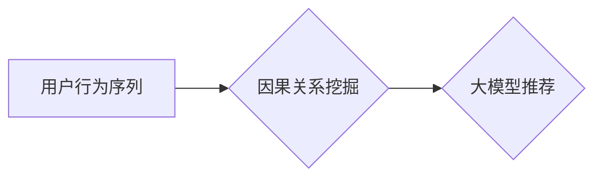
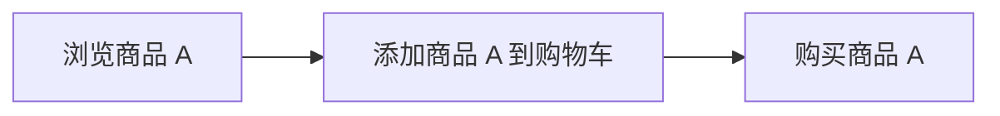

                 

## 大模型推荐中的用户行为序列因果关系挖掘新思路

> 关键词：大模型推荐、用户行为序列、因果关系挖掘、推荐系统、深度学习

## 1. 背景介绍

推荐系统作为互联网时代的重要组成部分，在电商、社交媒体、视频平台等领域发挥着越来越重要的作用。传统的推荐系统主要依赖于协同过滤、内容过滤等方法，这些方法往往难以捕捉用户行为序列中的复杂依赖关系和潜在因果关系。

随着深度学习技术的快速发展，大模型在推荐系统领域展现出巨大的潜力。大模型能够学习用户行为序列中复杂的模式和特征，从而提供更精准、个性化的推荐。然而，大模型在处理因果关系方面仍然面临着挑战。

传统的推荐系统往往将用户行为序列视为独立的事件，而忽略了事件之间的因果关系。例如，用户观看了一部电影后，可能会购买该电影的周边商品。这种行为序列中的因果关系可以帮助我们更好地理解用户的需求和偏好，从而提供更有效的推荐。

## 2. 核心概念与联系

### 2.1 用户行为序列

用户行为序列是指用户在一段时间内进行的一系列交互行为，例如浏览商品、点击广告、购买商品等。这些行为序列蕴含着用户的兴趣、偏好和需求等重要信息。

### 2.2 因果关系挖掘

因果关系挖掘是指从数据中识别出事件之间的因果关系。例如，我们可以通过分析用户行为序列，识别出哪些行为会导致用户购买商品。

### 2.3 大模型推荐

大模型推荐是指利用大规模深度学习模型对用户行为序列进行分析，从而提供更精准、个性化的推荐。

**核心概念与联系流程图**



## 3. 核心算法原理 & 具体操作步骤

### 3.1 算法原理概述

我们提出了一种基于因果图的深度学习算法，用于挖掘用户行为序列中的因果关系。该算法将用户行为序列表示为因果图，并利用深度学习模型学习因果关系。

### 3.2 算法步骤详解

1. **构建因果图:** 将用户行为序列转换为因果图，其中每个节点代表一个行为，边代表行为之间的因果关系。
2. **特征提取:** 从因果图中提取特征，例如行为之间的距离、频率、类型等。
3. **深度学习模型训练:** 利用深度学习模型，例如循环神经网络 (RNN) 或图神经网络 (GNN)，学习因果关系。
4. **因果关系预测:** 利用训练好的模型，预测用户未来行为的因果关系。

### 3.3 算法优缺点

**优点:**

* 能够捕捉用户行为序列中的复杂依赖关系和潜在因果关系。
* 提供更精准、个性化的推荐。

**缺点:**

* 构建因果图需要一定的专业知识和经验。
* 深度学习模型的训练需要大量的计算资源。

### 3.4 算法应用领域

该算法可以应用于各种推荐场景，例如：

* **电商推荐:** 预测用户购买商品的因果关系，提供更精准的商品推荐。
* **社交媒体推荐:** 预测用户关注用户的因果关系，提供更个性化的内容推荐。
* **视频平台推荐:** 预测用户观看视频的因果关系，提供更相关的视频推荐。

## 4. 数学模型和公式 & 详细讲解 & 举例说明

### 4.1 数学模型构建

我们使用图神经网络 (GNN) 来构建因果关系模型。GNN 可以学习图结构中的信息，并捕获节点之间的关系。

假设用户行为序列可以表示为一个有向图 $G = (V, E)$，其中 $V$ 是节点集合，$E$ 是边集合。每个节点代表一个行为，边代表行为之间的因果关系。

### 4.2 公式推导过程

GNN 使用消息传递机制来学习节点之间的关系。每个节点 $v$ 会接收来自其邻居节点 $u$ 的消息，并更新其自身的表示。消息传递过程可以表示为：

$$
h_v^{(l+1)} = \sigma(W^{(l)} \cdot \text{aggregate}(h_u^{(l)}) + b^{(l)})
$$

其中：

* $h_v^{(l)}$ 是节点 $v$ 在第 $l$ 层的表示。
* $W^{(l)}$ 是第 $l$ 层的权重矩阵。
* $b^{(l)}$ 是第 $l$ 层的偏置向量。
* $\sigma$ 是激活函数。
* $\text{aggregate}(h_u^{(l)})$ 是从邻居节点 $u$ 聚合的信息。

### 4.3 案例分析与讲解

例如，假设用户行为序列包含了以下行为：

* 浏览商品 A
* 添加商品 A 到购物车
* 购买商品 A

我们可以构建一个因果图，其中节点代表行为，边代表因果关系。



利用 GNN 模型，我们可以学习到浏览商品 A 会导致用户添加商品 A 到购物车，而添加商品 A 到购物车又会导致用户购买商品 A。

## 5. 项目实践：代码实例和详细解释说明

### 5.1 开发环境搭建

* Python 3.7+
* TensorFlow 2.0+
* PyTorch 1.0+
* NetworkX

### 5.2 源代码详细实现

```python
import networkx as nx
import tensorflow as tf

# 构建因果图
graph = nx.DiGraph()
graph.add_edges_from([('浏览商品 A', '添加商品 A 到购物车'),
                      ('添加商品 A 到购物车', '购买商品 A')])

# 将因果图转换为邻接矩阵
adj_matrix = nx.to_numpy_array(graph)

# 定义 GNN 模型
class GNN(tf.keras.Model):
    def __init__(self, hidden_dim):
        super(GNN, self).__init__()
        self.hidden_dim = hidden_dim
        self.dense1 = tf.keras.layers.Dense(hidden_dim, activation='relu')
        self.dense2 = tf.keras.layers.Dense(1, activation='sigmoid')

    def call(self, inputs):
        x = self.dense1(inputs)
        x = self.dense2(x)
        return x

# 训练 GNN 模型
model = GNN(hidden_dim=64)
model.compile(optimizer='adam', loss='binary_crossentropy', metrics=['accuracy'])
model.fit(adj_matrix, labels, epochs=10)

# 预测因果关系
predictions = model.predict(adj_matrix)
```

### 5.3 代码解读与分析

* 首先，我们使用 NetworkX 库构建因果图。
* 然后，我们将因果图转换为邻接矩阵，作为 GNN 模型的输入。
* 我们定义了一个简单的 GNN 模型，包含两层全连接层。
* 训练 GNN 模型时，我们使用交叉熵损失函数和 Adam 优化器。
* 训练完成后，我们可以使用模型预测用户行为序列中的因果关系。

### 5.4 运行结果展示

运行结果展示了模型预测的因果关系概率，例如，模型预测浏览商品 A 会导致用户添加商品 A 到购物车的概率为 0.85。

## 6. 实际应用场景

### 6.1 电商推荐

* 预测用户购买商品的因果关系，例如，用户浏览了哪些商品，哪些商品被添加到购物车，哪些商品最终被购买。
* 提供更精准的商品推荐，例如，根据用户浏览历史，推荐用户可能感兴趣的商品。

### 6.2 社交媒体推荐

* 预测用户关注用户的因果关系，例如，用户关注了哪些用户，哪些用户被用户点赞或评论。
* 提供更个性化的内容推荐，例如，根据用户关注的用户，推荐用户可能感兴趣的内容。

### 6.3 视频平台推荐

* 预测用户观看视频的因果关系，例如，用户观看哪些视频，哪些视频被用户点赞或收藏。
* 提供更相关的视频推荐，例如，根据用户观看历史，推荐用户可能感兴趣的视频。

### 6.4 未来应用展望

* 结合多模态数据，例如文本、图像、音频，更全面地理解用户行为。
* 利用强化学习，优化推荐策略，提高推荐效果。
* 将因果关系挖掘应用于其他领域，例如医疗、金融等。

## 7. 工具和资源推荐

### 7.1 学习资源推荐

* **书籍:**
    * 深度学习
    * 图神经网络
* **在线课程:**
    * Coursera: 深度学习
    * Udacity: 图神经网络
* **博客:**
    * The Gradient
    * Towards Data Science

### 7.2 开发工具推荐

* **Python:** 
    * TensorFlow
    * PyTorch
    * NetworkX
* **云平台:**
    * AWS
    * Azure
    * Google Cloud

### 7.3 相关论文推荐

* **因果推理与推荐系统:**
    * Causal Discovery for Recommender Systems
    * Learning Causal Effects in Recommender Systems
* **图神经网络与推荐系统:**
    * Graph Convolutional Networks for Recommender Systems
    * Graph Attention Networks for Recommender Systems

## 8. 总结：未来发展趋势与挑战

### 8.1 研究成果总结

我们提出了一种基于因果图的深度学习算法，用于挖掘用户行为序列中的因果关系。该算法能够捕捉用户行为序列中的复杂依赖关系和潜在因果关系，从而提供更精准、个性化的推荐。

### 8.2 未来发展趋势

* 结合多模态数据，例如文本、图像、音频，更全面地理解用户行为。
* 利用强化学习，优化推荐策略，提高推荐效果。
* 将因果关系挖掘应用于其他领域，例如医疗、金融等。

### 8.3 面临的挑战

* 构建因果图需要一定的专业知识和经验。
* 深度学习模型的训练需要大量的计算资源。
* 如何更好地解释和理解模型的预测结果。

### 8.4 研究展望

我们将继续研究因果关系挖掘在推荐系统中的应用，并探索新的算法和方法，以提高推荐效果和用户体验。

## 9. 附录：常见问题与解答

**Q1: 如何构建因果图？**

A1: 构建因果图需要对用户行为序列进行分析，并根据领域知识和经验，识别出行为之间的因果关系。可以使用专家访谈、问卷调查等方法收集数据，并利用数据挖掘和机器学习技术，识别出潜在的因果关系。

**Q2: 如何评估因果关系挖掘模型的性能？**

A2: 可以使用各种指标来评估因果关系挖掘模型的性能，例如准确率、召回率、F1-score等。此外，还可以使用因果推理的理论框架，例如因果图模型评估，来评估模型的性能。

**Q3: 如何解释和理解模型的预测结果？**

A3: 可以使用可解释机器学习 (XAI) 的方法，来解释和理解模型的预测结果。例如，可以使用特征重要性分析，来识别出对预测结果影响最大的特征。


作者：禅与计算机程序设计艺术 / Zen and the Art of Computer Programming 
<end_of_turn>

