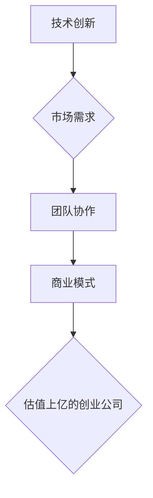

                 

## 如何将Side Project转化为估值上亿的创业公司

> 关键词：Side Project, 创业公司, 技术产品, 市场验证, 团队建设, 融资策略, 产品迭代, 用户增长

### 1. 背景介绍

在当今科技飞速发展的时代，Side Project（兼职项目）已成为许多程序员、设计师和创业者探索新想法、积累经验和实现梦想的重要途径。许多看似不起眼的Side Project最终发展成为估值上亿的创业公司，改变着人们的生活。 

本文将从技术、市场、团队和融资等多个方面，探讨如何将Side Project转化为估值上亿的创业公司，为有志于创业的开发者提供宝贵的经验和指导。

### 2. 核心概念与联系

将Side Project转化为成功的创业公司，需要将技术创新、市场需求、团队协作和商业模式有机结合。

**2.1 核心概念**

* **技术创新:**  Side Project的核心往往源于对现有技术的改进或对新技术的探索。 
* **市场需求:**  成功的创业公司必须解决真实的用户痛点，满足市场需求。
* **团队协作:**  创业是一个需要团队协作的过程，需要集齐各方面的专业人才。
* **商业模式:**  创业公司需要建立可持续的商业模式，确保其盈利能力。

**2.2  联系架构**

### 3. 核心算法原理 & 具体操作步骤

将Side Project转化为成功的创业公司，需要遵循一定的步骤和策略。

**3.1 算法原理概述**

* **市场验证:**  首先，需要对目标市场进行深入调研，验证其需求和规模。
* **产品迭代:**  根据市场反馈，不断迭代产品，提升用户体验。
* **用户增长:**  通过多种渠道，吸引和留住用户，实现用户增长。
* **融资策略:**  根据公司发展阶段，制定合理的融资策略，获取资金支持。

**3.2 算法步骤详解**

1. **确定项目方向:**  选择一个有市场前景、自己感兴趣且有能力开发的项目方向。
2. **进行市场调研:**  了解目标用户的需求、竞争对手情况和市场规模。
3. **开发MVP (最小可行产品):**  快速开发一个具备核心功能的原型，用于验证市场需求。
4. **进行用户测试:**  收集用户反馈，并根据反馈进行产品迭代。
5. **构建团队:**  根据项目需求，组建一支专业的团队。
6. **制定商业模式:**  确定公司盈利模式，例如订阅制、广告收入或付费下载。
7. **寻求融资:**  根据公司发展阶段，寻求天使投资、风投或其他融资方式。
8. **用户增长:**  通过内容营销、社交媒体推广、付费广告等方式，吸引和留住用户。
9. **持续迭代:**  根据市场反馈和用户需求，不断迭代产品，提升用户体验。

**3.3 算法优缺点**

* **优点:**  
    * 灵活性和适应性强，可以根据市场变化进行调整。
    * 风险相对较低，可以先进行小规模测试，再进行大规模推广。
    * 能够快速验证市场需求，降低失败风险。
* **缺点:**  
    * 需要投入大量的时间和精力，需要持续的努力和坚持。
    * 需要具备一定的市场营销和管理能力。
    * 需要克服资金和资源的限制。

**3.4 算法应用领域**

该算法适用于各种类型的Side Project，例如：

* **SaaS 产品:**  提供软件即服务的产品，例如协作工具、客户关系管理系统等。
* **移动应用:**  开发移动应用程序，例如游戏、社交软件、工具类软件等。
* **电商平台:**  搭建电商平台，销售商品或服务。
* **内容平台:**  创建内容平台，例如博客、视频网站、音频平台等。

### 4. 数学模型和公式 & 详细讲解 & 举例说明

在创业过程中，可以使用数学模型和公式来分析和预测市场规模、用户增长、盈利能力等关键指标。

**4.1 数学模型构建**

例如，可以使用**用户增长模型**来预测用户数量的增长趋势。

**4.2 公式推导过程**

用户增长模型通常采用指数增长模型，公式如下：

$$
N(t) = N_0 * e^{rt}
$$

其中：

* $N(t)$ 是时间 $t$ 时刻的用户数量。
* $N_0$ 是初始用户数量。
* $r$ 是用户增长率。
* $t$ 是时间。

**4.3 案例分析与讲解**

假设一个新的社交平台，初始用户数量为 1000 人，用户增长率为 10% per month。

使用上述公式，可以预测该平台的用户数量在未来几个月的增长趋势：

* 第一个月：$N(1) = 1000 * e^{0.1 * 1} = 1105 人$
* 第二个月：$N(2) = 1000 * e^{0.1 * 2} = 1221 人$
* 第三个月：$N(3) = 1000 * e^{0.1 * 3} = 1348 人$

可以看出，用户数量随着时间的推移呈指数增长趋势。

### 5. 项目实践：代码实例和详细解释说明

将Side Project转化为成功的创业公司，需要将技术落地，开发出可用的产品。

**5.1 开发环境搭建**

根据项目需求，选择合适的开发环境，例如：

* **云平台:**  AWS、Azure、GCP 等云平台提供丰富的开发工具和服务。
* **本地开发环境:**  使用虚拟机或容器化技术搭建本地开发环境。

**5.2 源代码详细实现**

具体代码实现取决于项目的类型和技术栈。

**5.3 代码解读与分析**

需要对代码进行详细解读和分析，确保代码的可读性、可维护性和安全性。

**5.4 运行结果展示**

需要对代码进行测试和运行，展示产品的功能和效果。

### 6. 实际应用场景

将Side Project转化为成功的创业公司，需要将其应用于实际场景，解决真实的用户痛点。

**6.1 应用场景分析**

需要分析目标用户的需求，并找到Side Project可以解决的问题。

**6.2 案例分析与讲解**

可以参考一些成功的创业案例，分析其应用场景和用户价值。

**6.3 未来应用展望**

需要展望Side Project的未来应用场景，并探索其发展潜力。

### 7. 工具和资源推荐

在创业过程中，可以使用各种工具和资源来提高效率和降低成本。

**7.1 学习资源推荐**

* **在线课程:**  Coursera、Udemy 等平台提供丰富的创业和技术课程。
* **书籍:**  《零到一》、《创业者万岁》等书籍提供创业经验和指导。
* **博客和论坛:**  关注创业领域的博客和论坛，获取最新的资讯和经验分享。

**7.2 开发工具推荐**

* **代码编辑器:**  VS Code、Sublime Text 等代码编辑器提供强大的代码编写和调试功能。
* **版本控制系统:**  Git 是常用的版本控制系统，可以帮助团队协作开发。
* **项目管理工具:**  Trello、Jira 等项目管理工具可以帮助团队管理任务和进度。

**7.3 相关论文推荐**

* **创业理论:**  Schumpeter's Theory of Innovation、Kirzner's Entrepreneurial Alertness 等论文。
* **技术创新:**  Moore's Law、Network Effects 等理论。

### 8. 总结：未来发展趋势与挑战

将Side Project转化为成功的创业公司是一个充满挑战但也充满机遇的过程。

**8.1 研究成果总结**

* **技术创新:**  人工智能、区块链、云计算等新技术为创业提供了新的机遇。
* **市场需求:**  用户对个性化、定制化、体验化的产品需求不断增长。
* **团队协作:**  远程协作、自动化工具等技术可以提高团队协作效率。

**8.2 未来发展趋势**

* **跨界融合:**  不同领域的知识和技术将更加融合，催生新的创业机会。
* **数据驱动:**  数据分析和机器学习将成为创业的重要工具。
* **全球化:**  互联网的发展将促进全球创业的合作和交流。

**8.3 面临的挑战**

* **竞争激烈:**  创业市场竞争日益激烈，需要不断创新和迭代。
* **资金压力:**  创业公司需要克服资金短缺的挑战。
* **人才缺口:**  优秀的创业团队需要具备多方面的专业技能。

**8.4 研究展望**

未来，需要进一步研究创业的成功因素，探索新的创业模式和商业模式，为创业者提供更有效的指导和支持。

### 9. 附录：常见问题与解答

**9.1 如何验证市场需求？**

可以使用市场调研、用户访谈、A/B 测试等方法验证市场需求。

**9.2 如何组建创业团队？**

需要根据项目需求，寻找具备相关专业技能和经验的人才。

**9.3 如何获得融资？**

可以寻求天使投资、风投、银行贷款等融资方式。

**9.4 如何进行用户增长？**

可以使用内容营销、社交媒体推广、付费广告等方式进行用户增长。

作者：禅与计算机程序设计艺术 / Zen and the Art of Computer Programming 
<end_of_turn>

