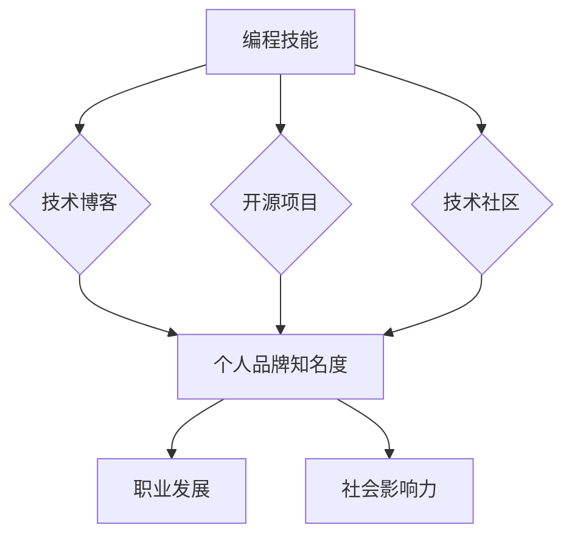

                 

## 如何将编程技能应用于个人品牌建设

> 关键词：编程技能、个人品牌、技术博客、开源贡献、算法、数据分析、网络安全、人工智能、机器学习

### 1. 背景介绍

在当今数字时代，个人品牌建设已成为个人职业发展和社会影响力的关键。对于技术人才而言，拥有扎实的编程技能不仅是获得职业成功的敲门砖，更可以成为打造个人品牌的有力武器。

传统意义上的个人品牌建设往往侧重于社交媒体营销、人脉关系拓展等软性技能。然而，对于程序员而言，他们的技术能力和专业知识是其个人品牌的基石。如何将编程技能转化为个人品牌价值，并将其融入到个人品牌建设的各个环节，是技术人才需要思考的重要问题。

### 2. 核心概念与联系

**2.1 个人品牌与编程技能的关联**

个人品牌是指个人在特定领域或行业内所建立的独特形象和声誉。对于程序员而言，其个人品牌应体现其技术能力、专业知识、解决问题的能力以及个人价值观。编程技能是构建个人品牌的基石，它可以帮助程序员：

* **展示专业能力:** 通过开源项目、技术博客、在线课程等方式展示编程技能，吸引潜在雇主或客户的关注。
* **建立专业声誉:** 参与技术社区、撰写技术文章、分享技术经验，提升个人在技术领域的知名度和影响力。
* **打造个人价值:** 将编程技能应用于解决实际问题，开发创新产品或服务，体现个人价值和社会贡献。

**2.2 构建个人品牌架构**



**2.3 核心概念原理**

个人品牌建设是一个持续积累和提升的过程，需要程序员不断学习新技术、提升自身能力，并将其成果展示给外界。编程技能是个人品牌建设的核心要素，它可以帮助程序员建立专业形象、提升个人价值，最终实现职业发展和社会影响力。

### 3. 核心算法原理 & 具体操作步骤

**3.1 算法原理概述**

个人品牌建设可以看作是一个迭代优化算法，其目标是不断提升个人品牌价值。该算法的核心步骤包括：

* **数据收集:** 收集个人技能、经验、作品等数据。
* **数据分析:** 分析数据，识别个人优势和劣势。
* **策略制定:** 根据数据分析结果，制定个人品牌建设策略。
* **内容创作:** 创建高质量的技术博客文章、开源项目、技术视频等内容。
* **网络推广:** 通过社交媒体、技术社区等平台推广个人品牌。
* **互动交流:** 与技术社区成员互动交流，建立人脉关系。
* **品牌评估:** 定期评估个人品牌价值，并根据结果调整策略。

**3.2 算法步骤详解**

1. **数据收集:** 程序员需要收集自身的技术技能、项目经验、教育背景、个人兴趣爱好等数据。可以使用在线工具、简历模板、社交媒体平台等方式收集数据。
2. **数据分析:** 对收集到的数据进行分析，识别个人优势和劣势。例如，程序员擅长某个特定编程语言或技术领域，可以将其作为个人品牌的突出点。
3. **策略制定:** 根据数据分析结果，制定个人品牌建设策略。例如，程序员可以专注于某个特定技术领域，并通过技术博客、开源项目等方式展示其专业能力。
4. **内容创作:** 创建高质量的技术博客文章、开源项目、技术视频等内容，并将其发布到相关平台。内容应具有实用性、原创性、可读性，并能够吸引目标受众的关注。
5. **网络推广:** 通过社交媒体、技术社区等平台推广个人品牌。可以分享自己的技术博客文章、开源项目，参与技术讨论，与其他程序员建立联系。
6. **互动交流:** 与技术社区成员互动交流，建立人脉关系。可以参加技术会议、线上论坛、开源项目讨论等活动，与其他程序员分享经验、学习新知识。
7. **品牌评估:** 定期评估个人品牌价值，并根据结果调整策略。可以使用网络搜索、社交媒体分析、个人网站流量等指标来评估个人品牌价值。

**3.3 算法优缺点**

* **优点:** 
    * 灵活可控: 程序员可以根据自身情况和目标，灵活调整个人品牌建设策略。
    * 成果可量化: 个人品牌建设成果可以通过网络搜索、社交媒体分析等指标进行量化评估。
    * 持续优化: 个人品牌建设是一个持续迭代的过程，可以通过不断学习、提升和调整策略来不断优化个人品牌价值。
* **缺点:** 
    * 需要投入时间和精力: 个人品牌建设需要程序员持续投入时间和精力，才能取得良好的效果。
    * 竞争激烈: 技术领域竞争激烈，需要程序员不断学习新技术、提升自身能力，才能脱颖而出。
    * 效果难以预测: 个人品牌建设是一个长期过程，其效果难以预测，需要程序员保持耐心和坚持。

**3.4 算法应用领域**

该算法适用于所有希望通过编程技能提升个人品牌价值的技术人才，包括：

* 程序员
* 软件工程师
* 数据科学家
* 机器学习工程师
* 网络安全工程师

### 4. 数学模型和公式 & 详细讲解 & 举例说明

**4.1 数学模型构建**

个人品牌价值可以看作是一个多维度的函数，其输入变量包括个人技能、经验、作品、网络影响力等，输出变量则是个人品牌价值。

**4.2 公式推导过程**

由于个人品牌价值是一个复杂的概念，难以用简单的公式进行精确量化。但我们可以通过一些指标来评估个人品牌价值，例如：

* **网络搜索量:** 使用搜索引擎搜索个人姓名或相关关键词的次数，反映个人知名度。
* **社交媒体粉丝数:** 在社交媒体平台上的粉丝数量，反映个人影响力。
* **技术博客阅读量:** 技术博客文章的阅读量和评论数，反映个人内容质量和受众认可度。
* **开源项目贡献:** 开源项目上的贡献数量和质量，反映个人技术能力和专业水平。

**4.3 案例分析与讲解**

例如，一位程序员在 GitHub 上拥有多个开源项目，并获得了大量星星和贡献者，其网络搜索量和社交媒体粉丝数也较高，可以推断其个人品牌价值较高。

### 5. 项目实践：代码实例和详细解释说明

**5.1 开发环境搭建**

* **操作系统:** Linux/macOS/Windows
* **编程语言:** Python/JavaScript/Java等
* **版本控制系统:** Git
* **代码编辑器:** VS Code/Atom/Sublime Text等

**5.2 源代码详细实现**

以下是一个简单的 Python 代码实例，用于展示个人技术博客文章的发布流程：

```python
import requests

def publish_blog_post(title, content, url):
  """
  发布技术博客文章

  Args:
    title: 文章标题
    content: 文章内容
    url: 博客平台 API 地址
  """
  headers = {'Authorization': 'Bearer your_api_token'}
  data = {
    'title': title,
    'content': content
  }
  response = requests.post(url, headers=headers, json=data)
  if response.status_code == 200:
    print(f'文章 "{title}" 发布成功!')
  else:
    print(f'文章发布失败: {response.text}')

# 示例用法
title = '如何将编程技能应用于个人品牌建设'
content = """
这是一个关于如何将编程技能应用于个人品牌建设的技术博客文章。
"""
url = 'https://api.example.com/blog/posts'
publish_blog_post(title, content, url)
```

**5.3 代码解读与分析**

该代码使用 Python 的 `requests` 库发送 HTTP POST 请求，将博客文章标题和内容发送到博客平台的 API 地址。

* `headers` 字典包含 API 授权 token，用于身份验证。
* `data` 字典包含文章标题和内容。
* `response` 对象包含 API 返回的结果。
* 代码根据 API 返回状态码判断文章是否发布成功。

**5.4 运行结果展示**

如果 API 返回状态码为 200，则表示文章发布成功，程序会打印 "文章 '{title}' 发布成功!" 的信息。否则，程序会打印文章发布失败的错误信息。

### 6. 实际应用场景

**6.1 技术博客**

程序员可以通过技术博客分享自己的编程经验、技术见解、项目案例等，建立个人品牌，吸引潜在雇主或客户的关注。

**6.2 开源项目**

参与开源项目可以帮助程序员提升技术能力、积累经验，并展示其编程技能和团队合作能力。开源项目也是建立个人品牌的重要途径。

**6.3 社区参与**

积极参与技术社区，例如 Stack Overflow、GitHub、Reddit 等，可以帮助程序员建立人脉关系、学习新知识，并提升个人知名度。

**6.4 线上课程**

程序员可以录制和分享自己的编程课程，通过在线平台例如 Udemy、Coursera 等，将自己的知识和经验转化为个人品牌价值。

**6.5 数据分析**

程序员可以利用数据分析技能，分析自身代码库、项目数据等，发现问题、优化代码，并将其成果分享给外界，提升个人品牌价值。

**6.6 网络安全**

程序员可以利用网络安全技能，参与漏洞挖掘、安全测试等活动，并分享自己的经验和见解，建立个人品牌，成为网络安全领域的专家。

**6.7 人工智能**

程序员可以利用人工智能技术，开发创新产品或服务，并将其成果展示给外界，提升个人品牌价值。

**6.8 未来应用展望**

随着技术的不断发展，程序员可以利用更多新兴技术，例如区块链、元宇宙等，打造更具创新性和价值的个人品牌。

### 7. 工具和资源推荐

**7.1 学习资源推荐**

* **在线学习平台:** Coursera、Udemy、edX、Khan Academy
* **技术博客:** Hacker News、Medium、Dev.to
* **开源社区:** GitHub、GitLab、Bitbucket
* **技术书籍:** 《代码的艺术》、《设计模式》、《计算机网络》

**7.2 开发工具推荐**

* **代码编辑器:** VS Code、Atom、Sublime Text
* **版本控制系统:** Git
* **云平台:** AWS、Azure、GCP
* **数据库:** MySQL、PostgreSQL、MongoDB

**7.3 相关论文推荐**

* **个人品牌建设:** "The Impact of Social Media on Personal Branding"
* **编程技能与职业发展:** "The Relationship Between Programming Skills and Career Success"
* **技术社区与个人品牌:** "The Role of Online Communities in Personal Branding"

### 8. 总结：未来发展趋势与挑战

**8.1 研究成果总结**

通过分析个人品牌建设与编程技能的关系，我们可以得出以下结论:

* 编程技能是个人品牌建设的核心要素，可以帮助程序员建立专业形象、提升个人价值。
* 个人品牌建设是一个持续迭代的过程，需要程序员不断学习新技术、提升自身能力，并将其成果展示给外界。
* 随着技术的不断发展，程序员可以利用更多新兴技术，打造更具创新性和价值的个人品牌。

**8.2 未来发展趋势**

* **个性化品牌:** 程序员将更加注重打造个性化的个人品牌，突出自身独特的技能和价值观。
* **跨领域合作:** 程序员将更加积极参与跨领域合作，将编程技能应用于更广泛的领域，例如艺术、设计、教育等。
* **人工智能辅助:** 人工智能将帮助程序员更高效地进行个人品牌建设，例如自动生成内容、分析数据、推荐策略等。

**8.3 面临的挑战**

* **竞争加剧:** 技术领域竞争日益激烈，程序员需要不断学习新技术、提升自身能力，才能脱颖而出。
* **信息爆炸:** 信息爆炸时代，程序员需要更加精准地定位目标受众，并创作更有价值的内容。
* **隐私保护:** 个人品牌建设需要程序员分享自己的信息，因此需要更加重视隐私保护。

**8.4 研究展望**

未来研究可以进一步探讨以下问题:

* 如何量化个人品牌价值?
* 如何利用人工智能辅助程序员进行个人品牌建设?
* 如何在信息爆炸时代，帮助程序员打造更具个性化和价值的个人品牌?


### 9. 附录：常见问题与解答

**9.1 如何选择合适的技术博客平台?**

选择技术博客平台需要考虑以下因素:

* **目标受众:** 不同的平台有不同的用户群体，需要选择与目标受众相符的平台。
* **内容类型:** 不同的平台支持不同的内容类型，例如文字、图片、视频等。
* **功能特性:** 不同的平台提供不同的功能特性，例如评论、点赞、分享等。
* **使用体验:** 选择易于使用、操作便捷的平台。

**9.2 如何提高技术博客文章的阅读量?**

提高技术博客文章的阅读量可以采取以下措施:

* **创作高质量内容:** 文章内容要实用、原创、有价值。
* **优化文章标题:** 标题要吸引眼球，并准确反映文章内容。
* **使用关键词:** 在文章中使用相关关键词，方便用户搜索。
* **推广文章:** 在社交媒体、技术社区等平台推广文章。
* **与读者互动:** 鼓励读者评论、提问，并及时回复。

**9.3 如何参与开源项目?**

参与开源项目可以采取以下步骤:

* **选择合适的项目:** 选择与自身兴趣和技能相符的项目。
* **阅读项目文档:** 了解项目的代码结构、开发规范等。
* **提交代码:** 提交自己的代码修改或新功能。
* **参与讨论:** 在项目论坛或邮件列表中参与讨论，与其他开发者交流。


作者：禅与计算机程序设计艺术 / Zen and the Art of Computer Programming<end_of_turn>

