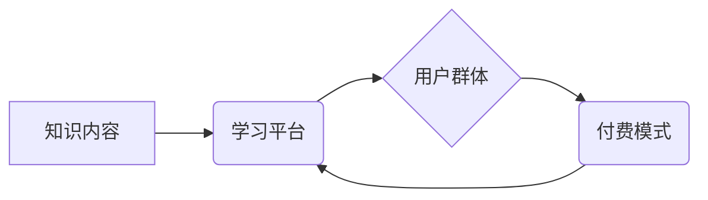

                 

## 如何打造高认可度的程序员知识付费产品

> 关键词：程序员知识付费、课程设计、技术内容、市场定位、用户需求、品牌建设、营销推广

### 1. 背景介绍

近年来，随着互联网技术的快速发展和普及，程序员的需求量持续增长，也催生了蓬勃发展的程序员知识付费市场。程序员们渴望提升技能、拓展知识面，而知识付费平台则为他们提供了一个便捷高效的学习途径。然而，在这个市场竞争日益激烈的环境下，如何打造一款高认可度的程序员知识付费产品，并获得用户的青睐和认可，成为了一个重要的课题。

### 2. 核心概念与联系

**2.1 知识付费产品体系**

知识付费产品体系是指围绕着特定知识领域，通过线上平台提供付费学习内容的商业模式。它通常包含以下几个核心要素：

* **知识内容：** 这是知识付费产品的核心，需要具有专业性、实用性和价值性。
* **学习平台：** 提供学习内容的线上平台，需要具备良好的用户体验、交互功能和技术保障。
* **用户群体：** 针对特定用户群体，例如程序员、设计师、创业者等，提供定制化的学习内容和服务。
* **付费模式：** 包括订阅制、课程购买、会员制等多种模式，根据产品的特点和用户需求选择合适的付费方式。

**2.2 程序员知识付费特点**

程序员知识付费产品具有以下特点：

* **技术性强：** 内容需要深入浅出地讲解技术原理、编程技巧和最佳实践。
* **实用性高：** 学习内容需要能够帮助用户解决实际问题，提升工作效率和竞争力。
* **更新迭代快：** 技术领域发展迅速，知识付费产品需要不断更新内容，保持与时俱进。
* **社区互动性强：** 程序员群体喜欢交流学习，知识付费平台可以提供论坛、讨论组等互动功能，促进用户之间的学习和分享。

**2.3 核心概念关系图**

### 3. 核心算法原理 & 具体操作步骤

**3.1 算法原理概述**

在程序员知识付费产品中，算法原理是核心内容之一。例如，数据结构和算法、机器学习算法、软件工程最佳实践等，都需要深入浅出地讲解算法原理，帮助用户理解算法的逻辑和应用场景。

**3.2 算法步骤详解**

对于每个算法，需要详细讲解其步骤，并使用代码示例进行演示。例如，讲解排序算法时，需要详细描述冒泡排序、插入排序、快速排序等算法的步骤，并提供相应的代码实现。

**3.3 算法优缺点**

需要分析每个算法的优缺点，帮助用户选择适合自己的算法。例如，冒泡排序简单易懂，但效率较低；快速排序效率较高，但时间复杂度不稳定。

**3.4 算法应用领域**

需要介绍每个算法的应用领域，帮助用户理解算法的实际应用价值。例如，快速排序算法广泛应用于数据排序、搜索等场景。

### 4. 数学模型和公式 & 详细讲解 & 举例说明

**4.1 数学模型构建**

在程序员知识付费产品中，数学模型和公式是解释算法原理和性能分析的重要工具。例如，时间复杂度、空间复杂度等概念都需要使用数学模型和公式进行描述。

**4.2 公式推导过程**

需要详细讲解数学模型和公式的推导过程，帮助用户理解公式的含义和应用。例如，时间复杂度的计算公式需要根据算法的执行步骤进行推导。

**4.3 案例分析与讲解**

需要使用实际案例进行分析和讲解，帮助用户理解数学模型和公式在实际应用中的意义。例如，使用不同的排序算法对不同规模的数据进行排序，并分析其时间复杂度和空间复杂度。

### 5. 项目实践：代码实例和详细解释说明

**5.1 开发环境搭建**

需要提供详细的开发环境搭建步骤，帮助用户快速上手。例如，安装编程语言、IDE、开发工具等。

**5.2 源代码详细实现**

需要提供完整的源代码实现，并进行详细的注释和解释。例如，实现一个排序算法的源代码，并注释每个步骤的逻辑和功能。

**5.3 代码解读与分析**

需要对源代码进行解读和分析，帮助用户理解代码的结构、逻辑和功能。例如，分析排序算法的代码，解释其时间复杂度和空间复杂度。

**5.4 运行结果展示**

需要展示代码的运行结果，并进行分析和解释。例如，使用不同的排序算法对不同规模的数据进行排序，并展示其排序时间和结果。

### 6. 实际应用场景

**6.1 应用场景介绍**

需要介绍程序员知识付费产品的实际应用场景，例如，软件开发、数据分析、人工智能等领域。

**6.2 案例分析与讲解**

需要使用实际案例进行分析和讲解，帮助用户理解知识付费产品的价值和应用场景。例如，介绍一个使用排序算法解决实际问题的案例。

**6.3 用户反馈与评价**

需要收集用户反馈和评价，并进行分析和总结，不断改进产品。

**6.4 未来应用展望**

需要展望程序员知识付费产品的未来发展趋势，例如，人工智能、云计算等新技术的应用。

### 7. 工具和资源推荐

**7.1 学习资源推荐**

推荐一些相关的学习资源，例如，书籍、网站、在线课程等。

**7.2 开发工具推荐**

推荐一些常用的开发工具，例如，IDE、版本控制系统、调试工具等。

**7.3 相关论文推荐**

推荐一些相关的学术论文，帮助用户深入了解相关技术。

### 8. 总结：未来发展趋势与挑战

**8.1 研究成果总结**

总结程序员知识付费产品的研究成果，例如，算法原理、应用场景、用户需求等。

**8.2 未来发展趋势**

展望程序员知识付费产品的未来发展趋势，例如，人工智能、云计算、虚拟现实等新技术的应用。

**8.3 面临的挑战**

分析程序员知识付费产品面临的挑战，例如，知识更新速度快、用户需求多样化、市场竞争激烈等。

**8.4 研究展望**

展望未来研究方向，例如，如何更好地满足用户需求、如何提高知识付费产品的质量和效率、如何应对市场竞争等。

### 9. 附录：常见问题与解答

**9.1 常见问题解答**

解答用户可能遇到的常见问题，例如，如何购买课程、如何使用平台、如何联系客服等。

作者：禅与计算机程序设计艺术 / Zen and the Art of Computer Programming 
<end_of_turn>

