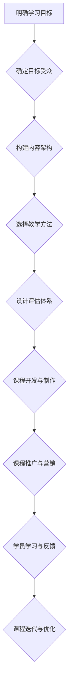

                 

## 如何设计吸引人的知识付费课程大纲

> 关键词：知识付费、课程设计、学习目标、内容架构、教学方法、营销策略、技术趋势

### 1. 背景介绍

知识付费市场近年来蓬勃发展，越来越多的专家学者和技术从业者选择通过线上课程分享知识和技能。然而，在激烈的市场竞争中，如何设计出吸引人的知识付费课程，并获得学员的认可和好评，成为了一个重要的课题。

一个成功的知识付费课程，不仅需要扎实的专业知识和丰富的教学经验，更需要精心设计的课程大纲和教学内容。课程大纲是课程设计的蓝图，它决定了课程的整体结构、学习目标、内容框架和教学方法等关键要素。

### 2. 核心概念与联系

**2.1 课程设计核心概念**

* **学习目标:** 课程设计的第一步是明确课程的学习目标，即学员在完成课程学习后应该能够掌握哪些知识、技能和能力。学习目标应该具体、可衡量、可实现、相关和有时间限制（SMART）。
* **目标受众:** 课程设计需要针对特定的目标受众，了解他们的背景知识、学习需求和学习习惯。
* **内容架构:** 课程内容应该按照逻辑顺序和知识层次进行组织，形成一个清晰的知识体系。
* **教学方法:** 课程设计需要选择合适的教学方法，例如讲授、案例分析、互动练习、项目实践等，以提高学员的学习兴趣和效果。
* **评估体系:** 课程设计需要建立一个有效的评估体系，以评估学员的学习成果和课程的教学效果。

**2.2 课程设计流程图**



### 3. 核心算法原理 & 具体操作步骤

**3.1 算法原理概述**

知识付费课程设计是一个复杂的系统工程，需要结合多种算法和技术手段来实现。其中，内容推荐算法、学习路径规划算法和课程效果评估算法等，是核心算法之一。

* **内容推荐算法:** 基于学员的学习行为、兴趣偏好和知识水平，推荐相关课程内容，提高学员的学习效率和兴趣。
* **学习路径规划算法:** 根据学员的学习目标和知识结构，规划个性化的学习路径，帮助学员高效掌握知识。
* **课程效果评估算法:** 通过分析学员的学习数据，评估课程的教学效果和学员的学习成果，为课程改进提供数据支持。

**3.2 算法步骤详解**

* **内容推荐算法:**
    1. 收集学员的学习行为数据，例如学习时长、点击率、评价等。
    2. 分析学员的兴趣偏好，例如学习主题、课程类型、授课老师等。
    3. 建立学员知识水平模型，例如掌握的知识点、技能等级等。
    4. 基于以上数据，使用协同过滤、内容过滤或混合推荐算法，推荐相关课程内容。
* **学习路径规划算法:**
    1. 建立课程知识图谱，描述课程内容之间的逻辑关系和知识层次。
    2. 根据学员的学习目标和知识结构，分析学员需要学习的知识点。
    3. 基于课程知识图谱，规划个性化的学习路径，推荐学员需要学习的课程和学习顺序。
* **课程效果评估算法:**
    1. 收集学员的学习数据，例如学习进度、考试成绩、反馈意见等。
    2. 使用数据分析和统计方法，评估课程的教学效果和学员的学习成果。
    3. 根据评估结果，提出课程改进建议。

**3.3 算法优缺点**

* **内容推荐算法:**
    * 优点: 可以根据学员的个性化需求推荐课程内容，提高学员的学习兴趣和效率。
    * 缺点: 需要大量的学习数据和算法模型训练，算法效果受数据质量影响较大。
* **学习路径规划算法:**
    * 优点: 可以帮助学员高效掌握知识，避免重复学习和知识盲点。
    * 缺点: 需要建立完善的课程知识图谱，算法效果受知识图谱质量影响较大。
* **课程效果评估算法:**
    * 优点: 可以客观地评估课程的教学效果和学员的学习成果，为课程改进提供数据支持。
    * 缺点: 需要收集和分析大量的学习数据，算法效果受数据质量和评估指标选择影响较大。

**3.4 算法应用领域**

* **在线教育平台:** 内容推荐、学习路径规划、课程效果评估等算法广泛应用于在线教育平台，提高学员的学习体验和学习效果。
* **企业培训:** 企业可以利用这些算法，为员工提供个性化的培训方案，提高员工的技能水平和工作效率。
* **个人学习:** 个人也可以利用这些算法，规划自己的学习路径，提高学习效率。

### 4. 数学模型和公式 & 详细讲解 & 举例说明

**4.1 数学模型构建**

知识付费课程设计中，可以使用数学模型来描述课程内容之间的关系、学员的学习行为和课程效果等。例如，可以使用知识图谱模型来表示课程内容之间的逻辑关系，可以使用贝叶斯网络模型来描述学员的学习行为和知识掌握情况。

**4.2 公式推导过程**

在知识推荐算法中，可以使用协同过滤算法来推荐课程内容。协同过滤算法的基本原理是，根据用户的历史行为数据，预测用户对某个物品的评分或偏好。

协同过滤算法的公式推导过程如下：

* **用户-物品评分矩阵:** 构建一个用户-物品评分矩阵，其中每个元素表示用户对物品的评分。
* **相似度计算:** 计算用户之间的相似度，例如使用余弦相似度或皮尔逊相关系数。
* **推荐算法:** 根据用户之间的相似度和物品的评分信息，预测用户对某个物品的评分或偏好。

**4.3 案例分析与讲解**

假设有一个在线教育平台，包含多个课程和用户。可以使用协同过滤算法来推荐课程给用户。

例如，用户A喜欢学习编程课程，用户B也喜欢学习编程课程，并且用户A和用户B的学习行为数据相似。那么，可以使用协同过滤算法，推荐用户B可能感兴趣的编程课程，即使用户B还没有学习过这些课程。

### 5. 项目实践：代码实例和详细解释说明

**5.1 开发环境搭建**

* **操作系统:** Linux 或 macOS
* **编程语言:** Python
* **开发工具:** Jupyter Notebook 或 VS Code
* **库依赖:** pandas, numpy, scikit-learn

**5.2 源代码详细实现**

```python
import pandas as pd
from sklearn.metrics.pairwise import cosine_similarity

# 加载用户-物品评分矩阵
ratings_data = pd.read_csv('ratings.csv')

# 计算用户之间的相似度
user_similarity = cosine_similarity(ratings_data.T)

# 获取用户A的ID
user_a_id = 1

# 获取用户A喜欢的课程ID
liked_course_ids = ratings_data[ratings_data['user_id'] == user_a_id][ratings_data['rating'] > 3]['course_id'].tolist()

# 推荐给用户A的课程
recommended_course_ids = []
for user_b_id in range(len(user_similarity[user_a_id])):
    if user_b_id != user_a_id:
        similarity_score = user_similarity[user_a_id][user_b_id]
        if similarity_score > 0.8:
            for course_id in ratings_data[ratings_data['user_id'] == user_b_id]['course_id'].tolist():
                if course_id not in liked_course_ids:
                    recommended_course_ids.append(course_id)

# 打印推荐结果
print(f'推荐给用户A的课程ID: {recommended_course_ids}')
```

**5.3 代码解读与分析**

* 该代码首先加载用户-物品评分矩阵，然后计算用户之间的相似度。
* 接着，获取用户A的ID和喜欢的课程ID。
* 最后，根据用户之间的相似度和用户A喜欢的课程ID，推荐给用户A可能感兴趣的课程ID。

**5.4 运行结果展示**

运行该代码后，会输出一个包含推荐课程ID的列表。

### 6. 实际应用场景

**6.1 在线教育平台**

在线教育平台可以利用知识付费课程设计中的算法和技术，为学员提供个性化的学习体验和学习路径。例如，可以根据学员的学习目标和知识水平，推荐相关课程内容，并规划个性化的学习路径。

**6.2 企业培训**

企业可以利用知识付费课程设计中的算法和技术，为员工提供个性化的培训方案，提高员工的技能水平和工作效率。例如，可以根据员工的岗位职责和职业发展目标，推荐相关培训课程，并规划个性化的学习路径。

**6.3 个人学习**

个人也可以利用知识付费课程设计中的算法和技术，规划自己的学习路径，提高学习效率。例如，可以使用知识图谱模型来构建自己的知识体系，并根据自己的学习目标，规划个性化的学习路径。

**6.4 未来应用展望**

随着人工智能技术的不断发展，知识付费课程设计将更加智能化和个性化。未来，我们可以期待以下应用场景：

* **智能化课程推荐:** 利用深度学习算法，更加精准地推荐学员感兴趣的课程内容。
* **个性化学习路径规划:** 基于学员的学习行为和知识结构，更加个性化地规划学习路径。
* **实时学习反馈:** 利用人工智能技术，实时分析学员的学习情况，并提供个性化的学习反馈。
* **虚拟现实和增强现实学习:** 利用虚拟现实和增强现实技术，打造更加沉浸式的学习体验。

### 7. 工具和资源推荐

**7.1 学习资源推荐**

* **在线课程平台:** Coursera, edX, Udemy
* **技术博客:** Towards Data Science, Machine Learning Mastery
* **书籍:**
    * 《深度学习》
    * 《机器学习实战》
    * 《Python编程：从入门到实践》

**7.2 开发工具推荐**

* **编程语言:** Python
* **开发环境:** Jupyter Notebook, VS Code
* **机器学习库:** scikit-learn, TensorFlow, PyTorch

**7.3 相关论文推荐**

* **协同过滤算法:**
    * "Collaborative Filtering: A User-Based Approach"
    * "Item-Based Collaborative Filtering Recommendation Algorithms"
* **知识图谱:**
    * "A Survey on Knowledge Graph Embedding"
    * "Knowledge Graph Completion"

### 8. 总结：未来发展趋势与挑战

**8.1 研究成果总结**

知识付费课程设计是一个不断发展的领域，近年来取得了显著的成果。

* **算法和技术:** 算法和技术不断进步，例如协同过滤算法、知识图谱模型、深度学习算法等，为知识付费课程设计提供了更强大的工具。
* **应用场景:** 知识付费课程设计已广泛应用于在线教育平台、企业培训和个人学习等领域。
* **用户体验:** 知识付费课程设计越来越注重用户体验，例如个性化推荐、互动练习、虚拟现实和增强现实学习等。

**8.2 未来发展趋势**

* **更智能化和个性化:** 利用人工智能技术，更加智能化和个性化地推荐课程内容、规划学习路径和提供学习反馈。
* **更沉浸式的学习体验:** 利用虚拟现实和增强现实技术，打造更加沉浸式的学习体验。
* **更丰富的学习内容:** 开发更加丰富的学习内容，例如视频课程、音频课程、互动练习、项目实践等。

**8.3 面临的挑战**

* **数据质量:** 知识付费课程设计需要大量的数据来训练算法模型，数据质量直接影响算法效果。
* **算法复杂度:** 一些算法模型过于复杂，难以理解和维护。
* **用户隐私:** 知识付费课程设计需要收集用户的学习数据，需要保障用户的隐私安全。

**8.4 研究展望**

未来，知识付费课程设计将继续朝着更智能化、个性化、沉浸式和丰富化的方向发展。

* 研究更有效的算法模型，提高算法的准确性和效率。
* 开发更易于理解和维护的算法模型。
* 研究如何更好地保障用户的隐私安全。


### 9. 附录：常见问题与解答

**9.1 如何选择合适的课程平台？**

选择合适的课程平台需要考虑以下因素：

* **平台的专业性:** 平台是否专注于某个领域的课程？
* **课程质量:** 平台的课程质量如何？是否有权威机构认证？
* **用户评价:** 平台的用户评价如何？
* **价格:** 平台的课程价格是否合理？
* **学习体验:** 平台的学习体验如何？是否提供互动练习、项目实践等功能？

**9.2 如何设计吸引人的课程内容？**

设计吸引人的课程内容需要考虑以下因素：

* **学习目标:** 课程的目标受众是谁？他们想要学习什么知识？
* **内容架构:** 课程内容应该按照逻辑顺序和知识层次进行组织，形成一个清晰的知识体系。
* **教学方法:** 选择合适的教学方法，例如讲授、案例分析、互动练习、项目实践等，以提高学员的学习兴趣和效果。
* **互动性:** 课程应该具有互动性，例如在线问答、论坛讨论、小组项目等，以提高学员的参与度和学习效果。

**9.3 如何评估课程效果？**

评估课程效果需要考虑以下因素：

* **学员的学习成果:** 学员是否掌握了课程内容？
* **学员的学习体验:** 学员对课程的满意度如何？
* **课程的教学效果:** 课程是否达到了预期的教学目标？

可以使用问卷调查、考试成绩、学习数据分析等方法来评估课程效果。


作者：禅与计算机程序设计艺术 / Zen and the Art of Computer Programming 
<end_of_turn>

