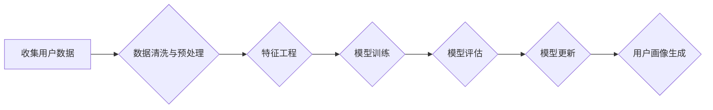

                 

## 如何进行有效的用户画像更新

> 关键词：用户画像、数据分析、机器学习、模型更新、数据驱动、用户行为分析、个性化推荐

## 1. 背景介绍

在当今数据爆炸的时代，用户画像已成为企业了解用户、精准营销、提供个性化服务的关键。用户画像是指通过对用户数据进行分析和挖掘，构建出用户特征、行为、偏好等多维度的描述，从而形成对用户的全面认知。

传统的用户画像往往基于静态数据，如用户基本信息、购买记录等，难以反映用户动态变化的特征。随着互联网技术的不断发展，用户行为数据日益丰富，如何有效更新用户画像，使其更加精准、动态，成为企业亟需解决的问题。

## 2. 核心概念与联系

用户画像更新的核心在于将新数据融入现有模型，并根据数据变化进行模型调整。

**用户画像更新流程:**



**核心概念:**

* **用户数据:** 包括用户基本信息、行为数据、偏好数据等。
* **数据清洗与预处理:** 对用户数据进行格式化、缺失值处理、异常值处理等操作，确保数据质量。
* **特征工程:** 从原始数据中提取有价值的特征，用于模型训练。
* **模型训练:** 使用机器学习算法，训练用户画像模型。
* **模型评估:** 对模型进行评估，衡量模型的准确性和性能。
* **模型更新:** 根据模型评估结果，对模型进行调整和更新。
* **用户画像生成:** 基于更新后的模型，生成用户画像。

## 3. 核心算法原理 & 具体操作步骤

### 3.1  算法原理概述

用户画像更新算法主要基于机器学习技术，常用的算法包括：

* **监督学习:** 利用标记数据训练模型，例如分类算法（如逻辑回归、支持向量机）和回归算法（如线性回归、决策树）。
* **无监督学习:** 利用未标记数据进行聚类分析，例如K-means聚类、层次聚类等。
* **深度学习:** 利用多层神经网络进行特征提取和建模，例如卷积神经网络（CNN）、循环神经网络（RNN）等。

### 3.2  算法步骤详解

**1. 数据收集:** 收集用户数据，包括用户基本信息、行为数据、偏好数据等。

**2. 数据清洗与预处理:** 对用户数据进行格式化、缺失值处理、异常值处理等操作，确保数据质量。

**3. 特征工程:** 从原始数据中提取有价值的特征，例如用户年龄、性别、购买频率、浏览历史、点赞记录等。

**4. 模型选择:** 根据用户画像更新的目标和数据特点，选择合适的机器学习算法。

**5. 模型训练:** 使用训练数据训练模型，并调整模型参数，使模型能够准确预测用户特征和行为。

**6. 模型评估:** 使用测试数据评估模型的准确性和性能，例如准确率、召回率、F1-score等指标。

**7. 模型更新:** 根据模型评估结果，对模型进行调整和更新，例如增加训练数据、调整模型参数、更换模型算法等。

**8. 用户画像生成:** 基于更新后的模型，生成用户画像，并进行可视化展示。

### 3.3  算法优缺点

**监督学习:**

* **优点:** 准确率高，能够学习复杂的关系。
* **缺点:** 需要大量的标记数据，数据标注成本高。

**无监督学习:**

* **优点:** 不需要标记数据，能够发现数据中的潜在结构。
* **缺点:** 准确率相对较低，难以解释模型结果。

**深度学习:**

* **优点:** 能够学习更深层次的特征，准确率高。
* **缺点:** 需要大量的计算资源，模型训练时间长，难以解释模型结果。

### 3.4  算法应用领域

用户画像更新算法广泛应用于以下领域：

* **电商:** 个性化推荐、精准营销、用户分层。
* **社交媒体:** 用户兴趣分析、内容推荐、社区运营。
* **金融:** 风险评估、客户画像、个性化服务。
* **教育:** 学习个性化、学生画像、教学优化。

## 4. 数学模型和公式 & 详细讲解 & 举例说明

### 4.1  数学模型构建

用户画像更新模型通常采用基于概率的模型，例如贝叶斯网络、隐马尔可夫模型等。

**贝叶斯网络:**

贝叶斯网络是一种概率图模型，用于表示变量之间的依赖关系。用户画像更新模型可以利用贝叶斯网络来表示用户特征、行为和偏好之间的关系，并根据新数据更新模型参数。

**隐马尔可夫模型:**

隐马尔可夫模型是一种用于处理序列数据的概率模型，可以用于分析用户行为序列，例如用户浏览历史、购买记录等。用户画像更新模型可以利用隐马尔可夫模型来学习用户行为模式，并根据新数据更新模型参数。

### 4.2  公式推导过程

**贝叶斯定理:**

$$P(A|B) = \frac{P(B|A)P(A)}{P(B)}$$

其中：

* $P(A|B)$ 是事件 A 在事件 B 发生条件下的概率。
* $P(B|A)$ 是事件 B 在事件 A 发生条件下的概率。
* $P(A)$ 是事件 A 的概率。
* $P(B)$ 是事件 B 的概率。

**隐马尔可夫模型状态转移概率:**

$$a_{ij} = P(q_t = j | q_{t-1} = i)$$

其中：

* $a_{ij}$ 是状态 i 到状态 j 的转移概率。
* $q_t$ 是时间 t 的隐藏状态。

**隐马尔可夫模型观测概率:**

$$b_j(o_t) = P(o_t | q_t = j)$$

其中：

* $b_j(o_t)$ 是状态 j 下观测到观测值 $o_t$ 的概率。

### 4.3  案例分析与讲解

**案例:**

假设我们有一个电商平台，想要根据用户的浏览历史和购买记录构建用户画像，并进行个性化推荐。

**分析:**

我们可以使用贝叶斯网络来表示用户特征、浏览历史和购买记录之间的关系。例如，用户年龄、性别、兴趣爱好等特征可以作为节点，浏览历史和购买记录可以作为边。根据用户的浏览历史和购买记录，我们可以更新模型参数，从而提高模型的准确性。

**讲解:**

通过贝叶斯网络，我们可以计算出用户购买特定商品的概率，并根据用户的画像进行个性化推荐。例如，如果用户浏览了大量运动装备，那么我们可以推荐用户购买运动鞋、运动服等商品。

## 5. 项目实践：代码实例和详细解释说明

### 5.1  开发环境搭建

* **操作系统:** Linux/macOS/Windows
* **编程语言:** Python
* **机器学习库:** scikit-learn、TensorFlow、PyTorch
* **数据处理库:** Pandas、NumPy
* **可视化库:** Matplotlib、Seaborn

### 5.2  源代码详细实现

```python
# 导入必要的库
import pandas as pd
from sklearn.model_selection import train_test_split
from sklearn.linear_model import LogisticRegression

# 加载用户数据
data = pd.read_csv('user_data.csv')

# 数据预处理
# ...

# 特征工程
# ...

# 将数据分为训练集和测试集
X_train, X_test, y_train, y_test = train_test_split(X, y, test_size=0.2)

# 训练模型
model = LogisticRegression()
model.fit(X_train, y_train)

# 模型评估
# ...

# 用户画像生成
# ...
```

### 5.3  代码解读与分析

* **数据加载:** 使用 Pandas 库加载用户数据。
* **数据预处理:** 对用户数据进行格式化、缺失值处理、异常值处理等操作。
* **特征工程:** 从原始数据中提取有价值的特征。
* **数据分割:** 将数据分为训练集和测试集，用于模型训练和评估。
* **模型训练:** 使用 LogisticRegression 模型训练用户画像模型。
* **模型评估:** 使用测试数据评估模型的准确性和性能。
* **用户画像生成:** 基于训练好的模型，生成用户画像。

### 5.4  运行结果展示

运行代码后，可以得到用户画像的预测结果，例如用户购买特定商品的概率。

## 6. 实际应用场景

### 6.1  电商平台

* **个性化推荐:** 根据用户的浏览历史、购买记录、兴趣爱好等信息，推荐个性化的商品。
* **精准营销:** 根据用户的画像特征，进行精准的广告投放和营销活动。
* **用户分层:** 将用户分为不同的群体，针对不同的群体进行个性化的服务。

### 6.2  社交媒体平台

* **用户兴趣分析:** 分析用户的兴趣爱好，推荐相关的内容和活动。
* **内容推荐:** 根据用户的浏览历史、点赞记录等信息，推荐相关的文章、视频、图片等内容。
* **社区运营:** 根据用户的画像特征，进行社区运营和用户管理。

### 6.3  金融机构

* **风险评估:** 根据用户的信用记录、交易行为等信息，评估用户的风险等级。
* **客户画像:** 建立用户的画像，了解用户的金融需求和行为模式。
* **个性化服务:** 提供个性化的金融产品和服务。

### 6.4  未来应用展望

随着人工智能技术的不断发展，用户画像更新将更加智能化、个性化。未来，用户画像更新将应用于更多领域，例如医疗、教育、交通等，为用户提供更加精准、个性化的服务。

## 7. 工具和资源推荐

### 7.1  学习资源推荐

* **书籍:**
    * 《Python机器学习》
    * 《深度学习》
    * 《数据挖掘：概念与技术》
* **在线课程:**
    * Coursera
    * edX
    * Udacity

### 7.2  开发工具推荐

* **IDE:** PyCharm、VS Code
* **机器学习库:** scikit-learn、TensorFlow、PyTorch
* **数据处理库:** Pandas、NumPy

### 7.3  相关论文推荐

* **《用户画像构建与应用研究》**
* **《基于深度学习的用户画像构建方法》**
* **《用户画像更新算法研究》**

## 8. 总结：未来发展趋势与挑战

### 8.1  研究成果总结

用户画像更新算法已取得了显著的成果，能够有效地帮助企业了解用户、提供个性化服务。

### 8.2  未来发展趋势

* **更加智能化:** 利用人工智能技术，实现用户画像的自动更新和智能分析。
* **更加个性化:** 根据用户的个性化需求，提供更加精准的个性化服务。
* **更加跨领域:** 将用户画像应用于更多领域，例如医疗、教育、交通等。

### 8.3  面临的挑战

* **数据质量:** 用户数据质量参差不齐，需要进行有效的数据清洗和预处理。
* **模型复杂度:** 用户画像模型越来越复杂，需要更高效的训练和评估方法。
* **隐私保护:** 用户数据隐私保护是一个重要问题，需要采取有效的措施保障用户隐私。

### 8.4  研究展望

未来，用户画像更新研究将继续深入，探索更加智能、个性化、跨领域的应用场景。


## 9. 附录：常见问题与解答

**1. 如何选择合适的用户画像更新算法？**

选择合适的算法需要根据用户的画像更新目标和数据特点进行综合考虑。

**2. 如何进行数据清洗和预处理？**

数据清洗和预处理包括格式化、缺失值处理、异常值处理等操作。

**3. 如何评估用户画像更新模型的性能？**

可以使用准确率、召回率、F1-score等指标评估模型性能。

**4. 如何保障用户数据隐私？**

可以使用数据加密、匿名化等技术保障用户数据隐私。


作者：禅与计算机程序设计艺术 / Zen and the Art of Computer Programming 
<end_of_turn>

