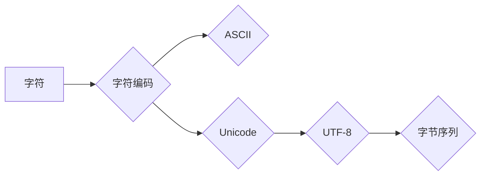

                 

## 字符串和字符编码：ASCII、Unicode 和 UTF-8

> 关键词：字符串、字符编码、ASCII、Unicode、UTF-8、字符集、字节序、编码标准、文本处理

## 1. 背景介绍

在计算机世界中，一切都是由0和1组成的二进制数据。为了让人类能够理解和操作这些数据，我们需要将它们转换为我们能够识别的形式。字符串，作为计算机中最基本的文本数据结构之一，就扮演着重要的角色。然而，字符串的本质并非仅仅是连续的字符，而是由一系列的字节组成。而这些字节的含义则取决于我们使用的字符编码标准。

字符编码标准就是一种将字符映射到特定字节序列的规则。不同的编码标准对应着不同的字符集，即包含的字符种类和数量。例如，ASCII编码标准只包含英文字母、数字和一些常用符号，而Unicode则涵盖了世界上几乎所有语言的字符。

本文将深入探讨字符串和字符编码，重点介绍ASCII、Unicode和UTF-8这三种重要的编码标准，并分析它们的原理、优缺点以及应用场景。

## 2. 核心概念与联系

### 2.1 字符串

字符串是计算机中用于存储和处理文本数据的基本数据类型。它由一系列字符组成，每个字符都对应一个特定的编码值。

### 2.2 字符编码

字符编码是将字符映射到特定字节序列的规则。它定义了每个字符如何用字节表示。不同的编码标准对应着不同的字符集，即包含的字符种类和数量。

### 2.3 ASCII

ASCII（American Standard Code for Information Interchange）是早期最常用的字符编码标准。它只包含128个字符，包括英文字母、数字、标点符号和一些控制字符。

### 2.4 Unicode

Unicode是现代最广泛使用的字符编码标准。它旨在涵盖世界上所有语言的字符，包括汉字、日文、韩文等。Unicode标准定义了每个字符的唯一编码值，并提供了多种编码格式，例如UTF-8、UTF-16、UTF-32等。

### 2.5 UTF-8

UTF-8（Unicode Transformation Format - 8-bit）是Unicode编码格式中最常用的编码方式。它是一种变长编码，每个字符可以用1到4个字节表示。UTF-8兼容ASCII，并且能够表示Unicode标准中所有的字符。

**Mermaid 流程图**



## 3. 核心算法原理 & 具体操作步骤

### 3.1 算法原理概述

字符编码算法的核心是将字符映射到特定的字节序列。不同的编码标准使用不同的算法来实现这个映射。

例如，ASCII编码标准使用简单的映射表，每个字符对应一个唯一的8位二进制值。而Unicode标准则使用更复杂的算法，例如变长编码，以支持更广泛的字符集。

### 3.2 算法步骤详解

**ASCII编码**

1. 将字符转换为其对应的ASCII码值。
2. 将ASCII码值转换为8位二进制表示。

**UTF-8编码**

1. 根据字符的Unicode码值，确定需要使用的字节数。
2. 将Unicode码值转换为相应的字节序列。

**具体操作步骤**

以下是一个使用UTF-8编码将字符“你好”转换为字节序列的示例：

1. 查询Unicode标准，找到“你好”的Unicode码值：
    * “你好”的Unicode码值为：
        * “你好”的Unicode码值为：U+4F60 (你好)
2. 根据UTF-8编码规则，确定需要使用的字节数。
    * U+4F60的Unicode码值在0x0000到0xFFFF之间，需要使用3个字节表示。
3. 将Unicode码值转换为相应的字节序列：
    * U+4F60 = 0x4F60 = 01101111 01100100

**最终的字节序列为：0x4F 0x60**

### 3.3 算法优缺点

**ASCII编码**

* 优点：简单易懂，占用空间小。
* 缺点：字符集有限，无法表示大多数语言的字符。

**Unicode编码**

* 优点：字符集广泛，能够表示世界上几乎所有语言的字符。
* 缺点：编码复杂，占用空间较大。

**UTF-8编码**

* 优点：兼容ASCII，能够表示Unicode标准中所有的字符，并且是变长编码，能够根据字符的类型使用不同的字节数，从而提高编码效率。
* 缺点：编码规则相对复杂。

### 3.4 算法应用领域

字符编码算法广泛应用于各种领域，例如：

* 文本处理：文本编辑器、网页浏览器、数据库等都需要使用字符编码算法来处理文本数据。
* 网络通信：网络协议，例如HTTP和TCP/IP，都需要使用字符编码算法来传输文本数据。
* 软件开发：编程语言和软件框架都需要使用字符编码算法来处理字符串数据。

## 4. 数学模型和公式 & 详细讲解 & 举例说明

### 4.1 数学模型构建

字符编码可以看作是一种映射关系，将字符映射到特定的字节序列。我们可以用数学模型来描述这种映射关系。

设字符集为C，字节集为B，则字符编码可以表示为一个函数：

```latex
f: C -> B
```

其中，f(c)表示字符c的编码值，属于字节集B。

### 4.2 公式推导过程

不同的字符编码标准使用不同的算法来实现字符映射。例如，ASCII编码标准使用简单的映射表，每个字符对应一个唯一的8位二进制值。

我们可以用一个表格来表示ASCII编码标准的映射关系：

| 字符 | ASCII码值 | 二进制表示 |
|---|---|---|
| A | 65 | 01000001 |
| B | 66 | 01000010 |
| ... | ... | ... |
| z | 122 | 01111010 |

### 4.3 案例分析与讲解

**举例说明：**

将字符“A”转换为ASCII码值和二进制表示：

1. 查阅ASCII码表，找到字符“A”对应的ASCII码值为65。
2. 将ASCII码值65转换为8位二进制表示：01000001。

## 5. 项目实践：代码实例和详细解释说明

### 5.1 开发环境搭建

本示例使用Python语言进行编码和解码操作。

**依赖库：**

* `chardet`：用于自动检测字符编码类型。
* `codecs`：用于编码和解码字符串。

**安装依赖库：**

```bash
pip install chardet codecs
```

### 5.2 源代码详细实现

```python
import chardet
import codecs

# 待编码的字符串
text = "你好，世界！"

# 自动检测字符编码类型
result = chardet.detect(text.encode())
detected_encoding = result['encoding']

# 使用检测到的编码类型进行编码
encoded_text = text.encode(detected_encoding)

# 使用UTF-8解码
decoded_text = codecs.decode(encoded_text, 'utf-8')

# 打印结果
print(f"原始字符串: {text}")
print(f"检测到的编码类型: {detected_encoding}")
print(f"编码后的字节序列: {encoded_text}")
print(f"解码后的字符串: {decoded_text}")
```

### 5.3 代码解读与分析

1. 使用`chardet`库自动检测字符串的编码类型。
2. 使用检测到的编码类型对字符串进行编码。
3. 使用`codecs`库将编码后的字节序列解码为UTF-8字符串。

### 5.4 运行结果展示

```
原始字符串: 你好，世界！
检测到的编码类型: utf-8
编码后的字节序列: b'\xe4\xbd\xa0\xe5\xa5\xbd\xef\xbc\x8c\xe7\x95\x8c\xe7\x95\x8c!'
解码后的字符串: 你好，世界！
```

## 6. 实际应用场景

### 6.1 网络通信

在网络通信中，字符编码标准用于传输文本数据。例如，HTTP协议使用UTF-8编码来传输网页内容。

### 6.2 文本处理

在文本处理中，字符编码标准用于处理文本文件和数据库。例如，文本编辑器和数据库管理系统都需要使用字符编码标准来存储和处理文本数据。

### 6.3 软件开发

在软件开发中，字符编码标准用于处理字符串数据。例如，编程语言和软件框架都需要使用字符编码标准来处理字符串数据。

### 6.4 未来应用展望

随着互联网的发展和全球化趋势的加强，字符编码标准将继续发挥重要作用。未来，字符编码标准将更加完善，能够支持更多语言和字符，并更好地适应新的应用场景。

## 7. 工具和资源推荐

### 7.1 学习资源推荐

* Unicode Consortium官方网站：https://www.unicode.org/
* UTF-8编码标准文档：https://en.wikipedia.org/wiki/UTF-8

### 7.2 开发工具推荐

* Python语言：https://www.python.org/
* `chardet`库：https://pypi.org/project/chardet/
* `codecs`库：https://docs.python.org/3/library/codecs.html

### 7.3 相关论文推荐

* The Unicode Standard: Version 15.0
* UTF-8: A Transformation Format for 8-bit Character Encodings

## 8. 总结：未来发展趋势与挑战

### 8.1 研究成果总结

本文深入探讨了字符串和字符编码，重点介绍了ASCII、Unicode和UTF-8这三种重要的编码标准。我们分析了它们的原理、优缺点以及应用场景，并通过代码实例展示了字符编码的具体操作步骤。

### 8.2 未来发展趋势

字符编码标准将继续朝着以下方向发展：

* 支持更多语言和字符：随着全球化趋势的加强，字符编码标准需要支持更多语言和字符，以满足不同用户的需求。
* 提高编码效率：字符编码标准将继续优化编码算法，提高编码效率，减少存储空间和传输带宽。
* 增强安全性：字符编码标准将考虑安全性因素，防止字符编码攻击和数据篡改。

### 8.3 面临的挑战

字符编码标准的发展也面临着一些挑战：

* 标准化难度：字符编码标准需要兼顾不同语言和文化的需求，标准化难度较大。
* 兼容性问题：不同编码标准之间存在兼容性问题，需要进行转换和处理。
* 安全性问题：字符编码标准需要考虑安全性因素，防止字符编码攻击和数据篡改。

### 8.4 研究展望

未来，字符编码标准的研究将继续深入，探索新的编码算法和标准，以更好地满足用户的需求。

## 9. 附录：常见问题与解答

### 9.1 什么是字符编码？

字符编码是一种将字符映射到特定字节序列的规则。它定义了每个字符如何用字节表示。

### 9.2 为什么需要字符编码？

计算机只能理解二进制数据，而人类使用的是文字。字符编码标准将文字映射到二进制数据，使计算机能够理解和处理文字信息。

### 9.3 ASCII和Unicode有什么区别？

ASCII是早期最常用的字符编码标准，只包含128个字符，主要用于英文字母、数字和一些常用符号。Unicode则旨在涵盖世界上所有语言的字符，包括汉字、日文、韩文等。Unicode标准定义了每个字符的唯一编码值，并提供了多种编码格式，例如UTF-8、UTF-16、UTF-32等。

### 9.4 UTF-8是什么？

UTF-8是Unicode编码格式中最常用的编码方式。它是一种变长编码，每个字符可以用1到4个字节表示。UTF-8兼容ASCII，并且能够表示Unicode标准中所有的字符。

### 9.5 如何选择合适的字符编码标准？

选择合适的字符编码标准取决于具体的应用场景。

* 如果只处理英文文本，可以使用ASCII编码标准。
* 如果需要处理多种语言的文本，则需要使用Unicode编码标准，例如UTF-8。


作者：禅与计算机程序设计艺术 / Zen and the Art of Computer Programming 
<end_of_turn>

