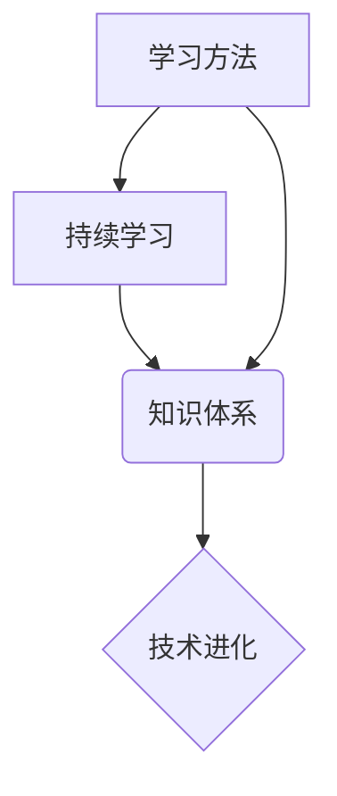

                 

## 学习体系:持续进化的源动力

> 关键词：持续学习、知识体系、学习方法、技术进化、未来趋势

### 1. 背景介绍

在科技日新月异的时代，知识更新的速度令人眼花缭乱。作为一名IT从业者，想要保持竞争力，必须建立一个高效的学习体系，并将其作为持续进化的源动力。传统的学习模式已经无法满足快速发展的技术需求，我们需要探索更灵活、更有效的学习方法，才能在激烈的竞争中脱颖而出。

### 2. 核心概念与联系

**2.1  持续学习**

持续学习是指终身不断学习新知识、新技能、新方法的理念。它强调的是学习是一个持续的过程，而不是一蹴而就的终点。在IT领域，技术迭代速度极快，新技术层出不穷，只有不断学习才能跟上时代的步伐。

**2.2  知识体系**

知识体系是指将知识按照一定的逻辑结构进行组织和排列，形成一个完整的知识网络。一个良好的知识体系可以帮助我们更好地理解和记忆知识，并将其应用到实际工作中。

**2.3  学习方法**

学习方法是指我们学习知识和技能的策略和技巧。不同的学习方法适用于不同的学习内容和学习目标。

**2.4  技术进化**

技术进化是指技术的不断发展和进步。它是一个持续的过程，涉及到各个领域的创新和突破。

**2.5  连接关系**

持续学习是建立知识体系的基础，而知识体系则为技术进化提供支撑。学习方法是实现持续学习和构建知识体系的关键，它决定了我们学习的效率和效果。技术进化则推动着学习内容的更新和迭代，形成一个良性循环。



### 3. 核心算法原理 & 具体操作步骤

**3.1  算法原理概述**

在构建知识体系的过程中，我们可以借鉴一些算法原理，例如：

* **分层结构**: 将知识按照层次结构进行组织，从基础知识到高级知识，层层递进。
* **关联网络**: 将知识点之间建立关联关系，形成一个知识网络。
* **知识图谱**: 使用图形化的方式表示知识，方便理解和检索。

**3.2  算法步骤详解**

1. **知识梳理**: 首先要对自己的知识进行梳理，明确自己的知识储备情况。
2. **知识分类**: 将知识按照一定的分类标准进行分类，例如：编程语言、数据结构、算法、数据库等。
3. **知识关联**: 将不同知识点之间建立关联关系，例如：某个编程语言的语法规则与数据结构的应用场景。
4. **知识结构化**: 将知识按照分层结构或关联网络的方式进行结构化，形成一个完整的知识体系。
5. **知识更新**: 持续学习新知识，并将其融入到知识体系中，保持知识体系的最新状态。

**3.3  算法优缺点**

* **优点**: 可以帮助我们更好地理解和记忆知识，并将其应用到实际工作中。
* **缺点**: 需要花费一定的时间和精力进行知识梳理和结构化。

**3.4  算法应用领域**

* **教育**: 建立学生知识体系，提高学习效率。
* **科研**: 建立研究领域知识体系，促进科研成果的积累和传播。
* **企业**: 建立员工知识体系，提升企业竞争力。

### 4. 数学模型和公式 & 详细讲解 & 举例说明

**4.1  数学模型构建**

我们可以使用图论模型来表示知识体系，其中：

* 节点代表知识点。
* 边代表知识点之间的关联关系。

**4.2  公式推导过程**

我们可以使用度数、路径长度等指标来度量知识体系的复杂度和连通性。

* **度数**: 节点的连接数，表示该知识点与其他知识点的关联程度。
* **路径长度**: 从一个知识点到另一个知识点的最短路径长度，表示两个知识点之间的距离。

**4.3  案例分析与讲解**

例如，我们可以构建一个关于编程语言的知识体系，其中节点代表不同的编程语言，边代表编程语言之间的相似性或依赖关系。我们可以使用度数来衡量每个编程语言的流行程度，使用路径长度来衡量编程语言之间的学习难度。

### 5. 项目实践：代码实例和详细解释说明

**5.1  开发环境搭建**

我们可以使用一些工具来构建知识体系，例如：

* **MindManager**: 用于创建思维导图，可视化知识结构。
* **Notion**: 用于构建笔记和知识库，支持多种格式的知识存储。
* **Obsidian**: 用于构建个人知识库，支持链接和笔记之间的关联。

**5.2  源代码详细实现**

以下是一个使用Python语言构建知识图谱的简单示例：

```python
import networkx as nx

# 创建知识图谱
graph = nx.Graph()

# 添加知识点
graph.add_node("Python")
graph.add_node("Java")
graph.add_node("C++")

# 添加知识点之间的关联关系
graph.add_edge("Python", "Java")
graph.add_edge("Python", "C++")

# 绘制知识图谱
nx.draw(graph, with_labels=True)
plt.show()
```

**5.3  代码解读与分析**

这段代码使用NetworkX库构建了一个简单的知识图谱。首先，我们创建了一个无向图，然后添加了三个知识点：Python、Java和C++。最后，我们添加了知识点之间的关联关系，并使用Matplotlib库绘制了知识图谱。

**5.4  运行结果展示**

运行这段代码后，会生成一个显示Python、Java和C++之间的关系的知识图谱。

### 6. 实际应用场景

**6.1  教育领域**

* **个性化学习**: 根据学生的知识水平和学习目标，构建个性化的知识体系，提供定制化的学习内容。
* **知识导航**: 为学生提供知识导航，帮助他们更好地理解和记忆知识。
* **学习评估**: 通过评估学生的知识体系结构，了解学生的学习情况，并及时提供反馈。

**6.2  企业领域**

* **知识管理**: 建立企业知识库，方便员工查找和共享知识。
* **人才培养**: 为员工提供知识体系建设的培训，提升员工的专业技能和知识水平。
* **创新驱动**: 通过知识体系的构建和分析，发现新的技术趋势和创新机会。

**6.3  科研领域**

* **文献综述**: 自动构建文献综述，帮助研究人员快速了解某个领域的最新研究成果。
* **知识发现**: 通过分析知识体系中的关联关系，发现新的知识和研究方向。
* **科研合作**: 建立科研人员之间的知识共享平台，促进科研合作和成果共享。

**6.4  未来应用展望**

随着人工智能技术的不断发展，知识体系的构建和应用将更加智能化和个性化。未来，我们可以期待：

* **自动知识构建**: 利用人工智能技术自动构建知识体系，减少人工成本。
* **智能知识推荐**: 根据用户的学习目标和兴趣，智能推荐相关的知识内容。
* **沉浸式学习体验**: 利用虚拟现实和增强现实技术，提供更加沉浸式的学习体验。

### 7. 工具和资源推荐

**7.1  学习资源推荐**

* **Coursera**: 提供各种在线课程，涵盖计算机科学、数据科学、人工智能等领域。
* **edX**: 提供来自世界知名大学的在线课程，涵盖各种学科。
* **Udacity**: 提供以项目为中心的在线课程，专注于技术领域。

**7.2  开发工具推荐**

* **Python**: 广泛应用于数据科学、机器学习、人工智能等领域。
* **Java**: 广泛应用于企业级软件开发、移动应用开发等领域。
* **C++**: 广泛应用于游戏开发、高性能计算等领域。

**7.3  相关论文推荐**

* **Knowledge Graph Embedding: A Survey**
* **A Survey on Knowledge Graph Construction**
* **Deep Learning for Knowledge Graph Completion**

### 8. 总结：未来发展趋势与挑战

**8.1  研究成果总结**

在持续学习和知识体系构建方面，我们取得了显著的成果。人工智能技术的发展为知识体系的构建和应用提供了新的可能性。

**8.2  未来发展趋势**

未来，知识体系将更加智能化、个性化和沉浸式。人工智能技术将进一步推动知识体系的构建和应用，为我们提供更加高效的学习和工作体验。

**8.3  面临的挑战**

* **知识的动态性**: 知识在不断更新变化，如何构建一个能够适应动态变化的知识体系是一个挑战。
* **知识的复杂性**: 知识体系的构建需要考虑知识之间的关联关系和层次结构，这对于算法设计和实现提出了挑战。
* **知识的共享**: 如何有效地共享和传播知识，是知识体系构建和应用的关键问题。

**8.4  研究展望**

未来，我们需要继续探索新的算法和技术，以构建更加智能、高效和可扩展的知识体系。同时，我们需要关注知识共享和传播问题，促进知识的流动和应用。

### 9. 附录：常见问题与解答

**9.1  如何构建一个有效的知识体系？**

构建一个有效的知识体系需要遵循以下步骤：

1. **明确学习目标**: 确定自己想要学习的内容和目标。
2. **知识梳理**: 对自己的知识进行梳理，明确自己的知识储备情况。
3. **知识分类**: 将知识按照一定的分类标准进行分类。
4. **知识关联**: 将不同知识点之间建立关联关系。
5. **知识结构化**: 将知识按照分层结构或关联网络的方式进行结构化。
6. **知识更新**: 持续学习新知识，并将其融入到知识体系中。

**9.2  如何使用工具构建知识体系？**

可以使用MindManager、Notion、Obsidian等工具来构建知识体系。这些工具提供各种功能，可以帮助我们创建思维导图、笔记、知识库等。

**9.3  如何保持知识体系的最新状态？**

需要持续学习新知识，并将其融入到知识体系中。可以订阅行业资讯、参加培训课程、阅读专业书籍等方式来获取新知识。


作者：禅与计算机程序设计艺术 / Zen and the Art of Computer Programming 
<end_of_turn>

