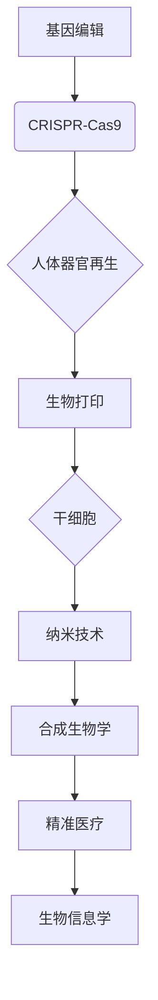

                 

## 2050年的生物技术：从基因编辑到人体器官再生的医学革命

> 关键词：基因编辑、CRISPR、人体器官再生、生物打印、干细胞、纳米技术、合成生物学、精准医疗、生物信息学

### 1. 背景介绍

21世纪初，生物技术领域经历了前所未有的飞速发展。基因组测序技术的突破、CRISPR-Cas9基因编辑技术的出现以及干细胞研究的进展，为我们开启了全新的医学时代。这些技术不仅改变了我们对生命本质的理解，也为治疗人类疾病提供了前所未有的可能性。

展望2050年，生物技术将继续以惊人的速度发展，深刻地改变我们的生活方式，尤其是医疗保健领域。基因编辑将不再局限于实验室，而是成为日常医疗实践的一部分。人体器官再生技术将从理论走向现实，解决器官移植的供需矛盾。精准医疗将成为主流，根据个体基因信息制定个性化治疗方案。

### 2. 核心概念与联系

**2.1  基因编辑**

基因编辑是指对生物基因组进行精确的修改，包括插入、删除、替换或沉默特定基因。CRISPR-Cas9技术作为一种革命性的基因编辑工具，凭借其高效、精准、可编程的特点，迅速成为该领域的明星技术。

**2.2  人体器官再生**

人体器官再生是指利用生物技术手段，在体外构建完整的、功能性的人体器官，用于移植替代受损或衰竭的器官。

**2.3  生物打印**

生物打印是一种利用3D打印技术，将生物材料层层堆叠，构建复杂生物结构的技术。它可以用于制造人工组织、器官模型以及最终用于器官移植的人工器官。

**2.4  干细胞**

干细胞是一种具有自我更新和分化潜能的细胞，可以分化为各种类型的细胞，例如肌肉细胞、神经细胞和肝细胞。干细胞在人体器官再生中扮演着至关重要的角色。

**2.5  纳米技术**

纳米技术是指对物质进行微观控制，利用纳米尺度的材料和设备进行研究和应用。纳米技术可以用于构建生物材料、递送药物以及操控细胞。

**2.6  合成生物学**

合成生物学是指利用工程学原理，设计和构建新的生物系统或改造现有生物系统。它可以用于生产药物、生物燃料以及其他有价值的生物产品。

**2.7  精准医疗**

精准医疗是指根据个体的基因信息、生活方式和环境因素，制定个性化的诊断、治疗和预防方案。

**2.8  生物信息学**

生物信息学是指利用计算机科学和统计学方法，分析和处理生物数据。它为基因组测序、基因编辑和器官再生等领域提供了重要的技术支持。

**核心概念与联系流程图**

### 3. 核心算法原理 & 具体操作步骤

**3.1  算法原理概述**

CRISPR-Cas9基因编辑技术的核心原理是利用细菌自身的免疫系统来识别和切割目标DNA序列。CRISPR（Clustered Regularly Interspaced Short Palindromic Repeats）是一种存在于细菌基因组中的重复序列，它可以记录入侵病毒的DNA片段。Cas9是一种核酸酶，可以根据CRISPR序列的指导，切割目标DNA序列。

**3.2  算法步骤详解**

1. **设计gRNA:** 首先需要设计一个gRNA（guide RNA）分子，它与目标DNA序列具有互补性。gRNA分子由两个部分组成：一个CRISPR序列和一个20个核苷酸的靶向序列。
2. **构建Cas9-gRNA复合物:** 将Cas9蛋白与gRNA分子结合，形成Cas9-gRNA复合物。
3. **识别和切割目标DNA:** Cas9-gRNA复合物进入细胞核，根据gRNA的指导，识别并切割目标DNA序列。
4. **修复DNA断裂:** 细胞自身的DNA修复机制会修复切割后的DNA断裂。可以通过引入模板DNA，引导细胞进行精确的基因编辑。

**3.3  算法优缺点**

**优点:**

* 高效：CRISPR-Cas9基因编辑技术具有很高的效率，可以精确地切割目标DNA序列。
* 精准：CRISPR-Cas9基因编辑技术可以精确地编辑目标基因，避免对其他基因造成影响。
* 可编程：CRISPR-Cas9基因编辑技术可以根据需要设计不同的gRNA分子，编辑不同的基因。

**缺点:**

* 潜在的脱靶效应：CRISPR-Cas9基因编辑技术可能会不经意地切割非目标DNA序列，导致脱靶效应。
* 伦理争议：CRISPR-Cas9基因编辑技术可以用于编辑人类胚胎基因，引发了伦理争议。

**3.4  算法应用领域**

CRISPR-Cas9基因编辑技术在医学、农业、生物能源等领域都有广泛的应用前景。

* **医学:** 用于治疗遗传性疾病、癌症、传染病等。
* **农业:** 用于提高作物产量、抗病性、耐旱性等。
* **生物能源:** 用于生产生物燃料、生物塑料等。

### 4. 数学模型和公式 & 详细讲解 & 举例说明

**4.1  数学模型构建**

CRISPR-Cas9基因编辑效率可以被数学模型描述，例如：

$$
Efficiency = \frac{Number \ of \ successful \ edits}{Total \ number \ of \ cells}
$$

其中，成功编辑的数量取决于gRNA设计、Cas9表达水平、DNA修复机制等因素。

**4.2  公式推导过程**

该公式的推导过程涉及统计学和概率论，可以根据实验数据进行拟合和优化。

**4.3  案例分析与讲解**

例如，研究人员通过改变gRNA序列长度和核苷酸组成，观察其对CRISPR-Cas9基因编辑效率的影响。通过实验数据分析，可以建立数学模型，预测不同gRNA序列的编辑效率。

### 5. 项目实践：代码实例和详细解释说明

**5.1  开发环境搭建**

CRISPR-Cas9基因编辑技术的开发环境通常包括：

* **生物信息学软件:** 用于gRNA设计、序列比对、数据分析等。
* **基因编辑工具:** 用于将Cas9蛋白和gRNA分子导入细胞。
* **细胞培养设备:** 用于培养和处理细胞。

**5.2  源代码详细实现**

CRISPR-Cas9基因编辑技术的源代码通常由多个模块组成，例如：

* **gRNA设计模块:** 根据目标基因序列设计gRNA分子。
* **Cas9表达模块:** 将Cas9蛋白表达载体导入细胞。
* **DNA修复模块:** 引入模板DNA，引导细胞进行精确的基因编辑。

**5.3  代码解读与分析**

源代码的解读和分析需要结合生物信息学知识和编程经验。

**5.4  运行结果展示**

CRISPR-Cas9基因编辑技术的运行结果通常通过基因测序、蛋白质表达分析等方法进行评估。

### 6. 实际应用场景

**6.1  遗传性疾病治疗**

CRISPR-Cas9基因编辑技术可以用于治疗遗传性疾病，例如囊性纤维化、镰状细胞贫血、亨廷顿舞蹈症等。

**6.2  癌症治疗**

CRISPR-Cas9基因编辑技术可以用于增强免疫细胞的杀伤能力，提高癌症治疗效果。

**6.3  传染病治疗**

CRISPR-Cas9基因编辑技术可以用于开发新的抗病毒药物和疫苗。

**6.4  未来应用展望**

未来，CRISPR-Cas9基因编辑技术将应用于更多领域，例如：

* **器官移植:** 利用CRISPR-Cas9基因编辑技术，改造动物器官，使其能够移植到人类体内。
* **农业:** 利用CRISPR-Cas9基因编辑技术，提高作物产量、抗病性、耐旱性等。
* **生物能源:** 利用CRISPR-Cas9基因编辑技术，生产生物燃料、生物塑料等。

### 7. 工具和资源推荐

**7.1  学习资源推荐**

* **CRISPR-Cas9基因编辑技术入门指南:** https://www.nature.com/articles/nmeth.3905
* **CRISPR-Cas9基因编辑技术在线课程:** https://www.coursera.org/learn/crispr-cas9

**7.2  开发工具推荐**

* **CRISPR Design Tool:** https://crispr.mit.edu/
* **Benchling:** https://www.benchling.com/

**7.3  相关论文推荐**

* **A Programmable Dual-RNA-Guided DNA Endonuclease in Adaptive Bacterial Immunity:** https://www.science.org/doi/10.1126/science.1240959
* **CRISPR-Cas9: A Tool for Genome Editing:** https://www.ncbi.nlm.nih.gov/pmc/articles/PMC4023517/

### 8. 总结：未来发展趋势与挑战

**8.1  研究成果总结**

CRISPR-Cas9基因编辑技术在短短几年内取得了惊人的进展，为医学、农业、生物能源等领域带来了前所未有的机遇。

**8.2  未来发展趋势**

未来，CRISPR-Cas9基因编辑技术将朝着以下方向发展：

* **提高编辑效率和精准度:** 开发新的gRNA设计策略、Cas9变体以及DNA修复机制，提高编辑效率和精准度。
* **扩展编辑范围:** 开发能够编辑更大基因组片段的基因编辑工具。
* **实现体内基因编辑:** 开发能够在体内进行基因编辑的递送系统和技术。

**8.3  面临的挑战**

CRISPR-Cas9基因编辑技术也面临着一些挑战：

* **脱靶效应:** 降低脱靶效应是CRISPR-Cas9基因编辑技术的关键挑战。
* **伦理争议:** 人类胚胎基因编辑引发了伦理争议，需要谨慎对待。
* **监管问题:** CRISPR-Cas9基因编辑技术的应用需要完善的监管制度。

**8.4  研究展望**

尽管面临挑战，CRISPR-Cas9基因编辑技术仍然是生物技术领域最具潜力的技术之一。未来，随着技术的不断发展和完善，CRISPR-Cas9基因编辑技术将为人类健康、农业生产和环境保护带来革命性的改变。

### 9. 附录：常见问题与解答

**9.1  CRISPR-Cas9基因编辑技术安全吗？**

CRISPR-Cas9基因编辑技术在应用前需要进行严格的安全性评估。目前，CRISPR-Cas9基因编辑技术在治疗遗传性疾病方面已经取得了一些进展，但仍需要进一步研究和完善。

**9.2  CRISPR-Cas9基因编辑技术会改变人类基因吗？**

CRISPR-Cas9基因编辑技术可以用于编辑人类基因，但目前主要应用于治疗遗传性疾病。人类胚胎基因编辑引发了伦理争议，需要谨慎对待。

**9.3  CRISPR-Cas9基因编辑技术会对环境造成影响吗？**

CRISPR-Cas9基因编辑技术在农业应用方面可能会对环境造成影响，例如基因流失。需要进行风险评估和管理。

作者：禅与计算机程序设计艺术 / Zen and the Art of Computer Programming 
<end_of_turn>

