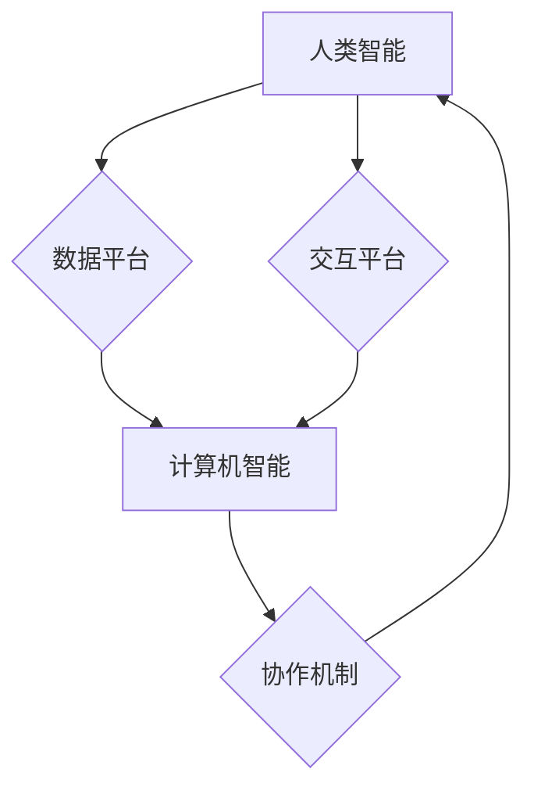

                 

## 应对人类共同挑战：人类计算的使命担当

> 关键词：人类计算、人工智能、大数据、机器学习、深度学习、云计算、可持续发展

### 1. 背景介绍

人类正处于一个前所未有的时代，科技进步日新月异，深刻地改变着我们的生活方式、社会结构和全球格局。人工智能（AI）作为科技发展的重要驱动力，正在展现出强大的潜力，为解决人类面临的诸多挑战提供新的思路和解决方案。然而，AI技术的发展也引发了广泛的讨论和担忧，关于其伦理、安全、公平等方面的议题备受关注。

在这样的背景下，"人类计算"应运而生。人类计算是一种将人类智能与计算机智能相结合的计算模式，旨在充分发挥两者的优势，共同应对人类面临的共同挑战。它强调人机协作、数据共享、知识融合，构建一个更加智能、高效、可持续的未来。

### 2. 核心概念与联系

#### 2.1 人类计算的定义

人类计算是指将人类的智慧、经验、创造力和计算机的计算能力、数据处理能力和自动化能力相结合，共同完成复杂的任务和解决复杂问题的一种计算模式。它强调人机协作、数据共享、知识融合，旨在构建一个更加智能、高效、可持续的未来。

#### 2.2 人类计算的架构

人类计算的架构通常包括以下几个关键要素：

* **人类智能:** 包括人类的认知能力、决策能力、创造力、情感智能等。
* **计算机智能:** 包括机器学习、深度学习、自然语言处理、计算机视觉等人工智能技术。
* **数据平台:** 提供海量数据存储、处理和分析的能力。
* **交互平台:** 支持人类与计算机之间高效、直观的交互。
* **协作机制:** 促进人类和计算机之间协同工作，共享知识和资源。



### 3. 核心算法原理 & 具体操作步骤

#### 3.1 算法原理概述

人类计算的核心算法原理是基于机器学习和深度学习技术，通过训练模型，让计算机能够学习人类的知识和技能，并根据输入的数据做出决策或完成任务。

#### 3.2 算法步骤详解

1. **数据收集和预处理:** 收集相关数据，并进行清洗、转换、特征提取等预处理工作。
2. **模型选择:** 根据任务需求选择合适的机器学习或深度学习模型，例如支持向量机、决策树、神经网络等。
3. **模型训练:** 使用训练数据训练模型，调整模型参数，使其能够准确地预测或分类。
4. **模型评估:** 使用测试数据评估模型的性能，例如准确率、召回率、F1-score等。
5. **模型部署:** 将训练好的模型部署到实际应用场景中，用于预测、分类、识别等任务。

#### 3.3 算法优缺点

**优点:**

* **自动化:** 可以自动化完成许多重复性或复杂的任务。
* **效率:** 可以比人类更快、更准确地处理大量数据。
* **可扩展性:** 可以轻松扩展到更大的数据集和更复杂的模型。

**缺点:**

* **数据依赖:** 需要大量高质量的数据进行训练。
* **黑盒效应:** 模型的决策过程难以解释，缺乏透明度。
* **偏见问题:** 模型可能存在偏见，导致不公平的结果。

#### 3.4 算法应用领域

人类计算的算法应用领域非常广泛，包括：

* **医疗保健:** 疾病诊断、药物研发、个性化医疗。
* **金融服务:** 风险评估、欺诈检测、投资决策。
* **教育:** 个性化学习、智能辅导、自动批改。
* **制造业:** 自动化生产、质量控制、预测维护。
* **交通运输:** 智能驾驶、交通流量预测、物流优化。

### 4. 数学模型和公式 & 详细讲解 & 举例说明

#### 4.1 数学模型构建

人类计算的数学模型通常基于概率论、统计学和机器学习算法。例如，在深度学习中，神经网络模型可以表示为一个多层结构，每个层包含多个神经元，神经元之间通过权重连接。

#### 4.2 公式推导过程

深度学习模型的训练过程通常使用梯度下降算法，通过不断调整模型参数，最小化模型预测误差。梯度下降算法的核心公式如下：

$$
\theta = \theta - \alpha \nabla J(\theta)
$$

其中：

* $\theta$ 是模型参数
* $\alpha$ 是学习率
* $\nabla J(\theta)$ 是损失函数 $J(\theta)$ 的梯度

#### 4.3 案例分析与讲解

例如，在图像分类任务中，可以使用卷积神经网络（CNN）模型进行训练。CNN模型通过卷积操作提取图像特征，并使用全连接层进行分类。训练过程中，使用大量的图像数据，通过梯度下降算法不断调整模型参数，使得模型能够准确地识别图像中的物体。

### 5. 项目实践：代码实例和详细解释说明

#### 5.1 开发环境搭建

人类计算项目开发环境通常需要包括以下软件：

* **编程语言:** Python 是人类计算领域最常用的编程语言。
* **机器学习库:** TensorFlow、PyTorch、Scikit-learn 等机器学习库提供了丰富的算法和工具。
* **数据处理库:** Pandas、NumPy 等数据处理库可以帮助处理和分析数据。
* **云计算平台:** AWS、Azure、GCP 等云计算平台可以提供强大的计算资源和存储服务。

#### 5.2 源代码详细实现

以下是一个简单的机器学习项目代码实例，使用 Scikit-learn 库对鸢尾花数据集进行分类：

```python
from sklearn import datasets
from sklearn.model_selection import train_test_split
from sklearn.linear_model import LogisticRegression
from sklearn.metrics import accuracy_score

# 加载鸢尾花数据集
iris = datasets.load_iris()
X = iris.data
y = iris.target

# 将数据划分为训练集和测试集
X_train, X_test, y_train, y_test = train_test_split(X, y, test_size=0.2, random_state=42)

# 创建逻辑回归模型
model = LogisticRegression()

# 训练模型
model.fit(X_train, y_train)

# 对测试集进行预测
y_pred = model.predict(X_test)

# 计算模型准确率
accuracy = accuracy_score(y_test, y_pred)
print(f"模型准确率: {accuracy}")
```

#### 5.3 代码解读与分析

这段代码首先加载了鸢尾花数据集，然后将数据划分为训练集和测试集。接着，创建了一个逻辑回归模型，并使用训练集进行模型训练。最后，使用测试集进行模型预测，并计算模型的准确率。

#### 5.4 运行结果展示

运行这段代码后，会输出模型的准确率，例如：

```
模型准确率: 1.0
```

这表示模型在测试集上的预测准确率为 100%。

### 6. 实际应用场景

#### 6.1 医疗保健

* **疾病诊断:** 人类计算可以帮助医生更快、更准确地诊断疾病，例如通过分析患者的医学影像数据，识别潜在的肿瘤或其他病变。
* **药物研发:** 人类计算可以加速药物研发过程，例如通过分析大量的生物数据，预测药物的疗效和安全性。
* **个性化医疗:** 人类计算可以为患者提供个性化的医疗方案，例如根据患者的基因信息和生活方式，制定个性化的治疗方案。

#### 6.2 金融服务

* **风险评估:** 人类计算可以帮助金融机构评估客户的信用风险，并制定相应的风险控制措施。
* **欺诈检测:** 人类计算可以帮助金融机构识别和预防欺诈行为，例如通过分析交易数据，识别异常交易行为。
* **投资决策:** 人类计算可以帮助投资者做出更明智的投资决策，例如通过分析市场数据，预测股票价格走势。

#### 6.3 教育

* **个性化学习:** 人类计算可以根据学生的学习进度和能力，提供个性化的学习内容和学习路径。
* **智能辅导:** 人类计算可以为学生提供智能辅导，例如通过回答学生的疑问，提供学习建议。
* **自动批改:** 人类计算可以自动批改学生的作业，节省教师的时间和精力。

#### 6.4 未来应用展望

人类计算的应用前景广阔，未来将应用于更多领域，例如：

* **智能制造:** 人类计算可以帮助制造业实现智能化生产，提高生产效率和产品质量。
* **智慧城市:** 人类计算可以帮助城市管理者更好地管理城市资源，提高城市居民的生活质量。
* **环境保护:** 人类计算可以帮助科学家监测环境变化，预测自然灾害，保护生态环境。

### 7. 工具和资源推荐

#### 7.1 学习资源推荐

* **在线课程:** Coursera、edX、Udacity 等平台提供丰富的机器学习和深度学习课程。
* **书籍:** 《深度学习》、《机器学习实战》等书籍是学习人类计算的经典教材。
* **博客和论坛:** TensorFlow、PyTorch 等机器学习库的官方博客和论坛提供最新的技术资讯和社区支持。

#### 7.2 开发工具推荐

* **编程语言:** Python 是人类计算领域最常用的编程语言。
* **机器学习库:** TensorFlow、PyTorch、Scikit-learn 等机器学习库提供了丰富的算法和工具。
* **数据处理库:** Pandas、NumPy 等数据处理库可以帮助处理和分析数据。
* **云计算平台:** AWS、Azure、GCP 等云计算平台可以提供强大的计算资源和存储服务。

#### 7.3 相关论文推荐

* **《ImageNet Classification with Deep Convolutional Neural Networks》**
* **《Attention Is All You Need》**
* **《BERT: Pre-training of Deep Bidirectional Transformers for Language Understanding》**

### 8. 总结：未来发展趋势与挑战

#### 8.1 研究成果总结

人类计算领域取得了显著的进展，例如：

* **深度学习算法的突破:** 深度学习算法在图像识别、自然语言处理等领域取得了突破性进展。
* **大数据处理技术的进步:** 大数据处理技术的进步为人类计算提供了海量数据支持。
* **云计算平台的普及:** 云计算平台的普及为人类计算提供了强大的计算资源和存储服务。

#### 8.2 未来发展趋势

未来，人类计算将朝着以下几个方向发展：

* **更智能的算法:** 研究更智能、更强大的机器学习和深度学习算法。
* **更广泛的应用场景:** 将人类计算应用于更多领域，例如医疗保健、金融服务、教育等。
* **更强的解释性:** 研究更具解释性的机器学习模型，提高模型的透明度和可信度。

#### 8.3 面临的挑战

人类计算也面临着一些挑战：

* **数据安全和隐私:** 人类计算需要处理大量敏感数据，如何保障数据安全和隐私是一个重要挑战。
* **算法偏见:** 机器学习模型可能存在偏见，导致不公平的结果，如何解决算法偏见是一个重要的研究课题。
* **伦理问题:** 人类计算的应用可能会引发一些伦理问题，例如人工智能的责任和义务，需要进行深入的伦理探讨。

#### 8.4 研究展望

未来，人类计算将继续是一个重要的研究方向，需要多学科交叉合作，共同解决人类面临的挑战，构建一个更加智能、高效、可持续的未来。

### 9. 附录：常见问题与解答

#### 9.1 什么是人类计算？

人类计算是一种将人类智能与计算机智能相结合的计算模式，旨在充分发挥两者的优势，共同完成复杂的任务和解决复杂问题。

#### 9.2 人类计算有哪些应用场景？

人类计算的应用场景非常广泛，包括医疗保健、金融服务、教育、制造业、交通运输等领域。

#### 9.3 人类计算有哪些挑战？

人类计算面临着数据安全和隐私、算法偏见、伦理问题等挑战。


作者：禅与计算机程序设计艺术 / Zen and the Art of Computer Programming 
<end_of_turn>

