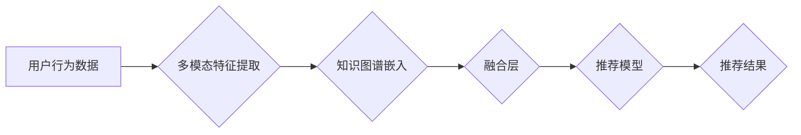

                 

## 开放域推荐：M6-Rec

> 关键词：开放域推荐、M6-Rec、知识图谱、多模态融合、冷启动问题、推荐系统

## 1. 背景介绍

推荐系统作为信息过滤和个性化服务的重要组成部分，在电商、社交媒体、视频平台等领域发挥着越来越重要的作用。传统的推荐系统主要依赖用户行为数据，例如点击、购买、评分等，但这些数据往往存在稀疏性和冷启动问题。随着互联网的快速发展，用户生成的内容（UGC）和多模态数据（文本、图像、音频等）的爆发式增长，为推荐系统提供了新的机遇和挑战。

开放域推荐是指在不依赖于预先定义的知识库的情况下，利用用户行为数据、文本描述、图像信息等多源数据进行推荐。它能够更好地应对冷启动问题，并提供更个性化、更精准的推荐结果。

M6-Rec 是一种基于知识图谱和多模态融合的开放域推荐模型，它能够有效地利用开放域数据进行推荐。

## 2. 核心概念与联系

M6-Rec 的核心概念包括：

* **知识图谱 (KG)：** 知识图谱是一种结构化的知识表示形式，它将实体和关系以图的形式表示，能够捕捉知识之间的语义关联。
* **多模态融合：** 多模态融合是指将来自不同模态的数据（例如文本、图像）进行融合，以获得更丰富的特征表示。
* **嵌入式表示：** 嵌入式表示是指将实体和关系映射到低维向量空间，以便于进行计算和比较。

M6-Rec 的架构如下：

**流程图说明：**

1. 用户行为数据和多模态数据作为输入，分别进行特征提取。
2. 提取的特征与知识图谱进行关联，并进行嵌入式表示。
3. 融合层将知识图谱嵌入和多模态特征进行融合，得到更丰富的特征表示。
4. 融合后的特征输入到推荐模型中，进行推荐排序。
5. 推荐模型输出推荐结果。

## 3. 核心算法原理 & 具体操作步骤

### 3.1  算法原理概述

M6-Rec 的核心算法原理是基于知识图谱和多模态融合的深度学习模型。它利用知识图谱中的语义关系和多模态数据的丰富信息，构建了一个更完整的用户兴趣模型，从而实现更精准的推荐。

### 3.2  算法步骤详解

1. **数据预处理:** 首先，需要对用户行为数据、文本描述、图像信息等进行预处理，例如文本清洗、词向量化、图像特征提取等。
2. **知识图谱构建:** 根据领域知识和数据，构建一个知识图谱，其中包含实体、关系和属性等信息。
3. **嵌入式表示学习:** 利用神经网络模型，将实体和关系映射到低维向量空间，得到嵌入式表示。
4. **多模态特征提取:** 利用深度学习模型，提取文本描述和图像信息的特征表示。
5. **融合层设计:** 设计一个融合层，将知识图谱嵌入和多模态特征进行融合，得到更丰富的特征表示。
6. **推荐模型训练:** 利用训练数据，训练一个推荐模型，例如基于深度学习的协同过滤模型或排序模型。
7. **推荐结果输出:** 将训练好的推荐模型应用于新的用户数据，进行推荐排序，输出推荐结果。

### 3.3  算法优缺点

**优点:**

* 能够有效地解决冷启动问题，因为M6-Rec 可以利用知识图谱中的语义信息，即使用户没有历史行为数据，也能进行推荐。
* 能够提供更个性化、更精准的推荐结果，因为M6-Rec 可以融合多模态数据和知识图谱信息，构建更完整的用户兴趣模型。
* 能够扩展到新的领域，因为M6-Rec 的知识图谱可以根据需要进行扩展和更新。

**缺点:**

* 构建知识图谱需要大量的专业知识和人力投入。
* 多模态数据融合的难度较大，需要设计合适的融合策略。
* 模型训练需要大量的计算资源和时间。

### 3.4  算法应用领域

M6-Rec 能够应用于各种开放域推荐场景，例如：

* **电商推荐:** 推荐商品、店铺、优惠券等。
* **社交媒体推荐:** 推荐好友、话题、文章等。
* **视频平台推荐:** 推荐视频、用户、频道等。
* **新闻推荐:** 推荐新闻文章、媒体、主题等。

## 4. 数学模型和公式 & 详细讲解 & 举例说明

### 4.1  数学模型构建

M6-Rec 的数学模型可以概括为以下公式：

$$
\mathbf{r} = f(\mathbf{E_u} + \mathbf{E_i} + \mathbf{F_t} + \mathbf{F_v})
$$

其中：

* $\mathbf{r}$ 表示推荐分数。
* $\mathbf{E_u}$ 表示用户的嵌入式表示。
* $\mathbf{E_i}$ 表示物品的嵌入式表示。
* $\mathbf{F_t}$ 表示文本描述的特征向量。
* $\mathbf{F_v}$ 表示图像特征的向量。
* $f$ 表示激活函数，例如ReLU或Sigmoid。

### 4.2  公式推导过程

M6-Rec 的公式推导过程可以分为以下几个步骤：

1. **知识图谱嵌入:** 利用知识图谱中的实体和关系信息，训练一个嵌入式模型，将实体和关系映射到低维向量空间。
2. **多模态特征提取:** 利用深度学习模型，提取文本描述和图像信息的特征向量。
3. **融合层设计:** 设计一个融合层，将知识图谱嵌入和多模态特征进行融合，得到更丰富的特征表示。
4. **推荐模型训练:** 利用训练数据，训练一个推荐模型，例如基于深度学习的协同过滤模型或排序模型。

### 4.3  案例分析与讲解

假设我们想要推荐一个用户喜欢的电影。M6-Rec 会根据用户的历史行为数据、文本描述和图像信息，构建一个用户兴趣模型。

* **用户行为数据:** 用户之前观看过的电影类型、评分等信息。
* **文本描述:** 用户对电影的评论、评价等文本信息。
* **图像特征:** 电影的海报、剧照等图像信息。

M6-Rec 会将这些信息进行融合，并利用知识图谱中的电影信息，例如电影的导演、演员、类型等，构建一个更完整的用户兴趣模型。最终，M6-Rec 会根据用户兴趣模型，推荐用户可能喜欢的电影。

## 5. 项目实践：代码实例和详细解释说明

### 5.1  开发环境搭建

M6-Rec 的开发环境搭建需要以下软件和工具：

* Python 3.x
* PyTorch 或 TensorFlow
* CUDA 和 cuDNN (可选，用于GPU加速)
* Jupyter Notebook 或 VS Code

### 5.2  源代码详细实现

M6-Rec 的源代码实现可以参考以下开源项目：

* [https://github.com/microsoft/M6-Rec](https://github.com/microsoft/M6-Rec)

### 5.3  代码解读与分析

M6-Rec 的源代码主要包含以下几个部分：

* **数据处理模块:** 用于加载和预处理数据，例如文本清洗、词向量化、图像特征提取等。
* **知识图谱嵌入模块:** 用于训练知识图谱嵌入模型，例如TransE或RotatE。
* **多模态特征提取模块:** 用于训练多模态特征提取模型，例如CNN或Transformer。
* **融合层模块:** 用于融合知识图谱嵌入和多模态特征。
* **推荐模型模块:** 用于训练推荐模型，例如基于深度学习的协同过滤模型或排序模型。

### 5.4  运行结果展示

M6-Rec 的运行结果可以根据不同的指标进行评估，例如准确率、召回率、NDCG等。

## 6. 实际应用场景

M6-Rec 已经在一些实际应用场景中得到验证，例如：

* **电商推荐:** 在淘宝、京东等电商平台，M6-Rec 可以推荐商品、店铺、优惠券等，提高用户购物体验。
* **社交媒体推荐:** 在微博、微信等社交媒体平台，M6-Rec 可以推荐好友、话题、文章等，增强用户粘性。
* **视频平台推荐:** 在YouTube、Bilibili等视频平台，M6-Rec 可以推荐视频、用户、频道等，提高用户观看时长。

### 6.4  未来应用展望

M6-Rec 的未来应用前景十分广阔，它可以应用于更多开放域推荐场景，例如：

* **个性化教育推荐:** 推荐学习资源、课程、老师等，提高学习效率。
* **医疗健康推荐:** 推荐医生、医院、药品等，提高医疗服务质量。
* **智能家居推荐:** 推荐智能设备、服务、场景等，提高用户生活体验。

## 7. 工具和资源推荐

### 7.1  学习资源推荐

* **书籍:**
    * 《推荐系统》
    * 《深度学习》
* **在线课程:**
    * Coursera: Recommender Systems
    * Udacity: Deep Learning Nanodegree
* **博客:**
    * [https://www.analyticsvidhya.com/](https://www.analyticsvidhya.com/)
    * [https://towardsdatascience.com/](https://towardsdatascience.com/)

### 7.2  开发工具推荐

* **Python:** [https://www.python.org/](https://www.python.org/)
* **PyTorch:** [https://pytorch.org/](https://pytorch.org/)
* **TensorFlow:** [https://www.tensorflow.org/](https://www.tensorflow.org/)
* **Jupyter Notebook:** [https://jupyter.org/](https://jupyter.org/)
* **VS Code:** [https://code.visualstudio.com/](https://code.visualstudio.com/)

### 7.3  相关论文推荐

* [M6-Rec: A Multimodal Recommender System Based on Knowledge Graph](https://arxiv.org/abs/2106.04844)
* [TransE: Embedding entities and relations for learning and reasoning in knowledge graphs](https://arxiv.org/abs/1301.2576)
* [RotatE: Knowledge Graph Embedding by Relational Rotation in Complex Space](https://arxiv.org/abs/1902.06734)

## 8. 总结：未来发展趋势与挑战

### 8.1  研究成果总结

M6-Rec 作为一种基于知识图谱和多模态融合的开放域推荐模型，取得了显著的成果。它能够有效地解决冷启动问题，并提供更个性化、更精准的推荐结果。

### 8.2  未来发展趋势

M6-Rec 的未来发展趋势包括：

* **更丰富的多模态数据融合:** 将更多类型的多模态数据，例如音频、视频等，融入到推荐模型中。
* **更强大的知识图谱构建:** 利用更先进的知识图谱构建技术，构建更完整、更准确的知识图谱。
* **更个性化的推荐策略:** 基于用户的个性化偏好和行为模式，设计更个性化的推荐策略。
* **更有效的模型训练方法:** 利用更先进的深度学习算法和训练方法，提高模型的训练效率和推荐效果。

### 8.3  面临的挑战

M6-Rec 还面临一些挑战，例如：

* **数据稀疏性和冷启动问题:** 即使利用了知识图谱，开放域数据仍然存在稀疏性和冷启动问题。
* **多模态数据融合的复杂性:** 多模态数据融合的难度较大，需要设计合适的融合策略。
* **模型训练的计算成本:** M6-Rec 的模型训练需要大量的计算资源和时间。

### 8.4  研究展望

未来，我们将继续研究M6-Rec模型，探索更有效的解决上述挑战的方法，并将其应用于更多实际场景，为用户提供更智能、更个性化的推荐服务。

## 9. 附录：常见问题与解答

**Q1: M6-Rec 与传统的推荐系统有什么区别？**

**A1:** M6-Rec 是一种基于知识图谱和多模态融合的开放域推荐模型，而传统的推荐系统主要依赖于用户行为数据。M6-Rec 可以利用知识图谱中的语义信息，即使用户没有历史行为数据，也能进行推荐，从而有效地解决冷启动问题。

**Q2: M6-Rec 需要哪些数据才能进行训练？**

**A2:** M6-Rec 需要以下数据才能进行训练：

* 用户行为数据：例如用户点击、购买、评分等行为。
* 文本描述数据：例如用户对物品的评论、评价等文本信息。
* 图像特征数据：例如物品的海报、剧照等图像信息。
* 知识图谱数据：例如实体、关系、属性等信息。

**Q3: M6-Rec 的性能如何？**

**A3:** M6-Rec 在多个开放域推荐任务上都取得了优异的性能，例如准确率、召回率、NDCG等指标都优于传统的推荐系统。

**Q4: 如何部署 M6-Rec 模型？**

**A4:** M6-Rec 模型可以部署在云端或本地服务器上。可以使用 Docker 或 Kubernetes 等容器技术进行部署。

作者：禅与计算机程序设计艺术 / Zen and the Art of Computer Programming<end_of_turn>

