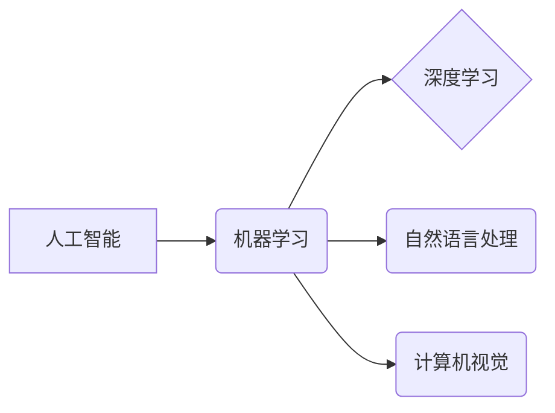

                 

## 快速学习：9个月掌握一门新专业

> 关键词：人工智能、机器学习、深度学习、编程、软件架构、快速学习、专业技能

### 1. 背景介绍

在当今瞬息万变的科技时代，掌握一门新专业已成为个人成长和职业发展的关键。然而，传统学习模式往往耗时冗长，难以满足快速迭代的需求。如何高效地学习新技能，并在短时间内达到专业水平，成为众多人关注的焦点。

本文将探讨一种快速学习新专业的有效方法，并以人工智能领域为例，详细阐述其核心概念、算法原理、实践操作以及未来发展趋势。

### 2. 核心概念与联系

人工智能 (AI) 是一门跨学科领域，涵盖了计算机科学、数学、统计学、心理学等多个领域。其核心目标是构建能够模拟人类智能的机器系统。

**AI 的核心概念包括：**

* **机器学习 (ML):** 允许机器从数据中学习，并根据学习到的知识进行预测或决策。
* **深度学习 (DL):** 一种基于多层神经网络的机器学习方法，能够学习更复杂的模式和特征。
* **自然语言处理 (NLP):** 使计算机能够理解和处理人类语言。
* **计算机视觉 (CV):** 赋予计算机“看”的能力，使其能够识别、理解和分析图像和视频。

**AI 领域的核心概念之间的关系可通过以下流程图表示：**



### 3. 核心算法原理 & 具体操作步骤

#### 3.1  算法原理概述

深度学习算法的核心是多层神经网络。神经网络由多个相互连接的神经元组成，每个神经元接收输入信号，对其进行处理，并输出处理后的信号。通过调整神经元之间的连接权重，深度学习模型能够学习数据中的复杂模式和特征。

#### 3.2  算法步骤详解

深度学习算法的训练过程通常包括以下步骤：

1. **数据预处理:** 将原始数据转换为深度学习模型可以理解的格式。
2. **模型构建:** 设计和构建多层神经网络模型。
3. **模型训练:** 使用训练数据训练模型，调整神经元之间的连接权重。
4. **模型评估:** 使用测试数据评估模型的性能。
5. **模型调优:** 根据评估结果调整模型参数，提高模型性能。

#### 3.3  算法优缺点

**优点:**

* 能够学习复杂模式和特征。
* 性能优于传统机器学习算法。
* 在图像识别、语音识别、自然语言处理等领域取得了突破性进展。

**缺点:**

* 训练数据量大，计算资源需求高。
* 模型解释性差，难以理解模型的决策过程。
* 容易过拟合，模型泛化能力差。

#### 3.4  算法应用领域

深度学习算法已广泛应用于各个领域，包括：

* **图像识别:** 人脸识别、物体检测、图像分类。
* **语音识别:** 语音转文本、语音助手。
* **自然语言处理:** 机器翻译、文本摘要、情感分析。
* **医疗诊断:** 疾病预测、图像分析。
* **金融分析:** 风险评估、欺诈检测。

### 4. 数学模型和公式 & 详细讲解 & 举例说明

#### 4.1  数学模型构建

深度学习模型的核心是多层神经网络，其数学模型可以表示为：

$$
y = f(W^L x^L + b^L)
$$

其中：

* $y$ 是模型输出。
* $x^L$ 是第 $L$ 层的输入。
* $W^L$ 是第 $L$ 层的权重矩阵。
* $b^L$ 是第 $L$ 层的偏置向量。
* $f$ 是激活函数。

#### 4.2  公式推导过程

深度学习模型的训练过程是通过反向传播算法来进行的。反向传播算法的核心思想是：

1. 计算模型输出与真实值的误差。
2. 根据误差反向传播，更新各层神经元的权重和偏置。

反向传播算法的具体推导过程涉及到梯度下降法、链式法则等数学概念。

#### 4.3  案例分析与讲解

以图像分类为例，假设我们有一个包含猫和狗的图像数据集。深度学习模型可以学习到猫和狗的特征，并根据这些特征对新的图像进行分类。

训练过程中，模型会不断调整权重和偏置，使得模型输出与真实标签的误差最小化。

### 5. 项目实践：代码实例和详细解释说明

#### 5.1  开发环境搭建

为了进行深度学习项目实践，需要搭建相应的开发环境。常用的开发环境包括：

* **Python:** 深度学习的编程语言。
* **TensorFlow/PyTorch:** 深度学习框架。
* **GPU:** 加速深度学习训练的硬件。

#### 5.2  源代码详细实现

以下是一个使用 TensorFlow 实现图像分类的简单代码示例：

```python
import tensorflow as tf

# 定义模型结构
model = tf.keras.models.Sequential([
    tf.keras.layers.Conv2D(32, (3, 3), activation='relu', input_shape=(28, 28, 1)),
    tf.keras.layers.MaxPooling2D((2, 2)),
    tf.keras.layers.Conv2D(64, (3, 3), activation='relu'),
    tf.keras.layers.MaxPooling2D((2, 2)),
    tf.keras.layers.Flatten(),
    tf.keras.layers.Dense(10, activation='softmax')
])

# 编译模型
model.compile(optimizer='adam',
              loss='sparse_categorical_crossentropy',
              metrics=['accuracy'])

# 训练模型
model.fit(x_train, y_train, epochs=5)

# 评估模型
loss, accuracy = model.evaluate(x_test, y_test)
print('Test loss:', loss)
print('Test accuracy:', accuracy)
```

#### 5.3  代码解读与分析

这段代码定义了一个简单的卷积神经网络模型，用于图像分类。模型包含两层卷积层、两层最大池化层、一层全连接层和一层输出层。

模型使用 Adam 优化器、交叉熵损失函数和准确率作为评估指标。

#### 5.4  运行结果展示

训练完成后，模型可以对新的图像进行分类。

### 6. 实际应用场景

深度学习算法已广泛应用于各个领域，例如：

* **医疗诊断:** 深度学习模型可以辅助医生诊断疾病，例如癌症、糖尿病等。
* **金融风险评估:** 深度学习模型可以分析金融数据，识别潜在的风险。
* **自动驾驶:** 深度学习模型可以帮助车辆识别道路环境、预测其他车辆的行为。

### 6.4  未来应用展望

未来，深度学习算法将在更多领域得到应用，例如：

* **个性化教育:** 深度学习模型可以根据学生的学习情况提供个性化的学习方案。
* **智能客服:** 深度学习模型可以帮助企业提供更智能、更便捷的客服服务。
* **科学研究:** 深度学习模型可以加速科学研究，例如药物研发、材料科学等。

### 7. 工具和资源推荐

#### 7.1  学习资源推荐

* **在线课程:** Coursera、edX、Udacity 等平台提供丰富的深度学习课程。
* **书籍:** 《深度学习》、《动手学深度学习》等书籍是深度学习学习的经典教材。
* **博客和论坛:** TensorFlow、PyTorch 等框架的官方博客和论坛提供大量学习资源和技术支持。

#### 7.2  开发工具推荐

* **TensorFlow:** Google 开发的开源深度学习框架。
* **PyTorch:** Facebook 开发的开源深度学习框架。
* **Keras:** TensorFlow 上的深度学习 API，易于使用。

#### 7.3  相关论文推荐

* **AlexNet:** ImageNet Large Scale Visual Recognition Challenge 2012 冠军论文。
* **VGGNet:** 深度卷积神经网络架构论文。
* **ResNet:** 残差网络架构论文。

### 8. 总结：未来发展趋势与挑战

#### 8.1  研究成果总结

近年来，深度学习取得了显著进展，在图像识别、语音识别、自然语言处理等领域取得了突破性成果。

#### 8.2  未来发展趋势

未来，深度学习的发展趋势包括：

* **模型更深、更复杂:** 研究更深层次、更复杂的深度学习模型。
* **数据更丰富、更多样:** 探索更多数据类型和数据来源，例如文本、音频、视频等。
* **算法更高效、更鲁棒:** 研究更有效的训练算法和更鲁棒的模型。

#### 8.3  面临的挑战

深度学习也面临一些挑战，例如：

* **数据标注问题:** 深度学习模型需要大量的标注数据，数据标注成本高昂。
* **模型解释性问题:** 深度学习模型的决策过程难以解释，缺乏透明度。
* **伦理问题:** 深度学习技术可能带来一些伦理问题，例如算法偏见、隐私泄露等。

#### 8.4  研究展望

未来，需要继续深入研究深度学习算法、模型和应用，解决上述挑战，推动深度学习技术向更安全、更可靠、更普惠的方向发展。

### 9. 附录：常见问题与解答

**Q1: 如何选择合适的深度学习框架？**

**A1:** TensorFlow 和 PyTorch 是目前最流行的深度学习框架， TensorFlow 更适合于生产环境，PyTorch 更灵活，更容易上手。

**Q2: 如何处理深度学习模型过拟合问题？**

**A2:** 可以使用正则化技术、 dropout 技术、数据增强等方法来缓解过拟合问题。

**Q3: 如何评估深度学习模型的性能？**

**A3:** 可以使用准确率、召回率、F1-score 等指标来评估模型的性能。

作者：禅与计算机程序设计艺术 / Zen and the Art of Computer Programming


<end_of_turn>

