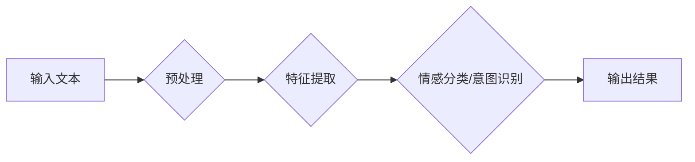

                 

## 情感分析：AI理解用户意图的新维度

> 关键词：情感分析、自然语言处理、机器学习、深度学习、文本分类、意图识别、用户体验

## 1. 背景介绍

在当今数据爆炸的时代，文本数据已成为企业和研究机构的重要资产。如何从海量文本数据中提取有价值的信息，并洞察用户的情感和意图，已成为一个关键问题。情感分析（Sentiment Analysis），也称为意见挖掘（Opinion Mining），正是旨在解决这一问题的技术领域。它通过分析文本中的情感倾向，识别用户对特定主题、产品、服务或事件的正面、负面或中立态度，从而帮助我们理解用户真实想法和需求。

情感分析技术在各个领域都有广泛的应用，例如：

* **市场营销:** 了解消费者对产品和品牌的评价，改进营销策略，提升客户满意度。
* **社交媒体监测:** 分析用户对品牌、产品和事件的舆情，及时发现潜在危机，进行危机公关。
* **客户服务:** 自动识别客户反馈中的情感倾向，提供更精准的客户服务，提升客户体验。
* **金融领域:** 分析市场情绪，预测股票价格走势，降低投资风险。
* **政治分析:** 了解公众对政治人物和政策的看法，为政治决策提供参考。

随着人工智能技术的快速发展，情感分析技术也取得了长足进步。传统的基于规则的方法逐渐被机器学习和深度学习算法所取代，这些算法能够从海量文本数据中学习情感表达模式，并实现更准确、更智能的情感分析。

## 2. 核心概念与联系

情感分析的核心概念包括：

* **情感极性:** 指文本表达的情感倾向，通常分为正面、负面和中立三类。
* **情感强度:** 指文本表达的情感程度，例如，"喜欢" 和 "非常喜欢" 的情感强度不同。
* **情感分类:** 将文本根据情感极性进行分类，例如，将评论分为正面、负面和中立。
* **意图识别:** 分析文本背后的用户意图，例如，用户是想表达赞赏、抱怨还是寻求帮助。

**情感分析流程图:**



## 3. 核心算法原理 & 具体操作步骤

### 3.1  算法原理概述

情感分析算法主要分为以下几类：

* **基于规则的方法:** 基于人工定义的情感词典和语法规则，对文本进行情感分析。这种方法简单易实现，但难以处理复杂的情感表达和语境变化。
* **基于机器学习的方法:** 利用机器学习算法，从训练数据中学习情感表达模式，并对新文本进行情感分类。常见的机器学习算法包括支持向量机（SVM）、朴素贝叶斯（Naive Bayes）、决策树（Decision Tree）和随机森林（Random Forest）。
* **基于深度学习的方法:** 利用深度神经网络，例如循环神经网络（RNN）和卷积神经网络（CNN），对文本进行情感分析。深度学习算法能够学习更复杂的文本表示，并取得更高的准确率。

### 3.2  算法步骤详解

以基于机器学习的文本分类算法为例，其具体操作步骤如下：

1. **数据收集和预处理:** 收集包含情感标签的文本数据，并进行预处理，例如，去除停用词、标点符号、HTML标签等。
2. **特征提取:** 将文本转换为机器可理解的特征向量，例如，使用词袋模型（Bag-of-Words）、TF-IDF或Word2Vec等方法。
3. **模型训练:** 选择合适的机器学习算法，并使用训练数据对模型进行训练，学习情感表达模式。
4. **模型评估:** 使用测试数据评估模型的性能，例如，计算准确率、召回率和F1-score等指标。
5. **模型部署:** 将训练好的模型部署到实际应用场景中，对新文本进行情感分类。

### 3.3  算法优缺点

**基于规则的方法:**

* **优点:** 简单易实现，能够处理一些简单的文本情感分析任务。
* **缺点:** 难以处理复杂的情感表达和语境变化，准确率较低。

**基于机器学习的方法:**

* **优点:** 能够学习更复杂的文本表示，准确率较高。
* **缺点:** 需要大量的训练数据，训练时间较长。

**基于深度学习的方法:**

* **优点:** 能够学习更深层的文本表示，准确率更高。
* **缺点:** 需要更强大的计算资源，训练时间更长。

### 3.4  算法应用领域

情感分析算法广泛应用于以下领域：

* **市场营销:** 产品评价分析、品牌形象监测、广告效果评估。
* **社交媒体监测:** 用户情绪分析、舆情预警、品牌危机管理。
* **客户服务:** 客户反馈分析、问题分类、智能客服。
* **金融领域:** 市场情绪分析、股票预测、风险评估。
* **政治分析:** 公众舆情分析、选举预测、政策评估。

## 4. 数学模型和公式 & 详细讲解 & 举例说明

### 4.1  数学模型构建

情感分析算法通常使用概率模型来表示情感分类的可能性。例如，朴素贝叶斯算法假设每个特征独立地对情感分类产生影响，可以使用以下公式计算文本属于某一情感类别的概率：

$$P(C|D) = \frac{P(D|C)P(C)}{P(D)}$$

其中：

* $P(C|D)$ 是文本 $D$ 属于情感类别 $C$ 的概率。
* $P(D|C)$ 是给定情感类别 $C$ 时，文本 $D$ 的概率。
* $P(C)$ 是情感类别 $C$ 的先验概率。
* $P(D)$ 是文本 $D$ 的概率。

### 4.2  公式推导过程

朴素贝叶斯算法的推导过程基于贝叶斯定理和特征独立性假设。

* **贝叶斯定理:**

$$P(A|B) = \frac{P(B|A)P(A)}{P(B)}$$

* **特征独立性假设:**

$$P(D|C) = \prod_{i=1}^{n} P(d_i|C)$$

其中 $d_i$ 是文本 $D$ 中的第 $i$ 个特征。

将上述公式代入贝叶斯定理，即可得到朴素贝叶斯算法的公式。

### 4.3  案例分析与讲解

假设我们有一个情感分类任务，需要判断文本属于正面、负面或中立情感。我们可以使用朴素贝叶斯算法进行训练，并根据训练好的模型对新文本进行分类。

例如，训练数据包含以下文本和情感标签：

* 文本 1: "这部电影太棒了！"，情感标签: 正面
* 文本 2: "这首歌听起来很糟糕。"，情感标签: 负面
* 文本 3: "天气今天不错。"，情感标签: 中立

我们可以使用这些数据训练朴素贝叶斯模型，并根据模型的预测结果，对新文本进行情感分类。

## 5. 项目实践：代码实例和详细解释说明

### 5.1  开发环境搭建

情感分析项目可以使用 Python 语言进行开发。需要安装以下库：

* NLTK: 自然语言处理库
* Scikit-learn: 机器学习库
* TensorFlow 或 PyTorch: 深度学习库

### 5.2  源代码详细实现

以下是一个使用 Scikit-learn 库进行文本分类的 Python 代码示例：

```python
import nltk
from sklearn.feature_extraction.text import TfidfVectorizer
from sklearn.naive_bayes import MultinomialNB
from sklearn.model_selection import train_test_split

# 数据集
texts = [
    "这部电影太棒了！",
    "这首歌听起来很糟糕。",
    "天气今天不错。",
    "我非常喜欢这本书。",
    "这个服务很糟糕。"
]
labels = ["正面", "负面", "中立", "正面", "负面"]

# 数据预处理
nltk.download('stopwords')
stop_words = nltk.corpus.stopwords.words('english')
texts = [
    " ".join([word for word in nltk.word_tokenize(text) if word.lower() not in stop_words])
    for text in texts
]

# 特征提取
vectorizer = TfidfVectorizer()
features = vectorizer.fit_transform(texts)

# 模型训练
model = MultinomialNB()
X_train, X_test, y_train, y_test = train_test_split(features, labels, test_size=0.2)
model.fit(X_train, y_train)

# 模型评估
accuracy = model.score(X_test, y_test)
print(f"模型准确率: {accuracy}")

# 新文本分类
new_text = "这部电影很不错。"
new_text_features = vectorizer.transform([new_text])
prediction = model.predict(new_text_features)
print(f"新文本情感分类: {prediction[0]}")
```

### 5.3  代码解读与分析

这段代码首先使用 NLTK 库对文本进行预处理，去除停用词和标点符号。然后使用 Scikit-learn 库中的 TfidfVectorizer 将文本转换为特征向量。接着使用 MultinomialNB 算法训练模型，并使用测试数据评估模型的性能。最后，对新文本进行情感分类。

### 5.4  运行结果展示

运行这段代码后，会输出模型的准确率和对新文本的情感分类结果。

## 6. 实际应用场景

### 6.1  市场营销

* **产品评价分析:** 分析用户对产品评论的情感倾向，了解用户对产品功能、设计、价格等方面的满意度。
* **品牌形象监测:** 监控用户对品牌的舆情，及时发现潜在危机，并进行危机公关。
* **广告效果评估:** 分析用户对广告的反应，评估广告的吸引力和转化率。

### 6.2  社交媒体监测

* **用户情绪分析:** 分析用户在社交媒体平台上的情绪倾向，了解用户对特定事件、话题或人物的看法。
* **舆情预警:** 监测用户对特定事件或话题的讨论，及时发现潜在的舆情风险。
* **品牌危机管理:** 识别用户对品牌负面评论，并及时进行回应和处理。

### 6.3  客户服务

* **客户反馈分析:** 分析客户反馈中的情感倾向，了解客户对产品和服务的满意度。
* **问题分类:** 自动识别客户反馈中的问题类型，并将其分配给相应的客服人员。
* **智能客服:** 开发基于情感分析的智能客服系统，能够理解用户的情感需求，并提供更精准的帮助。

### 6.4  未来应用展望

随着人工智能技术的不断发展，情感分析技术将有更广泛的应用场景，例如：

* **个性化推荐:** 根据用户的喜好和情感倾向，提供个性化的产品和服务推荐。
* **情感机器人:** 开发能够理解和回应用户情感的机器人，提供更人性化的服务。
* **医疗诊断:** 分析患者的语言和行为，识别潜在的疾病和心理问题。
* **教育领域:** 分析学生的学习情绪和反馈，提供个性化的学习建议。

## 7. 工具和资源推荐

### 7.1  学习资源推荐

* **书籍:**
    * "Natural Language Processing with Python" by Steven Bird, Ewan Klein, and Edward Loper
    * "Speech and Language Processing" by Daniel Jurafsky and James H. Martin
* **在线课程:**
    * Coursera: Natural Language Processing Specialization
    * edX: Artificial Intelligence
* **博客和网站:**
    * Towards Data Science
    * Analytics Vidhya
    * Machine Learning Mastery

### 7.2  开发工具推荐

* **Python:** 广泛用于情感分析开发，拥有丰富的库和工具。
* **NLTK:** 自然语言处理库，提供文本预处理、词性标注、情感分析等功能。
* **Scikit-learn:** 机器学习库，提供各种分类算法和评估指标。
* **TensorFlow 或 PyTorch:** 深度学习库，用于训练更复杂的深度学习模型。

### 7.3  相关论文推荐

* "Sentiment Analysis and Opinion Mining" by Pang and Lee
* "A Survey on Transfer Learning" by Pan and Yang
* "Deep Learning for Natural Language Processing" by Devlin et al.

## 8. 总结：未来发展趋势与挑战

### 8.1  研究成果总结

情感分析技术近年来取得了长足进步，能够准确识别文本的情感倾向，并应用于多个领域。深度学习算法的应用使得情感分析的准确率大幅提升，并能够处理更复杂的文本表达。

### 8.2  未来发展趋势

* **跨语言情感分析:** 发展能够处理多种语言的情感分析模型，满足全球化需求。
* **多模态情感分析:** 将文本、图像、音频等多模态数据融合，实现更全面的情感理解。
* **微表情识别:** 识别微表情，捕捉更细微的情感变化。
* **情感生成:** 基于情感分析模型，生成具有特定情感的文本。

### 8.3  面临的挑战

* **数据标注:** 高质量的情感标注数据是训练情感分析模型的关键，但标注工作耗时费力。
* **语境理解:** 情感表达往往依赖于语境，如何更好地理解文本的语境，仍然是一个挑战。
* **文化差异:** 情感表达方式因文化而异，跨文化的情感分析需要考虑文化差异的影响。
* **伦理问题:** 情感分析技术可能被用于监控和控制用户，需要关注其伦理问题。

### 8.4  研究展望

未来，情感分析技术将继续发展，并应用于更多领域。研究者将致力于解决上述挑战，开发更准确、更智能、更安全的感情分析模型，为人类社会带来更多价值。

## 9. 附录：常见问题与解答

**Q1: 情感分析和意见挖掘有什么区别？**

**A1:** 情感分析和意见挖掘是密切相关的概念，但略有区别。情感分析侧重于识别文本中表达的情感倾向，例如正面、负面或中立。意见挖掘则更侧重于提取用户对特定主题、产品或服务的主观意见和态度。

**Q2: 如何选择合适的文本分类算法？**

**A2:** 选择合适的文本分类算法取决于具体任务和数据特点。对于小型数据集，朴素贝叶斯算法或支持向量机算法可能效果较好。对于大型数据集，深度学习算法如 RNN 或 CNN 可能更适合。

**Q3: 如何评估情感分析模型的性能？**

**A3:** 常用的评估指标包括准确率、召回率、F1-score 和 AUC。

**Q4: 情感分析技术有哪些伦理问题？**

**A4:** 情感分析技术可能被用于监控和控制用户，侵犯用户隐私。因此，需要关注其伦理问题，并制定相应的规范和政策。


作者：禅与计算机程序设计艺术 / Zen and the Art of Computer Programming<end_of_turn>

