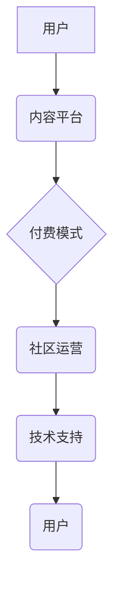

                 

## 打造技术型知识付费社群的活动策划

> 关键词：知识付费、技术社群、在线课程、直播互动、社区运营、内容营销、技术分享、会员体系、付费模式

## 1. 背景介绍

近年来，随着互联网技术的快速发展和普及，知识付费市场呈现出爆发式增长。人们对专业技能和知识的需求日益增长，而技术领域作为知识更新迭代最快的领域之一，也成为了知识付费的热门方向。技术型知识付费社群应运而生，为技术爱好者、开发者和企业提供了一个学习、交流和提升的平台。

然而，打造成功的技术型知识付费社群并非易事。需要对目标用户、内容策略、运营模式等方面进行深入思考和规划。本文将从多个角度探讨如何策划和运营一个成功的技术型知识付费社群。

## 2. 核心概念与联系

**2.1 技术型知识付费社群的定义**

技术型知识付费社群是指以技术领域知识为核心内容，通过线上平台搭建，以付费会员制或其他付费模式为运营模式，提供技术学习、交流、分享和合作的社区平台。

**2.2 社群运营模式**

技术型知识付费社群的运营模式主要包括以下几种：

* **会员制:** 用户通过付费成为会员，获得社区资源和服务，例如在线课程、直播互动、专栏文章、技术文档等。
* **课程销售:** 社群提供付费在线课程，用户通过购买课程获得知识学习和技能提升。
* **咨询服务:** 社群提供技术咨询服务，用户付费咨询专业技术人员解决技术问题。
* **项目合作:** 社群搭建项目合作平台，用户付费参与技术项目开发，获得经验和收益。

**2.3 社群价值链**

技术型知识付费社群的价值链主要包括以下几个环节：

* **内容生产:** 社群需要持续生产高质量的技术内容，例如文章、视频、直播等，满足用户学习需求。
* **用户运营:** 社群需要积极运营用户，建立活跃的社区氛围，促进用户之间的交流和互动。
* **付费模式:** 社群需要选择合适的付费模式，确保可持续发展。
* **技术支持:** 社群需要提供技术支持服务，解决用户在学习和使用过程中遇到的问题。

**2.4 核心架构**



## 3. 核心算法原理 & 具体操作步骤

**3.1 算法原理概述**

技术型知识付费社群的运营需要借助一些算法来实现内容推荐、用户匹配、社区活跃度提升等功能。常见的算法包括：

* **协同过滤算法:** 根据用户的历史行为和喜好，推荐与用户兴趣相符的内容。
* **内容聚类算法:** 将内容进行分类和聚合，方便用户查找和浏览。
* **社交网络分析算法:** 分析用户之间的关系和互动，挖掘社区潜在价值。

**3.2 算法步骤详解**

* **协同过滤算法:**

    1. 收集用户行为数据，例如用户浏览记录、点赞记录、评论记录等。
    2. 计算用户之间的相似度，例如基于物品的协同过滤、基于用户的协同过滤。
    3. 根据用户相似度，推荐与相似用户喜欢的内容。

* **内容聚类算法:**

    1. 将内容进行文本处理，提取关键词和主题信息。
    2. 使用聚类算法将内容进行分组，例如K-means聚类、层次聚类。
    3. 为每个聚类分配标签，方便用户查找和浏览。

* **社交网络分析算法:**

    1. 建立用户关系图谱，记录用户之间的关注、点赞、评论等关系。
    2. 使用度中心性、介数中心性等算法分析用户影响力。
    3. 根据用户关系和影响力，推荐用户关注和互动。

**3.3 算法优缺点**

* **协同过滤算法:**

    优点: 推荐效果精准，能够发现用户潜在兴趣。
    缺点: 数据依赖性强，冷启动问题严重。

* **内容聚类算法:**

    优点: 能够有效组织和分类内容，提高用户查找效率。
    缺点: 聚类结果可能存在模糊性，需要人工进行标签修正。

* **社交网络分析算法:**

    优点: 可以挖掘社区潜在价值，促进用户互动。
    缺点: 需要处理大量数据，算法复杂度较高。

**3.4 算法应用领域**

* **内容推荐:** 推荐用户感兴趣的文章、视频、直播等。
* **用户匹配:** 将用户与合适的学习伙伴、项目合作方进行匹配。
* **社区活跃度提升:** 通过算法分析用户行为，推荐相关内容和活动，提高用户参与度。

## 4. 数学模型和公式 & 详细讲解 & 举例说明

**4.1 数学模型构建**

技术型知识付费社群的运营可以抽象为一个多变量优化问题，目标是最大化社群的价值，例如用户活跃度、付费转化率、内容传播效果等。

**4.2 公式推导过程**

* **用户活跃度:**

    $$
    活跃度 = \frac{总参与次数}{总用户数}
    $$

    其中，总参与次数包括用户浏览文章、观看视频、参与讨论、点赞评论等行为。

* **付费转化率:**

    $$
    转化率 = \frac{付费用户数}{总用户数}
    $$

* **内容传播效果:**

    $$
    传播效果 = \frac{总分享次数}{总内容数}
    $$

**4.3 案例分析与讲解**

假设一个技术型知识付费社群，其用户活跃度为0.2，付费转化率为0.05，内容传播效果为0.1。

根据上述公式，我们可以分析社群的运营状况：

* 用户活跃度较低，说明社群需要加强用户运营，提高用户参与度。
* 付费转化率较低，说明社群需要优化付费模式，提高用户付费意愿。
* 内容传播效果较低，说明社群需要加强内容营销，提高内容的传播力和影响力。

## 5. 项目实践：代码实例和详细解释说明

**5.1 开发环境搭建**

技术型知识付费社群的开发环境可以根据实际需求进行搭建，常用的技术栈包括：

* 前端: React、Vue、Angular
* 后端: Node.js、Python、Java
* 数据库: MySQL、MongoDB
* 云平台: AWS、Azure、阿里云

**5.2 源代码详细实现**

由于篇幅限制，这里只提供一个简单的代码示例，用于演示用户注册功能的实现。

```javascript
// 用户注册接口
app.post('/register', async (req, res) => {
  const { username, password } = req.body;

  // 校验用户名和密码
  if (!username || !password) {
    return res.status(400).json({ error: '用户名和密码不能为空' });
  }

  // 查询数据库是否存在该用户名
  const user = await User.findOne({ username });
  if (user) {
    return res.status(400).json({ error: '用户名已存在' });
  }

  // 创建新用户
  const newUser = new User({ username, password });
  await newUser.save();

  // 返回成功信息
  res.json({ message: '注册成功' });
});
```

**5.3 代码解读与分析**

这段代码定义了一个`/register`接口，用于处理用户注册请求。

1. 从请求体中获取用户名和密码。
2. 校验用户名和密码是否为空。
3. 查询数据库是否存在该用户名。
4. 如果用户名不存在，则创建新用户并保存到数据库。
5. 返回成功信息。

**5.4 运行结果展示**

当用户向`/register`接口发送注册请求时，如果用户名和密码合法，则会返回“注册成功”的响应信息。

## 6. 实际应用场景

技术型知识付费社群可以应用于各种场景，例如：

* **编程语言学习:** 提供编程语言课程、代码示例、在线练习等资源，帮助用户学习编程技能。
* **技术技能提升:** 提供数据科学、人工智能、云计算等技术领域的课程和培训，帮助用户提升专业技能。
* **行业知识分享:** 提供行业资讯、技术趋势、案例分析等内容，帮助用户了解行业动态和发展趋势。
* **技术社区交流:** 提供技术讨论论坛、在线问答平台等，帮助用户交流技术经验和解决技术问题。

**6.4 未来应用展望**

未来，技术型知识付费社群将更加注重个性化学习、沉浸式体验和社区互动。例如：

* **个性化学习路径:** 根据用户的学习目标和进度，推荐个性化的学习路径和内容。
* **虚拟现实/增强现实技术:** 利用VR/AR技术打造沉浸式的学习体验，例如虚拟实验室、模拟场景等。
* **人工智能辅助学习:** 利用人工智能技术提供个性化学习建议、智能答疑、自动生成学习计划等服务。

## 7. 工具和资源推荐

**7.1 学习资源推荐**

* **在线学习平台:** Coursera、Udemy、edX、Udacity
* **技术博客:** Hacker News、Medium、Stack Overflow
* **开源社区:** GitHub、GitLab、Bitbucket

**7.2 开发工具推荐**

* **前端框架:** React、Vue、Angular
* **后端框架:** Node.js、Django、Flask
* **数据库:** MySQL、MongoDB、PostgreSQL

**7.3 相关论文推荐**

* **协同过滤算法:** "Collaborative Filtering: A User-Based Approach" by Goldberg et al. (1992)
* **内容聚类算法:** "K-Means Clustering" by MacQueen (1967)
* **社交网络分析算法:** "Social Network Analysis: Methods and Applications" by Wasserman and Faust (1994)

## 8. 总结：未来发展趋势与挑战

**8.1 研究成果总结**

技术型知识付费社群的发展已经取得了显著成果，为技术学习和技能提升提供了新的途径。

**8.2 未来发展趋势**

未来，技术型知识付费社群将朝着更加个性化、智能化、沉浸式的方向发展。

**8.3 面临的挑战**

技术型知识付费社群也面临着一些挑战，例如：

* **内容质量控制:** 确保社群内容的质量和权威性。
* **用户付费意愿:** 提高用户付费意愿，建立可持续的商业模式。
* **社区活跃度维护:** 持续活跃社区氛围，促进用户互动和交流。

**8.4 研究展望**

未来研究方向包括：

* **人工智能技术在社群运营中的应用:** 利用人工智能技术实现个性化学习推荐、智能答疑、自动生成学习计划等功能。
* **虚拟现实/增强现实技术在社群学习中的应用:** 利用VR/AR技术打造沉浸式的学习体验，例如虚拟实验室、模拟场景等。
* **社群运营模式的创新:** 探索新的付费模式和运营策略，提高社群的盈利能力和用户粘性。

## 9. 附录：常见问题与解答

**9.1 如何加入技术型知识付费社群？**

您可以通过社群官网、微信公众号、微博等渠道加入社群。

**9.2 社群的付费模式是什么？**

社群提供会员制、课程销售、咨询服务等多种付费模式。

**9.3 社群提供哪些技术内容？**

社群提供编程语言学习、技术技能提升、行业知识分享等技术内容。

**9.4 如何与其他用户交流？**

您可以通过社群论坛、在线问答平台、直播互动等方式与其他用户交流。


作者：禅与计算机程序设计艺术 / Zen and the Art of Computer Programming 
<end_of_turn>

