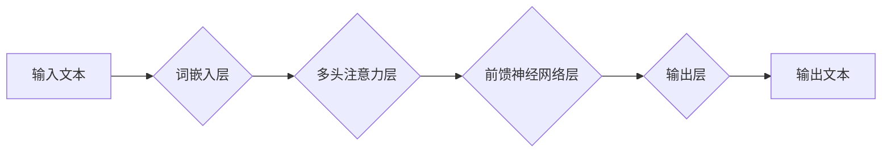

                 

## 技术的未来：LLM 驱动的变革

> 关键词：LLM, 大语言模型, 自然语言处理, 深度学习, 迁移学习, 知识图谱, 人工智能, 伦理

### 1. 背景介绍

近年来，人工智能（AI）技术取得了飞速发展，其中，大语言模型（LLM）作为人工智能领域最具潜力的突破之一，引发了广泛的关注和研究。LLM 拥有强大的文本理解和生成能力，能够完成从翻译、写作到代码生成等多种复杂的任务，其应用前景广阔，对未来技术发展具有深远影响。

传统的自然语言处理（NLP）方法主要依赖于人工特征工程和规则化语法，难以处理复杂、多义的文本信息。而 LLMs 则通过深度学习算法，从海量文本数据中学习语言的结构和语义，从而实现更精准、更灵活的文本处理。

### 2. 核心概念与联系

**2.1  LLM 的核心概念**

LLM 是指参数量巨大、训练数据海量的大型神经网络模型，其核心在于学习语言的表示和关系。通过对大量文本数据的训练，LLM 可以捕捉到语言的复杂模式和规律，从而实现对文本的理解、生成和转换。

**2.2  LLM 与其他技术的联系**

LLM 与其他人工智能技术密切相关，例如：

* **深度学习:** LLMs 基于深度学习算法，例如 Transformer 架构，能够有效地学习语言的复杂结构。
* **迁移学习:** LLMs 可以通过迁移学习技术，将预训练的知识应用于特定任务，提高效率和性能。
* **知识图谱:** LLMs 可以与知识图谱相结合，增强对文本信息的理解和推理能力。

**2.3  LLM 架构示意图**

### 3. 核心算法原理 & 具体操作步骤

**3.1  算法原理概述**

LLMs 的核心算法是基于 Transformer 架构的深度神经网络，其主要特点是：

* **多头注意力机制:**  能够捕捉文本中不同词之间的长距离依赖关系，提高文本理解能力。
* **位置编码:**  解决 Transformer 模型无法捕捉词序信息的问题，确保模型能够理解文本的语义结构。
* **堆叠式网络结构:**  通过堆叠多层 Transformer 块，能够学习更深层次的语言表示。

**3.2  算法步骤详解**

1. **词嵌入:** 将输入文本中的每个词转换为稠密的向量表示，捕捉词的语义信息。
2. **多头注意力:**  对词向量进行多头注意力机制处理，捕捉词之间的依赖关系。
3. **前馈神经网络:**  对注意力输出进行非线性变换，进一步提取文本特征。
4. **输出层:**  根据学习到的文本表示，生成预测的输出文本。

**3.3  算法优缺点**

**优点:**

* 强大的文本理解和生成能力
* 能够处理长文本序列
* 具有良好的迁移学习能力

**缺点:**

* 训练成本高
* 参数量大，需要大量计算资源
* 容易受到训练数据偏差的影响

**3.4  算法应用领域**

* **自然语言理解:** 文本分类、情感分析、问答系统
* **自然语言生成:** 机器翻译、文本摘要、对话系统
* **代码生成:** 自动生成代码、代码补全
* **其他领域:**  搜索引擎优化、内容创作、教育辅助

### 4. 数学模型和公式 & 详细讲解 & 举例说明

**4.1  数学模型构建**

LLMs 的数学模型通常基于 Transformer 架构，其核心是多头注意力机制和前馈神经网络。

**4.2  公式推导过程**

* **注意力机制:**  注意力机制用于计算每个词对其他词的关注程度，公式如下:

$$
Attention(Q, K, V) = softmax(\frac{QK^T}{\sqrt{d_k}})V
$$

其中，Q、K、V 分别代表查询矩阵、键矩阵和值矩阵，$d_k$ 代表键向量的维度。

* **多头注意力:**  多头注意力机制通过并行计算多个注意力头，捕捉不同类型的词语关系，公式如下:

$$
MultiHead(Q, K, V) = Concat(head_1, head_2, ..., head_h)W^O
$$

其中，$head_i$ 代表第 i 个注意力头的输出，h 代表注意力头的数量，$W^O$ 代表最终输出层的权重矩阵。

**4.3  案例分析与讲解**

例如，在机器翻译任务中，LLM 可以使用注意力机制来关注源语言句子中与目标语言句子对应部分的词语，从而提高翻译的准确性。

### 5. 项目实践：代码实例和详细解释说明

**5.1  开发环境搭建**

使用 Python 语言和深度学习框架 TensorFlow 或 PyTorch 搭建开发环境。

**5.2  源代码详细实现**

使用预训练的 LLM 模型，例如 BERT 或 GPT-3，并对其进行微调，使其能够完成特定任务。

**5.3  代码解读与分析**

代码主要包括以下部分:

* 数据预处理: 将文本数据转换为模型可识别的格式。
* 模型加载: 加载预训练的 LLM 模型。
* 模型微调: 对模型进行微调，使其能够完成特定任务。
* 模型评估: 使用测试数据评估模型的性能。

**5.4  运行结果展示**

展示模型在特定任务上的性能指标，例如准确率、召回率、F1 值等。

### 6. 实际应用场景

**6.1  聊天机器人**

LLMs 可以用于构建更智能、更自然的聊天机器人，能够理解用户意图并提供更精准的回复。

**6.2  文本摘要**

LLMs 可以自动生成文本摘要，提取文本的关键信息，节省用户阅读时间。

**6.3  机器翻译**

LLMs 可以实现更准确、更流畅的机器翻译，突破语言障碍，促进跨文化交流。

**6.4  未来应用展望**

LLMs 的应用场景还在不断扩展，未来可能应用于教育、医疗、法律等领域，为人类社会带来更多便利和福祉。

### 7. 工具和资源推荐

**7.1  学习资源推荐**

* **书籍:**《深度学习》、《自然语言处理》
* **在线课程:** Coursera、edX、Udacity
* **博客和论坛:**  Hugging Face、Towards Data Science

**7.2  开发工具推荐**

* **深度学习框架:** TensorFlow、PyTorch
* **自然语言处理库:** NLTK、spaCy
* **云平台:** Google Cloud AI Platform、AWS SageMaker

**7.3  相关论文推荐**

* **BERT:** Devlin et al. (2018)
* **GPT-3:** Brown et al. (2020)
* **T5:** Raffel et al. (2019)

### 8. 总结：未来发展趋势与挑战

**8.1  研究成果总结**

LLMs 在文本理解和生成方面取得了显著进展，为人工智能发展提供了新的方向。

**8.2  未来发展趋势**

* **模型规模和性能提升:**  未来 LLMs 的参数量将继续增加，模型性能将进一步提升。
* **多模态学习:**  LLMs 将与其他模态数据（例如图像、音频）相结合，实现更全面的信息理解。
* **可解释性增强:**  研究人员将致力于提高 LLMs 的可解释性，使其决策过程更加透明。

**8.3  面临的挑战**

* **数据偏见:**  LLMs 容易受到训练数据偏见的影响，需要开发更公平、更鲁棒的训练方法。
* **计算资源消耗:**  训练大型 LLMs 需要大量的计算资源，成本较高。
* **伦理问题:**  LLMs 的应用可能引发伦理问题，例如信息操纵、隐私泄露等，需要制定相应的规范和制度。

**8.4  研究展望**

未来研究将重点关注解决 LLMs 的挑战，使其更加安全、可靠、可解释，并推动其在更多领域应用。

### 9. 附录：常见问题与解答

* **什么是 LLMs 的训练数据？**

LLMs 的训练数据通常是海量文本数据，例如书籍、文章、网站内容等。

* **如何评估 LLMs 的性能？**

LLMs 的性能可以通过多种指标评估，例如准确率、召回率、F1 值等。

* **LLMs 是否会取代人类？**

LLMs 是一种强大的工具，但不会取代人类。人类仍然需要发挥创造力、批判性思维和情感智能等方面的优势。

作者：禅与计算机程序设计艺术 / Zen and the Art of Computer Programming 
<end_of_turn>

