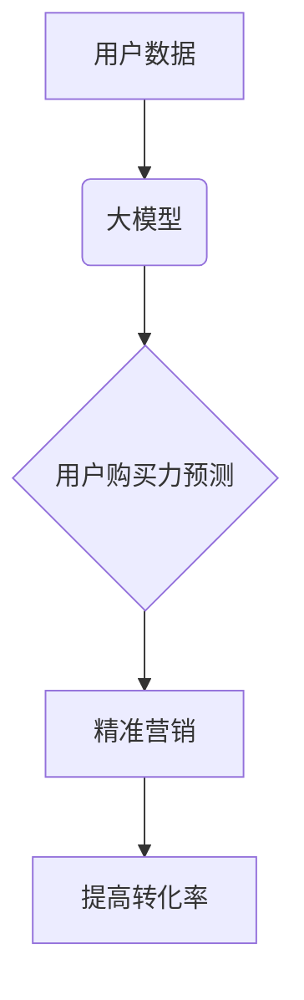

                 

## 探讨大模型在电商平台用户购买力预测中的潜力

> 关键词：大模型、用户购买力预测、电商平台、深度学习、自然语言处理、推荐系统、数据分析

## 1. 背景介绍

在当今数据爆炸的时代，电商平台积累了海量用户数据，这些数据蕴藏着丰富的商业价值。用户购买力预测作为电商平台运营的关键环节之一，能够帮助平台精准定位目标用户，优化营销策略，提高转化率和收益。传统的购买力预测方法主要依赖于用户历史购买行为、人口统计特征等静态数据，但这些方法往往难以捕捉用户动态变化和复杂行为模式。

近年来，大模型技术在自然语言处理、计算机视觉等领域取得了突破性进展，其强大的学习能力和泛化能力为用户购买力预测提供了新的思路和可能性。大模型能够从海量文本数据中学习用户兴趣、偏好、消费习惯等深层特征，并结合其他数据源进行多模态融合，从而构建更精准、更全面的用户画像，实现更准确的用户购买力预测。

## 2. 核心概念与联系

### 2.1 用户购买力预测

用户购买力预测是指通过分析用户历史行为、社会属性、心理特征等信息，预测用户未来在特定商品或服务上的消费意愿和能力。

### 2.2 大模型

大模型是指参数规模庞大、训练数据海量、学习能力强的人工智能模型。大模型通常基于深度学习架构，例如 Transformer、BERT 等，能够学习到复杂数据之间的关系和模式，并进行文本生成、翻译、问答、图像识别等多种任务。

### 2.3 核心概念关系

大模型能够从海量电商平台数据中学习用户购买行为模式，并结合用户画像信息进行预测，从而实现用户购买力预测。



## 3. 核心算法原理 & 具体操作步骤

### 3.1 算法原理概述

大模型在用户购买力预测中的应用主要基于以下算法原理：

* **深度学习**: 利用多层神经网络结构，从海量数据中学习用户购买行为的复杂模式。
* **自然语言处理**: 对用户评论、浏览记录等文本数据进行分析，提取用户兴趣、偏好等特征。
* **多模态融合**: 将文本数据、图像数据、用户行为数据等多种数据源进行融合，构建更全面的用户画像。

### 3.2 算法步骤详解

1. **数据收集**: 收集电商平台用户相关数据，包括用户基本信息、购买历史、浏览记录、评论内容、社交行为等。
2. **数据预处理**: 对收集到的数据进行清洗、转换、编码等预处理操作，使其适合大模型训练。
3. **特征工程**: 从用户数据中提取特征，例如用户年龄、性别、职业、购买频率、平均消费金额、喜欢的商品类别等。
4. **模型训练**: 选择合适的深度学习模型，例如 Transformer、BERT 等，并利用训练数据进行模型训练。
5. **模型评估**: 使用测试数据对模型进行评估，并根据评估结果进行模型调优。
6. **模型部署**: 将训练好的模型部署到电商平台，用于实时预测用户购买力。

### 3.3 算法优缺点

**优点**:

* 能够从海量数据中学习用户复杂行为模式，预测精度更高。
* 能够结合多种数据源进行多模态融合，构建更全面的用户画像。
* 具有较强的泛化能力，能够应用于不同电商平台和商品类型。

**缺点**:

* 训练数据量大，计算资源需求高。
* 模型训练时间长，需要专业技术人员进行操作。
* 模型解释性较差，难以理解模型决策过程。

### 3.4 算法应用领域

* **精准营销**: 根据用户购买力预测结果，精准推送商品推荐、优惠券、促销活动等，提高营销效果。
* **个性化推荐**: 根据用户购买力预测结果，为用户提供个性化的商品推荐，提升用户购物体验。
* **风险控制**: 识别高风险用户，采取相应的措施降低平台风险。
* **库存管理**: 根据用户购买力预测结果，优化库存管理，避免库存积压或缺货。

## 4. 数学模型和公式 & 详细讲解 & 举例说明

### 4.1 数学模型构建

用户购买力预测模型可以构建为一个回归问题，目标是预测用户在特定商品或服务上的消费金额。常用的数学模型包括线性回归、逻辑回归、支持向量机等。

### 4.2 公式推导过程

以线性回归为例，其模型公式如下：

$$
y = \beta_0 + \beta_1x_1 + \beta_2x_2 + ... + \beta_nx_n + \epsilon
$$

其中：

* $y$ 是用户购买力预测结果，即用户在特定商品或服务上的消费金额。
* $\beta_0, \beta_1, \beta_2, ..., \beta_n$ 是模型参数，需要通过训练数据进行学习。
* $x_1, x_2, ..., x_n$ 是用户特征，例如用户年龄、性别、职业、购买频率、平均消费金额等。
* $\epsilon$ 是误差项，代表模型预测结果与实际结果之间的偏差。

### 4.3 案例分析与讲解

假设我们想要预测用户在某款手机上的购买金额，我们可以收集用户年龄、性别、职业、购买频率、平均消费金额等特征数据，并将其作为模型输入。通过训练数据，模型会学习到每个特征对用户购买金额的影响程度，并最终得到一个预测公式。

例如，模型学习到用户年龄越大，购买金额越高；用户收入越高，购买金额越高；用户购买频率越高，购买金额越高。

## 5. 项目实践：代码实例和详细解释说明

### 5.1 开发环境搭建

* Python 3.7+
* TensorFlow/PyTorch 深度学习框架
* Scikit-learn 机器学习库
* Pandas 数据处理库
* Numpy 数值计算库

### 5.2 源代码详细实现

```python
import tensorflow as tf
from sklearn.model_selection import train_test_split
from sklearn.metrics import mean_squared_error

# 1. 数据加载和预处理
# ...

# 2. 模型构建
model = tf.keras.Sequential([
    tf.keras.layers.Dense(64, activation='relu', input_shape=(num_features,)),
    tf.keras.layers.Dense(32, activation='relu'),
    tf.keras.layers.Dense(1)
])

# 3. 模型编译
model.compile(optimizer='adam', loss='mse')

# 4. 模型训练
history = model.fit(X_train, y_train, epochs=10, batch_size=32)

# 5. 模型评估
y_pred = model.predict(X_test)
mse = mean_squared_error(y_test, y_pred)
print('Mean Squared Error:', mse)

```

### 5.3 代码解读与分析

* 代码首先加载数据并进行预处理，例如特征缩放、数据归一化等。
* 然后构建一个深度学习模型，该模型包含多个全连接层和激活函数。
* 模型使用 Adam 优化器和均方误差损失函数进行训练。
* 训练完成后，使用测试数据评估模型性能，并计算均方误差作为评估指标。

### 5.4 运行结果展示

运行结果展示模型的训练过程和评估指标，例如训练损失、测试损失、均方误差等。

## 6. 实际应用场景

### 6.1 精准营销

电商平台可以根据用户购买力预测结果，精准推送商品推荐、优惠券、促销活动等，提高营销效果。例如，对于购买力较高的用户，可以推送高价值商品推荐；对于购买力较低的用户，可以推送优惠促销活动。

### 6.2 个性化推荐

电商平台可以根据用户购买力预测结果，为用户提供个性化的商品推荐，提升用户购物体验。例如，对于喜欢购买电子产品的用户，可以推荐最新的手机、电脑等产品；对于喜欢购买服饰的用户，可以推荐最新的服装、鞋子等产品。

### 6.3 风险控制

电商平台可以识别高风险用户，采取相应的措施降低平台风险。例如，对于购买力较低、信用风险高的用户，可以限制其购买金额或要求其提供更多身份信息。

### 6.4 库存管理

电商平台可以根据用户购买力预测结果，优化库存管理，避免库存积压或缺货。例如，对于预计购买量较高的商品，可以增加库存量；对于预计购买量较低的商品，可以减少库存量。

### 6.5 未来应用展望

随着大模型技术的不断发展，用户购买力预测的应用场景将更加广泛，例如：

* **用户画像构建**: 大模型可以从用户数据中学习更深层的特征，构建更精准的用户画像，为用户提供更个性化的服务。
* **价格预测**: 大模型可以预测商品价格的波动趋势，帮助电商平台制定更合理的定价策略。
* **市场趋势分析**: 大模型可以分析用户购买行为数据，预测市场趋势，帮助电商平台开发新的产品和服务。

## 7. 工具和资源推荐

### 7.1 学习资源推荐

* **书籍**:
    * 《深度学习》 - Ian Goodfellow, Yoshua Bengio, Aaron Courville
    * 《自然语言处理入门》 - Jacob Eisenstein
* **在线课程**:
    * Coursera: 深度学习 Specialization
    * Udacity: 自然语言处理 Nanodegree
* **博客**:
    * TensorFlow Blog
    * PyTorch Blog

### 7.2 开发工具推荐

* **深度学习框架**: TensorFlow, PyTorch
* **机器学习库**: Scikit-learn
* **数据处理库**: Pandas, Numpy

### 7.3 相关论文推荐

* **BERT**: Devlin, J., Chang, M. W., Lee, K., & Toutanova, K. (2018). BERT: Pre-training of deep bidirectional transformers for language understanding. arXiv preprint arXiv:1810.04805.
* **Transformer**: Vaswani, A., Shazeer, N., Parmar, N., Uszkoreit, J., Jones, L., Gomez, A. N., ... & Polosukhin, I. (2017). Attention is all you need. In Advances in neural information processing systems (pp. 5998-6008).

## 8. 总结：未来发展趋势与挑战

### 8.1 研究成果总结

大模型在用户购买力预测领域取得了显著进展，能够从海量数据中学习用户复杂行为模式，提高预测精度。

### 8.2 未来发展趋势

* **模型规模和能力提升**: 大模型参数规模将继续扩大，学习能力将进一步增强，能够捕捉更深层的用户特征。
* **多模态融合**: 大模型将更加注重多模态融合，结合文本、图像、音频等多种数据源，构建更全面的用户画像。
* **解释性增强**: 研究者将致力于提高大模型的解释性，使模型决策过程更加透明可理解。

### 8.3 面临的挑战

* **数据质量和隐私**: 大模型训练需要海量高质量数据，同时需要保障用户数据隐私安全。
* **计算资源需求**: 大模型训练需要大量的计算资源，成本较高。
* **模型可解释性**: 大模型的决策过程复杂，难以解释，这可能会导致模型应用的局限性。

### 8.4 研究展望

未来，大模型在用户购买力预测领域将继续发挥重要作用，并与其他人工智能技术结合，例如强化学习、联邦学习等，实现更智能、更精准的预测。


## 9. 附录：常见问题与解答

### 9.1 如何选择合适的深度学习模型？

选择合适的深度学习模型取决于具体应用场景和数据特征。常用的模型包括：

* **全连接神经网络**: 适用于数据特征线性相关的情况。
* **卷积神经网络**: 适用于图像数据处理。
* **循环神经网络**: 适用于序列数据处理。
* **Transformer**: 适用于自然语言处理任务。

### 9.2 如何处理缺失数据？

缺失数据可以通过以下方法处理：

* **删除缺失数据**: 如果缺失数据量较少，可以删除缺失数据。
* **填充缺失数据**: 可以使用均值、中位数、众数等方法填充缺失数据。
* **使用机器学习算法**: 可以使用机器学习算法预测缺失数据。

### 9.3 如何评估模型性能？

模型性能可以通过以下指标评估：

* **均方误差**: 衡量预测值与实际值之间的平均平方差。
* **平均绝对误差**: 衡量预测值与实际值之间的平均绝对差。
* **R-squared**: 衡量模型拟合优度。

### 9.4 如何防止模型过拟合？

模型过拟合可以通过以下方法防止：

* **使用正则化技术**: 例如 L1 正则化、L2 正则化。
* **使用交叉验证**: 将数据分成多个子集，分别用于训练和测试模型。
* **减少模型复杂度**: 例如减少模型层数、神经元数量。


作者：禅与计算机程序设计艺术 / Zen and the Art of Computer Programming 
<end_of_turn>

