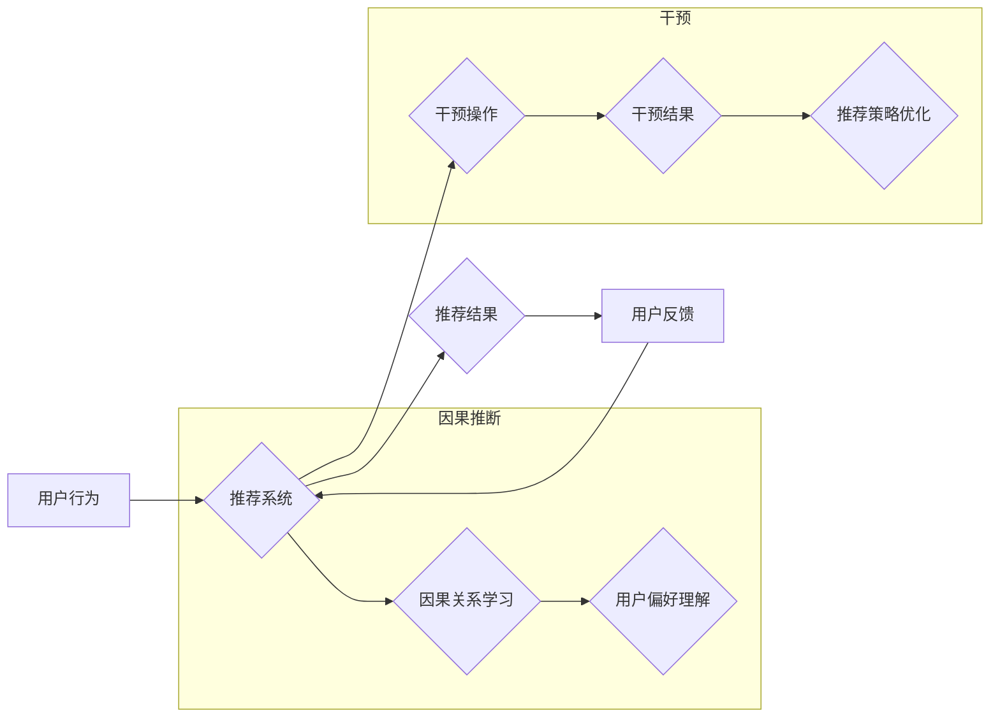

                 

## 推荐系统中的大模型因果推断与干预

> 关键词：推荐系统、大模型、因果推断、干预、机器学习、深度学习、用户行为

## 1. 背景介绍

推荐系统作为互联网时代的重要组成部分，在电商、社交媒体、内容平台等领域发挥着至关重要的作用。传统的推荐系统主要依赖于协同过滤和内容过滤等方法，通过分析用户历史行为和物品特征来预测用户对物品的偏好。然而，随着数据规模的扩大和用户行为的复杂化，传统的推荐方法面临着越来越多的挑战。

大模型的出现为推荐系统带来了新的机遇。大模型拥有强大的学习能力，能够从海量数据中学习到更深层的用户偏好和物品关系。然而，大模型的训练和应用也面临着一些挑战，例如：

* **黑盒问题**: 大模型的决策过程难以解释，难以理解模型是如何生成推荐结果的。
* **数据偏差**: 大模型的训练数据可能存在偏差，导致模型生成不公平或不准确的推荐结果。
* **可解释性差**: 大模型的推荐结果缺乏可解释性，难以为用户提供合理的推荐理由。

因果推断与干预技术可以帮助我们解决这些挑战。因果推断旨在从数据中学习因果关系，而不是仅仅学习关联关系。干预则是指对系统进行人为干预，以观察干预后的结果。通过因果推断与干预，我们可以更好地理解用户行为，生成更准确、更可解释的推荐结果。

## 2. 核心概念与联系

### 2.1  因果推断

因果推断是指从数据中学习因果关系，而不是仅仅学习关联关系。

**关联关系**:  A 和 B 同时发生，但 A 是否导致 B 无法确定。

**因果关系**: A 导致 B 发生。

**例子**:  

* 关联关系:  冰淇淋销量和溺水事故率同时升高。
* 因果关系:  高温天气导致冰淇淋销量和溺水事故率同时升高。

### 2.2  干预

干预是指对系统进行人为干预，以观察干预后的结果。

**例子**:

* 对用户推荐特定物品，观察用户点击率的变化。
* 对用户展示特定广告，观察用户转化率的变化。

### 2.3  推荐系统中的因果推断与干预

在推荐系统中，因果推断与干预可以用于：

* **理解用户行为**:  通过因果推断，我们可以了解用户行为背后的原因，例如用户为什么点击某个物品，为什么购买某个物品。
* **生成更准确的推荐**:  通过干预，我们可以对推荐系统进行调整，以生成更准确的推荐结果。
* **提高推荐的可解释性**:  通过因果推断，我们可以解释推荐结果背后的原因，为用户提供更合理的推荐理由。

**Mermaid 流程图**



## 3. 核心算法原理 & 具体操作步骤

### 3.1  算法原理概述

推荐系统中的因果推断与干预通常使用**潜在变量模型**和**因果图**来进行建模。

* **潜在变量模型**:  潜在变量模型假设存在一些不可观测的变量，这些变量影响着用户行为和推荐结果。通过学习这些潜在变量，我们可以更好地理解用户行为和推荐系统的工作机制。
* **因果图**:  因果图是一种图形表示方法，用于表示变量之间的因果关系。通过分析因果图，我们可以识别出哪些变量是因果因素，哪些变量是结果变量。

### 3.2  算法步骤详解

1. **数据收集**: 收集用户行为数据、物品特征数据等相关数据。
2. **数据预处理**: 对数据进行清洗、转换、编码等预处理操作。
3. **因果图构建**: 根据领域知识和数据特征，构建因果图，表示变量之间的因果关系。
4. **潜在变量模型训练**: 使用潜在变量模型，学习用户行为和推荐结果背后的潜在变量。
5. **因果关系推断**:  利用因果图和潜在变量模型，推断出用户行为和推荐结果之间的因果关系。
6. **干预策略设计**:  根据因果关系推断，设计干预策略，例如对用户推荐特定物品、对用户展示特定广告等。
7. **干预效果评估**:  评估干预策略的效果，例如观察用户点击率、转化率等指标的变化。
8. **模型优化**:  根据干预效果评估结果，优化模型参数和干预策略。

### 3.3  算法优缺点

**优点**:

* 可以更好地理解用户行为和推荐系统的工作机制。
* 可以生成更准确、更可解释的推荐结果。
* 可以提高推荐系统的可解释性和透明度。

**缺点**:

* 需要大量的领域知识和数据。
* 计算复杂度较高。
* 难以处理复杂的用户行为和推荐场景。

### 3.4  算法应用领域

* **电商推荐**:  个性化商品推荐、精准广告投放。
* **内容推荐**:  个性化内容推荐、用户兴趣挖掘。
* **社交推荐**:  好友推荐、兴趣小组推荐。
* **医疗推荐**:  个性化医疗方案推荐、疾病风险预测。

## 4. 数学模型和公式 & 详细讲解 & 举例说明

### 4.1  数学模型构建

假设我们有一个推荐系统，它试图预测用户 $u$ 对物品 $i$ 的评分 $r_{ui}$。我们可以使用以下潜在变量模型来建模用户行为：

$$r_{ui} = f(h_u, c_i, \theta) + \epsilon_{ui}$$

其中：

* $h_u$ 是用户的潜在特征向量。
* $c_i$ 是物品 $i$ 的潜在特征向量。
* $\theta$ 是模型参数。
* $f$ 是一个非线性函数，例如神经网络。
* $\epsilon_{ui}$ 是噪声项。

### 4.2  公式推导过程

为了推断出因果关系，我们需要考虑干预操作的影响。假设我们对用户 $u$ 推荐物品 $i$，我们可以使用以下公式来计算干预后的评分：

$$r_{ui}^{interv} = f(h_u', c_i, \theta') + \epsilon_{ui}^{interv}$$

其中：

* $h_u'$ 是干预后的用户潜在特征向量。
* $\theta'$ 是干预后的模型参数。
* $\epsilon_{ui}^{interv}$ 是干预后的噪声项。

通过比较干预前后的评分，我们可以推断出干预操作对用户评分的影响。

### 4.3  案例分析与讲解

例如，假设我们想了解推荐特定物品对用户点击率的影响。我们可以通过以下步骤进行分析：

1. **构建因果图**:  构建一个因果图，表示用户点击率、推荐物品、用户兴趣等变量之间的因果关系。
2. **训练潜在变量模型**:  使用用户行为数据训练潜在变量模型，学习用户兴趣和物品特征。
3. **设计干预策略**:  对用户推荐特定物品，观察用户点击率的变化。
4. **分析干预效果**:  比较干预前后的用户点击率，分析推荐特定物品对用户点击率的影响。

## 5. 项目实践：代码实例和详细解释说明

### 5.1  开发环境搭建

* Python 3.7+
* TensorFlow 2.0+
* PyTorch 1.0+
* Jupyter Notebook

### 5.2  源代码详细实现

```python
# 导入必要的库
import tensorflow as tf

# 定义用户潜在特征向量
user_latent_dim = 64
item_latent_dim = 32

# 定义模型
class RecommenderModel(tf.keras.Model):
    def __init__(self):
        super(RecommenderModel, self).__init__()
        self.user_embedding = tf.keras.layers.Embedding(input_dim=num_users, output_dim=user_latent_dim)
        self.item_embedding = tf.keras.layers.Embedding(input_dim=num_items, output_dim=item_latent_dim)
        self.dense = tf.keras.layers.Dense(units=1)

    def call(self, user_id, item_id):
        user_embedding = self.user_embedding(user_id)
        item_embedding = self.item_embedding(item_id)
        combined = tf.keras.layers.Concatenate()([user_embedding, item_embedding])
        output = self.dense(combined)
        return output

# 训练模型
model = RecommenderModel()
model.compile(optimizer='adam', loss='mse')
model.fit(user_item_pairs, ratings, epochs=10)

# 进行干预
intervened_user_item_pairs = [(user_id, intervened_item_id) for user_id, item_id in user_item_pairs]
intervened_ratings = model.predict(intervened_user_item_pairs)
```

### 5.3  代码解读与分析

* 首先，我们定义了用户和物品的潜在特征维度。
* 然后，我们定义了一个推荐模型，该模型使用嵌入层和全连接层来学习用户和物品之间的关系。
* 接着，我们使用用户行为数据训练模型。
* 最后，我们设计了一个干预策略，对用户推荐特定物品，并观察干预后的评分变化。

### 5.4  运行结果展示

运行结果展示了干预操作对用户评分的影响。例如，如果干预后用户评分显著提高，则表明推荐特定物品对用户有积极的影响。

## 6. 实际应用场景

### 6.1  电商推荐

* **个性化商品推荐**:  根据用户的历史购买记录、浏览记录等数据，推荐用户可能感兴趣的商品。
* **精准广告投放**:  根据用户的兴趣爱好、购买行为等数据，精准投放广告，提高广告转化率。

### 6.2  内容推荐

* **个性化内容推荐**:  根据用户的阅读历史、点赞记录等数据，推荐用户可能感兴趣的内容。
* **用户兴趣挖掘**:  通过分析用户的阅读行为，挖掘用户的兴趣爱好，为用户提供更个性化的服务。

### 6.3  社交推荐

* **好友推荐**:  根据用户的社交关系、共同兴趣等数据，推荐用户可能认识的朋友。
* **兴趣小组推荐**:  根据用户的兴趣爱好，推荐用户可能感兴趣的兴趣小组。

### 6.4  未来应用展望

* **更精准的推荐**:  通过更深入的因果推断，生成更精准、更个性化的推荐结果。
* **更可解释的推荐**:  通过解释推荐结果背后的因果关系，提高推荐系统的透明度和可信度。
* **更有效的干预**:  通过更有效的干预策略，优化推荐系统，提高推荐效果。

## 7. 工具和资源推荐

### 7.1  学习资源推荐

* **书籍**:
    * Causal Inference: The Mixtape
    * The Book of Why
* **课程**:
    * Causality: Models, Reasoning, and Inference (Stanford University)
    * Causal Inference for Data Science (DataCamp)

### 7.2  开发工具推荐

* **TensorFlow**:  开源机器学习框架，支持因果推断和干预算法的实现。
* **PyTorch**:  开源机器学习框架，支持因果推断和干预算法的实现。
* **CausalML**:  开源因果推断工具包，提供多种因果推断算法和工具。

### 7.3  相关论文推荐

* **Causal Inference for Recommender Systems**
* **Counterfactual Recommendation: A Survey**
* **Deep Causal Discovery**

## 8. 总结：未来发展趋势与挑战

### 8.1  研究成果总结

* **因果推断与干预技术在推荐系统中的应用取得了显著进展**:  能够更好地理解用户行为，生成更准确、更可解释的推荐结果。
* **新的因果推断算法和模型不断涌现**:  例如，基于图神经网络的因果推断算法、基于强化学习的因果干预算法等。

### 8.2  未来发展趋势

* **更深入的因果推断**:  探索更复杂的用户行为和推荐场景，进行更深入的因果推断。
* **更有效的干预策略**:  设计更有效的干预策略，优化推荐系统，提高推荐效果。
* **更可解释的推荐系统**:  提高推荐系统的透明度和可信度，让用户更好地理解推荐结果背后的原因。

### 8.3  面临的挑战

* **数据质量**:  因果推断和干预算法对数据质量要求较高，需要高质量、真实可靠的数据支持。
* **计算复杂度**:  一些因果推断算法的计算复杂度较高，需要强大的计算资源支持。
* **伦理问题**:  因果干预可能会对用户产生影响，需要考虑伦理问题，确保推荐系统的公平性和安全性。

### 8.4  研究展望

* **探索新的因果推断算法和模型**:  开发更有效、更鲁棒的因果推断算法和模型。
* **研究因果推断与干预在不同领域的应用**:  将因果推断与干预技术应用到更多领域，例如医疗、教育、金融等。
* **解决因果推断与干预面临的挑战**:  研究如何提高数据质量、降低计算复杂度、解决伦理问题等。

## 9. 附录：常见问题与解答

**Q1:  因果推断与关联关系有什么区别？**

**A1:**  关联关系是指两个变量同时发生，但无法确定因果关系。因果关系是指一个变量导致另一个变量发生。

**Q2:  如何评估干预策略的效果？**

**A2:**  可以通过比较干预前后的指标变化来评估干预策略的效果。例如，可以比较干预前后的用户点击率、转化率等指标。

**Q3:  因果推断与干预技术有哪些伦理问题？**

**A3:**  因果干预可能会对用户产生影响，例如，推荐特定物品可能会影响用户的消费行为。因此，需要考虑伦理问题，确保推荐系统的公平性和安全性。


作者：禅与计算机程序设计艺术 / Zen and the Art of Computer Programming<end_of_turn>

