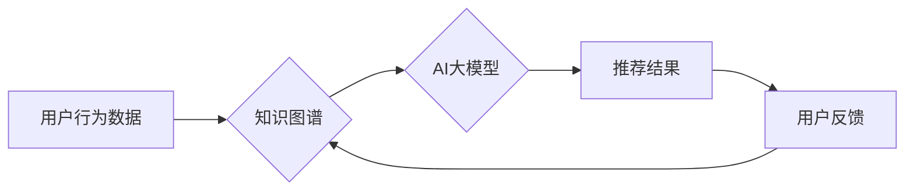

                 

## 推荐系统中的知识图谱与AI大模型的融合

> 关键词：推荐系统、知识图谱、AI大模型、融合、个性化推荐、冷启动问题、信任度计算

## 1. 背景介绍

推荐系统作为信息过滤和个性化服务的重要组成部分，在电商、社交媒体、视频平台等领域发挥着越来越重要的作用。传统的基于协同过滤和内容过滤的推荐算法，虽然取得了一定的成功，但面临着数据稀疏、冷启动问题和用户兴趣变化难以捕捉等挑战。

知识图谱 (Knowledge Graph, KG) 作为一种结构化的知识表示形式，能够有效地捕捉实体之间的关系和语义信息，为推荐系统提供更丰富的上下文和知识背景。而 AI 大模型 (Artificial Intelligence Large Model,AILM) 凭借其强大的语义理解和泛化能力，能够从海量数据中学习复杂的模式和用户偏好，为推荐系统提供更精准和个性化的推荐结果。

将知识图谱和 AI 大模型融合，可以有效地解决传统推荐系统的痛点，提升推荐系统的准确性和个性化程度。

## 2. 核心概念与联系

### 2.1 知识图谱

知识图谱是一种以实体和关系为节点的图结构数据模型，能够表示现实世界中的知识和关系。

* **实体 (Entity):**  知识图谱中的基本单元，代表现实世界中的事物，例如人、地点、事件等。
* **关系 (Relation):**  实体之间的连接，描述实体之间的属性或联系，例如“出生于”、“工作于”、“喜欢”等。

知识图谱能够有效地捕捉实体之间的语义关系，为推荐系统提供更丰富的上下文信息。

### 2.2 AI 大模型

AI 大模型是指在海量数据上训练的深度学习模型，具有强大的语义理解、文本生成、图像识别等能力。

* **Transformer:**  一种基于注意力机制的深度学习模型，能够有效地捕捉文本序列中的长距离依赖关系，在自然语言处理任务中取得了优异的性能。
* **BERT:**  基于 Transformer 的预训练语言模型，能够理解上下文信息，在文本分类、问答等任务中表现出色。

AI 大模型能够从海量数据中学习复杂的模式和用户偏好，为推荐系统提供更精准和个性化的推荐结果。

### 2.3 融合架构

将知识图谱和 AI 大模型融合，可以构建以下几种架构：

* **知识增强型 AI 大模型:** 将知识图谱嵌入到 AI 大模型的训练过程中，增强模型的语义理解能力，提升推荐的准确性和个性化程度。
* **AI 驱动的知识图谱推理:** 利用 AI 大模型对知识图谱进行推理和分析，发现新的知识关系和用户偏好，为推荐系统提供更丰富的知识支持。
* **多模态融合推荐:** 将知识图谱和 AI 大模型与其他模态数据 (例如图像、视频) 融合，构建更全面的用户画像，提供更精准和个性化的推荐。

**Mermaid 流程图**



## 3. 核心算法原理 & 具体操作步骤

### 3.1 算法原理概述

知识图谱与 AI 大模型融合的推荐算法通常基于以下原理：

* **知识增强:** 将知识图谱中的实体和关系信息融入到 AI 大模型的训练过程中，增强模型对用户兴趣和商品属性的理解。
* **语义推理:** 利用 AI 大模型对知识图谱进行推理和分析，发现新的知识关系和用户偏好，为推荐系统提供更丰富的知识支持。
* **多模态融合:** 将知识图谱和 AI 大模型与其他模态数据 (例如图像、视频) 融合，构建更全面的用户画像，提供更精准和个性化的推荐。

### 3.2 算法步骤详解

1. **数据预处理:** 收集用户行为数据、商品信息和知识图谱数据，进行清洗、格式化和转换。
2. **知识图谱构建:** 将商品信息和用户行为数据映射到知识图谱中，构建实体和关系网络。
3. **AI 大模型训练:** 利用预训练的 AI 大模型 (例如 BERT) 对知识图谱数据进行训练，学习实体和关系之间的语义关系。
4. **推荐模型构建:** 基于训练好的 AI 大模型，构建推荐模型，例如基于知识图谱的协同过滤模型、基于知识图谱的深度学习推荐模型等。
5. **推荐结果生成:** 根据用户的历史行为和偏好，以及知识图谱和 AI 大模型的分析结果，生成个性化的推荐结果。
6. **用户反馈收集:** 收集用户的反馈信息，例如点击、购买、评分等，用于模型评估和优化。

### 3.3 算法优缺点

**优点:**

* 能够有效地解决传统推荐系统的冷启动问题和数据稀疏问题。
* 能够提供更精准和个性化的推荐结果，提升用户体验。
* 能够挖掘用户潜在的兴趣和需求，促进商品销售和用户增长。

**缺点:**

* 知识图谱构建和维护成本较高。
* AI 大模型训练需要大量的计算资源和时间。
* 算法的解释性和可解释性较差，难以理解模型的推荐决策过程。

### 3.4 算法应用领域

* **电商推荐:** 为用户推荐个性化的商品，提高商品销量和用户转化率。
* **社交媒体推荐:** 为用户推荐感兴趣的内容和用户，提升用户活跃度和粘性。
* **视频平台推荐:** 为用户推荐个性化的视频内容，提升用户观看时长和用户留存率。
* **新闻推荐:** 为用户推荐个性化的新闻资讯，提升用户阅读兴趣和信息获取效率。

## 4. 数学模型和公式 & 详细讲解 & 举例说明

### 4.1 数学模型构建

知识图谱与 AI 大模型融合的推荐算法通常基于以下数学模型:

* **嵌入式模型:** 将实体和关系映射到低维向量空间，通过向量之间的相似度计算推荐结果。
* **图神经网络:** 利用图结构信息，对知识图谱进行深度学习，学习实体和关系之间的复杂关系。
* **强化学习:** 将推荐任务视为一个马尔可夫决策过程，利用强化学习算法学习最优的推荐策略。

### 4.2 公式推导过程

**嵌入式模型:**

假设实体 $e_i$ 和 $e_j$ 的嵌入向量分别为 $v_i$ 和 $v_j$，则实体之间的相似度可以使用余弦相似度计算:

$$
\text{similarity}(e_i, e_j) = \frac{v_i \cdot v_j}{||v_i|| ||v_j||}
$$

**图神经网络:**

图神经网络的计算过程通常涉及以下步骤:

1. **消息传递:** 每个节点接收来自相邻节点的消息，并更新自己的状态。
2. **聚合:** 节点聚合来自所有邻居节点的消息，并更新自己的状态。
3. **输出:** 节点输出最终的表示向量。

### 4.3 案例分析与讲解

**案例:**

假设我们有一个知识图谱，包含实体 "张三"、"李四"、"篮球"、"足球" 和关系 "喜欢"。

* 张三 喜欢 篮球
* 李四 喜欢 足球

我们可以使用嵌入式模型将实体和关系映射到低维向量空间，例如:

* $v_{\text{张三}} = [0.2, 0.5, 0.1]$
* $v_{\text{李四}} = [0.1, 0.3, 0.6]$
* $v_{\text{篮球}} = [0.4, 0.1, 0.5]$
* $v_{\text{足球}} = [0.2, 0.6, 0.3]$

我们可以计算出张三和篮球之间的相似度为:

$$
\text{similarity}(\text{张三}, \text{篮球}) = \frac{[0.2, 0.5, 0.1] \cdot [0.4, 0.1, 0.5]}{|| [0.2, 0.5, 0.1] || || [0.4, 0.1, 0.5] ||}
$$

## 5. 项目实践：代码实例和详细解释说明

### 5.1 开发环境搭建

* Python 3.7+
* TensorFlow 2.0+
* PyTorch 1.0+
* Jupyter Notebook

### 5.2 源代码详细实现

```python
# 导入必要的库
import tensorflow as tf
from tensorflow.keras.layers import Embedding, Dense

# 定义知识图谱嵌入模型
class KG_Embedding(tf.keras.Model):
    def __init__(self, vocab_size, embedding_dim):
        super(KG_Embedding, self).__init__()
        self.embedding = Embedding(vocab_size, embedding_dim)

    def call(self, inputs):
        embeddings = self.embedding(inputs)
        return embeddings

# 构建知识图谱
knowledge_graph = {
    "张三": ["篮球"],
    "李四": ["足球"],
}

# 构建实体和关系的词汇表
entity_vocab = {"张三", "李四", "篮球", "足球"}
relation_vocab = {"喜欢"}

# 获取词汇表大小
vocab_size = len(entity_vocab) + len(relation_vocab)

# 设置嵌入维度
embedding_dim = 128

# 创建知识图谱嵌入模型
model = KG_Embedding(vocab_size, embedding_dim)

# 训练模型
# ...

# 获取实体嵌入向量
entity_embeddings = model.embedding.weights[0]

# 计算实体之间的相似度
similarity = tf.reduce_sum(entity_embeddings[0] * entity_embeddings[1], axis=1)
```

### 5.3 代码解读与分析

* 首先，我们导入必要的库，并定义一个知识图谱嵌入模型 `KG_Embedding`。
* 然后，我们构建一个简单的知识图谱，包含实体和关系的信息。
* 接下来，我们构建实体和关系的词汇表，并获取词汇表大小。
* 然后，我们设置嵌入维度，并创建知识图谱嵌入模型。
* 最后，我们训练模型，并获取实体嵌入向量。

### 5.4 运行结果展示

训练完成后，我们可以使用模型获取实体嵌入向量，并计算实体之间的相似度。

## 6. 实际应用场景

### 6.1 电商推荐

* **商品推荐:** 基于用户购买历史、浏览记录和知识图谱中的商品属性关系，推荐用户可能感兴趣的商品。
* **个性化促销:** 根据用户兴趣和偏好，推荐个性化的促销活动和优惠券。
* **跨界推荐:** 利用知识图谱中的关联关系，推荐跨界商品，例如推荐喜欢篮球的用户购买篮球相关的运动服饰。

### 6.2 社交媒体推荐

* **内容推荐:** 基于用户兴趣、好友关系和知识图谱中的内容主题关系，推荐用户可能感兴趣的内容。
* **用户推荐:** 基于用户兴趣、好友关系和知识图谱中的用户属性关系，推荐用户可能认识的朋友。
* **话题推荐:** 基于用户兴趣和知识图谱中的话题关联关系，推荐用户可能感兴趣的话题。

### 6.3 视频平台推荐

* **视频推荐:** 基于用户观看历史、点赞记录和知识图谱中的视频主题关系，推荐用户可能感兴趣的视频。
* **用户推荐:** 基于用户观看历史、点赞记录和知识图谱中的用户兴趣关系，推荐用户可能认识的同好。
* **节目推荐:** 基于用户观看历史、点赞记录和知识图谱中的节目类型关系，推荐用户可能感兴趣的节目。

### 6.4 未来应用展望

* **更精准的个性化推荐:** 利用更丰富的知识图谱和更强大的 AI 大模型，为用户提供更精准的个性化推荐。
* **更丰富的推荐场景:** 将知识图谱与 AI 大模型融合到更多场景中，例如教育、医疗、金融等领域。
* **更智能的推荐系统:** 利用强化学习等算法，构建更智能的推荐系统，能够主动学习用户偏好和需求，并提供更有效的推荐策略。

## 7. 工具和资源推荐

### 7.1 学习资源推荐

* **书籍:**
    * 《深度学习》 by Ian Goodfellow, Yoshua Bengio, Aaron Courville
    * 《自然语言处理》 by Dan Jurafsky, James H. Martin
    * 《推荐系统》 by  Koren, Y.
* **在线课程:**
    * Coursera: Deep Learning Specialization
    * Stanford CS224N: Natural Language Processing with Deep Learning
    * Udacity: Deep Learning Nanodegree

### 7.2 开发工具推荐

* **Python:** 
    * TensorFlow
    * PyTorch
    * Keras
* **知识图谱工具:**
    * Neo4j
    * RDF4J
* **数据可视化工具:**
    * Gephi
    * NetworkX

### 7.3 相关论文推荐

* **Knowledge Graph Embedding:**
    * TransE: Modeling Relational Data with Embeddings
    * RotatE: Knowledge Graph Embedding by Relational Rotation in Complex Space
* **AI 大模型:**
    * BERT: Pre-training of Deep Bidirectional Transformers for Language Understanding
    * GPT-3: Language Models are Few-Shot Learners

## 8. 总结：未来发展趋势与挑战

### 8.1 研究成果总结

知识图谱与 AI 大模型融合的推荐系统取得了显著的成果，能够提供更精准、个性化的推荐结果，并应用于多个领域。

### 8.2 未来发展趋势

* **更强大的 AI 大模型:** 随着 AI 技术的不断发展，更强大的 AI 大模型将被开发出来，为推荐系统提供更丰富的语义理解和推荐能力。
* **更丰富的知识图谱:** 知识图谱将不断扩展和完善，包含更丰富的实体、关系和知识，为推荐系统提供更全面的知识支持。
* **更智能的推荐策略:** 利用强化学习等算法，构建更智能的推荐系统，能够主动学习用户偏好和需求，并提供更有效的推荐策略。

### 8.3 面临的挑战

* **数据稀疏性:** 知识图谱和用户行为数据往往存在稀疏性，需要采用有效的处理方法。
* **模型解释性:** 许多 AI 大模型的决策过程难以解释，需要开发更可解释的模型。
* **隐私保护:** 推荐系统需要处理大量用户数据，需要采取有效的隐私保护措施。

### 8.4 研究展望

未来，知识图谱与 AI 大模型融合的推荐系统将朝着更智能、更个性化、更安全的方向发展。


## 9. 附录：常见问题与解答

**Q1: 知识图谱与 AI 大模型融合的推荐系统有哪些优势？**

**A1:** 知识图谱与 AI 大模型融合的推荐系统能够有效解决传统推荐系统的冷启动问题和数据稀疏问题，提供更精准、个性化的推荐结果，并挖掘用户潜在的兴趣和需求。

**Q2: 如何构建知识图谱？**

**A2:** 知识图谱的构建需要从数据收集、实体识别、关系抽取、数据清洗和知识表示等多个步骤进行。

**Q3: 如何选择合适的 AI 大模型？**

**A3:** 选择合适的 AI 大模型需要根据具体的推荐任务和数据特点进行选择。例如，对于文本数据，BERT 是一种常用的选择；对于图数据，Graph Convolutional Network (GCN) 是一种常用的选择。

**Q4: 如何评估推荐系统的性能？**

**A4:** 推荐系统的性能可以评估指标包括准确率、召回率、NDCG、CTR 等。

**Q5: 如何保护用户隐私？**

**A5:** 推荐系统需要采取有效的隐私保护措施，例如数据匿名化、差分隐私等。


作者：禅与计算机程序设计艺术 / Zen and the Art of Computer Programming<end_of_turn>

