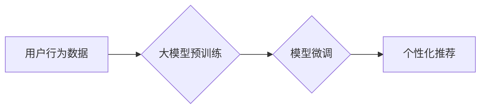

                 

## 推荐系统的未来发展趋势：大模型的主导作用

> 关键词：推荐系统、大模型、Transformer、深度学习、个性化推荐、冷启动问题、数据隐私

### 1. 背景介绍

推荐系统作为互联网时代的重要组成部分，已渗透到我们生活的方方面面，从电商平台的商品推荐、视频网站的影视推荐到社交媒体的个性化内容推送，无处不在。传统的推荐系统主要依赖于协同过滤、内容过滤等方法，但随着用户行为数据量的激增和推荐场景的多样化，这些方法逐渐面临挑战。

近年来，深度学习技术的蓬勃发展为推荐系统带来了新的机遇。基于深度学习的推荐系统能够更好地挖掘用户兴趣和商品特征的复杂关系，从而提供更精准、更个性化的推荐结果。其中，大模型作为深度学习领域的新兴技术，凭借其强大的学习能力和泛化能力，正在成为推荐系统未来的主导力量。

### 2. 核心概念与联系

#### 2.1 推荐系统概述

推荐系统旨在根据用户的历史行为、偏好和上下文信息，预测用户对特定物品的兴趣，并推荐最相关的物品。

#### 2.2 大模型介绍

大模型是指参数规模庞大、训练数据海量、具备强大泛化能力的深度学习模型。近年来，随着计算资源的提升和算法的进步，大模型在自然语言处理、计算机视觉等领域取得了突破性进展。

#### 2.3 大模型在推荐系统中的应用

大模型能够有效解决传统推荐系统面临的挑战，例如：

* **数据稀疏性:** 大模型能够通过学习用户和物品之间的潜在关系，弥补数据稀疏性的不足。
* **冷启动问题:** 大模型能够利用其丰富的知识和语义理解能力，对新用户和新物品进行有效的推荐。
* **个性化推荐:** 大模型能够根据用户的个性化需求，提供更加精准和细粒度的推荐结果。

**大模型在推荐系统中的应用流程:**



### 3. 核心算法原理 & 具体操作步骤

#### 3.1 算法原理概述

大模型在推荐系统中的应用主要基于以下核心算法：

* **Transformer:** Transformer是一种基于注意力机制的深度学习模型，能够有效捕捉用户和物品之间的长距离依赖关系，从而提高推荐效果。
* **BERT:** BERT是一种预训练语言模型，能够理解用户的自然语言输入，并将其转化为推荐系统可理解的特征。
* **Graph Neural Networks (GNN):** GNN能够学习用户和物品之间的复杂关系，并将其用于推荐任务。

#### 3.2 算法步骤详解

1. **数据预处理:** 收集用户行为数据、商品信息等数据，并进行清洗、转换、编码等预处理操作。
2. **大模型预训练:** 使用海量文本数据对Transformer、BERT等大模型进行预训练，使其具备强大的语言理解和语义表示能力。
3. **模型微调:** 将预训练好的大模型用于推荐任务，并根据具体的推荐场景进行微调，例如调整模型结构、学习率等参数。
4. **特征提取:** 将用户行为数据、商品信息等数据输入到微调后的模型中，提取用户和物品的特征表示。
5. **推荐排序:** 根据特征表示，使用排序算法对推荐结果进行排序，并输出给用户。

#### 3.3 算法优缺点

**优点:**

* **高准确率:** 大模型能够学习用户和物品之间的复杂关系，从而提高推荐的准确率。
* **个性化推荐:** 大模型能够根据用户的个性化需求，提供更加精准和细粒度的推荐结果。
* **泛化能力强:** 预训练好的大模型能够应用于不同的推荐场景，并具有较强的泛化能力。

**缺点:**

* **计算资源消耗大:** 大模型的训练和推理需要大量的计算资源，成本较高。
* **数据依赖性强:** 大模型的性能依赖于训练数据的质量和数量。
* **可解释性差:** 大模型的决策过程较为复杂，难以解释其推荐结果背后的逻辑。

#### 3.4 算法应用领域

大模型在推荐系统领域的应用非常广泛，例如：

* **电商推荐:** 推荐商品、优惠券、促销活动等。
* **视频推荐:** 推荐视频、电视剧、电影等。
* **音乐推荐:** 推荐歌曲、专辑、音乐人等。
* **新闻推荐:** 推荐新闻文章、视频、音频等。
* **社交媒体推荐:** 推荐好友、群组、话题等。

### 4. 数学模型和公式 & 详细讲解 & 举例说明

#### 4.1 数学模型构建

大模型在推荐系统中的应用通常基于以下数学模型：

* **用户-物品交互矩阵:** 用来表示用户对物品的评分或交互行为，例如点击、收藏、购买等。
* **嵌入向量:** 将用户和物品映射到低维向量空间，以便于模型学习用户和物品之间的关系。
* **注意力机制:** 用于学习用户和物品之间的重要性权重，并根据权重进行加权求和，从而得到最终的推荐结果。

#### 4.2 公式推导过程

例如，Transformer模型中的注意力机制公式如下：

$$
Attention(Q, K, V) = softmax(\frac{QK^T}{\sqrt{d_k}})V
$$

其中：

* $Q$：查询向量
* $K$：键向量
* $V$：值向量
* $d_k$：键向量的维度
* $softmax$：softmax函数

#### 4.3 案例分析与讲解

假设有一个用户-物品交互矩阵，其中用户和物品分别用数字表示。可以使用Transformer模型学习用户和物品的嵌入向量，并通过注意力机制计算用户对每个物品的兴趣分数。最终，根据兴趣分数对物品进行排序，并推荐给用户。

### 5. 项目实践：代码实例和详细解释说明

#### 5.1 开发环境搭建

推荐系统开发环境通常包括以下软件：

* Python：编程语言
* TensorFlow/PyTorch：深度学习框架
* Jupyter Notebook：交互式编程环境
* Git：版本控制系统

#### 5.2 源代码详细实现

以下是一个使用TensorFlow构建简单推荐系统的代码示例：

```python
import tensorflow as tf

# 定义用户-物品交互矩阵
user_item_matrix = tf.constant([[1, 0, 1, 0],
                                [0, 1, 1, 1],
                                [1, 1, 0, 1]])

# 定义用户和物品的嵌入向量
user_embedding = tf.Variable(tf.random.normal([3, 10]))
item_embedding = tf.Variable(tf.random.normal([4, 10]))

# 计算用户对每个物品的兴趣分数
scores = tf.matmul(user_embedding, item_embedding, transpose_b=True)

# 使用softmax函数对兴趣分数进行归一化
probabilities = tf.nn.softmax(scores)

# 打印推荐结果
print(probabilities)
```

#### 5.3 代码解读与分析

* 代码首先定义了用户-物品交互矩阵，其中每个元素表示用户对物品的评分或交互行为。
* 然后定义了用户和物品的嵌入向量，每个向量代表用户的特征或物品的特征。
* 使用矩阵乘法计算用户对每个物品的兴趣分数。
* 使用softmax函数对兴趣分数进行归一化，得到每个物品被推荐的概率。
* 最后打印推荐结果，即每个物品被推荐的概率。

#### 5.4 运行结果展示

运行上述代码后，会输出一个3x4的矩阵，其中每个元素代表用户对每个物品的推荐概率。

### 6. 实际应用场景

#### 6.1 电商推荐

大模型在电商推荐中可以实现个性化商品推荐、跨界商品推荐、新品推荐等功能，提升用户购物体验和转化率。

#### 6.2 视频推荐

大模型可以根据用户的观看历史、偏好和行为数据，推荐个性化的视频内容，提升用户粘性和平台活跃度。

#### 6.3 音乐推荐

大模型可以根据用户的音乐偏好、听歌习惯和社交关系，推荐个性化的音乐作品，提升用户音乐体验和平台用户粘性。

#### 6.4 其他应用场景

大模型还可以应用于新闻推荐、社交媒体推荐、教育推荐等领域，为用户提供更精准、更个性化的服务。

#### 6.5 未来应用展望

随着大模型技术的不断发展，其在推荐系统中的应用将更加广泛和深入，例如：

* **多模态推荐:** 将文本、图像、音频等多种模态信息融合，提供更丰富的推荐体验。
* **实时推荐:** 基于用户的实时行为数据，提供更加动态和个性化的推荐结果。
* **解释性推荐:** 增强大模型的可解释性，让用户能够理解推荐结果背后的逻辑。

### 7. 工具和资源推荐

#### 7.1 学习资源推荐

* **书籍:**
    * Deep Learning by Ian Goodfellow, Yoshua Bengio, and Aaron Courville
    * Natural Language Processing with Transformers by Hugging Face
* **在线课程:**
    * TensorFlow Tutorials
    * PyTorch Tutorials
    * DeepLearning.AI Specialization

#### 7.2 开发工具推荐

* **TensorFlow:** 开源深度学习框架
* **PyTorch:** 开源深度学习框架
* **Hugging Face Transformers:** 预训练大模型库

#### 7.3 相关论文推荐

* Attention Is All You Need (Vaswani et al., 2017)
* BERT: Pre-training of Deep Bidirectional Transformers for Language Understanding (Devlin et al., 2018)
* Graph Convolutional Networks for Web-Scale Recommender Systems (Wang et al., 2019)

### 8. 总结：未来发展趋势与挑战

#### 8.1 研究成果总结

大模型在推荐系统领域取得了显著的成果，能够有效解决传统推荐系统面临的挑战，并提供更加精准、个性化的推荐结果。

#### 8.2 未来发展趋势

* **模型规模和能力的提升:** 大模型的规模和能力将继续提升，从而带来更强大的推荐性能。
* **多模态融合:** 大模型将融合文本、图像、音频等多种模态信息，提供更丰富的推荐体验。
* **个性化推荐的精细化:** 大模型将更加精细化地理解用户的个性化需求，提供更加精准的推荐结果。
* **解释性推荐的增强:** 研究者将致力于增强大模型的可解释性，让用户能够理解推荐结果背后的逻辑。

#### 8.3 面临的挑战

* **数据隐私保护:** 大模型的训练和应用需要大量用户数据，如何保护用户隐私是一个重要的挑战。
* **模型可解释性:** 大模型的决策过程较为复杂，难以解释其推荐结果背后的逻辑，这可能会导致用户对推荐结果的信任度降低。
* **计算资源消耗:** 大模型的训练和推理需要大量的计算资源，成本较高。

#### 8.4 研究展望

未来，研究者将继续探索大模型在推荐系统中的应用，并致力于解决上述挑战，从而推动推荐系统的发展和进步。

### 9. 附录：常见问题与解答

#### 9.1 什么是大模型？

大模型是指参数规模庞大、训练数据海量、具备强大泛化能力的深度学习模型。

#### 9.2 大模型在推荐系统中的应用有哪些？

大模型在推荐系统中可以实现个性化商品推荐、跨界商品推荐、新品推荐等功能，提升用户购物体验和转化率。

#### 9.3 大模型的优势和劣势是什么？

**优势:**

* 高准确率
* 个性化推荐
* 泛化能力强

**劣势:**

* 计算资源消耗大
* 数据依赖性强
* 可解释性差

#### 9.4 如何搭建推荐系统开发环境？

推荐系统开发环境通常包括以下软件：

* Python
* TensorFlow/PyTorch
* Jupyter Notebook
* Git


作者：禅与计算机程序设计艺术 / Zen and the Art of Computer Programming 
<end_of_turn>

