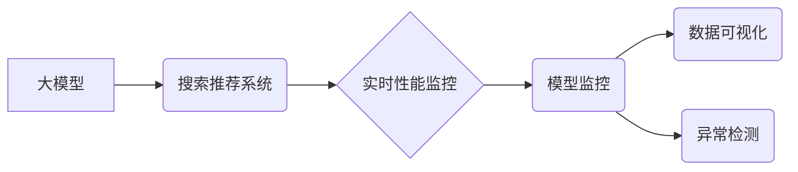

                 

## 搜索推荐系统的实时性能监控：大模型时代的新方法

> 关键词：搜索推荐系统、实时监控、大模型、性能指标、模型监控、数据可视化、异常检测

## 1. 背景介绍

随着人工智能技术的飞速发展，大模型在搜索推荐系统中的应用日益广泛。大模型能够学习更复杂的模式，提供更精准的推荐结果，显著提升用户体验。然而，大模型的复杂性也带来了新的挑战，特别是对于实时性能监控。传统监控方法难以有效应对大模型的动态变化和海量数据处理需求。

传统的搜索推荐系统性能监控主要关注以下指标：

* **召回率和精度:** 衡量推荐结果的准确性和相关性。
* **点击率和转化率:** 衡量用户对推荐结果的兴趣和行为。
* **延迟时间:** 衡量推荐结果返回的速度。

然而，大模型时代，这些指标的意义有所改变。大模型的训练和部署成本高昂，模型参数庞大，实时更新和调整变得更加复杂。因此，我们需要更加细粒度的监控指标，以全面了解大模型的性能和健康状态。

## 2. 核心概念与联系

### 2.1  大模型与搜索推荐系统

大模型是指参数量巨大的人工智能模型，通常拥有数十亿甚至数千亿个参数。它们能够学习更复杂的模式，在自然语言处理、图像识别、机器翻译等领域表现出色。

搜索推荐系统旨在根据用户的历史行为、偏好和上下文信息，推荐相关的内容或产品。大模型可以用于搜索结果排序、个性化推荐、内容生成等多个环节，显著提升推荐系统的性能和用户体验。

### 2.2  实时性能监控

实时性能监控是指对系统性能进行持续监测和分析，及时发现问题并采取措施进行修复。在搜索推荐系统中，实时性能监控对于保证用户体验、维护系统稳定性和优化推荐效果至关重要。

### 2.3  模型监控

模型监控是指对机器学习模型的性能和行为进行持续监测和分析，以确保模型的准确性、可靠性和安全性。在使用大模型的搜索推荐系统中，模型监控尤为重要，因为它可以帮助我们：

* **及时发现模型性能下降:** 大模型的性能可能会随着时间推移而下降，例如数据分布变化、模型参数漂移等。模型监控可以帮助我们及时发现这些问题，并采取措施进行修复。
* **识别模型异常行为:** 大模型可能会出现一些异常行为，例如输出不合理的结果、过度拟合等。模型监控可以帮助我们识别这些异常行为，并进行分析和调试。
* **评估模型风险:** 大模型可能会存在一些风险，例如偏见、公平性问题等。模型监控可以帮助我们评估这些风险，并采取措施进行 mitigation。

**核心概念与架构**



## 3. 核心算法原理 & 具体操作步骤

### 3.1  算法原理概述

实时性能监控的核心算法主要包括：

* **滑动窗口算法:** 用于计算一段时间内的平均值、最大值、最小值等统计指标。
* **异常检测算法:** 用于识别数据点或事件与正常行为的偏差。
* **聚类算法:** 用于将数据点根据相似性进行分组，识别潜在的模式和异常。

### 3.2  算法步骤详解

1. **数据采集:** 收集搜索推荐系统运行期间产生的各种数据，例如用户行为数据、模型预测结果、系统资源使用情况等。
2. **数据预处理:** 对采集到的数据进行清洗、转换和格式化，使其适合用于监控分析。
3. **指标计算:** 使用滑动窗口算法等计算实时性能指标，例如平均延迟时间、召回率变化趋势等。
4. **异常检测:** 使用异常检测算法识别性能指标的异常值，例如突然的延迟时间增加、点击率大幅下降等。
5. **数据可视化:** 使用图表、仪表盘等方式将监控数据进行可视化展示，方便用户直观地了解系统性能状态。
6. **报警机制:** 当监控指标超过预设阈值时，触发报警机制，通知相关人员进行处理。

### 3.3  算法优缺点

**优点:**

* **实时性:** 可以实时监测系统性能，及时发现问题。
* **细粒度:** 可以监控各种细粒度的指标，全面了解系统状态。
* **可视化:** 可以使用图表等方式直观展示监控数据，方便分析和理解。

**缺点:**

* **数据量大:** 需要处理海量数据，对系统资源要求较高。
* **算法复杂:** 需要选择合适的算法和参数，才能有效地监控系统性能。
* **维护成本高:** 需要持续维护和更新监控系统，才能保证其准确性和可靠性。

### 3.4  算法应用领域

实时性能监控算法广泛应用于各种领域，例如：

* **电商平台:** 监控商品推荐、用户行为、订单处理等环节的性能。
* **社交媒体:** 监控用户互动、内容推荐、广告投放等环节的性能。
* **金融机构:** 监控交易系统、风险控制、客户服务等环节的性能。
* **游戏行业:** 监控游戏服务器、玩家行为、游戏体验等环节的性能。

## 4. 数学模型和公式 & 详细讲解 & 举例说明

### 4.1  数学模型构建

实时性能监控的数学模型通常基于统计学和机器学习方法。

* **统计学模型:** 用于计算性能指标的平均值、方差、标准差等统计特征。
* **机器学习模型:** 用于识别异常值、预测未来性能趋势等。

### 4.2  公式推导过程

**滑动窗口算法:**

假设我们想要计算过去 $w$ 个时间步长的平均延迟时间，可以使用以下公式：

$$
\text{平均延迟时间} = \frac{1}{w} \sum_{i=t-w+1}^{t} \text{延迟时间}_i
$$

其中，$t$ 表示当前时间步长，$\text{延迟时间}_i$ 表示第 $i$ 个时间步长的延迟时间。

**异常检测算法:**

常用的异常检测算法包括：

* **z-score:** 计算数据点与平均值的标准差距离，超过一定阈值的点被视为异常值。

$$
z = \frac{x - \mu}{\sigma}
$$

其中，$x$ 表示数据点，$\mu$ 表示平均值，$\sigma$ 表示标准差。

* **Isolation Forest:** 将数据点随机隔离到树中，计算隔离所需的时间，时间越长，数据点越可能是异常值。

### 4.3  案例分析与讲解

**案例:** 假设我们监控一个搜索推荐系统的平均延迟时间，使用滑动窗口算法计算过去 100 个时间步长的平均值。如果平均延迟时间超过 200 毫秒，则触发报警机制。

**分析:**

* 滑动窗口算法可以实时计算平均延迟时间，并及时发现延迟时间变化趋势。
* 设置报警阈值可以帮助我们快速识别潜在的问题，并采取措施进行修复。

## 5. 项目实践：代码实例和详细解释说明

### 5.1  开发环境搭建

* **操作系统:** Linux 或 macOS
* **编程语言:** Python
* **库依赖:**

```python
pip install numpy pandas matplotlib scikit-learn
```

### 5.2  源代码详细实现

```python
import numpy as np
import pandas as pd
from sklearn.ensemble import IsolationForest

# 数据加载
data = pd.read_csv('delay_time.csv')

# 滑动窗口算法计算平均延迟时间
window_size = 100
data['avg_delay'] = data['delay_time'].rolling(window=window_size).mean()

# 异常检测算法
model = IsolationForest()
model.fit(data[['avg_delay']])
data['anomaly'] = model.predict(data[['avg_delay']])

# 数据可视化
import matplotlib.pyplot as plt
plt.plot(data['avg_delay'])
plt.xlabel('时间步长')
plt.ylabel('平均延迟时间')
plt.show()

# 报警机制
threshold = 200
for index, row in data.iterrows():
    if row['avg_delay'] > threshold and row['anomaly'] == -1:
        print(f'报警: 时间步长 {index}, 平均延迟时间 {row["avg_delay"]} 毫秒')
```

### 5.3  代码解读与分析

* 代码首先加载延迟时间数据，并使用滑动窗口算法计算过去 100 个时间步长的平均延迟时间。
* 然后，使用 IsolationForest 算法对平均延迟时间进行异常检测。
* 最后，使用 matplotlib 库进行数据可视化，并设置报警机制，当平均延迟时间超过阈值且被识别为异常值时，触发报警。

### 5.4  运行结果展示

运行代码后，会生成一个图表展示平均延迟时间变化趋势，并打印出超过阈值且被识别为异常值的报警信息。

## 6. 实际应用场景

### 6.1  电商平台

* 监控商品推荐的点击率、转化率、用户满意度等指标，及时发现推荐效果下降的问题。
* 监控用户行为数据，识别潜在的风险行为，例如恶意刷单、虚假交易等。
* 监控订单处理流程，确保订单及时配送，提高用户体验。

### 6.2  社交媒体

* 监控用户互动数据，例如点赞、评论、转发等，识别热门话题和用户兴趣。
* 监控内容推荐的点击率、分享率、用户停留时间等指标，优化内容推荐算法。
* 监控广告投放效果，提高广告精准度和转化率。

### 6.3  金融机构

* 监控交易系统性能，确保交易安全可靠。
* 监控风险控制模型，识别潜在的欺诈行为。
* 监控客户服务系统，提高客户满意度。

### 6.4  未来应用展望

随着大模型技术的不断发展，实时性能监控将发挥更加重要的作用。未来，我们可以期待以下应用场景：

* **个性化性能监控:** 根据用户的不同需求和行为模式，提供个性化的性能监控和报警机制。
* **主动式性能优化:** 利用机器学习算法，预测未来性能问题，并主动采取措施进行优化。
* **跨系统性能监控:** 将不同系统的数据进行整合，实现跨系统性能监控和分析。

## 7. 工具和资源推荐

### 7.1  学习资源推荐

* **书籍:**

* 《Deep Learning》 by Ian Goodfellow, Yoshua Bengio, and Aaron Courville
* 《Hands-On Machine Learning with Scikit-Learn, Keras & TensorFlow》 by Aurélien Géron

* **在线课程:**

* Coursera: Machine Learning by Andrew Ng
* Udacity: Deep Learning Nanodegree

### 7.2  开发工具推荐

* **Prometheus:** 开源监控和告警系统
* **Grafana:** 数据可视化平台
* **Elasticsearch:** 搜索和分析引擎

### 7.3  相关论文推荐

* **"Real-Time Monitoring of Deep Learning Models"** by  H. Wang et al.
* **"Towards Robustness in Deep Learning: A Survey"** by  A. Ilyas et al.

## 8. 总结：未来发展趋势与挑战

### 8.1  研究成果总结

本文介绍了搜索推荐系统在使用大模型时代的新型实时性能监控方法，包括核心概念、算法原理、代码实例以及实际应用场景。

### 8.2  未来发展趋势

* **更细粒度的监控指标:** 随着大模型的复杂性增加，我们需要更加细粒度的监控指标，例如模型参数变化、激活函数输出等。
* **更智能的监控算法:** 需要开发更智能的监控算法，例如基于强化学习的主动式性能优化算法。
* **更全面的监控体系:** 需要构建更全面的监控体系，将数据采集、分析、可视化、报警等环节进行整合。

### 8.3  面临的挑战

* **数据量大:** 大模型的训练和部署会产生海量数据，对存储和处理能力提出了更高的要求。
* **算法复杂:** 需要开发更复杂、更有效的监控算法，才能应对大模型的动态变化和复杂行为。
* **资源消耗:** 实时性能监控需要消耗大量的计算资源，需要寻找更有效的资源利用方案。

### 8.4  研究展望

未来，我们将继续研究大模型时代的新型实时性能监控方法，探索更智能、更全面的监控体系，为搜索推荐系统的稳定运行和性能优化提供更有效的保障。

## 9. 附录：常见问题与解答

**问题:** 如何选择合适的监控指标？

**解答:** 监控指标的选择应该根据具体的应用场景和系统需求进行。例如，对于电商平台，可以监控商品推荐的点击率、转化率、用户满意度等指标；对于社交媒体，可以监控用户互动数据、内容推荐效果等指标。

**问题:** 如何处理海量监控数据？

**解答:** 可以使用分布式存储和计算系统，例如 Hadoop、Spark 等，来处理海量监控数据。

**问题:** 如何提高监控算法的准确性？

**解答:** 可以使用更先进的机器学习算法，例如深度学习算法，来提高监控算法的准确性。


作者：禅与计算机程序设计艺术 / Zen and the Art of Computer Programming 
<end_of_turn>

