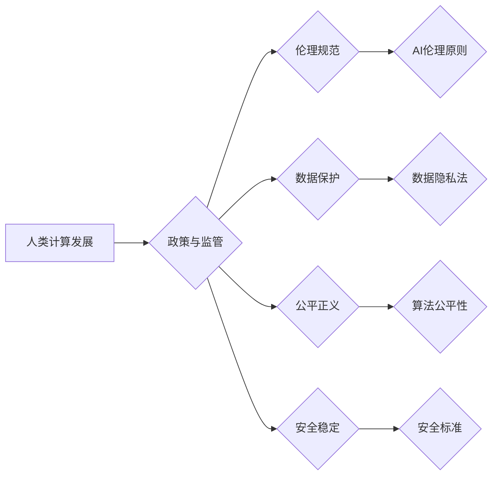

                 

## 政策与监管：引导人类计算的健康发展

> 关键词：人工智能、监管、伦理、可持续发展、法律框架、数据隐私、算法透明度、社会影响

### 1. 背景介绍

人类计算正处于一个前所未有的发展阶段。从深度学习的突破到量子计算的兴起，人工智能（AI）正在以惊人的速度改变着我们的世界。然而，这种飞速发展也带来了新的挑战和风险。如何确保AI技术的发展既能造福人类，又能避免潜在的负面影响，成为全球范围内亟待解决的问题。

政策与监管在引导人类计算健康发展中扮演着至关重要的角色。它们为AI技术的应用设定了边界，保障了公众利益，促进了技术创新与社会可持续发展。

### 2. 核心概念与联系

**2.1 核心概念**

* **人类计算:** 指人类与计算系统协同工作，共同完成复杂任务的范畴。它涵盖了从传统的人机交互到AI驱动的智能化协作，以及未来可能出现的融合生物与计算的新型计算模式。
* **政策:** 指政府或其他具有权威机构制定的规范性文件，用于指导社会行为，维护公共秩序和利益。
* **监管:** 指对特定领域或活动的监督和控制，以确保其符合既定的法律法规和社会规范。

**2.2 联系**

政策与监管是引导人类计算健康发展的必要保障。它们通过以下方式实现这一目标：

* **设定伦理边界:** 

AI技术的应用涉及到伦理、道德和社会价值观等复杂议题。政策与监管可以制定相关规范，确保AI技术的使用符合人类的伦理原则，避免潜在的危害。

* **保护个人隐私:** AI技术依赖于海量数据，而数据的收集、使用和存储都可能侵犯个人隐私。政策与监管可以制定数据保护法律法规，保障个人隐私权，防止数据滥用。
* **促进公平正义:** AI算法的训练数据和设计方式可能存在偏差，导致算法输出结果不公平或歧视性。政策与监管可以推动算法的公平性与透明度，确保AI技术在应用中不加剧社会不平等。
* **保障安全稳定:** AI技术的应用可能带来新的安全风险，例如网络攻击、无人驾驶事故等。政策与监管可以制定相应的安全标准和监管措施，降低AI技术带来的安全风险。

**2.3 流程图**



### 3. 核心算法原理 & 具体操作步骤

**3.1 算法原理概述**

在政策与监管领域，许多核心算法被用于分析数据、预测趋势、评估风险和制定决策。这些算法通常基于机器学习、深度学习和自然语言处理等技术。

* **机器学习:** 算法通过学习数据中的模式，自动识别和预测未知数据。
* **深度学习:** 算法使用多层神经网络，模拟人类大脑的学习过程，能够处理更复杂的数据和任务。
* **自然语言处理:** 算法能够理解和处理人类语言，用于文本分析、情感识别和对话系统等应用。

**3.2 算法步骤详解**

1. **数据收集:** 收集相关数据，例如法律法规、政策文件、社会舆情等。
2. **数据预处理:** 清洗、转换和格式化数据，使其适合算法训练。
3. **模型选择:** 根据任务需求选择合适的算法模型，例如分类、回归、聚类等。
4. **模型训练:** 使用训练数据训练算法模型，调整模型参数，使其能够准确预测或分类数据。
5. **模型评估:** 使用测试数据评估模型的性能，例如准确率、召回率、F1-score等。
6. **模型部署:** 将训练好的模型部署到实际应用场景中，用于分析数据、预测趋势、评估风险等。

**3.3 算法优缺点**

* **优点:** 能够自动分析大量数据，识别复杂模式，提高决策效率和准确性。
* **缺点:** 算法的性能依赖于训练数据的质量，数据偏差可能导致算法输出结果不准确或不公平。

**3.4 算法应用领域**

* **政策制定:** 分析社会问题、预测政策影响、优化政策方案。
* **法律法规解读:** 自动分析法律法规文本，识别关键信息，辅助法律研究和判决。
* **风险评估:** 识别潜在风险，评估风险等级，制定风险应对措施。
* **监管执法:** 自动监控违规行为，提高监管效率和准确性。

### 4. 数学模型和公式 & 详细讲解 & 举例说明

**4.1 数学模型构建**

在政策与监管领域，可以使用数学模型来描述和分析复杂系统，例如社会网络、经济系统、法律法规体系等。

例如，可以使用图论模型来描述法律法规之间的关系，分析法律法规的相互依赖性和冲突性。可以使用博弈论模型来分析政府和企业之间的博弈关系，预测政策的影响和企业行为。

**4.2 公式推导过程**

例如，在分析政策影响时，可以使用线性回归模型来预测政策实施后社会经济指标的变化。

假设政策实施后，社会经济指标X的变化量为ΔX，政策实施强度为Y，则可以使用以下公式进行预测：

ΔX = β0 + β1 * Y + ε

其中，β0和β1为回归系数，ε为随机误差项。

通过对历史数据进行回归分析，可以估计出β0和β1的值，从而预测政策实施后社会经济指标的变化趋势。

**4.3 案例分析与讲解**

例如，可以使用机器学习算法来分析社会舆情，预测政策的公众接受度。

可以通过收集和分析社交媒体数据、新闻报道等，训练一个分类模型，识别公众对政策的正面、负面或中立态度。

通过分析模型的预测结果，政府可以了解公众对政策的看法，及时调整政策方案，提高政策的有效性和可行性。

### 5. 项目实践：代码实例和详细解释说明

**5.1 开发环境搭建**

* 操作系统: Ubuntu 20.04 LTS
* Python 版本: 3.8.10
* 必要的库: pandas, numpy, scikit-learn, matplotlib

**5.2 源代码详细实现**

```python
import pandas as pd
from sklearn.linear_model import LinearRegression

# 加载数据
data = pd.read_csv('policy_data.csv')

# 准备数据
X = data[['policy_strength']]
y = data['economic_impact']

# 创建线性回归模型
model = LinearRegression()

# 训练模型
model.fit(X, y)

# 预测政策影响
new_policy_strength = 5
predicted_impact = model.predict([[new_policy_strength]])

# 打印预测结果
print(f'预测的经济影响: {predicted_impact[0]}')
```

**5.3 代码解读与分析**

* 代码首先加载数据，并选择需要使用的特征和目标变量。
* 然后创建线性回归模型，并使用训练数据训练模型。
* 最后使用训练好的模型预测新的政策强度下的经济影响。

**5.4 运行结果展示**

运行代码后，会输出预测的经济影响值。

### 6. 实际应用场景

**6.1 政策制定**

* 预测政策实施后社会经济指标的变化趋势，帮助政府制定更有效的政策方案。
* 分析公众对政策的看法，了解政策的潜在影响，及时调整政策方案。

**6.2 法律法规解读**

* 自动分析法律法规文本，识别关键信息，辅助法律研究和判决。
* 识别法律法规之间的相互依赖性和冲突性，帮助政府制定更完善的法律法规体系。

**6.3 风险评估**

* 识别潜在风险，评估风险等级，制定风险应对措施。
* 预测风险发生的可能性和影响程度，帮助政府制定更有效的风险管理策略。

**6.4 未来应用展望**

* 利用人工智能技术，实现更智能化的政策制定、法律法规解读和风险评估。
* 开发更精准的预测模型，提高政策的有效性和可行性。
* 利用数据分析技术，更好地了解社会问题，制定更针对性的解决方案。

### 7. 工具和资源推荐

**7.1 学习资源推荐**

* **书籍:**

《人工智能：一种现代方法》

《深度学习》

《机器学习》

* **在线课程:**

Coursera, edX, Udacity

**7.2 开发工具推荐**

* Python
* Jupyter Notebook
* TensorFlow
* PyTorch

**7.3 相关论文推荐**

* **人工智能伦理:**

《人工智能的伦理挑战》

* **数据隐私保护:**

《数据隐私的法律和技术挑战》

* **算法公平性:**

《算法偏见和公平性》

### 8. 总结：未来发展趋势与挑战

**8.1 研究成果总结**

政策与监管在引导人类计算健康发展中发挥着至关重要的作用。人工智能技术为政策制定、法律法规解读、风险评估等领域提供了新的工具和方法，提高了效率和准确性。

**8.2 未来发展趋势**

* **更智能化的政策制定:** 利用人工智能技术，实现更精准的政策预测和评估，制定更有效的政策方案。
* **更完善的法律法规体系:** 利用人工智能技术，自动分析法律法规文本，识别关键信息，帮助政府制定更完善的法律法规体系。
* **更有效的风险管理:** 利用人工智能技术，识别潜在风险，评估风险等级，制定更有效的风险应对措施。

**8.3 面临的挑战**

* **算法透明度和可解释性:** 确保人工智能算法的透明度和可解释性，避免算法决策的不可理解和不可控。
* **数据安全和隐私保护:** 确保人工智能算法训练数据的安全性和隐私保护，避免数据滥用和泄露。
* **伦理和社会影响:** 关注人工智能技术的伦理和社会影响，避免算法决策导致的歧视、偏见和社会不平等。

**8.4 研究展望**

未来，需要加强人工智能技术与政策与监管领域的融合研究，探索人工智能技术在政策制定、法律法规解读、风险评估等领域的更广泛应用，并制定相应的伦理规范和监管措施，确保人工智能技术的发展造福人类。

### 9. 附录：常见问题与解答

**9.1 如何确保人工智能算法的公平性？**

* 使用多元化的训练数据，避免数据偏差。
* 定期评估算法的公平性，识别和解决算法偏见。
* 开发可解释的算法模型，提高算法决策的透明度。

**9.2 如何保护人工智能算法训练数据的隐私？**

* 使用匿名化技术，去除数据中的个人识别信息。
* 加密数据存储和传输，防止数据泄露。
* 制定数据使用协议，明确数据使用范围和权限。

**9.3 如何应对人工智能技术的伦理挑战？**

* 制定人工智能伦理规范，指导人工智能技术的发展和应用。
* 建立人工智能伦理审查机制，评估人工智能技术的潜在风险和影响。
* 加强公众对人工智能伦理的教育和宣传，促进社会对人工智能技术的理性认识。


作者：禅与计算机程序设计艺术 / Zen and the Art of Computer Programming 
<end_of_turn>

