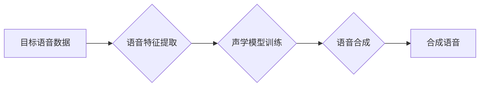

                 

## 数字化声音克隆创业：个性化语音定制

> 关键词：声音克隆、语音合成、深度学习、文本到语音、个性化定制、创业机会

## 1. 背景介绍

近年来，人工智能技术飞速发展，语音合成技术取得了突破性进展。深度学习算法的应用使得语音合成更加逼真自然，并逐渐摆脱了早期机械、单调的语音特点。 

声音克隆技术作为语音合成技术的子领域，利用深度学习算法对目标语音进行分析和学习，生成与目标语音高度相似的合成语音。它打破了传统语音合成技术对声源的限制，为个性化语音定制提供了全新的可能性。

声音克隆技术在多个领域展现出巨大的应用潜力，例如：

* **娱乐行业:**  虚拟主播、游戏角色、影视配音等，可以利用声音克隆技术打造更加个性化、逼真的虚拟角色。
* **教育行业:**  个性化语音学习助手、智能朗读软件等，可以根据学生的学习进度和特点，提供更加精准的语音指导和反馈。
* **商业领域:**  客服机器人、语音广告、个性化营销等，可以利用声音克隆技术打造更加个性化、贴近用户的品牌形象和营销策略。

随着声音克隆技术的不断发展和成熟，其商业化应用前景广阔，为创业者提供了新的机遇。

## 2. 核心概念与联系

声音克隆的核心概念是利用深度学习算法，从目标语音数据中学习目标语音的声学特征，并生成与目标语音高度相似的合成语音。

**声音克隆技术架构**



**核心概念解释:**

* **目标语音数据:**  用于训练声学模型的语音数据，可以是目标人物的录音、音频文件等。
* **语音特征提取:**  从目标语音数据中提取声学特征，例如梅尔频率倒谱系数 (MFCC)、线性预测系数 (LPC) 等。
* **声学模型训练:**  利用提取的语音特征训练深度学习模型，例如循环神经网络 (RNN)、变分自编码器 (VAE) 等，学习目标语音的声学规律。
* **语音合成:**  利用训练好的声学模型，根据文本输入生成与目标语音相似的合成语音。
* **合成语音:**  生成的与目标语音高度相似的语音音频文件。

## 3. 核心算法原理 & 具体操作步骤

### 3.1  算法原理概述

声音克隆的核心算法原理是利用深度学习技术，特别是循环神经网络 (RNN) 和变分自编码器 (VAE) 等模型，学习目标语音的声学特征，并生成与目标语音相似的合成语音。

* **循环神经网络 (RNN):** RNN 是一种能够处理序列数据的深度学习模型，其内部结构包含循环单元，能够记忆之前的信息，从而更好地捕捉语音信号中的时序特征。
* **变分自编码器 (VAE):** VAE 是一种生成模型，能够学习数据分布的潜在表示，并根据潜在表示生成新的数据。在声音克隆中，VAE 可以用于学习目标语音的声学特征，并生成新的语音信号。

### 3.2  算法步骤详解

1. **数据收集和预处理:** 收集目标语音数据，并进行预处理，例如去噪、分段、特征提取等。
2. **声学模型训练:** 利用深度学习框架 (例如 TensorFlow、PyTorch) 和训练数据，训练 RNN 或 VAE 模型，学习目标语音的声学特征。
3. **模型评估:** 利用测试数据评估模型的性能，例如语音质量、相似度等。
4. **语音合成:** 利用训练好的声学模型，根据文本输入生成与目标语音相似的合成语音。

### 3.3  算法优缺点

**优点:**

* **高逼真度:** 深度学习算法能够学习目标语音的复杂声学特征，生成逼真的合成语音。
* **个性化定制:** 可以根据不同的目标语音数据，生成不同的个性化合成语音。
* **应用广泛:** 在娱乐、教育、商业等多个领域都有广泛的应用前景。

**缺点:**

* **数据依赖:** 声音克隆算法需要大量的目标语音数据进行训练，数据质量和数量直接影响合成语音的质量。
* **计算资源需求高:** 训练深度学习模型需要大量的计算资源和时间。
* **伦理问题:** 声音克隆技术可能被用于恶意用途，例如身份盗窃、虚假信息传播等，需要引起足够的重视和监管。

### 3.4  算法应用领域

* **虚拟助手:**  个性化语音助手，例如智能家居助手、虚拟客服等。
* **游戏角色:**  游戏角色的语音合成，例如NPC、游戏主角等。
* **影视配音:**  影视作品的配音，例如动画片、电视剧等。
* **教育培训:**  个性化语音学习助手、智能朗读软件等。
* **广播电视:**  新闻播报、节目配音等。

## 4. 数学模型和公式 & 详细讲解 & 举例说明

### 4.1  数学模型构建

声音克隆算法通常采用变分自编码器 (VAE) 模型进行构建。VAE 模型由编码器和解码器两部分组成。

* **编码器:** 将输入的语音信号编码成一个低维的潜在表示 (latent representation)。
* **解码器:** 根据潜在表示解码生成新的语音信号。

### 4.2  公式推导过程

VAE 模型的目标是最大化潜在表示的似然概率，并最小化重建误差。

* **似然概率:**  $p(x|z)$，表示给定潜在表示 $z$，生成输入语音信号 $x$ 的概率。
* **重建误差:**  $D(x, \hat{x})$，表示输入语音信号 $x$ 和解码器生成的语音信号 $\hat{x}$ 之间的差异。

VAE 模型的损失函数通常定义为：

$$
L(x, z) = D(x, \hat{x}) + KL(p(z) || q(z))
$$

其中：

* $D(x, \hat{x})$ 是重建误差。
* $KL(p(z) || q(z))$ 是 KL 散度，表示潜在表示 $z$ 的分布 $p(z)$ 和编码器生成的分布 $q(z)$ 之间的差异。

### 4.3  案例分析与讲解

假设我们想要克隆一个人的语音，我们可以收集该人的语音数据，并将其作为训练数据。训练好的 VAE 模型可以根据文本输入，生成与目标语音相似的合成语音。例如，我们可以输入文本 "你好，世界！"，并利用训练好的 VAE 模型生成该文本对应的目标语音合成语音。

## 5. 项目实践：代码实例和详细解释说明

### 5.1  开发环境搭建

* **操作系统:**  Linux、macOS 或 Windows
* **编程语言:**  Python
* **深度学习框架:**  TensorFlow 或 PyTorch
* **语音处理库:**  Librosa、PyDub 等

### 5.2  源代码详细实现

```python
# 使用 TensorFlow 实现 VAE 模型

import tensorflow as tf

# 定义编码器模型
encoder = tf.keras.Sequential([
    tf.keras.layers.Input(shape=(audio_length,)),
    tf.keras.layers.Dense(128, activation='relu'),
    tf.keras.layers.Dense(latent_dim)
])

# 定义解码器模型
decoder = tf.keras.Sequential([
    tf.keras.layers.Input(shape=(latent_dim,)),
    tf.keras.layers.Dense(128, activation='relu'),
    tf.keras.layers.Dense(audio_length)
])

# 定义 VAE 模型
vae = tf.keras.Model(inputs=encoder.input, outputs=decoder(encoder.output))

# 定义损失函数
reconstruction_loss = tf.keras.losses.MeanSquaredError()
kl_loss = tf.keras.losses.KLDivergence()

def vae_loss(x, x_recon):
    reconstruction_loss_value = reconstruction_loss(x, x_recon)
    kl_loss_value = kl_loss(tf.distributions.Normal(loc=0, scale=1), encoder.output)
    return reconstruction_loss_value + kl_loss_value

# 训练 VAE 模型
vae.compile(optimizer='adam', loss=vae_loss)
vae.fit(audio_data, audio_data, epochs=100)

# 使用训练好的 VAE 模型生成合成语音
text = "你好，世界！"
latent_representation = encoder.predict(text)
synthetic_audio = decoder.predict(latent_representation)
```

### 5.3  代码解读与分析

* **编码器:** 将输入的语音信号编码成一个低维的潜在表示。
* **解码器:** 根据潜在表示解码生成新的语音信号。
* **VAE 模型:** 将编码器和解码器组合在一起，形成一个完整的 VAE 模型。
* **损失函数:** 定义了 VAE 模型的训练目标，包括重建误差和 KL 散度。
* **训练过程:** 利用训练数据训练 VAE 模型，使其能够生成与目标语音相似的合成语音。
* **合成语音生成:** 利用训练好的 VAE 模型，根据文本输入生成合成语音。

### 5.4  运行结果展示

训练好的 VAE 模型可以根据文本输入，生成与目标语音相似的合成语音。生成的合成语音可以保存为音频文件，并进行播放或其他处理。

## 6. 实际应用场景

### 6.1  虚拟助手

声音克隆技术可以用于打造个性化虚拟助手，例如智能家居助手、虚拟客服等。用户可以根据自己的喜好选择目标语音，定制自己的虚拟助手。

### 6.2  游戏角色

声音克隆技术可以用于游戏角色的语音合成，例如NPC、游戏主角等。游戏开发者可以使用声音克隆技术，为游戏角色赋予更加逼真的语音，提升玩家的游戏体验。

### 6.3  影视配音

声音克隆技术可以用于影视作品的配音，例如动画片、电视剧等。配音演员可以使用声音克隆技术，快速生成不同角色的语音，提高配音效率。

### 6.4  未来应用展望

随着声音克隆技术的不断发展，其应用场景将会更加广泛，例如：

* **个性化教育:**  根据学生的学习进度和特点，提供个性化的语音指导和反馈。
* **远程医疗:**  利用声音克隆技术，模拟医生的语音，为患者提供远程医疗服务。
* **数字遗产:**  利用声音克隆技术，保存逝者的声音，让他们的声音能够继续陪伴家人和朋友。

## 7. 工具和资源推荐

### 7.1  学习资源推荐

* **书籍:**
    * Deep Learning by Ian Goodfellow, Yoshua Bengio, and Aaron Courville
    * Speech and Language Processing by Daniel Jurafsky and James H. Martin
* **在线课程:**
    * Coursera: Deep Learning Specialization
    * Udacity: Deep Learning Nanodegree
* **博客和论坛:**
    * TensorFlow Blog
    * PyTorch Blog
    * Reddit: r/MachineLearning

### 7.2  开发工具推荐

* **深度学习框架:**
    * TensorFlow
    * PyTorch
* **语音处理库:**
    * Librosa
    * PyDub
* **文本处理库:**
    * NLTK
    * SpaCy

### 7.3  相关论文推荐

* **Generative Adversarial Networks** by Ian Goodfellow et al. (2014)
* **Auto-Encoding Variational Bayes** by Diederik P. Kingma and Max Welling (2013)
* **Tacotron 2: End-to-End Text-to-Speech Synthesis** by Jonathan S. Chen et al. (2017)

## 8. 总结：未来发展趋势与挑战

### 8.1  研究成果总结

声音克隆技术近年来取得了显著进展，能够生成逼真的合成语音，并应用于多个领域。

### 8.2  未来发展趋势

* **更高质量的合成语音:**  随着深度学习算法的不断发展，声音克隆技术将能够生成更加逼真、自然的人声。
* **更广泛的应用场景:**  声音克隆技术将应用于更多领域，例如教育、医疗、娱乐等。
* **个性化定制:**  用户将能够根据自己的喜好定制自己的声音，例如改变声调、语速等。

### 8.3  面临的挑战

* **数据依赖:**  声音克隆算法需要大量的目标语音数据进行训练，数据质量和数量直接影响合成语音的质量。
* **计算资源需求高:**  训练深度学习模型需要大量的计算资源和时间。
* **伦理问题:**  声音克隆技术可能被用于恶意用途，例如身份盗窃、虚假信息传播等，需要引起足够的重视和监管。

### 8.4  研究展望

未来，声音克隆技术将继续朝着更高质量、更广泛应用、更个性化的方向发展。研究者将致力于解决数据依赖、计算资源需求高、伦理问题等挑战，推动声音克隆技术在更多领域得到应用。

## 9. 附录：常见问题与解答

### 9.1  声音克隆技术是否会取代人类配音演员？

声音克隆技术可以提高配音效率，但它并不会完全取代人类配音演员。人类配音演员能够根据剧本的情感和意境，为角色赋予更加丰富的表现力，而声音克隆技术目前还无法完全模拟人类的表达能力。

### 9.2  声音克隆技术是否会侵犯个人隐私？

声音克隆技术可能会被用于侵犯个人隐私，例如利用他人声音进行身份盗窃。因此，需要制定相应的法律法规和伦理规范，规范声音克隆技术的应用，保护个人隐私。


作者：禅与计算机程序设计艺术 / Zen and the Art of Computer Programming 


<end_of_turn>

