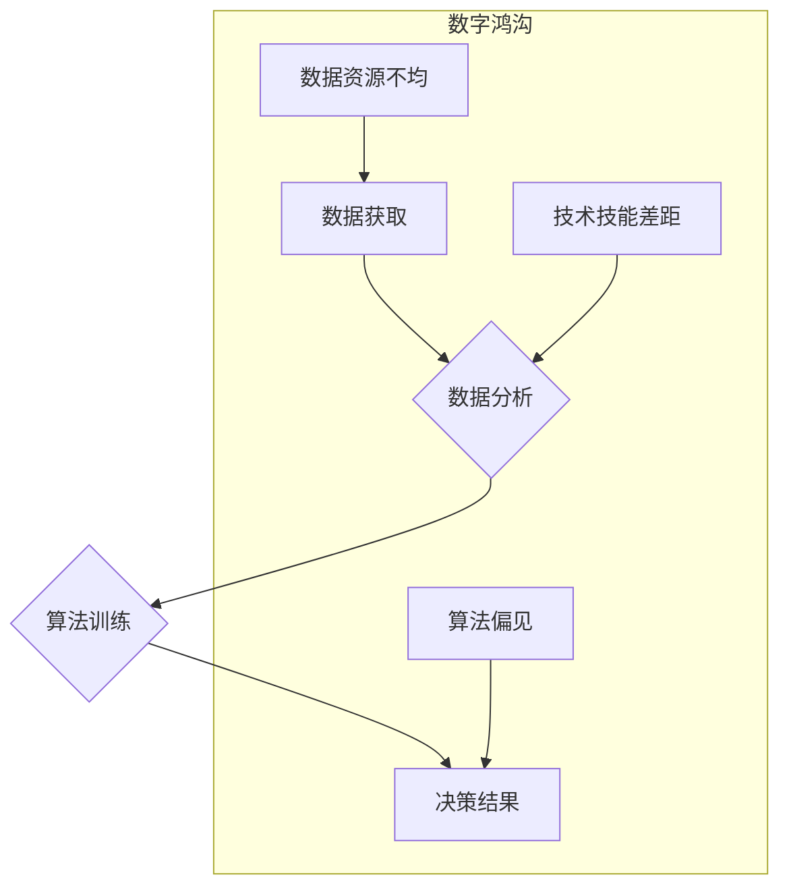

                 

## 数字鸿沟：弥合人类计算中的不平等

> 关键词：数字鸿沟、计算不平等、人工智能、数据科学、算法公平性、可解释性、伦理

### 1. 背景介绍

在信息时代，计算能力已成为人类社会发展的重要驱动力。从智能手机到自动驾驶，从医疗诊断到金融交易，计算技术无处不在，深刻地改变着我们的生活方式和社会结构。然而，随着计算技术的飞速发展，一个不容忽视的问题逐渐浮出水面：**数字鸿沟**。

数字鸿沟是指在社会中不同群体对信息技术和网络资源的获取、使用和利用能力存在显著差异的现象。这种差异不仅体现在经济发展水平、教育程度和地理位置等方面，更深刻地反映了社会结构、权力关系和文化差异等因素的影响。

在计算领域，数字鸿沟表现为：

* **数据获取和利用不平等:** 拥有大量数据资源的机构和个人，能够利用数据驱动算法训练，获得更精准的预测和决策，从而获得更大的竞争优势。而数据获取有限的群体，则难以参与到数据驱动的决策过程中，面临着被边缘化和被剥夺的风险。
* **算法偏见和歧视:** 算法的训练数据往往反映了社会中的偏见和歧视，导致算法在应用过程中产生不公平的结果。例如，在招聘、贷款、司法等领域，算法可能对特定群体产生歧视，加剧社会不平等。
* **技术技能差距:** 掌握计算技术和数据科学技能的人群，能够更好地利用计算资源，创造新的价值。而缺乏技术技能的群体，则难以适应数字经济的发展，面临着失业和社会隔离的风险。

### 2. 核心概念与联系

数字鸿沟的形成是一个复杂的多因素互动的结果，涉及到技术、经济、社会和伦理等多个方面。

**2.1 数字鸿沟的形成机制**

数字鸿沟的形成机制可以概括为以下几个方面：

* **技术因素:** 计算技术的发展速度快，成本不断降低，但并非所有人都能够平等地获取和使用这些技术。
* **经济因素:** 经济发展水平、收入分配不均等因素，导致不同群体对信息技术和网络资源的获取能力存在差异。
* **社会因素:** 教育水平、文化背景、社会网络等因素，影响着人们对信息技术的接受度和使用能力。
* **伦理因素:** 算法偏见、数据隐私等伦理问题，加剧了数字鸿沟的形成和恶化。

**2.2 数字鸿沟的危害**

数字鸿沟的危害是多方面的：

* **加剧社会不平等:** 数字鸿沟导致不同群体在经济、社会、文化等方面存在更大的差距，加剧社会不平等。
* **阻碍经济发展:** 数字鸿沟限制了信息技术在经济发展中的应用，阻碍了经济增长和创新。
* **削弱社会凝聚力:** 数字鸿沟导致不同群体之间的信息隔阂和沟通障碍，削弱了社会凝聚力和社会稳定。

**2.3 数字鸿沟的解决方案**

弥合数字鸿沟是一个系统工程，需要多方共同努力。

* **政府层面:** 政府应制定相关政策，促进信息技术普及，提高全民数字素养，保障数据安全和隐私，规范算法应用，防止算法歧视。
* **企业层面:** 企业应承担社会责任，开发更加公平、透明、可解释的算法，提供更加便捷、易用的信息技术产品和服务，帮助更多人参与到数字经济中。
* **个人层面:** 个人应积极学习信息技术和数据科学知识，提升自己的数字素养，理性使用信息技术，保护自己的数据安全和隐私。

**2.4 数字鸿沟的未来趋势**

随着人工智能、大数据、云计算等技术的快速发展，数字鸿沟将更加深刻地影响人类社会。我们需要更加重视数字鸿沟问题，采取更加有效的措施，才能确保信息技术造福于全体人类。

**2.5 Mermaid 流程图**



### 3. 核心算法原理 & 具体操作步骤

### 3.1 算法原理概述

为了更好地理解数字鸿沟，我们需要深入了解一些核心算法原理，例如机器学习算法、深度学习算法、自然语言处理算法等。这些算法在数据分析、决策预测、信息处理等方面发挥着重要作用，但也可能存在偏见和歧视。

**3.1.1 机器学习算法**

机器学习算法是一种能够从数据中学习并不断改进的算法。它可以分为监督学习、非监督学习和强化学习三大类。

* **监督学习:** 利用标记数据训练模型，预测新的数据标签。例如，图像分类、文本分类等。
* **非监督学习:** 从无标记数据中发现模式和结构。例如，聚类分析、降维分析等。
* **强化学习:** 通过试错学习，在环境中获得最大奖励。例如，游戏AI、机器人控制等。

**3.1.2 深度学习算法**

深度学习算法是一种基于多层神经网络的机器学习算法。它能够学习更复杂的特征表示，在图像识别、语音识别、自然语言处理等领域取得了突破性进展。

**3.1.3 自然语言处理算法**

自然语言处理算法能够理解和处理人类语言。它包括文本分类、情感分析、机器翻译等应用。

### 3.2 算法步骤详解

**3.2.1 机器学习算法步骤**

1. **数据收集和预处理:** 收集相关数据，并进行清洗、转换、特征提取等预处理操作。
2. **模型选择:** 根据具体任务选择合适的机器学习算法模型。
3. **模型训练:** 利用标记数据训练模型参数，使模型能够准确预测新的数据标签。
4. **模型评估:** 使用测试数据评估模型的性能，例如准确率、召回率、F1-score等。
5. **模型调优:** 根据评估结果调整模型参数，提高模型性能。
6. **模型部署:** 将训练好的模型部署到实际应用场景中。

**3.2.2 深度学习算法步骤**

1. **数据收集和预处理:** 与机器学习算法类似，需要收集相关数据并进行预处理。
2. **网络结构设计:** 设计多层神经网络结构，包括输入层、隐藏层和输出层。
3. **模型训练:** 利用标记数据训练神经网络参数，使模型能够学习复杂的特征表示。
4. **模型评估:** 使用测试数据评估模型的性能，例如准确率、损失函数等。
5. **模型调优:** 根据评估结果调整网络结构、学习率等参数，提高模型性能。
6. **模型部署:** 将训练好的模型部署到实际应用场景中。

### 3.3 算法优缺点

**3.3.1 机器学习算法**

* **优点:** 能够从数据中学习，不断改进；适用范围广；可解释性相对较高。
* **缺点:** 需要大量的标记数据进行训练；容易受到数据噪声的影响；对数据特征工程要求较高。

**3.3.2 深度学习算法**

* **优点:** 能够学习更复杂的特征表示；在图像识别、语音识别等领域取得了突破性进展。
* **缺点:** 需要大量的计算资源进行训练；可解释性较低；容易受到数据偏差的影响。

### 3.4 算法应用领域

机器学习和深度学习算法广泛应用于各个领域，例如：

* **医疗保健:** 疾病诊断、药物研发、个性化医疗
* **金融服务:** 风险评估、欺诈检测、投资决策
* **交通运输:** 自动驾驶、交通流量预测、物流优化
* **教育:** 个性化学习、智能辅导、考试评分
* **娱乐:** 内容推荐、游戏AI、虚拟现实

### 4. 数学模型和公式 & 详细讲解 & 举例说明

### 4.1 数学模型构建

为了更好地理解数字鸿沟的形成机制和影响因素，我们可以构建一些数学模型来进行分析和预测。例如，我们可以构建一个基于社会网络的数字鸿沟模型，来分析不同群体之间的信息流动和资源分配情况。

**4.1.1 社会网络模型**

我们可以将社会网络表示为一个图结构，其中节点代表个人或群体，边代表信息流动或资源共享关系。

* **节点属性:** 可以包含个人或群体的特征信息，例如年龄、性别、教育程度、收入水平、技术技能等。
* **边属性:** 可以包含信息流动量、资源共享程度、信任关系等信息。

通过分析节点属性和边属性，我们可以了解不同群体之间的连接强度、信息流动模式、资源分配情况等，从而揭示数字鸿沟的形成机制。

### 4.2 公式推导过程

我们可以利用一些数学公式来量化数字鸿沟的程度。例如，我们可以使用**gini系数**来衡量社会收入分配不平等，也可以使用**信息熵**来衡量信息流动的不均衡性。

**4.2.1 Gini系数**

Gini系数是一个介于0和1之间的指标，用来衡量收入分配不平等程度。

* Gini系数 = 0 表示收入完全平等，所有人的收入相同。
* Gini系数 = 1 表示收入完全不平等，一个人拥有所有收入。

**4.2.2 信息熵**

信息熵是一个用来衡量信息不确定性的指标。

* 信息熵 = - Σ p(x) * log2(p(x))

其中，p(x) 是事件x发生的概率。

信息熵越大，表示信息的不确定性越大，信息流动越不均衡。

### 4.3 案例分析与讲解

我们可以通过一些案例分析来更好地理解数字鸿沟的具体表现和影响。例如，我们可以分析不同地区的人口互联网普及率、不同职业群体的数字技能水平、不同收入阶层的互联网使用情况等。

**4.3.1 案例：互联网普及率**

我们可以收集不同地区的互联网普及率数据，分析不同地区的人口互联网使用情况。

* **结果:** 我们可以发现，发达地区的人口互联网普及率普遍较高，而欠发达地区的人口互联网普及率则相对较低。

**4.3.2 案例：数字技能水平**

我们可以调查不同职业群体的数字技能水平，分析不同职业群体的技术能力差异。

* **结果:** 我们可以发现，科技行业、金融行业等高技术行业的人员数字技能水平普遍较高，而农业、服务业等传统行业的人员数字技能水平则相对较低。

### 5. 项目实践：代码实例和详细解释说明

为了更好地理解数字鸿沟的形成机制和影响因素，我们可以开发一些项目来进行实践研究。例如，我们可以开发一个基于社会网络的数字鸿沟模拟器，来模拟不同群体之间的信息流动和资源分配情况。

### 5.1 开发环境搭建

* **操作系统:** Linux、Windows、macOS
* **编程语言:** Python
* **开发工具:** Jupyter Notebook、VS Code
* **数据源:** 社会网络数据、人口统计数据、经济数据

### 5.2 源代码详细实现

```python
# 模拟社会网络
class Node:
    def __init__(self, id, attributes):
        self.id = id
        self.attributes = attributes
        self.neighbors = []

class Graph:
    def __init__(self):
        self.nodes = []

    def add_node(self, node):
        self.nodes.append(node)

    def add_edge(self, node1, node2):
        node1.neighbors.append(node2)
        node2.neighbors.append(node1)

# 模拟信息流动
def simulate_information_flow(graph):
    # ...

# 模拟资源分配
def simulate_resource_allocation(graph):
    # ...

# 分析数字鸿沟
def analyze_digital_divide(graph):
    # ...

# 实例化社会网络
graph = Graph()
# 添加节点
# ...
# 添加边
# ...
# 模拟信息流动
simulate_information_flow(graph)
# 模拟资源分配
simulate_resource_allocation(graph)
# 分析数字鸿沟
analyze_digital_divide(graph)
```

### 5.3 代码解读与分析

这段代码展示了一个简单的社会网络模拟器，它可以模拟不同群体之间的信息流动和资源分配情况。

* **Node类:** 代表一个社会网络中的节点，每个节点都有一个ID和一些属性，例如年龄、性别、教育程度等。
* **Graph类:** 代表一个社会网络，它包含多个节点和边。
* **simulate_information_flow()函数:** 模拟信息在社会网络中的流动过程。
* **simulate_resource_allocation()函数:** 模拟资源在社会网络中的分配过程。
* **analyze_digital_divide()函数:** 分析数字鸿沟的程度，例如信息流动不均衡、资源分配不均等。

### 5.4 运行结果展示

通过运行这段代码，我们可以得到一些关于数字鸿沟的模拟结果，例如不同群体之间的信息流动量、资源分配情况等。这些结果可以帮助我们更好地理解数字鸿沟的形成机制和影响因素。

### 6. 实际应用场景

数字鸿沟的解决方案需要从多个方面入手，例如：

* **政府层面:** 政府可以制定相关政策，促进信息技术普及，提高全民数字素养，保障数据安全和隐私，规范算法应用，防止算法歧视。
* **企业层面:** 企业可以开发更加公平、透明、可解释的算法，提供更加便捷、易用的信息技术产品和服务，帮助更多人参与到数字经济中。
* **个人层面:** 个人可以积极学习信息技术和数据科学知识，提升自己的数字素养，理性使用信息技术，保护自己的数据安全和隐私。

### 6.4 未来应用展望

随着人工智能、大数据、云计算等技术的快速发展，数字鸿沟将更加深刻地影响人类社会。我们需要更加重视数字鸿沟问题，采取更加有效的措施，才能确保信息技术造福于全体人类。

### 7. 工具和资源推荐

### 7.1 学习资源推荐

* **在线课程:** Coursera、edX、Udacity等平台提供丰富的机器学习、深度学习、数据科学等课程。
* **书籍:** 《深入理解深度学习》、《Python机器学习实战》、《数据科学入门》等书籍。
* **开源项目:** TensorFlow、PyTorch、Scikit-learn等开源项目可以帮助你学习和实践机器学习算法。

### 7.2 开发工具推荐

* **编程语言:** Python、R、Java等编程语言。
* **开发环境:** Jupyter Notebook、VS Code、PyCharm等开发环境。
* **数据分析工具:** Pandas、NumPy、SciPy等数据分析工具。

### 7.3 相关论文推荐

* **机器学习:** 《机器学习》 by Tom Mitchell
* **深度学习:** 《深度学习》 by Ian Goodfellow
* **数据科学:** 《数据科学方法》 by Peter Bruce

### 8. 总结：未来发展趋势与挑战

### 8.1 研究成果总结

数字鸿沟是一个复杂的多因素互动的结果，需要多方共同努力才能解决。

* **技术方面:** 算法公平性、可解释性、数据隐私保护等技术研究将更加重要。
* **社会方面:** 提高全民数字素养、促进信息技术普及、缩小社会经济差距等社会措施将更加关键。
* **伦理方面:** 算法伦理、数据伦理、人工智能伦理等伦理问题将更加突出。

### 8.2 未来发展趋势

数字鸿沟的解决方案将更加注重以下几个方面：

* **个性化学习:** 利用人工智能技术，为不同群体提供个性化的学习资源和服务。
* **数字技能培训:** 加强数字技能培训，帮助更多人掌握信息技术和数据科学知识。
* **公平算法设计:** 开发更加公平、透明、可解释的算法，防止算法歧视。
* **数据共享与开放:** 促进数据共享和开放，打破数据孤岛，促进数据驱动的创新。

### 8.3 面临的挑战

弥合数字鸿沟面临着一些挑战：

* **技术挑战:** 如何开发更加公平、透明、可解释的算法，如何保障数据安全和隐私，如何降低信息技术成本等。
* **社会挑战:** 如何提高全民数字素养，如何缩小社会经济差距，如何促进信息技术公平使用等。
* **伦理挑战:** 如何解决算法伦理、数据伦理、人工智能伦理等伦理问题。

### 8.4 研究展望

未来，我们需要更加深入地研究数字鸿沟的形成机制和影响因素，开发更加有效的解决方案，确保信息技术造福于全体人类。

### 9. 附录：常见问题与解答

### 9.1 常见问题

* **什么是数字鸿沟？**

数字鸿沟是指在社会中不同群体对信息技术和网络资源的获取、使用和利用能力存在显著差异的现象。

* **数字鸿沟有哪些危害？**

数字鸿沟会导致社会不平等加剧、经济发展受阻、社会凝聚力下降等问题。

* **如何弥合数字鸿沟？**

弥合数字鸿沟需要多方共同努力，包括政府、企业和个人。

* **人工智能如何加剧数字鸿沟？**

人工智能算法可能存在偏见和歧视，导致算法应用中产生不公平的结果，加剧数字鸿沟。

* **如何保障算法公平性？**

可以通过算法设计、数据清洗、模型评估等方法来保障算法公平性。

**作者：禅与计算机程序设计艺术 / Zen and the Art of Computer Programming**


<end_of_turn>


