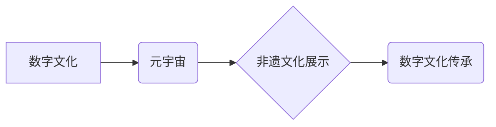

                 

## 1. 背景介绍

数字技术正在深刻地改变着我们与文化遗产的互动方式。传统博物馆的物理空间限制着参观者的体验，而数字文化技术则为我们提供了无限的可能性，让我们能够更便捷、更沉浸地探索和体验文化遗产。虚拟博物馆、增强现实（AR）、虚拟现实（VR）和元宇宙等新兴技术正在为数字文化传承开辟新的道路，将传统文化与现代科技相融合，创造出更加丰富多彩的文化体验。

近年来，随着元宇宙概念的兴起，数字文化传承迎来了新的机遇。元宇宙是一个由虚拟世界、增强现实和区块链等技术构成的沉浸式数字空间，它为文化遗产的数字化展示和传承提供了更加广阔的平台。

## 2. 核心概念与联系

### 2.1 数字文化

数字文化是指在数字技术发展背景下，以数字技术为载体，以数字化内容为核心，以网络传播为手段，形成的一种新的文化形态。它涵盖了数字艺术、数字文学、数字音乐、数字游戏等多个领域。

### 2.2 元宇宙

元宇宙是一个由虚拟世界、增强现实和区块链等技术构成的沉浸式数字空间。它具有以下特点：

* **沉浸式体验:** 元宇宙利用VR、AR等技术，为用户提供更加沉浸式的体验，让人们能够身临其境地感受虚拟世界。
* **持久性:** 元宇宙是一个持续运行的虚拟世界，用户可以在其中创建、分享和互动。
* **去中心化:** 元宇宙由多个平台和开发者共同构建，而不是由单一实体控制。
* **经济系统:** 元宇宙拥有自己的经济系统，用户可以通过虚拟货币进行交易。

### 2.3 非遗文化

非遗文化是指具有地域特色、历史传承和文化内涵的传统文化遗产，例如传统工艺、民间艺术、传统音乐、民间故事等。

### 2.4 数字文化传承

数字文化传承是指利用数字技术手段，对非遗文化进行数字化保存、展示、传播和传承。

**核心概念关系图**



## 3. 核心算法原理 & 具体操作步骤

### 3.1 算法原理概述

数字文化传承的核心算法原理主要包括：

* **3D建模:** 利用3D扫描、摄影测量等技术，对文物、建筑等进行数字化建模。
* **纹理贴图:** 为3D模型添加纹理贴图，使其更加逼真。
* **动画制作:** 利用动画技术，对文物、建筑等进行动态展示。
* **交互设计:** 设计用户交互界面，让用户能够与虚拟文物、建筑等进行互动。

### 3.2 算法步骤详解

1. **数据采集:** 利用3D扫描仪、相机等设备，对文物、建筑等进行数据采集。
2. **数据处理:** 对采集到的数据进行处理，例如去除噪声、拼接模型等。
3. **3D建模:** 利用3D建模软件，对处理后的数据进行建模。
4. **纹理贴图:** 为3D模型添加纹理贴图，使其更加逼真。
5. **动画制作:** 利用动画软件，对3D模型进行动画制作。
6. **交互设计:** 设计用户交互界面，让用户能够与虚拟文物、建筑等进行互动。
7. **平台发布:** 将完成的虚拟文物、建筑等发布到虚拟博物馆、元宇宙平台等。

### 3.3 算法优缺点

**优点:**

* **沉浸式体验:** 数字化展示可以为用户提供更加沉浸式的体验。
* **便捷性:** 用户可以随时随地访问虚拟博物馆，无需前往实体博物馆。
* **可互动性:** 用户可以与虚拟文物、建筑等进行互动，更加深入地了解文化遗产。

**缺点:**

* **技术门槛:** 数字化展示需要一定的技术门槛，需要专业的3D建模、动画制作等技术人员。
* **成本高昂:** 数字化展示的成本相对较高，需要投入大量的资金和人力。
* **缺乏真实感:** 尽管数字技术已经非常成熟，但虚拟文物、建筑等仍然无法完全替代实体文物、建筑的真实感。

### 3.4 算法应用领域

数字文化传承的算法应用领域非常广泛，例如：

* **虚拟博物馆:** 建立虚拟博物馆，展示文物、建筑等。
* **文化旅游:** 利用AR、VR等技术，为文化旅游提供更加丰富的体验。
* **教育教学:** 利用数字技术，将文化遗产融入教育教学，提高学生的学习兴趣。
* **文化传承:** 利用数字技术，对传统文化进行数字化保存和传承。

## 4. 数学模型和公式 & 详细讲解 & 举例说明

### 4.1 数学模型构建

数字文化传承的数学模型主要包括：

* **3D空间模型:** 利用坐标系和几何图形，构建虚拟文物、建筑等在3D空间中的模型。
* **纹理贴图模型:** 利用图像处理技术，将纹理信息映射到3D模型表面。
* **动画运动模型:** 利用物理学和数学公式，模拟虚拟文物、建筑等的运动轨迹。
* **用户交互模型:** 利用心理学和人机交互设计理论，设计用户与虚拟文物、建筑等的交互方式。

### 4.2 公式推导过程

例如，在3D建模过程中，可以使用以下公式计算物体在3D空间中的位置：

$$
x = x_0 + v_x * t
$$

$$
y = y_0 + v_y * t
$$

$$
z = z_0 + v_z * t
$$

其中：

* $x$, $y$, $z$ 是物体在3D空间中的坐标。
* $x_0$, $y_0$, $z_0$ 是物体的初始坐标。
* $v_x$, $v_y$, $v_z$ 是物体的速度分量。
* $t$ 是时间。

### 4.3 案例分析与讲解

例如，在虚拟博物馆中，可以使用3D建模技术对文物进行数字化展示。通过扫描文物的外形，可以得到其3D模型。然后，可以为模型添加纹理贴图，使其更加逼真。用户可以通过鼠标或手柄控制视角，观察文物各个角度。还可以利用动画技术，展示文物的制作过程或历史背景。

## 5. 项目实践：代码实例和详细解释说明

### 5.1 开发环境搭建

* **操作系统:** Windows/macOS/Linux
* **编程语言:** Python
* **3D建模软件:** Blender/Maya
* **游戏引擎:** Unity/Unreal Engine
* **虚拟现实平台:** Oculus/HTC Vive

### 5.2 源代码详细实现

以下是一个简单的Python代码示例，用于在虚拟博物馆中展示虚拟文物：

```python
import bpy

# 加载3D模型
bpy.ops.import_scene.obj(filepath="文物.obj")

# 设置相机位置和角度
bpy.context.scene.camera.location = (0, 0, 5)
bpy.context.scene.camera.rotation_euler = (0, 0, 0)

# 渲染图像
bpy.ops.render.render(write_still=True)
```

### 5.3 代码解读与分析

* `import bpy`: 导入Blender的Python API。
* `bpy.ops.import_scene.obj(filepath="文物.obj")`: 从文件中导入3D模型。
* `bpy.context.scene.camera.location = (0, 0, 5)`: 设置相机的位置。
* `bpy.context.scene.camera.rotation_euler = (0, 0, 0)`: 设置相机的旋转角度。
* `bpy.ops.render.render(write_still=True)`: 渲染图像并保存到文件。

### 5.4 运行结果展示

运行代码后，将生成一张包含虚拟文物的图像。

## 6. 实际应用场景

### 6.1 虚拟博物馆

虚拟博物馆可以利用数字技术，展示各种文物、建筑等，让用户可以随时随地访问和体验。例如，中国国家博物馆已经建立了虚拟博物馆，展示了馆藏文物。

### 6.2 文化旅游

AR/VR技术可以为文化旅游提供更加丰富的体验。例如，用户可以利用AR应用程序，在古迹遗址上看到虚拟的古代场景。

### 6.3 教育教学

数字技术可以将文化遗产融入教育教学，提高学生的学习兴趣。例如，学生可以利用虚拟现实技术，参观古代宫殿，了解古代生活。

### 6.4 未来应用展望

随着数字技术的不断发展，数字文化传承将会有更加广泛的应用场景。例如：

* **元宇宙非遗展示:** 将非遗文化展示到元宇宙平台，让用户可以身临其境地体验传统文化。
* **数字文化融合:** 将数字技术与传统文化融合，创造出更加创新和有趣的文化体验。
* **个性化文化体验:** 利用人工智能技术，为用户提供个性化的文化体验。

## 7. 工具和资源推荐

### 7.1 学习资源推荐

* **书籍:**

    * 《数字文化》
    * 《元宇宙》
    * 《非遗文化保护与传承》

* **网站:**

    * 中国国家博物馆虚拟博物馆: http://www.nmm.org.cn/
    *  UNESCO非物质文化遗产: http://ich.unesco.org/

### 7.2 开发工具推荐

* **3D建模软件:** Blender, Maya
* **游戏引擎:** Unity, Unreal Engine
* **虚拟现实平台:** Oculus, HTC Vive

### 7.3 相关论文推荐

* **数字文化传承的算法研究**
* **元宇宙非遗文化展示的实现方案**
* **数字技术在文化遗产保护中的应用**

## 8. 总结：未来发展趋势与挑战

### 8.1 研究成果总结

数字文化传承利用数字技术手段，对非遗文化进行数字化保存、展示、传播和传承，取得了显著成果。虚拟博物馆、AR/VR技术等为文化遗产的数字化展示提供了新的平台和手段，为用户提供了更加便捷、沉浸式的文化体验。

### 8.2 未来发展趋势

未来，数字文化传承将朝着以下方向发展：

* **更加沉浸式体验:** 利用VR/AR等技术，创造更加逼真的虚拟文化体验。
* **更加个性化体验:** 利用人工智能技术，为用户提供个性化的文化体验。
* **更加互动性体验:** 利用游戏化设计，让用户更加积极地参与到文化传承中。
* **更加跨界融合:** 将数字文化与其他领域融合，例如旅游、教育、娱乐等。

### 8.3 面临的挑战

数字文化传承也面临着一些挑战：

* **技术难题:** 如何更好地利用数字技术，实现更加逼真的虚拟文化体验。
* **数据保护问题:** 如何保护数字文化遗产的版权和数据安全。
* **文化传承问题:** 如何利用数字技术，更好地传承和弘扬传统文化。

### 8.4 研究展望

未来，我们需要继续加强对数字文化传承的研究，探索新的技术手段和应用模式，更好地利用数字技术，保护和传承我们的文化遗产。

## 9. 附录：常见问题与解答

**Q1: 数字文化传承的成本高昂吗？**

A1: 数字文化传承的成本确实相对较高，需要投入大量的资金和人力。但随着技术的进步和成本的降低，数字文化传承的成本将会逐渐降低。

**Q2: 数字文化传承可以完全替代实体文化遗产吗？**

A2: 数字文化传承可以为用户提供更加便捷、沉浸式的文化体验，但它无法完全替代实体文化遗产的真实感和历史价值。实体文化遗产仍然是不可替代的。

**Q3: 如何参与数字文化传承？**

A3: 您可以通过以下方式参与数字文化传承：

* 学习相关知识和技能。
* 参与数字文化项目。
* 利用数字技术，记录和传播传统文化。


作者：禅与计算机程序设计艺术 / Zen and the Art of Computer Programming 
<end_of_turn>

